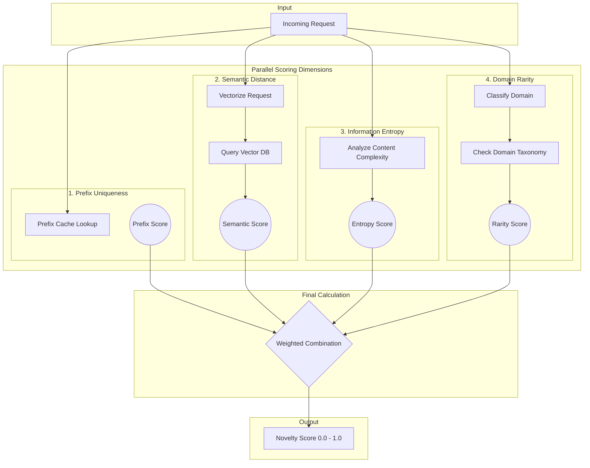

```mermaid
graph TD
    subgraph "Input"
        A[Incoming Request]
    end

    subgraph "Parallel Scoring Dimensions"
        subgraph "1. Prefix Uniqueness"
            B[Prefix Cache Lookup]
            C((Prefix Score))
        end

        subgraph "2. Semantic Distance"
            D[Vectorize Request] --> E[Query Vector DB]
            E --> F((Semantic Score))
        end

        subgraph "3. Information Entropy"
            G[Analyze Content Complexity] --> H((Entropy Score))
        end

        subgraph "4. Domain Rarity"
            I[Classify Domain] --> J[Check Domain Taxonomy]
            J --> K((Rarity Score))
        end
    end

    subgraph "Final Calculation"
        L{Weighted Combination}
    end

    subgraph "Output"
        M[Novelty Score 0.0 - 1.0]
    end

    A --> B
    A --> D
    A --> G
    A --> I

    C --> L
    F --> L
    H --> L
    K --> L

    L --> M
```
