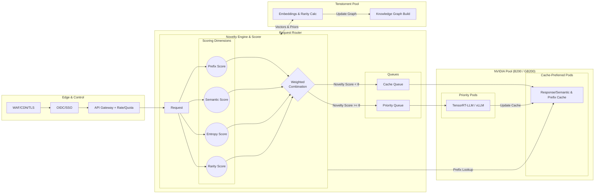

```mermaid
graph LR
    subgraph EDGE["Edge & Control"]
        direction LR
        WAF[WAF/CDN/TLS] --> IDP[OIDC/SSO] --> API[API Gateway + Rate/Quota]
    end

    subgraph ROUTER["Request Router"]
        direction TB
        subgraph NVEL["Novelty Engine & Scorer"]
            direction LR
            A[Request]

            subgraph "Scoring Dimensions"
                direction TB
                B((Prefix Score))
                F((Semantic Score))
                H((Entropy Score))
                K((Rarity Score))
            end

            L{Weighted<br/>Combination}

            A --> B & F & H & K
            B & F & H & K --> L
        end

        subgraph "Queues"
            direction TB
            QP[Priority Queue]
            QC[Cache Queue]
        end

        L -- "Novelty Score >= θ" --> QP
        L -- "Novelty Score < θ" --> QC
    end

    subgraph NV["NVIDIA Pool (B200 / GB200)"]
        direction TB
        subgraph NV-P["Priority Pods"]
            TRTLLM[TensorRT-LLM / vLLM]
        end
        subgraph NV-C["Cache-Preferred Pods"]
            RESP[Response/Semantic & Prefix Cache]
        end
    end

    subgraph TT["Tenstorrent Pool"]
        direction TB
        EMB[Embeddings & Rarity Calc]
        KGRAPH[Knowledge Graph Build]
    end

    %% --- Connections ---
    API --> A

    %% Scoring Data Sources
    NVEL -- "Prefix Lookup" --> RESP
    NVEL -- "Vectors & Priors" <--> EMB

    %% Queue to Processing
    QP --> TRTLLM
    QC --> RESP

    %% Feedback Loops
    TRTLLM -- "Update Cache" --> RESP
    EMB -- "Update Graph" --> KGRAPH
```
