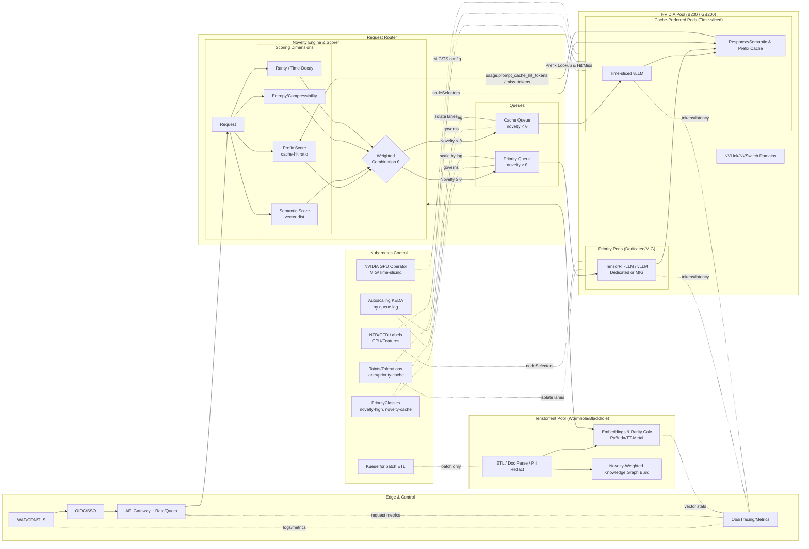

```mermaid
graph LR
    %% ===== EDGE & CONTROL =====
    subgraph EDGE["Edge & Control"]
        direction LR
        WAF[WAF/CDN/TLS] --> IDP[OIDC/SSO] --> API[API Gateway + Rate/Quota]
        OBS[Obs/Tracing/Metrics]
        WAF -. logs/metrics .- OBS
        API -. request metrics .- OBS
    end

    %% ===== ROUTER =====
    subgraph ROUTER["Request Router"]
        direction TB

        %% --- Novelty Engine ---
        subgraph NVEL["Novelty Engine & Scorer"]
            direction LR
            A[Request]

            subgraph SD["Scoring Dimensions"]
                direction TB
                B[Prefix Score<br/>cache-hit ratio]
                F[Semantic Score<br/>vector dist]
                H[Entropy/Compressibility]
                K[Rarity / Time-Decay]
            end

            L{Weighted<br/>Combination θ}

            A --> B & F & H & K
            B & F & H & K --> L
        end

        %% --- Queues ---
        subgraph QUEUES["Queues"]
            direction TB
            QP[Priority Queue<br/>novelty ≥ θ]
            QC[Cache Queue<br/>novelty < θ]
        end

        L -->|Novelty ≥ θ| QP
        L -->|Novelty < θ| QC
    end

    %% ===== NVIDIA POOL =====
    subgraph NV["NVIDIA Pool (B200 / GB200)"]
        direction TB

        subgraph NV-P["Priority Pods (Dedicated/MIG)"]
            TRTLLM[TensorRT-LLM / vLLM<br/>Dedicated or MIG]
        end

        subgraph NV-C["Cache-Preferred Pods (Time-sliced)"]
            TS[Time-sliced vLLM]
            RESP[Response/Semantic & Prefix Cache]
        end

        NVLINK[NVLink/NVSwitch Domains]
    end

    %% ===== TENSTORRENT POOL =====
    subgraph TT["Tenstorrent Pool (Wormhole/Blackhole)"]
        direction TB
        EMB[Embeddings & Rarity Calc<br/>PyBuda/TT-Metal]
        ETL[ETL / Doc Parse / PII Redact]
        KGRAPH[Novelty-Weighted Knowledge Graph Build]
    end

    %% ===== K8s CONTROL PLANE =====
    subgraph KCTRL["Kubernetes Control"]
        direction TB
        PRIO[PriorityClasses<br/>novelty-high, novelty-cache]
        TAINTS[Taints/Tolerations<br/>lane=priority-cache]
        NFD[NFD/GFD Labels<br/>GPU/Features]
        KEDA[Autoscaling KEDA<br/>by queue lag]
        KUEUE[Kueue for batch ETL]
        GPUOP[NVIDIA GPU Operator<br/>MIG/Time-slicing]
    end

    %% --- Connections ---
    API --> A

    %% Scoring Data Sources
    NVEL -- "Prefix Lookup & Hit/Miss" --> RESP
    NVEL <--> EMB:::bi
    ETL --> EMB
    ETL --> KGRAPH

    %% Queue to Processing
    QP --> TRTLLM
    QC --> TS
    TS --> RESP
    TRTLLM --> RESP

    %% Feedback Loops
    RESP -- "usage.prompt_cache_hit_tokens / miss_tokens" --> B
    TRTLLM -. tokens/latency .- OBS
    TS -. tokens/latency .- OBS
    EMB -. vector stats .- OBS

    %% Orchestration Links
    PRIO -. governs .- QP
    PRIO -. governs .- QC
    TAINTS -. isolate lanes .- NV-P
    TAINTS -. isolate lanes .- NV-C
    NFD -. nodeSelectors .- NV-P
    NFD -. nodeSelectors .- NV-C
    GPUOP -. MIG/TS config .- NV
    KEDA -. scale by lag .- QP
    KEDA -. scale by lag .- QC
    KUEUE -. batch only .- ETL

    classDef bi fill:#eef,stroke:#88a,stroke-width:1px;
```
