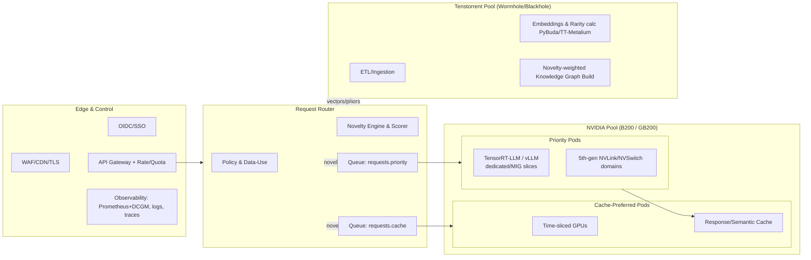

```mermaid
flowchart LR
  subgraph EDGE["Edge & Control"]
    WAF[WAF/CDN/TLS]
    IDP[OIDC/SSO]
    API[API Gateway + Rate/Quota]
    OBS[Observability: Prometheus+DCGM, logs, traces]
  end

  subgraph ROUTER["Request Router"]
    POL[Policy & Data-Use]
    NVEL[Novelty Engine & Scorer]
    QP[Queue: requests.priority]
    QC[Queue: requests.cache]
  end

  EDGE --> API --> ROUTER
  ROUTER -->|novelty>=θ| QP
  ROUTER -->|novelty<θ| QC

  %% NVIDIA pool
  subgraph NV["NVIDIA Pool (B200 / GB200)"]
    subgraph NV-P["Priority Pods"]
      TRTLLM[TensorRT-LLM / vLLM<br/>dedicated/MIG slices]
      NVL[5th-gen NVLink/NVSwitch domains]
    end
    subgraph NV-C["Cache-Preferred Pods"]
      TS[Time-sliced GPUs]
      RESP[Response/Semantic Cache]
    end
  end

  %% Tenstorrent pool
  subgraph TT["Tenstorrent Pool (Wormhole/Blackhole)"]
    ETL[ETL/Ingestion]
    EMB[Embeddings & Rarity calc PyBuda/TT-Metalium]
    KGRAPH[Novelty-weighted Knowledge Graph Build]
  end

  QP --> NV-P
  QC --> NV-C
  ROUTER <-->|vectors/priors| TT
  TT --> KGRAPH
  NV-P --> RESP
  NV-C --> RESP
```
