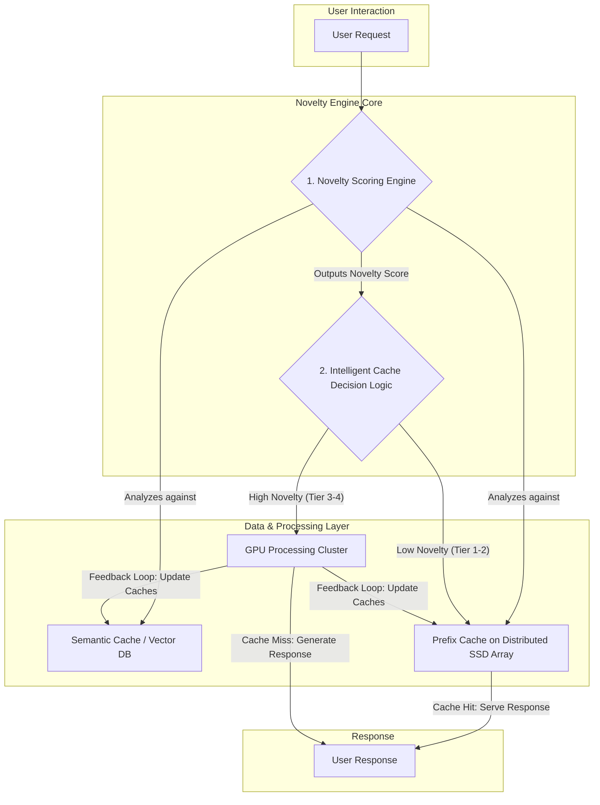

```mermaid
graph TD
    subgraph "User Interaction"
        A[User Request]
    end

    subgraph "Novelty Engine Core"
        B{1. Novelty Scoring Engine}
        C{2. Intelligent Cache Decision Logic}
    end

    subgraph "Data & Processing Layer"
        D[Semantic Cache / Vector DB]
        E[Prefix Cache on Distributed SSD Array]
        F[GPU Processing Cluster]
    end

    subgraph "Response"
        G[User Response]
    end

    A --> B;
    B -- "Analyzes against" --> D;
    B -- "Analyzes against" --> E;
    B -- "Outputs Novelty Score" --> C;

    C -- "Low Novelty (Tier 1-2)" --> E;
    E -- "Cache Hit: Serve Response" --> G;

    C -- "High Novelty (Tier 3-4)" --> F;
    F -- "Cache Miss: Generate Response" --> G;
    F -- "Feedback Loop: Update Caches" --> E;
    F -- "Feedback Loop: Update Caches" --> D;
```
