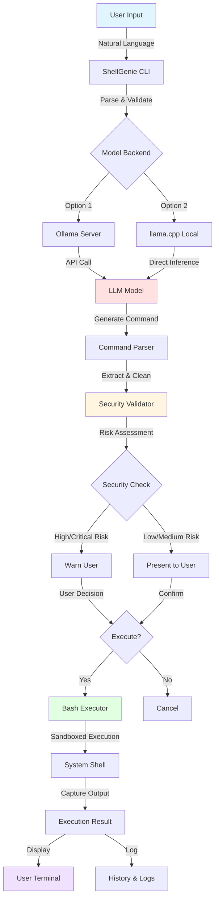
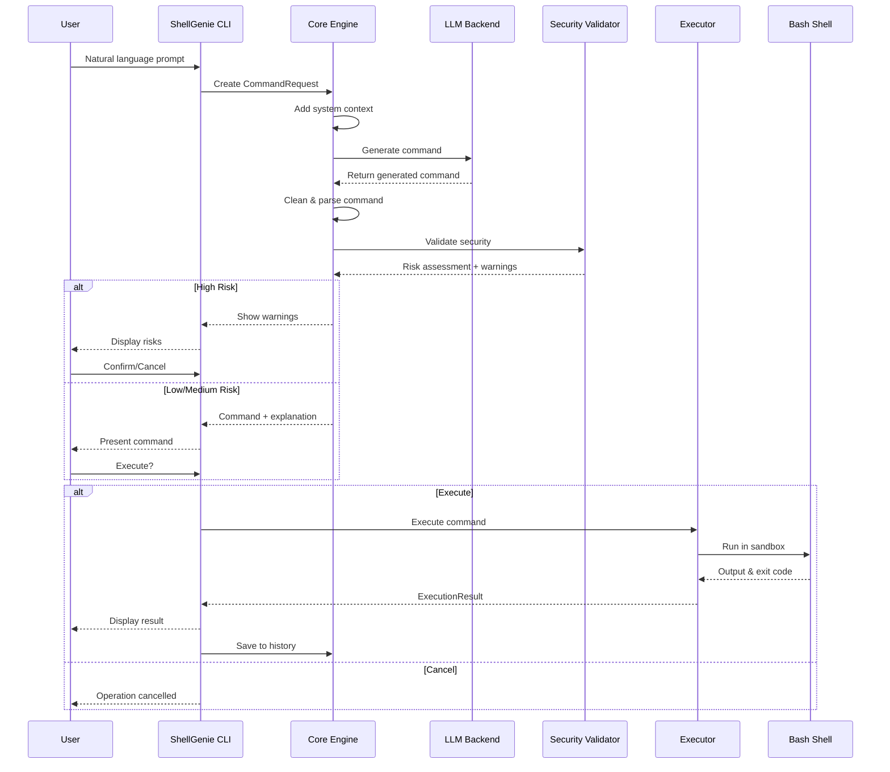

# 🧞 ShellGenie

<div align="center">

[](https://www.python.org/downloads/)
[](https://developer.nvidia.com/cuda-toolkit)
[](https://pytorch.org/)
[](LICENSE)
[](https://github.com/psf/black)
[](https://github.com/astral-sh/ruff)

**Transform natural language into powerful bash commands with GPU-accelerated LLMs**

[Features](#-features) •
[Quick Start](#-quick-start) •
[Installation](#-installation) •
[Usage](#-usage) •
[Documentation](#-documentation) •
[Contributing](#-contributing)

</div>

---

## 📖 Overview

ShellGenie is a modern, AI-powered bash shell assistant that leverages local large language models (LLMs) to transform natural language requests into executable bash commands. Optimized for NVIDIA GPUs (especially RTX 4080), it provides a secure, efficient, and user-friendly interface for command-line productivity.

### 🎯 Key Highlights

- 🤖 **AI-Powered**: Uses state-of-the-art LLMs (Llama 3.2, Qwen 2.5, etc.)
- 🚀 **GPU-Accelerated**: Optimized for NVIDIA RTX 4080 with CUDA 12.4
- 🔒 **Security-First**: Multi-level security validation and sandboxing
- 🐳 **Containerized**: Docker support with GPU passthrough
- 💻 **Modern CLI**: Built with Click and Rich for beautiful terminal UIs
- 📊 **Production-Ready**: Full test coverage, type hints, and comprehensive logging

---

## 🎨 Architecture



### 🔄 Data Flow



---

## ✨ Features

### 🛡️ Security Features

- **Multi-Level Security**: Strict, Moderate, Permissive, or Disabled modes
- **Pattern-Based Detection**: Identifies dangerous commands (rm -rf, fork bombs, etc.)
- **Command Whitelisting/Blacklisting**: Customize allowed/blocked commands
- **Risk Assessment**: Every command gets a risk level (low/medium/high/critical)
- **Sandboxed Execution**: Isolated environment with limited permissions
- **Input Sanitization**: Prevents command injection attacks

### 🚀 Performance

- **GPU-Accelerated**: Full CUDA support for RTX 4080 (Ada Lovelace, Compute 8.9)
- **Optimized Inference**: Batch processing and efficient memory management
- **Model Quantization**: Support for GGUF quantized models
- **Caching**: Command history and result caching
- **Async Operations**: Non-blocking I/O for responsive UX

### 🎛️ Flexibility

- **Multiple Backends**: Ollama, llama.cpp, or OpenAI-compatible APIs
- **Model Agnostic**: Works with Llama, Qwen, Mistral, and more
- **Configurable**: YAML/environment variable configuration
- **Interactive Mode**: Real-time conversation with the AI
- **Batch Mode**: Process multiple commands at once

### 📊 Observability

- **Structured Logging**: JSON logs with loguru
- **Command History**: Persistent command tracking
- **Usage Statistics**: Monitor usage patterns
- **GPU Monitoring**: Track GPU utilization and temperature
- **Error Tracking**: Comprehensive error reporting

---

## 🚀 Quick Start

### Prerequisites

- Python 3.10 or higher
- NVIDIA GPU with CUDA support (recommended: RTX 4080)
- CUDA 12.4 or compatible version
- Docker (optional, for containerized deployment)

### One-Line Install

```bash
# Clone the repository
git clone https://github.com/danindiana/GRYPHGEN.git
cd "GRYPHGEN/LLM-Sandbox CLI/ShellGenie"

# Install with GPU support
make install-gpu

# Setup Ollama and download models
make setup-ollama

# Run ShellGenie
shellgenie interactive
```

### First Commands

```bash
# Basic usage
shellgenie run "list all PDF files in Downloads"

# With automatic execution
shellgenie run "show disk usage" --execute

# Interactive mode
shellgenie interactive

# Check system info
shellgenie info
```

---

## 📦 Installation

### Method 1: pip (Recommended)

```bash
# Basic installation
pip install -e .

# With GPU support
pip install -e ".[gpu]"

# Development installation
pip install -e ".[dev]"

# Everything
pip install -e ".[all]"
```

### Method 2: Docker

```bash
# Build the image
make docker-build

# Run in Docker
make docker-run

# Access the container
make docker-shell
```

### Method 3: Manual Setup

```bash
# Install system dependencies (Ubuntu/Debian)
sudo apt-get update
sudo apt-get install -y python3.11 python3-pip build-essential

# Install Ollama
curl -fsSL https://ollama.ai/install.sh | sh

# Install ShellGenie
cd "LLM-Sandbox CLI/ShellGenie"
pip install -e ".[gpu,dev]"

# Pull models
ollama pull llama3.2
ollama pull qwen2.5
```

---

## 💡 Usage

### Command Line Interface

```bash
# Generate a command
shellgenie run "find files larger than 100MB"

# Execute immediately (use with caution!)
shellgenie run "create a backup of my documents" --execute

# Use specific model
shellgenie run "analyze system logs" --model llama3.1

# Change security level
shellgenie run "delete temp files" --security strict
```

### Interactive Mode

```bash
$ shellgenie interactive

ShellGenie> list all running docker containers
╭─ Generated Command ──────────────────────────────────╮
│ docker ps -a                                        │
╰──────────────────────────────────────────────────────╯

Explanation: List all Docker containers (running and stopped)
Risk Level: LOW

Execute? (y/n): y

CONTAINER ID   IMAGE     COMMAND   CREATED   STATUS   PORTS   NAMES
abc123...      nginx     ...       2 hours   Up       80/tcp  web

ShellGenie> exit
```

### Python API

```python
import asyncio
from shellgenie import ShellGenieCore
from shellgenie.models import ModelConfig, AppConfig, SecurityLevel

# Configure
model_config = ModelConfig(
    backend="ollama",
    model_name="llama3.2",
    temperature=0.7
)

app_config = AppConfig(
    security_level=SecurityLevel.MODERATE,
    auto_execute=False
)

# Initialize
sg = ShellGenieCore(model_config=model_config, app_config=app_config)

# Generate command
async def main():
    response, result = await sg.process_request(
        "list all files modified in the last hour"
    )
    print(f"Command: {response.command}")
    print(f"Risk: {response.risk_level}")

    if result:
        print(f"Output: {result.stdout}")

asyncio.run(main())
```

---

## ⚙️ Configuration

### Configuration File

Create `~/.shellgenie/config.yaml`:

```yaml
# Model configuration
model:
  backend: ollama
  model_name: llama3.2
  api_base: http://localhost:11434
  temperature: 0.7
  max_tokens: 512
  gpu_layers: -1  # Use all GPU layers

# Application settings
app:
  security_level: moderate
  auto_execute: false
  log_level: INFO
  log_file: ~/.shellgenie/shellgenie.log
  history_file: ~/.shellgenie/history
  max_history: 1000
  timeout: 300

# Security customization
security:
  whitelist:
    - ls
    - cat
    - grep
  blacklist:
    - mkfs
    - dd
```

### Environment Variables

```bash
# Model settings
export SHELLGENIE_MODEL=llama3.2
export SHELLGENIE_BACKEND=ollama
export OLLAMA_HOST=http://localhost:11434

# Security
export SHELLGENIE_SECURITY=moderate
export SHELLGENIE_AUTO_EXECUTE=false

# Logging
export SHELLGENIE_LOG_LEVEL=INFO
export SHELLGENIE_LOG_FILE=~/.shellgenie/app.log
```

---

## 🎯 Use Cases

### System Administration

```bash
# Find large files
sg run "find all files larger than 1GB in /var"

# Monitor resources
sg run "show me CPU and memory usage"

# Network diagnostics
sg run "test connection to google.com"
```

### Development

```bash
# Git operations
sg run "show git status with uncommitted changes"

# Docker management
sg run "stop all running containers"

# Build commands
sg run "compile all Python files in src directory"
```

### Data Processing

```bash
# File manipulation
sg run "convert all PNG images to JPEG"

# Text processing
sg run "count lines in all Python files"

# Archive operations
sg run "extract all tar.gz files in downloads"
```

---

## 🏗️ Project Structure

```
LLM-Sandbox CLI/ShellGenie/
├── src/shellgenie/          # Main package
│   ├── __init__.py          # Package initialization
│   ├── cli.py               # Command-line interface
│   ├── core.py              # Core functionality
│   ├── models.py            # Data models (Pydantic)
│   ├── security.py          # Security validation
│   └── utils.py             # Utility functions
├── tests/                   # Test suite
│   ├── test_cli.py
│   ├── test_core.py
│   ├── test_security.py
│   └── test_utils.py
├── docs/                    # Documentation
│   ├── architecture.md
│   ├── security.md
│   └── usage.md
├── docker/                  # Docker configuration
│   ├── Dockerfile
│   └── docker-compose.yml
├── config/                  # Configuration files
│   ├── config.yaml
│   └── prompts/
├── scripts/                 # Utility scripts
├── examples/                # Usage examples
├── pyproject.toml           # Project metadata
├── Makefile                 # Build automation
├── README.md                # This file
└── LICENSE                  # MIT License
```

---

## 🔧 Development

### Setup Development Environment

```bash
# Clone and install
git clone https://github.com/danindiana/GRYPHGEN.git
cd "GRYPHGEN/LLM-Sandbox CLI/ShellGenie"
make dev-setup

# Run tests
make test

# Lint and format
make format
make lint

# Type checking
make type-check
```

### Running Tests

```bash
# All tests
make test

# Fast tests only
make test-fast

# Integration tests
make test-integration

# With coverage
make coverage
```

### Code Quality

```bash
# Format code
make format

# Lint code
make lint

# Type check
make type-check

# All quality checks
make format lint type-check test
```

---

## 📊 Performance Benchmarks

### NVIDIA RTX 4080 Performance

| Model | Tokens/sec | Latency (p50) | Latency (p99) | VRAM Usage |
|-------|-----------|---------------|---------------|------------|
| Llama 3.2 3B | ~180 | 0.8s | 1.2s | 4.2 GB |
| Llama 3.1 8B | ~95 | 1.5s | 2.1s | 8.1 GB |
| Qwen 2.5 7B | ~105 | 1.3s | 1.9s | 7.5 GB |

*Benchmarks measured on RTX 4080 16GB with CUDA 12.4, batch size 512*

---

## 🛡️ Security Considerations

### Security Levels

- **Strict**: Only whitelisted commands allowed
- **Moderate**: Dangerous commands blocked, suspicious ones warned (default)
- **Permissive**: Warnings only, most commands allowed
- **Disabled**: No security checks (use with extreme caution!)

### Best Practices

1. **Always review commands** before execution
2. **Use moderate security** for daily work
3. **Enable logging** for audit trails
4. **Run in Docker** for isolation
5. **Keep models updated** for better security awareness

### Known Limitations

- LLM-generated commands may contain errors
- Complex multi-step operations may not be perfect
- Context window limitations for very long prompts
- Model hallucinations possible (validate critical operations)

---

## 🤝 Contributing

We welcome contributions! Please see our [Contributing Guide](docs/CONTRIBUTING.md) for details.

### Development Workflow

1. Fork the repository
2. Create a feature branch (`git checkout -b feature/amazing-feature`)
3. Make your changes
4. Run tests and linting (`make test lint`)
5. Commit your changes (`git commit -m 'Add amazing feature'`)
6. Push to the branch (`git push origin feature/amazing-feature`)
7. Open a Pull Request

---

## 📄 License

This project is licensed under the MIT License - see the [LICENSE](LICENSE) file for details.

---

## 🙏 Acknowledgments

- [Ollama](https://ollama.ai/) - For the excellent LLM serving platform
- [llama.cpp](https://github.com/ggerganov/llama.cpp) - For efficient LLM inference
- [Meta AI](https://ai.meta.com/) - For the Llama models
- [Alibaba Cloud](https://qwenlm.github.io/) - For the Qwen models
- [NVIDIA](https://developer.nvidia.com/) - For CUDA and GPU support

---

## 📞 Support

- **Issues**: [GitHub Issues](https://github.com/danindiana/GRYPHGEN/issues)
- **Discussions**: [GitHub Discussions](https://github.com/danindiana/GRYPHGEN/discussions)
- **Documentation**: [Full Docs](docs/)

---

## 🗺️ Roadmap

- [ ] Support for more LLM backends (OpenAI, Anthropic, etc.)
- [ ] Plugin system for extensibility
- [ ] Web UI for non-CLI users
- [ ] Multi-language support
- [ ] Advanced context awareness (git repo, docker env, etc.)
- [ ] Command suggestions based on history
- [ ] Integration with shell history (bash, zsh, fish)
- [ ] Mobile app for remote command generation

---

<div align="center">

**Made with ❤️ by the GRYPHGEN Team**

[](https://github.com/danindiana/GRYPHGEN)
[](https://github.com/danindiana/GRYPHGEN/fork)

</div>
