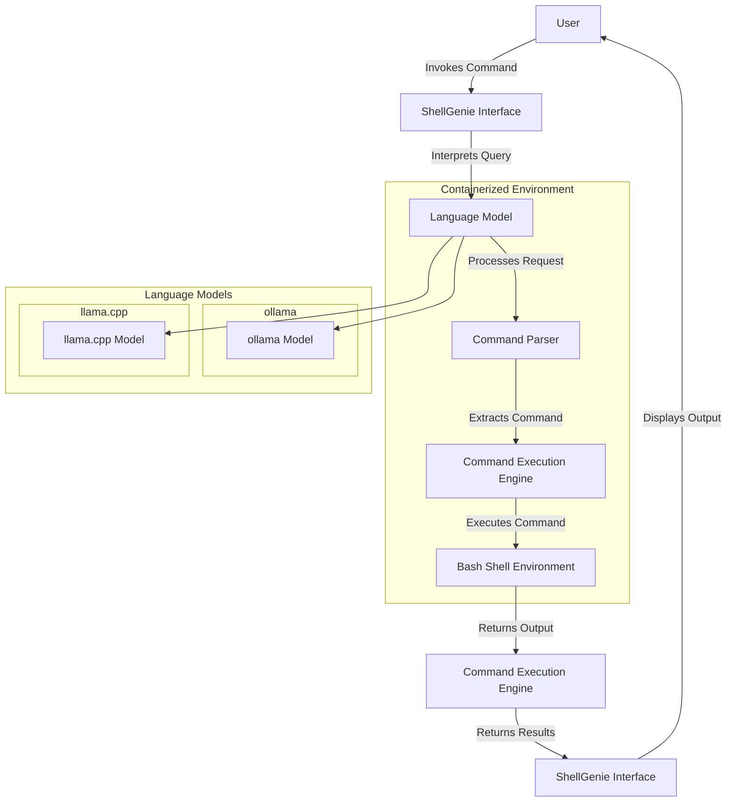

```mermaid
graph TD
    A[User] -->|Invokes Command| B[ShellGenie Interface]
    B -->|Interprets Query| C[Language Model]
    C -->|Processes Request| D[Command Parser]
    D -->|Extracts Command| E[Command Execution Engine]
    E -->|Executes Command| F[Bash Shell Environment]
    F -->|Returns Output| G[Command Execution Engine]
    G -->|Returns Results| H[ShellGenie Interface]
    H -->|Displays Output| A

    subgraph "Containerized Environment"
        C
        D
        E
        F
    end

    subgraph "Language Models"
        subgraph ollama
            C1[ollama Model]
        end
        subgraph llama.cpp
            C2[llama.cpp Model]
        end
    end

    C --> C1
    C --> C2
```
