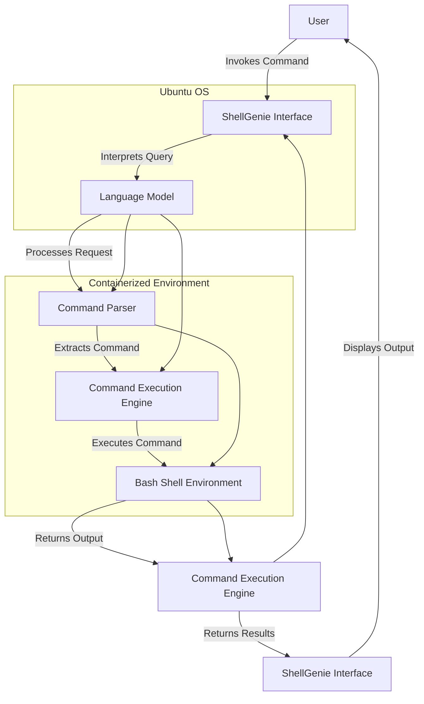

ShellGenie - Enabling Language Models to Interface with a Bash Shell Environment

### Overview



ShellGenie aims to integrate local language models (e.g., llama3, qwen2, and .gguf files) with a bash shell environment, allowing these models to be invoked, execute commands, and interact with the system on behalf of the user. This proposal outlines the steps to set up and implement this system using both ollama and llama.cpp.

### System Specifications

- **Operating System**: Ubuntu 22.04 (jammy)
- **Kernel**: x86_64 Linux 6.5.0-45-generic
- **Shell**: bash 5.1.16
- **Disk**: 1.3T / 5.5T (24%)
- **CPU**: AMD Ryzen 9 5950X 16-Core @ 32x 3.4GHz
- **GPU**: NVIDIA GeForce RTX 3060, NVIDIA GeForce GTX 1060 6GB
- **RAM**: 13753MiB / 128724MiB

### GPU Details

```plaintext
nvidia-smi
| NVIDIA-SMI 535.183.01       Driver Version: 550.67    CUDA Version: 12.4   |
| GPU Name           Persistence-M | Bus-Id    Disp.A | Volatile Uncorr. ECC |
| Fan Temp  Perf     Pwr:Usage/Cap |     Memory-Usage | GPU-Util Compute M.  |
|  0 NVIDIA GeForce RTX 3060    Off | 00000000:0D:00.0 On |         N/A        |
| 35%  51C  P2       38W / 170W |  5830MiB / 12288MiB |   2%   Default       |
|  1 NVIDIA GeForce GTX 1060 6GB  Off | 00000000:0E:00.0 Off |         N/A     |
| 33%  42C  P2       29W / 120W |   71MiB /  6144MiB |   0%   Default       |
```

### Objectives

1. **Enable Language Models to Access Shell Environment**: Provide local language models with the capability to execute bash commands securely and efficiently.
2. **Utilize ollama and llama.cpp**: Integrate both ollama and llama.cpp to leverage their strengths in running and managing models.
3. **Ensure Security and Isolation**: Use Docker or VM containers to maintain security and isolation while allowing the language models to interact with the shell environment.

### Implementation Steps

#### Step 1: Set Up Docker Environment

1. **Install Docker**:
   ```bash
   sudo apt update
   sudo apt install -y docker.io
   sudo systemctl start docker
   sudo systemctl enable docker
   sudo usermod -aG docker $USER
   ```

2. **Create Dockerfile**:
   ```Dockerfile
   FROM ubuntu:22.04

   # Install necessary packages
   RUN apt-get update && apt-get install -y \
       bash \
       sudo \
       curl \
       wget \
       build-essential \
       git \
       python3 \
       python3-pip \
       && rm -rf /var/lib/apt/lists/*

   # Install NVIDIA CUDA
   RUN apt-get update && apt-get install -y \
       nvidia-cuda-toolkit

   # Create a non-root user
   RUN useradd -ms /bin/bash shellgenie && echo "shellgenie:shellgenie" | chpasswd && adduser shellgenie sudo
   USER shellgenie
   WORKDIR /home/shellgenie

   # Install Llama.cpp and ollama
   RUN git clone https://github.com/ggerganov/llama.cpp.git && \
       cd llama.cpp && make

   RUN pip install ollama
   ```

3. **Build and Run Docker Container**:
   ```bash
   docker build -t shellgenie .
   docker run --gpus all -it --name shellgenie-container shellgenie
   ```

#### Step 2: Install and Configure Language Models

1. **Clone and Build llama.cpp**:
   ```bash
   git clone https://github.com/ggerganov/llama.cpp.git
   cd llama.cpp
   make
   ```

2. **Install ollama**:
   ```bash
   pip install ollama
   ```

3. **Download and Configure Models**:
   ```bash
   mkdir models
   cd models
   # Assuming model files are available for download
   wget <model-url> -O llama3.gguf
   wget <model-url> -O qwen2.gguf
   ```

4. **Load Models in Python**:
   ```python
   import ollama
   from llama_cpp import Llama

   llama_model = Llama(model_path="./models/llama3.gguf")
   qwen_model = Llama(model_path="./models/qwen2.gguf")
   ```

#### Step 3: Implement Shell Command Execution

1. **Python Script for Command Execution**:
   ```python
   import subprocess

   def execute_command(command):
       result = subprocess.run(command, shell=True, capture_output=True, text=True)
       return result.stdout, result.stderr

   # Example usage
   command = "ls -la"
   stdout, stderr = execute_command(command)
   print("Output:", stdout)
   print("Error:", stderr)
   ```

2. **Integrate with Language Model**:
   ```python
   def respond_to_query(query):
       response = llama_model(query)
       command = parse_command_from_response(response)
       stdout, stderr = execute_command(command)
       return stdout if stdout else stderr

   def parse_command_from_response(response):
       # Simplistic command extraction; improve with proper parsing logic
       return response.split('`')[1]
   ```

#### Step 4: Security and Isolation

1. **Docker Container Isolation**: Ensure the language model's access is limited to the container environment to prevent unintended system-wide changes.
2. **Resource Limits**:
   ```bash
   docker run --gpus all --memory="16g" --cpus="8" -it --name shellgenie-container shellgenie
   ```

3. **Monitor and Audit**: Implement logging and monitoring within the container to audit command executions and model interactions.

### Conclusion

ShellGenie provides a robust framework for integrating local language models with a bash shell environment, leveraging ollama and llama.cpp. This system ensures security, efficiency, and ease of use, making it a valuable tool for users requiring advanced language model interactions with their systems. By following the outlined steps, ShellGenie can be effectively implemented and deployed on Ubuntu 22.04 systems.

**Proposal: Integrating Local Language Models with Bash Shell (Llama3 Focus)**

**1. Executive Summary**

This proposal outlines a framework for enabling secure and efficient interaction between local LLMs (specifically Llama3) and the bash shell environment. The integration will empower users to leverage the language understanding and generation capabilities of LLMs for shell command execution, automation, and enhanced productivity.

**2. Objectives**

* **Seamless Integration:** Establish a user-friendly interface for invoking LLMs within the bash shell.
* **Command Execution:** Enable LLMs to interpret natural language instructions and translate them into executable bash commands.
* **Safety and Control:** Implement safeguards to prevent unauthorized or harmful command execution.
* **Performance Optimization:** Utilize GPU acceleration (RTX 3060) for efficient LLM inference.
* **Flexibility:** Support both Ollama and llama.cpp for model deployment.

**3. Technical Approach**

**3.1. LLM Selection and Deployment**

* **Llama3:** Utilize the Llama3 model due to its strong performance in natural language understanding and code generation tasks.
* **Deployment Options:**
    * **Ollama:** Leverage the Ollama server for easy deployment and model management.
    * **llama.cpp:** Deploy the model locally using llama.cpp for direct interaction with the shell environment.

**3.2. Integration Mechanism**

* **Shell Function/Alias:** Create a bash function or alias (e.g., `llama`) to trigger LLM interaction.
* **Input Handling:** Capture user input (natural language instructions) passed to the function/alias.
* **LLM Invocation:**
    * **Ollama:** Send the input to the Ollama server for processing.
    * **llama.cpp:** Utilize the llama.cpp API to directly interact with the locally deployed model.
* **Output Parsing:** Parse the LLM's response (generated bash command) and display it to the user for confirmation.
* **Command Execution (Optional):** Execute the command upon user confirmation or provide an option to manually review and modify it.

**3.3. Safety Measures**

* **Command Whitelisting/Blacklisting:** Define allowed/disallowed commands to mitigate risks.
* **Sandbox Environment:** Execute commands within a restricted environment to prevent unauthorized access to system resources.
* **User Confirmation:** Require explicit user approval before executing potentially sensitive commands.

**3.4. Performance Optimization**

* **GPU Acceleration:** Utilize the NVIDIA RTX 3060 GPU for accelerated model inference (especially relevant for llama.cpp deployment).
* **Caching:** Cache frequently used commands and their LLM-generated equivalents to improve response times.

**4. Proposed Implementation Steps**

1. **Environment Setup:**
   * Install Ollama or llama.cpp.
   * Download and configure the Llama3 model.
   * Set up GPU acceleration if using llama.cpp.

2. **Shell Integration:**
   * Create bash function/alias (`llama`).
   * Implement input handling, LLM invocation, and output parsing logic.

3. **Safety Implementation:**
   * Define command whitelists/blacklists.
   * Implement sandboxing or restricted execution environments.
   * Add user confirmation mechanisms.

4. **Performance Enhancement:**
   * Integrate GPU acceleration into the LLM invocation process.
   * Implement command caching.

5. **Testing and Refinement:**
   * Thoroughly test the integration with various commands and scenarios.
   * Refine the LLM prompts and response parsing to improve accuracy.

**5. Considerations and Future Enhancements**

* **Security:** Continuously evaluate and strengthen security measures.
* **Model Fine-tuning:** Fine-tune the LLM on a dataset of bash commands and natural language instructions to improve accuracy and relevance.
* **Contextual Awareness:** Explore mechanisms for the LLM to understand the current shell context (e.g., working directory, environment variables) to generate more relevant commands.
