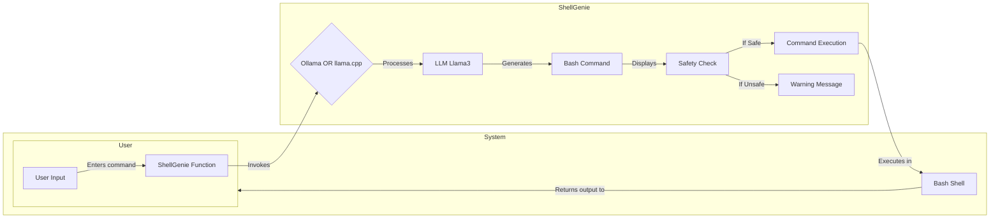

ShellGenie Project Plan (Llama3 Focus)


Explanation:

User Input: The user enters a command in natural language within the terminal.
ShellGenie Function: The shellgenie bash function is triggered.
LLM Invocation:
If Ollama is chosen, the function sends the input to the Ollama server for processing.
If llama.cpp is used, it directly interacts with the locally deployed Llama3 model.
LLM Processing: Llama3 processes the natural language input and generates a corresponding bash command.
Safety Check: The generated command is checked for potentially dangerous operations.
Command Execution (If Safe): If the command is deemed safe, it's executed in the bash shell.
Warning Message (If Unsafe): If the command is flagged as unsafe, a warning message is displayed to the user.
Output: The output from the bash shell (if the command was executed) is returned to the user.


1. Executive Summary

The ShellGenie project aims to provide a user-friendly and secure interface between the Llama3 language model and your bash shell. By leveraging Llama3's capabilities, you can automate tasks, execute complex commands with natural language instructions, and boost your productivity within the terminal.

2. Objectives

Intuitive Interaction: Create a simple way to interact with Llama3 from your terminal.
Intelligent Command Execution: Translate natural language into accurate bash commands.
Prioritize Security: Implement strict safeguards to prevent unauthorized actions.
Leverage Hardware: Utilize your RTX 3060 for faster Llama3 inference.
Flexible Deployment: Choose between Ollama for ease of use or llama.cpp for direct control.
3. Technical Implementation

3.1. Environment Setup

Install Ollama (Recommended):

Bash
curl -sSL https://get.ollama.ai | bash
ollama pull llama2
Use code with caution.

(This will give you a good starting point with a similar model, then you can replace with Llama3 when available)

OR Install llama.cpp:

Bash
git clone https://github.com/ggerganov/llama.cpp.git
cd llama.cpp
make
Use code with caution.

(Requires more manual configuration and potential CUDA setup)

Obtain Llama3 Model:  Download the Llama3 model files (.bin or .gguf) and place them in a designated directory (e.g., ~/llama_models).

3.2. Bash Function (ShellGenie)
Bash
#!/bin/bash
```
function shellgenie() {
    local prompt="$1"
    local model_path="$2"   # Optional path to Llama3 model (required for llama.cpp)

    if [[ -z "$prompt" ]]; then
        echo "Usage: shellgenie 'your command in natural language' [model_path]"
        return
    fi

    if [[ -z "$model_path" ]]; then  # Use Ollama by default
        local command=$(ollama run llama2 "$prompt") 
    else  # Use llama.cpp
        # Replace with actual llama.cpp execution command
        local command=$(llama_cpp/main -m "$model_path" -p "$prompt")  
    fi

    # Safety Check (add your own logic)
    if [[ "$command" =~ (rm|sudo|dangerous_command) ]]; then
        echo "Potentially dangerous command detected. Please review:"
    fi

    echo "Generated command:"
    echo "$command"
    read -p "Execute? (y/n): " confirm
    if [[ "$confirm" == "y" ]]; then
        eval "$command"
    fi
}
```
3.3. Safety First

Command Filtering: In the shellgenie function, add robust checks to filter out dangerous commands like rm -rf, sudo, etc.
Interactive Mode: In the script above, the read command asks the user to confirm before execution.
3.4. GPU Acceleration

Ollama: Ollama will automatically detect and use your GPU if properly configured.
llama.cpp: Use the --n-gpu-layers option in your llama.cpp command to control GPU usage.
4. Additional Considerations

Model Optimization: Quantize your Llama3 model for faster inference on your GPU (especially relevant for llama.cpp).
Prompt Engineering: Craft clear and concise prompts to guide the model toward generating the correct bash commands.
5. Example Usage
```
Bash
shellgenie "List all files in my Downloads folder"
shellgenie "Show me the disk usage"
shellgenie "Find all PDF files created in the last month"
```
Let me know if you'd like help with any of these steps or want to explore more advanced features like output validation and automatic error correction!


This is a great start! Your proposal outlines a solid plan for integrating Llama3 with the bash shell, addressing key aspects like security, performance, and flexibility. Here are some additional thoughts and suggestions that could further enhance your project:

**1. Command Parsing & Understanding:**

* **Regular Expressions:** Utilize regular expressions to extract specific parts of natural language commands (e.g., filenames, arguments).
* **Intent Classification:** Train a separate model (or leverage existing ones) to classify user intent (e.g., "list files," "create directory," "run a script"). This can improve the accuracy of command extraction.

**2. User Interface & Feedback:**

* **Interactive Prompts:** Guide users with clear prompts, suggesting possible commands or clarifying ambiguous input.
* **Contextual Awareness:**  If possible, maintain some context from previous interactions to provide more relevant suggestions and avoid repetitive prompts.
* **Error Handling:** Implement robust error handling for invalid commands or unexpected output. Provide helpful messages to the user.

**3. Security Considerations:**

* **Input Sanitization:** Carefully sanitize all user input before executing any commands. This can help prevent command injection vulnerabilities.
* **Limited Permissions:** Run the LLM and command execution processes with limited privileges to minimize potential damage.
* **Monitoring & Logging:** Continuously monitor LLM interactions and command executions, logging all activities for auditing and analysis.

**4. Advanced Features:**

* **Command History & Suggestions:** Keep track of previously executed commands and offer suggestions based on user history.
* **Code Generation & Scripting:** Expand the capabilities beyond simple commands by allowing LLMs to generate code snippets or complete scripts based on user instructions.
* **Multi-Model Integration:** Explore using different LLMs for specific tasks (e.g., a code generation LLM alongside a general-purpose LLM).

**5. Deployment & Scalability:**

* **Containerization:** Package the entire system within Docker containers to ensure reproducibility and portability.
* **Cloud Deployment:** Consider deploying on cloud platforms (e.g., AWS, Azure) for scalability and accessibility.


Remember that security is paramount when interacting with external systems. Carefully validate all inputs and outputs, implement access controls, and regularly review your system for vulnerabilities.
