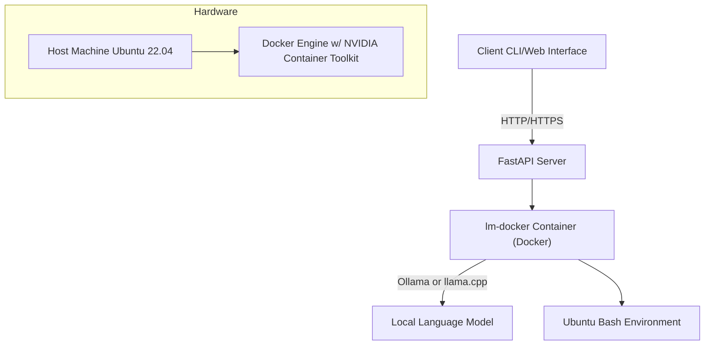

Absolutely! Let's refine this further into a more concise, elegant implementation with a clear explanation:

**Refined System Diagram:**

**Simplified Explanation:**

1. **Host Machine:** Your Ubuntu 22.04 machine serves as the foundation. It has Docker Engine installed, enhanced with the NVIDIA Container Toolkit for GPU acceleration if needed.

2. **Docker Container (`lm-docker`)**:  This is the heart of the system. It provides:
   - **Isolation:** A secure, self-contained environment for running language models.
   - **Flexibility:** Easily switch between Ollama or llama.cpp by modifying the container configuration.
   - **Bash Access:** A full Ubuntu Bash environment for scripting, data manipulation, etc.

3. **FastAPI Server:** A Python-based web framework that acts as the bridge between your client (CLI, web interface, etc.) and the Docker container. It handles requests, manages interactions with the language model, and executes Bash commands within the container.

4. **Client:** This can be as simple as a command-line interface (CLI) or a more sophisticated web-based application. The client sends requests to the FastAPI server, specifying the model to use, input text, and any desired commands.

**Key Improvements:**

- **Simplified Architecture:** Removed the VM layer, as Docker containers provide the necessary isolation and environment control.
- **Streamlined Communication:**  FastAPI directly interacts with the language model and Bash environment within the container, eliminating the need for SSH.
- **Flexibility:** Easily switch between Ollama and llama.cpp models by modifying the Docker container configuration.
- **Enhanced Security:** Docker containers offer a more secure sandbox for running the language models.
- **Standardized Deployment:** By using Docker, the entire setup can be packaged into a single image, making it easy to deploy and reproduce across different environments.

**Why FastAPI Instead of SSH:**

FastAPI is a much more efficient and convenient way to communicate with your application running within the Docker container. Here's why:

- **API-Driven:** FastAPI is designed for building APIs, allowing for well-structured communication between the client and the language model.
- **Performance:** FastAPI is high-performance, minimizing the overhead of communication compared to SSH.
- **Flexibility:** You can easily add authentication, validation, and other features to your API with FastAPI.
- **Python Integration:** FastAPI seamlessly integrates with Python, the language you'll likely be using for your language model scripts.

**Minimum Viable Product (MVP) Development:**

1. **FastAPI Server:**
   - Set up basic endpoints for:
      - Model selection (Ollama or llama.cpp)
      - Text input/output
      - Executing Bash commands within the container
   - Implement token-based authentication for security.

2. **Docker Container (`lm-docker`):**
   - Create a Dockerfile that includes:
      - Base Ubuntu image
      - Installation of Ollama and/or llama.cpp
      - Configuration for GPU acceleration (if needed)
      - Any additional libraries or dependencies

3. **Client (CLI):**
   - Build a simple command-line tool to:
      - Interact with the FastAPI endpoints
      - Display model output 
      - Handle user input

**Note:** A parser for the language model output may be necessary depending on the format of the responses. You can use Python libraries like `json` or `re` (regular expressions) for basic parsing, or more specialized libraries if needed.
