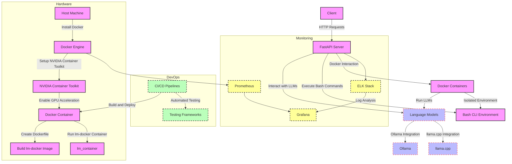

Your project, 'lm-sandbox-cli,' seems to be well-structured and leverages a variety of modern tools and technologies to provide a robust and scalable environment for local language model interaction. Here are some suggestions and improvements to consider:

### Suggestions

1. **Security Enhancements**:
   - **Authentication and Authorization**: Implement OAuth2 or JWT for secure API access. FastAPI has built-in support for these.
   - **Rate Limiting**: Prevent abuse by implementing rate limiting on API endpoints.
   - **Audit Logging**: Track usage and changes for security and debugging purposes.

2. **Scalability and Load Balancing**:
   - Use **Kubernetes** for orchestration and auto-scaling.
   - Implement **Load Balancers** (e.g., NGINX, HAProxy) to distribute traffic efficiently.

3. **Monitoring and Logging**:
   - Integrate **Prometheus** for monitoring and **Grafana** for visualization.
   - Use **ELK stack (Elasticsearch, Logstash, Kibana)** for centralized logging and analysis.

4. **Continuous Integration and Continuous Deployment (CI/CD)**:
   - Set up CI/CD pipelines using **GitHub Actions**, **Jenkins**, or **GitLab CI** to automate testing, building, and deployment processes.
   - Implement automated testing frameworks (e.g., **pytest** for Python, **BATS** for Bash scripts).

5. **Documentation**:
   - Use tools like **Sphinx** or **MkDocs** for generating project documentation.
   - Include API documentation with **Swagger** or **OpenAPI** (built into FastAPI).

6. **Version Control**:
   - Follow **semantic versioning** for all components.
   - Maintain a **CHANGELOG** for transparency on updates and changes.

### Comments on the Diagram

- The diagram is clear and logically structured, but here are a few enhancements:

This enhanced diagram includes DevOps and Monitoring components, providing a more comprehensive view of the project’s infrastructure.
