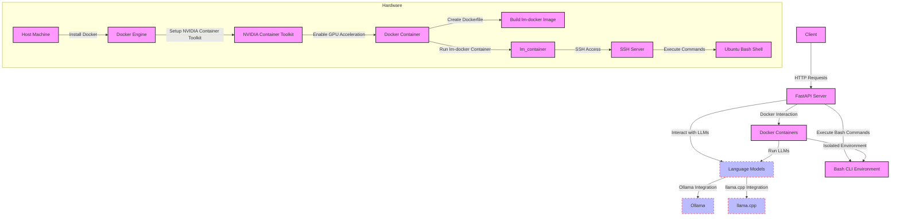

### Exhaustive Task List for 'lm-sandbox' System Setup

To implement the 'lm-sandbox' system on your desktop hardware with Ubuntu 22.04, follow these detailed tasks:

### Step 1: Prepare the Operating System

1. **Update and Upgrade Ubuntu**:
   ```bash
   sudo apt update && sudo apt upgrade -y
   ```

2. **Install Essential Tools**:
   ```bash
   sudo apt install curl git build-essential -y
   ```

### Step 2: Install Docker

1. **Install Docker**:
   ```bash
   curl -fsSL https://get.docker.com -o get-docker.sh
   sudo sh get-docker.sh
   ```

2. **Manage Docker as a Non-root User**:
   ```bash
   sudo usermod -aG docker ${USER}
   newgrp docker
   ```

### Step 3: Setup NVIDIA Container Toolkit

1. **Install NVIDIA Drivers**:
   ```bash
   sudo apt install nvidia-driver-470 -y
   ```

2. **Install NVIDIA Docker Support**:
   ```bash
   distribution=$(. /etc/os-release;echo $ID$VERSION_ID)
   curl -s -L https://nvidia.github.io/nvidia-docker/gpgkey | sudo apt-key add -
   curl -s -L https://nvidia.github.io/nvidia-docker/$distribution/nvidia-docker.list | sudo tee /etc/apt/sources.list.d/nvidia-docker.list
   sudo apt update
   sudo apt install -y nvidia-container-toolkit
   sudo systemctl restart docker
   ```

### Step 4: Build the 'lm-docker' Image

1. **Create a Dockerfile**:
   ```Dockerfile
   FROM nvidia/cuda:11.7.1-cudnn8-runtime-ubuntu22.04

   # Install necessary packages
   RUN apt-get update && apt-get install -y \
       python3-pip \
       openssh-server \
       curl \
       && rm -rf /var/lib/apt/lists/*

   # Install Paramiko and Requests for Python
   RUN pip3 install paramiko requests

   # Set up SSH
   RUN mkdir /var/run/sshd
   RUN echo 'root:password' | chpasswd
   RUN sed -i 's/PermitRootLogin prohibit-password/PermitRootLogin yes/' /etc/ssh/sshd_config
   RUN sed -i 's/#PasswordAuthentication yes/PasswordAuthentication yes/' /etc/ssh/sshd_config
   EXPOSE 22

   # Copy your script into the container
   COPY script.py /root/script.py

   # Start SSH service
   CMD ["/usr/sbin/sshd", "-D"]
   ```

2. **Build the Docker Image**:
   ```bash
   sudo docker build -t lm-docker .
   ```

### Step 5: Run the 'lm-docker' Container

1. **Run the Docker Container with NVIDIA Support**:
   ```bash
   sudo docker run --gpus all -d -p 2222:22 --name lm_container lm-docker
   ```

### Step 6: Setup FastAPI Server

1. **Create FastAPI Application**:
   - Create a `main.py` file with the following content:
     ```python
     from fastapi import FastAPI
     from pydantic import BaseModel
     import subprocess

     app = FastAPI()

     class Command(BaseModel):
         cmd: str

     @app.post("/run-bash/")
     async def run_bash(command: Command):
         result = subprocess.run(command.cmd, shell=True, capture_output=True, text=True)
         return {"output": result.stdout, "error": result.stderr}
     ```

2. **Access the Container**:
   ```bash
   sudo docker exec -it lm_container /bin/bash
   ```

3. **Install FastAPI and Uvicorn**:
   ```bash
   pip3 install fastapi uvicorn
   ```

4. **Start FastAPI Server**:
   ```bash
   uvicorn main:app --host 0.0.0.0 --port 8000 --reload
   ```

### Step 7: Integrate Language Models (Ollama and llama.cpp)

1. **Download and Setup Ollama**:
   - Follow the installation instructions for [Ollama](https://github.com/jordwest/ollama).

2. **Download and Setup llama.cpp**:
   - Clone the llama.cpp repository and build the project:
     ```bash
     git clone https://github.com/ggerganov/llama.cpp
     cd llama.cpp
     make
     ```

3. **Integrate Ollama and llama.cpp in FastAPI**:
   - Update the `main.py` to include endpoints for interacting with Ollama and llama.cpp:
     ```python
     from fastapi import FastAPI
     from pydantic import BaseModel
     import subprocess
     import requests

     app = FastAPI()

     class Command(BaseModel):
         cmd: str

     @app.post("/run-bash/")
     async def run_bash(command: Command):
         result = subprocess.run(command.cmd, shell=True, capture_output=True, text=True)
         return {"output": result.stdout, "error": result.stderr}

     @app.post("/ollama/")
     async def run_ollama(prompt: Command):
         response = requests.post("http://localhost:2234/v1/chat/completions", json={
             "model": "ollama-model",
             "messages": [{"role": "user", "content": prompt.cmd}]
         })
         return response.json()

     @app.post("/llama-cpp/")
     async def run_llama_cpp(prompt: Command):
         result = subprocess.run(f'./llama -p "{prompt.cmd}"', shell=True, capture_output=True, text=True, cwd='/path/to/llama.cpp')
         return {"output": result.stdout, "error": result.stderr}
     ```

### Step 8: Verify the Setup

1. **Test the API Endpoints**:
   - Use `curl` to test the Bash command execution:
     ```bash
     curl -X POST "http://localhost:8000/run-bash/" -H "Content-Type: application/json" -d '{"cmd":"whoami"}'
     ```
   - Test the Ollama integration:
     ```bash
     curl -X POST "http://localhost:8000/ollama/" -H "Content-Type: application/json" -d '{"cmd":"Introduce yourself."}'
     ```
   - Test the llama.cpp integration:
     ```bash
     curl -X POST "http://localhost:8000/llama-cpp/" -H "Content-Type: application/json" -d '{"cmd":"What is AI?"}'
     ```

### Final System Overview



### Summary

This comprehensive task list and diagram provide a detailed roadmap for setting up the 'lm-sandbox' system, integrating Docker with NVIDIA GPU support, and setting up a FastAPI server to interact with local language models (Ollama and llama.cpp) and execute Bash commands. This setup leverages the power of GPUs for efficient model execution and ensures a robust, isolated environment for your development needs.
