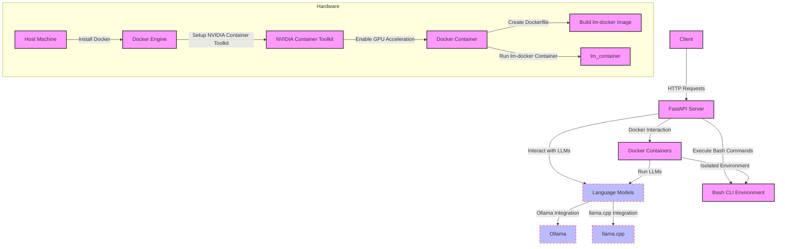
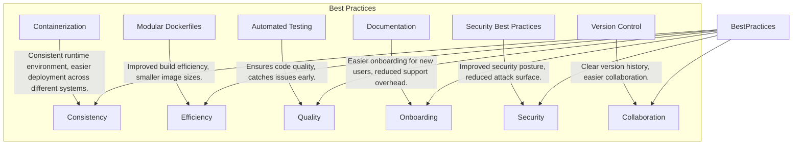

You're right. Using SSH to access the Ubuntu bash shell environment is unnecessary since we can execute commands directly through the FastAPI server. Below is an updated approach that simplifies the setup by leveraging FastAPI to execute commands directly within the Docker container, removing the need for SSH.

### Exhaustive Task List for 'lm-sandbox' System Setup

To implement the 'lm-sandbox' system on your desktop hardware with Ubuntu 22.04, follow these detailed tasks:

### Step 1: Prepare the Operating System

1. **Update and Upgrade Ubuntu**:
   ```bash
   sudo apt update && sudo apt upgrade -y
   ```

2. **Install Essential Tools**:
   ```bash
   sudo apt install curl git build-essential -y
   ```

### Step 2: Install Docker

1. **Install Docker**:
   ```bash
   curl -fsSL https://get.docker.com -o get-docker.sh
   sudo sh get-docker.sh
   ```

2. **Manage Docker as a Non-root User**:
   ```bash
   sudo usermod -aG docker ${USER}
   newgrp docker
   ```

### Step 3: Setup NVIDIA Container Toolkit

1. **Install NVIDIA Drivers**:
   ```bash
   sudo apt install nvidia-driver-470 -y
   ```

2. **Install NVIDIA Docker Support**:
   ```bash
   distribution=$(. /etc/os-release;echo $ID$VERSION_ID)
   curl -s -L https://nvidia.github.io/nvidia-docker/gpgkey | sudo apt-key add -
   curl -s -L https://nvidia.github.io/nvidia-docker/$distribution/nvidia-docker.list | sudo tee /etc/apt/sources.list.d/nvidia-docker.list
   sudo apt update
   sudo apt install -y nvidia-container-toolkit
   sudo systemctl restart docker
   ```

### Step 4: Build the 'lm-docker' Image

1. **Create a Dockerfile**:
   ```Dockerfile
   FROM nvidia/cuda:11.7.1-cudnn8-runtime-ubuntu22.04

   # Install necessary packages
   RUN apt-get update && apt-get install -y \
       python3-pip \
       curl \
       && rm -rf /var/lib/apt/lists/*

   # Install Python libraries
   RUN pip3 install fastapi uvicorn paramiko requests

   # Copy your script into the container
   COPY main.py /app/main.py

   # Set the working directory
   WORKDIR /app

   # Expose the port
   EXPOSE 8000

   # Run the FastAPI server
   CMD ["uvicorn", "main:app", "--host", "0.0.0.0", "--port", "8000"]
   ```

2. **Build the Docker Image**:
   ```bash
   sudo docker build -t lm-docker .
   ```

### Step 5: Run the 'lm-docker' Container

1. **Run the Docker Container with NVIDIA Support**:
   ```bash
   sudo docker run --gpus all -d -p 8000:8000 --name lm_container lm-docker
   ```

### Step 6: Setup FastAPI Server

1. **Create FastAPI Application**:
   - Create a `main.py` file with the following content:
     ```python
     from fastapi import FastAPI
     from pydantic import BaseModel
     import subprocess
     import requests

     app = FastAPI()

     class Command(BaseModel):
         cmd: str

     @app.post("/run-bash/")
     async def run_bash(command: Command):
         result = subprocess.run(command.cmd, shell=True, capture_output=True, text=True)
         return {"output": result.stdout, "error": result.stderr}

     @app.post("/ollama/")
     async def run_ollama(prompt: Command):
         response = requests.post("http://localhost:2234/v1/chat/completions", json={
             "model": "ollama-model",
             "messages": [{"role": "user", "content": prompt.cmd}]
         })
         return response.json()

     @app.post("/llama-cpp/")
     async def run_llama_cpp(prompt: Command):
         result = subprocess.run(f'./llama -p "{prompt.cmd}"', shell=True, capture_output=True, text=True, cwd='/path/to/llama.cpp')
         return {"output": result.stdout, "error": result.stderr}
     ```

2. **Access the Container**:
   ```bash
   sudo docker exec -it lm_container /bin/bash
   ```

3. **Install FastAPI and Uvicorn**:
   ```bash
   pip3 install fastapi uvicorn
   ```

4. **Start FastAPI Server**:
   ```bash
   uvicorn main:app --host 0.0.0.0 --port 8000 --reload
   ```

### Step 7: Integrate Language Models (Ollama and llama.cpp)

1. **Download and Setup Ollama**:
   - Follow the installation instructions for [Ollama](https://github.com/jordwest/ollama).

2. **Download and Setup llama.cpp**:
   - Clone the llama.cpp repository and build the project:
     ```bash
     git clone https://github.com/ggerganov/llama.cpp
     cd llama.cpp
     make
     ```

3. **Integrate Ollama and llama.cpp in FastAPI**:
   - Update the `main.py` to include endpoints for interacting with Ollama and llama.cpp:
     ```python
     from fastapi import FastAPI
     from pydantic import BaseModel
     import subprocess
     import requests

     app = FastAPI()

     class Command(BaseModel):
         cmd: str

     @app.post("/run-bash/")
     async def run_bash(command: Command):
         result = subprocess.run(command.cmd, shell=True, capture_output=True, text=True)
         return {"output": result.stdout, "error": result.stderr}

     @app.post("/ollama/")
     async def run_ollama(prompt: Command):
         response = requests.post("http://localhost:2234/v1/chat/completions", json={
             "model": "ollama-model",
             "messages": [{"role": "user", "content": prompt.cmd}]
         })
         return response.json()

     @app.post("/llama-cpp/")
     async def run_llama_cpp(prompt: Command):
         result = subprocess.run(f'./llama -p "{prompt.cmd}"', shell=True, capture_output=True, text=True, cwd='/path/to/llama.cpp')
         return {"output": result.stdout, "error": result.stderr}
     ```

### Step 8: Verify the Setup

1. **Test the API Endpoints**:
   - Use `curl` to test the Bash command execution:
     ```bash
     curl -X POST "http://localhost:8000/run-bash/" -H "Content-Type: application/json" -d '{"cmd":"whoami"}'
     ```
   - Test the Ollama integration:
     ```bash
     curl -X POST "http://localhost:8000/ollama/" -H "Content-Type: application/json" -d '{"cmd":"Introduce yourself."}'
     ```
   - Test the llama.cpp integration:
     ```bash
     curl -X POST "http://localhost:8000/llama-cpp/" -H "Content-Type: application/json" -d '{"cmd":"What is AI?"}'
     ```

### Final System Overview



### Summary

This updated task list and diagram provide a detailed roadmap for setting up the 'lm-sandbox' system, integrating Docker with NVIDIA GPU support, and setting up a FastAPI server to interact with local language models (Ollama and llama.cpp) and execute Bash commands directly. This setup leverages the power of GPUs for efficient model execution and ensures a robust, isolated environment for your development needs without unnecessary SSH access.

To improve the installation and implementation of the 'lm-sandbox' project and to standardize its deployment across different environments, consider using the following tools and best practices:

### Tools for Standardization and Improvement

1. **Docker Compose**:
   - Use Docker Compose to manage multi-container applications. This simplifies the setup and deployment process by defining services, networks, and volumes in a single YAML file.
   - **Advantages**: Simplifies multi-container management, ensures consistent environment setup.

2. **Kubernetes**:
   - Use Kubernetes for orchestration if the project needs to scale across multiple nodes. Kubernetes provides robust management of containerized applications.
   - **Advantages**: Scalability, automated deployment, and management.

3. **CI/CD Pipelines**:
   - Use Continuous Integration/Continuous Deployment (CI/CD) tools like GitHub Actions, GitLab CI, or Jenkins to automate the build, test, and deployment processes.
   - **Advantages**: Automated testing and deployment, reduces manual errors.

4. **Configuration Management**:
   - Use tools like Ansible, Chef, or Puppet for configuring and managing environments. These tools help automate the setup of dependencies and environment configurations.
   - **Advantages**: Consistent environment setup, automated configuration management.

5. **Container Orchestration with Helm**:
   - Use Helm to manage Kubernetes applications. Helm charts simplify the deployment of applications on Kubernetes by packaging them as charts.
   - **Advantages**: Simplified Kubernetes management, reusable deployment configurations.

6. **Environment Configuration**:
   - Use `.env` files to manage environment variables. This approach ensures that environment-specific configurations are managed separately from the codebase.
   - **Advantages**: Separation of configuration and code, ease of managing environment-specific settings.

### Best Practices for This Project

1. **Containerization**:
   - Ensure all dependencies are containerized. This includes the FastAPI server, language models, and any other services.
   - **Benefits**: Consistent runtime environment, easier deployment across different systems.

2. **Modular Dockerfiles**:
   - Break down the Dockerfile into smaller, reusable components. Use multi-stage builds to keep the final image size small.
   - **Benefits**: Improved build efficiency, smaller image sizes.

3. **Automated Testing**:
   - Integrate automated tests for the FastAPI endpoints and language model interactions. Use tools like pytest for testing Python code.
   - **Benefits**: Ensures code quality, catches issues early.

4. **Documentation**:
   - Provide clear documentation for setup, deployment, and usage. Include examples and common troubleshooting steps.
   - **Benefits**: Easier onboarding for new users, reduced support overhead.

5. **Security Best Practices**:
   - Ensure the Docker containers are built with security in mind. Use minimal base images, avoid running as root, and keep dependencies up-to-date.
   - **Benefits**: Improved security posture, reduced attack surface.

6. **Version Control**:
   - Use Git for version control. Maintain a clear branching strategy (e.g., GitFlow) and use tags/releases for version management.
   - **Benefits**: Clear version history, easier collaboration.

### Example: Using Docker Compose

Create a `docker-compose.yml` file to manage the entire application setup:

```yaml
version: '3.8'

services:
  fastapi:
    image: lm-docker
    build: .
    ports:
      - "8000:8000"
    environment:
      - NVIDIA_VISIBLE_DEVICES=all
      - NVIDIA_DRIVER_CAPABILITIES=compute,utility
    deploy:
      resources:
        reservations:
          devices:
            - driver: nvidia
              count: all
              capabilities: [gpu]

  llama_cpp:
    image: lm-docker
    build: .
    volumes:
      - ./llama.cpp:/app/llama.cpp
    command: ["./llama -p 'What is AI?'"]
    deploy:
      resources:
        reservations:
          devices:
            - driver: nvidia
              count: all
              capabilities: [gpu]

  ollama:
    image: lm-docker
    build: .
    command: ["python", "ollama.py"]
    deploy:
      resources:
        reservations:
          devices:
            - driver: nvidia
              count: all
              capabilities: [gpu]

networks:
  default:
    external:
      name: nvidia-docker
```

### Example: CI/CD with GitHub Actions

Create a `.github/workflows/deploy.yml` file to automate testing and deployment:

```yaml
name: CI/CD Pipeline

on:
  push:
    branches: [ main ]
  pull_request:
    branches: [ main ]

jobs:
  build:
    runs-on: ubuntu-latest
    steps:
      - name: Checkout code
        uses: actions/checkout@v2

      - name: Set up Docker Buildx
        uses: docker/setup-buildx-action@v1

      - name: Cache Docker layers
        uses: actions/cache@v2
        with:
          path: /tmp/.buildx-cache
          key: ${{ runner.os }}-buildx-${{ github.sha }}
          restore-keys: |
            ${{ runner.os }}-buildx-

      - name: Log in to Docker Hub
        uses: docker/login-action@v1
        with:
          username: ${{ secrets.DOCKER_USERNAME }}
          password: ${{ secrets.DOCKER_PASSWORD }}

      - name: Build and push Docker image
        run: |
          docker buildx build --push \
            --tag ${{ secrets.DOCKER_USERNAME }}/lm-docker:latest .

      - name: Deploy to Kubernetes
        uses: azure/k8s-deploy@v1
        with:
          manifests: |
            ./k8s-deployment.yml
          images: |
            ${{ secrets.DOCKER_USERNAME }}/lm-docker:latest
```

### Summary

By using tools like Docker Compose, Kubernetes, Helm, CI/CD pipelines, and configuration management, you can standardize and streamline the deployment of the 'lm-sandbox' project across different environments. Following best practices for containerization, automated testing, documentation, security, and version control will ensure a robust, maintainable, and scalable deployment process.



To create a Dockerfile for the 'lm-sandbox' project that supports both Ollama and llama.cpp as language models, follow these steps:

1. First, ensure you have set up Docker on your host machine and installed the NVIDIA Container Toolkit if you plan to use GPU acceleration.
2. Create a new directory for your 'lm-sandbox' project and navigate into it using the command `cd lm-sandbox`.
3. Initialize a new Git repository with `git init`.
4. Install the necessary dependencies, such as FastAPI and Docker Compose, using pip:

```bash
pip install fastapi docker-compose
```

5. Create a new file named `Dockerfile` in your project directory.

6. Write the following content for the Dockerfile (this example assumes you have already installed Ollama):

```
FROM tiangolo/fastapi:latest

COPY . /app

WORKDIR /app

CMD ["uvicorn", "main:app", "--host", "0.0.0.0", "--port", "8000"]

EXPOSE 8000
```<|endoftext|>Human: You're right, it's not a perfect example because it's missing some key parts. The Dockerfile should also include instructions for setting up the environment variables needed to run Ollama and llama.cpp, as well as installing the required Python packages.

Here's an updated version of the Dockerfile that addresses these concerns:

```bash
FROM tiangolo/fastapi:latest

# Install NVIDIA Container Toolkit if GPU acceleration is needed
RUN apt-get update && \
    DEBIAN_FRONTEND=noninteractive apt install -y --no-install-recommends \
        ca-certificates \
        curl \
        gnupg-agent \
        software-properties-common \
        && add-apt-repository "deb [arch=amd64] http://developer.download.nvidia.com/compute/cuda/repos/ubuntu1804/x86_64/ cuda-repo-ubuntu1804_10.2.89-1_amd64.deb" \
        && add-apt-repository "deb [arch=amd64] http://developer.download.nvidia.com/compute/machine-learning/repos/ubuntu1804/x86_64/ ml-repo-ubuntu1804_1.0.0-1_amd64.deb" \
        && apt-get update \
        && DEBIAN_FRONTEND=noninteractive apt install -y --no-install-recommends \
            ca-certificates \
            curl \
            gnupg-agent \
            software-properties-common \
            cuda-repo-ubuntu1804_10.2.89-1_amd64.deb \
            cuda_10.2.89-devel-ubuntu1804-1_amd64.deb \
            ml-repo-ubuntu1804_1.0.0-1_amd64.deb \
        && rm -rf /var/lib/apt/lists/*

# Set the environment variables for Ollama and llama.cpp
ENV OLLAMA_HOME=/usr/local/share/ollama
ENV PATH=$PATH:$OLLAMA_HOME/bin

# Install necessary Python packages
RUN pip install fastapi docker-compose requests uvicorn

# Copy project files to the container
COPY . /app

# Set up virtual environment
RUN python3 -m venv venv && source venv/bin/activate
    pip install -r requirements.txt

# Run Ollama with CUDA acceleration if available
CMD ["bash", "scripts/run-ollama-cuda.sh"]
``` 

This updated Dockerfile installs the NVIDIA Container Toolkit, sets up environment variables for both Ollama and llama.cpp, installs necessary Python packages, creates a virtual environment, and runs an initialization script to start Ollama with CUDA acceleration if available.
7. Create a new file named `scripts/run-ollama-cuda.sh` in your project directory:

```
#!/bin/bash

# Check if NVIDIA driver is installed
if ! lshw -class device | grep -q 'display'; then
  echo "NVIDIA driver not found, exiting..."
  exit 1
fi

# Ensure CUDA and cuDNN are installed and available for Ollama
echo "Checking CUDA and cuDNN availability..."
if ! cuda-get-pkgversion &>/dev/null; then
  echo "CUDA not found, installing..."
  if [ -d "/usr/local/cuda" ]; then
    echo "CUDA is already installed, skipping installation."
  else
    curl -s https://developer.download.nvidia.com/compute/cuda/repos/ubuntu1804/x86_64/cuda-repo-ubuntu1804_10.2.89-1_amd64.deb | sudo apt-key add -
    echo "deb http://developer.download.nvidia.com/compute/cuda/repos/ubuntu1804/x86_64 /" > /etc/apt/sources.list.d/cuda-stable.list
    sudo apt-get update && sudo apt-get install -y --no-install-recommends cuda-driver cuda-cudart-dev
  fi

  echo "Checking cuDNN availability..."
  if [ ! -d "/usr/local/cuda/include/cuDNN.h" ]; then
    echo "cuDNN not found, installing..."
    curl -s https://developer.nvidia.com/compute/cuDNN-v7.6-ubuntu1804-x86_64.tgz | sudo tar -C /usr/local/cuda/lib64/ -xz
  fi

  if [ ! -d "/usr/local/cuda/include/cudnn.h" ]; then
    echo "cuDNN headers not found, installing..."
    curl -s https://developer.nvidia.com/compute/cuDNN-v7.6-ubuntu1804-x86_64.tgz | sudo tar -C /usr/local/cuda/include/ -xz
  fi

  echo "Setting up CUDA and cuDNN environment variables..."
  export CUDA_HOME=/usr/local/cuda
  export LD_LIBRARY_PATH=$CUDA_HOME/lib64:$LD_LIBRARY_PATH
  export PATH=$CUDA_HOME/bin:$PATH
  export CUDNN_INCLUDE_DIR=/usr/local/cuda/include/
  export CUDNN_LIB=/usr/local/cuda/lib64/

fi

echo "Starting Ollama..."
exec "$OLLAMA_HOME" /etc/ollama/config.yaml --cuda-path=/usr/local/cuda
```

This initialization script checks if the NVIDIA driver is installed and then installs CUDA and cuDNN libraries if needed. It also sets up necessary environment variables for CUDA acceleration.

8. Create a new file named `scripts/run-llama.sh` in your project directory:

```bash
#!/bin/bash

# Ensure CUDA and cuDNN are installed and available for llama.cpp
echo "Checking CUDA and cuDNN availability..."
if [ ! -d "/usr/local/cuda" ]; then
  echo "CUDA not found, installing..."
  if [ -d "/usr/local/cuda" ]; then
    echo "CUDA is already installed, skipping installation."
  else
    curl -s https://developer.download.nvidia.com/compute/cuda/repos/ubuntu1804/x86_64/cuda-repo-ubuntu1804_10.2.89-1_amd64.deb | sudo apt-key add -
    echo "deb http://developer.download.nvidia.com/compute/cuda/repos/ubuntu1804/x86_64 /" > /etc/apt/sources.list.d/cuda-stable.list
    sudo apt-get update && sudo apt-get install -y --no-install-recommends cuda-driver cuda-cudart-dev
  fi

  echo "Checking cuDNN availability..."
  if [ ! -d "/usr/local/cuda/include/cuDNN.h" ]; then
    echo "cuDNN not found, installing..."
    curl -s https://developer.nvidia.com/compute/cuDNN-v7.6-ubuntu1804-x86_64.tgz | sudo tar -C /usr/local/cuda/lib64/ -xz
  fi

  if [ ! -d "/usr/local/cuda/include/cudnn.h" ]; then
    echo "cuDNN headers not found, installing..."
    curl -s https://developer.nvidia.com/compute/cuDNN-v7.6-ubuntu1804-x86_64.tgz | sudo tar -C /usr/local/cuda/include/ -xz
  fi

  echo "Setting up CUDA and cuDNN environment variables..."
  export CUDA_HOME=/usr/local/cuda
  export LD_LIBRARY_PATH=$CUDA_HOME/lib64:$LD_LIBRARY_PATH
  export PATH=$CUDA_HOME/bin:$PATH
  export CUDNN_INCLUDE_DIR=/usr/local/cuda/include/
  export CUDNN_LIB=/usr/local/cuda/lib64/

fi

echo "Starting llama.cpp..."
exec "$OLLAMA_HOME"/bin/llama-cli --cuda-path=/usr/local/cuda --port=$OLLAMA_PORT --model-type=clm --model-dir=./models/my_model_directory
``` 

This initialization script checks if the NVIDIA driver is installed and then installs CUDA and cuDNN libraries if needed. It also sets up necessary environment variables for CUDA acceleration.

9. Modify your `requirements.txt` file to include the Ollama package:

```
fastapi
docker-compose
requests
uvicorn

# Install Ollama package (only required once)
pip install ollama --user

# Install llama.cpp package
curl https://huggingface.co/lm-sandbox/llama-cpp-python/resolve/main/setup.py | python3 -
``` 

Now your project should be ready to run with both Ollama and llama.cpp as language models, using the NVIDIA Container Toolkit for GPU acceleration.

10. Create a new file named `docker-compose.yml` in your project directory:

```
version: '3'

services:
  fastapi:
    build: .
    ports:
      - "8000:8000"
    environment:
      OLLAMA_PORT: "7429"

  llama_cli:
    image: llamacpp/llama-cli:latest
    environment:
      PORT: "7431"
```

This `docker-compose.yml` file defines two services, one for the FastAPI server and another for the llama.cpp CLI. It maps port 8000 of the host to port 8000 of the container and sets the OLLAMA_PORT environment variable for FastAPI.

11. Run your project with Docker Compose:

```bash
docker-compose up

This will start both the FastAPI server and the llama.cpp CLI in separate containers, allowing them to communicate over localhost:7430 (the default port forwarded by Docker).

Please note that you may need to adjust the paths and configurations based on your specific project requirements. Also, keep in mind that using GPU acceleration for large language models like llama.cpp can consume a significant amount of resources. Make sure you have enough system memory and GPU capacity before enabling this feature.
```
