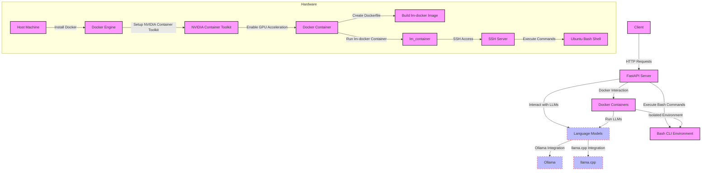

To set up the 'lm-sandbox' system on your desktop hardware with Ubuntu 22.04 as the base OS, follow these steps. This guide assumes you have a basic understanding of Linux commands and the system has a GPU suitable for machine learning tasks.

### Step 1: Prepare the Operating System

1. **Update and Upgrade Ubuntu**:
   Ensure your system is up-to-date with the latest packages.
   ```bash
   sudo apt update && sudo apt upgrade -y
   ```

2. **Install Essential Tools**:
   Install tools like `curl`, `git`, and `build-essential`.
   ```bash
   sudo apt install curl git build-essential -y
   ```

### Step 2: Install Docker

1. **Install Docker**:
   Follow the official Docker installation guide for Ubuntu.
   ```bash
   curl -fsSL https://get.docker.com -o get-docker.sh
   sudo sh get-docker.sh
   ```

2. **Manage Docker as a Non-root User**:
   Add your user to the Docker group to manage Docker as a non-root user.
   ```bash
   sudo usermod -aG docker ${USER}
   newgrp docker
   ```

### Step 3: Setup NVIDIA Container Toolkit

1. **Install NVIDIA Drivers**:
   Install the proprietary NVIDIA drivers for your GPU.
   ```bash
   sudo apt install nvidia-driver-470 -y
   ```

2. **Install NVIDIA Docker Support**:
   Install the NVIDIA Container Toolkit to enable GPU acceleration in Docker containers.
   ```bash
   distribution=$(. /etc/os-release;echo $ID$VERSION_ID)
   curl -s -L https://nvidia.github.io/nvidia-docker/gpgkey | sudo apt-key add -
   curl -s -L https://nvidia.github.io/nvidia-docker/$distribution/nvidia-docker.list | sudo tee /etc/apt/sources.list.d/nvidia-docker.list
   sudo apt update && sudo apt install -y nvidia-container-toolkit
   sudo systemctl restart docker
   ```

### Step 4: Build the 'lm-docker' Image

1. **Clone the Repository**:
   Clone the repository containing the Dockerfile for the 'lm-docker' image.
   ```bash
   git clone <repository-url>
   cd <repository-directory>
   ```

2. **Build the Docker Image**:
   Build the Docker image from the Dockerfile. This image will contain the environment for running your language models.
   ```bash
   sudo docker build -t lm-docker .
   ```

### Step 5: Run the 'lm-docker' Container

1. **Run the Docker Container**:
   Start a Docker container from the 'lm-docker' image. Ensure to enable GPU access with `--gpus all`.
   ```bash
   sudo docker run --gpus all -d -p 8000:8000 --name lm_container lm-docker
   ```

### Step 6: Setup FastAPI Server

1. **Access the Container**:
   Access the running container via SSH or `docker exec`.
   ```bash
   sudo docker exec -it lm_container /bin/bash
   ```

2. **Start FastAPI**:
   Inside the container, navigate to the directory containing your FastAPI application and start it with Uvicorn.
   ```bash
   uvicorn main:app --host 0.0.0.0 --reload
   ```

### Step 7: Verify the Setup

1. **Test the API**:
   Use `curl` or a web browser to test the FastAPI endpoints.
   ```bash
   curl http://localhost:8000/run-bash/?cmd=whoami
   ```

2. **Test GPU Acceleration**:
   Ensure that the Docker container can access the GPU by running a test command or script that utilizes the GPU.

This setup guide walks you through installing Docker, setting up the NVIDIA Container Toolkit for GPU acceleration, building and running a Docker container with your language models, and setting up a FastAPI server to interact with the models and execute Bash commands.
