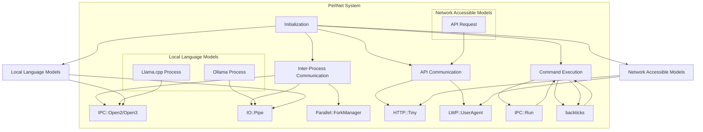

### PerlNet Functionality Overview

**PerlNet** is a system designed to enable collaboration between local language models, network-accessible models via API (such as GPT, Gemini, etc.), and allow these models to issue commands inside a common development environment (virtual machine/container). Here's an explanation of how PerlNet functions to achieve this:

### Components

1. **Local Language Models**: Running in the same container/VM environment.
2. **Network Accessible Models**: Accessed via API calls.
3. **Command Execution Environment**: A shared environment where models can execute commands.

### Key Functionalities

1. **Inter-Process Communication (IPC)**: 
   - **IPC::Open2/Open3**: For synchronous communication between processes.
   - **IO::Pipe**: For asynchronous communication and handling large data streams.
   - **Parallel::ForkManager**: For managing multiple processes concurrently.

2. **API Communication**:
   - **HTTP::Tiny** or **LWP::UserAgent**: For making API calls to network-accessible models.

3. **Command Execution**:
   - **IPC::Run**: To handle command execution within the shared environment.
   - **system()** or backticks: For simple command execution.

### Workflow

1. **Initialization**:
   - Start by initializing the local language models using `IPC::Open2` or `IPC::Open3` to create communication channels.
   - Set up the environment for accessing network models, ensuring necessary authentication and API keys are configured.

2. **Inter-Process Communication**:
   - Use `IO::Pipe` or `IPC::Open2` to send and receive data between local models.
   - Handle data streams asynchronously to ensure efficient communication.

3. **API Communication**:
   - When a request needs to be sent to a network model, use HTTP modules to construct and send the request.
   - Parse the response and integrate it with the local processing.

4. **Command Execution**:
   - Commands issued by any model are handled using `IPC::Run` or `system()`.
   - Output from commands is captured and sent back to the requesting model or used for further processing.

### Example Implementation

Here is a simplified example in Perl, showcasing these functionalities:

```perl
#!/usr/bin/perl

use strict;
use warnings;
use IPC::Open2;
use IO::Pipe;
use Parallel::ForkManager;
use HTTP::Tiny;

my $pm = Parallel::ForkManager->new(2);

my %processes = (
    llama => {
        cmd  => 'llama.cpp',
        args => ['--model_path', '/path/to/model', '--input', 'example.txt'],
    },
    ollama => {
        cmd  => 'ollama',
        args => [],
    },
);

my $api_url = "https://api.frontiermodel.com/v1/query";
my $api_key = "your_api_key_here";

sub run_process {
    my ($name) = @_;
    my ($READER, $WRITER);
    open2($READER, $WRITER, $processes{$name}{cmd}, @{ $processes{$name}{args} }) or die "Cannot fork: $!";
    print "Running $name process\n";
    while (<$READER>) {
        print "$name output: $_";
    }
    close($WRITER);
}

sub api_request {
    my ($input) = @_;
    my $http = HTTP::Tiny->new();
    my $response = $http->post_form($api_url, {
        api_key => $api_key,
        input => $input,
    });

    if ($response->{success}) {
        return $response->{content};
    } else {
        die "Failed to fetch from API: $response->{status} $response->{reason}";
    }
}

sub execute_command {
    my ($command) = @_;
    my $output = `$command`;
    return $output;
}

$pm->start and next for keys %processes;
run_process($_) for keys %processes;
$pm->wait_all_children;

my $input = "Sample input for API";
my $api_result = api_request($input);
print "API Result: $api_result\n";

my $command_output = execute_command("ls -l");
print "Command Output: $command_output\n";
```

### Explanation

1. **Process Management**: Uses `Parallel::ForkManager` to handle multiple local processes concurrently.
2. **Running Local Models**: Uses `IPC::Open2` to manage input and output streams of local models.
3. **API Requests**: Uses `HTTP::Tiny` to send requests to network-accessible models and handle their responses.
4. **Command Execution**: Uses backticks to execute shell commands within the shared environment.

### Benefits

- **Scalability**: Easily scales with more local and network-accessible models.
- **Flexibility**: Handles both synchronous and asynchronous communication.
- **Integration**: Combines local processing power with remote model capabilities.
- **Efficiency**: Streamlines command execution and data handling within a single environment.

By leveraging these Perl modules and methodologies, PerlNet provides a robust and flexible framework for orchestrating and collaborating between various language models and command execution environments.

