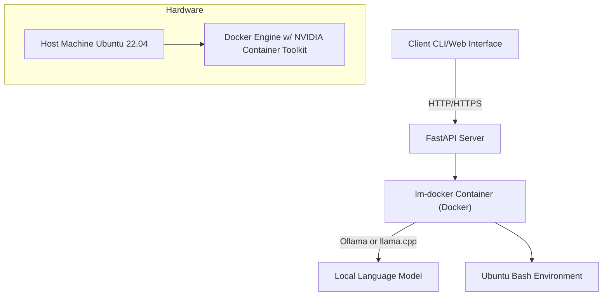
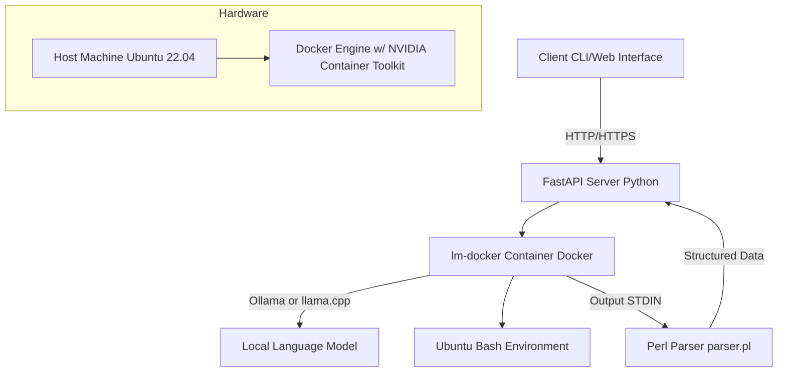

Absolutely! Here's a Dockerfile for creating a containerized Perl language parser on Ubuntu 22.04, along with an explanation:

**Dockerfile:**

```dockerfile
# Use the official Ubuntu 22.04 base image
FROM ubuntu:22.04

# Update package lists and install Perl and common Perl modules
RUN apt-get update && \
    apt-get install -y perl libjson-perl libregexp-common-perl libtext-csv-perl && \
    apt-get clean && \
    rm -rf /var/lib/apt/lists/*

# Set the working directory within the container
WORKDIR /app

# Copy your Perl parsing script into the container
COPY parser.pl /app/

# Command to execute when the container starts (replace with your script name)
CMD ["perl", "parser.pl"]
```

**Explanation:**

1. **Base Image:** We start with the official Ubuntu 22.04 image, providing a solid foundation for our Perl environment.

2. **Install Perl and Modules:**  We update package lists and install:
   - `perl`: The Perl interpreter.
   - `libjson-perl`: A module for parsing and manipulating JSON data.
   - `libregexp-common-perl`: A module for common regular expressions.
   - `libtext-csv-perl`: A module for parsing and working with CSV (comma-separated values) data.

3. **Working Directory:** We set the working directory to `/app` within the container. This is where your Perl parsing script will be placed.

4. **Copy Script:** Replace `parser.pl` with the actual filename of your Perl parsing script. This command copies it into the container's `/app` directory.

5. **Startup Command:** The `CMD` instruction specifies that the container should run your Perl script (`parser.pl`) when it starts.


**Example `parser.pl` (Basic JSON Parsing):**

```perl
#!/usr/bin/perl
use JSON;

my $json_string = '{"name": "John Doe", "age": 30, "city": "New York"}';
my $data = decode_json($json_string);

print "Name: $data->{'name'}\n";
print "Age: $data->{'age'}\n";
print "City: $data->{'city'}\n";
```


**How to Build and Run:**

1. **Save Files:** Save the Dockerfile as `Dockerfile` and the Perl script (e.g., `parser.pl`) in the same directory.

2. **Build the Image:** Open a terminal in that directory and run:

   ```bash
   docker build -t perl-parser .
   ```

3. **Run the Container:**

   ```bash
   docker run -it --rm perl-parser
   ```

**Key Considerations:**

- **Script:** Make sure to create your `parser.pl` script with the appropriate Perl code to parse the specific language model output format you're working with.

- **Specialization:** If your parsing needs are complex, you may need additional Perl modules. You can add them to the `apt-get install` command in the Dockerfile.

- **Data Input:**  Determine how the language model output will be provided to your parser (e.g., through standard input, a file, or an API call). Update the `parser.pl` script accordingly.

  Absolutely! Let's refine this further into a more concise, elegant implementation with a clear explanation:

**Refined System Diagram:**



**Simplified Explanation:**

1. **Host Machine:** Your Ubuntu 22.04 machine serves as the foundation. It has Docker Engine installed, enhanced with the NVIDIA Container Toolkit for GPU acceleration if needed.

2. **Docker Container (`lm-docker`)**:  This is the heart of the system. It provides:
   - **Isolation:** A secure, self-contained environment for running language models.
   - **Flexibility:** Easily switch between Ollama or llama.cpp by modifying the container configuration.
   - **Bash Access:** A full Ubuntu Bash environment for scripting, data manipulation, etc.

3. **FastAPI Server:** A Python-based web framework that acts as the bridge between your client (CLI, web interface, etc.) and the Docker container. It handles requests, manages interactions with the language model, and executes Bash commands within the container.

4. **Client:** This can be as simple as a command-line interface (CLI) or a more sophisticated web-based application. The client sends requests to the FastAPI server, specifying the model to use, input text, and any desired commands.


**Key Improvements:**

- **Simplified Architecture:** Removed the VM layer, as Docker containers provide the necessary isolation and environment control.
- **Streamlined Communication:**  FastAPI directly interacts with the language model and Bash environment within the container, eliminating the need for SSH.
- **Flexibility:** Easily switch between Ollama and llama.cpp models by modifying the Docker container configuration.
- **Enhanced Security:** Docker containers offer a more secure sandbox for running the language models.
- **Standardized Deployment:** By using Docker, the entire setup can be packaged into a single image, making it easy to deploy and reproduce across different environments.

**Why FastAPI Instead of SSH:**

FastAPI is a much more efficient and convenient way to communicate with your application running within the Docker container. Here's why:

- **API-Driven:** FastAPI is designed for building APIs, allowing for well-structured communication between the client and the language model.
- **Performance:** FastAPI is high-performance, minimizing the overhead of communication compared to SSH.
- **Flexibility:** You can easily add authentication, validation, and other features to your API with FastAPI.
- **Python Integration:** FastAPI seamlessly integrates with Python, the language you'll likely be using for your language model scripts.

**Minimum Viable Product (MVP) Development:**

1. **FastAPI Server:**
   - Set up basic endpoints for:
      - Model selection (Ollama or llama.cpp)
      - Text input/output
      - Executing Bash commands within the container
   - Implement token-based authentication for security.

2. **Docker Container (`lm-docker`):**
   - Create a Dockerfile that includes:
      - Base Ubuntu image
      - Installation of Ollama and/or llama.cpp
      - Configuration for GPU acceleration (if needed)
      - Any additional libraries or dependencies

3. **Client (CLI):**
   - Build a simple command-line tool to:
      - Interact with the FastAPI endpoints
      - Display model output 
      - Handle user input

**Note:** A parser for the language model output may be necessary depending on the format of the responses. You can use Python libraries like `json` or `re` (regular expressions) for basic parsing, or more specialized libraries if needed.****

Absolutely! Let's outline the `parser.pl` script and the FastAPI server setup, focusing on the language model output parsing aspect. 

**`parser.pl` Script (Example Structure):**

```perl
#!/usr/bin/perl
use JSON;

while (<>) {  # Read input line by line (from STDIN)
    chomp;   # Remove newline

    if (m/^{.*}$/) { # Check if the line is likely JSON
        my $data = decode_json($_); 

        # Parsing Logic (Adapt to your model's output format)
        if (exists $data->{'model'}) {
            # Handle model selection information
        } elsif (exists $data->{'text'}) {
            # Process text output from the model
        } elsif (exists $data->{'command_result'}) {
            # Handle the result of a Bash command
        } else {
            # Unrecognized format, handle accordingly
        }

    } else {
        # Handle non-JSON output (e.g., plain text)
    }
}
```

**Key Points for `parser.pl`:**

- **Input:**  Reads input from STDIN, assuming the language model output is piped to the script.
- **JSON Detection:** Checks if the input line looks like JSON (starts and ends with curly braces).
- **Parsing Logic:**
    - Use `decode_json` to parse valid JSON into a Perl hash (`$data`).
    - Add `if` statements to check for specific keys in the parsed output:
        - `model`: Indicates which model (Ollama or llama.cpp) was used.
        - `text`: The actual text generated by the language model.
        - `command_result`: The output of a Bash command executed within the container.
    - Adapt the parsing logic to your model's exact output structure.

**FastAPI Server (`main.py`) Enhancement:**

```python
from fastapi import FastAPI, HTTPException
from fastapi.security import HTTPBearer
import subprocess

app = FastAPI()
security = HTTPBearer()

# ... (your existing FastAPI code, including token authentication)


@app.post("/generate")
async def generate_text(input_data: dict, token: str = Depends(security)):
    # ... (your authentication logic)

    model = input_data.get("model", "ollama")  # Default to Ollama
    prompt = input_data.get("prompt")

    if not prompt:
        raise HTTPException(status_code=400, detail="Missing 'prompt' in request")

    # Construct the command to run inside the Docker container
    command = f"echo '{prompt}' | docker exec -i lm-docker perl /app/parser.pl"  # Pass prompt via STDIN

    process = subprocess.Popen(command, shell=True, stdout=subprocess.PIPE, stderr=subprocess.PIPE)
    stdout, stderr = process.communicate()

    if process.returncode != 0:
        raise HTTPException(status_code=500, detail=f"Error executing command: {stderr.decode()}")

    return {"result": stdout.decode()}  
```

**Key Changes in `main.py`:**

- **Command Construction:**  
    - The `command` now pipes the `prompt` to the `docker exec` command using `echo`.
    - Inside the container, the Perl parser (`parser.pl`) reads the prompt from STDIN.
- **Error Handling:** Added a check for non-zero return codes from the `docker exec` command, raising an HTTPException if an error occurs.
- **JSON Response:** The server now returns the parsed output in a JSON format with the key `result`.



Here's the updated Mermaid diagram, incorporating the `parser.pl` script and the FastAPI server's interaction with it:

**Key Changes in the Diagram:**

- **Perl Parser:** A new node (`Parser`) is added to represent the `parser.pl` script within the Docker container.
- **Output Flow:** Arrows now indicate that the language model's output is piped (via STDIN) to the Perl parser, which then sends structured data back to the FastAPI server.

**Explanation of the Flow:**

1. **Client Request:** The client sends a request to the FastAPI server, including the prompt and potentially the model selection.

2. **FastAPI Execution:** The FastAPI server handles the request, constructs a command to execute the language model within the Docker container, and pipes the prompt to the container's STDIN.

3. **Language Model Output:** The language model generates its output, which is sent to the STDOUT of the container.

4. **Perl Parser:** The `parser.pl` script running inside the container reads the model's output from STDIN, parses it according to the expected format, and structures the data.

5. **Structured Data Returned:** The parsed and structured data is then sent back to the FastAPI server.

6. **Response to Client:** The FastAPI server processes the structured data (e.g., extracts the generated text, command results, or model information) and sends an appropriate response back to the client.
