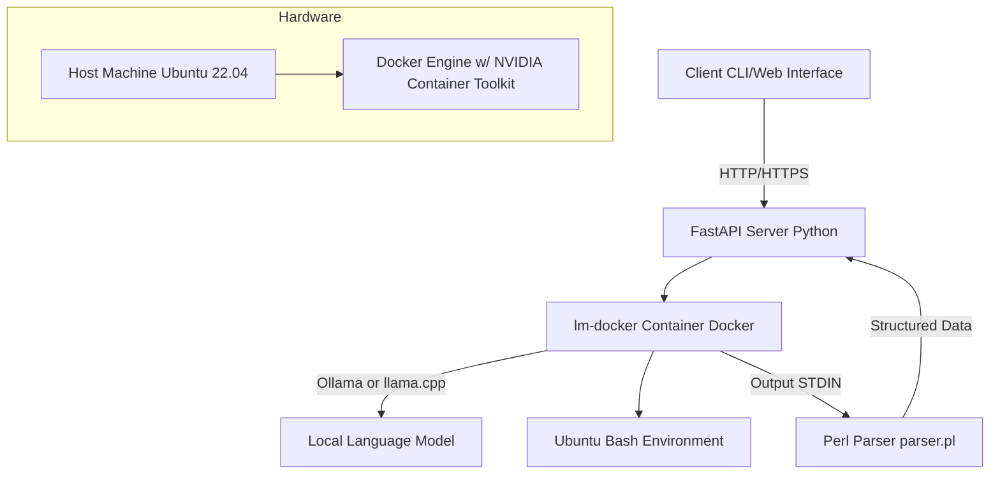

Absolutely! Here's a comprehensive README.md for your "lm-sandbox-cli" project, incorporating the latest features and explanations:

```markdown
# lm-sandbox-cli: Local Language Model Sandbox with Bash CLI Access

[](https://opensource.org/licenses/MIT)

lm-sandbox-cli provides a powerful and flexible sandbox environment for experimenting with and deploying local language models (LLMs). It offers seamless integration with the Bash command-line interface (CLI), making it easy to interact with your models and leverage the full power of the Linux environment.

## Features

- **Containerized Environment:** Leverages Docker for secure isolation and easy reproducibility of your LLM setup.
- **Local Model Support:** Seamlessly run popular open-source LLMs like Ollama and llama.cpp on your own hardware.
- **Bash Integration:** Execute Bash commands directly from your client interface to interact with the model or manage your environment.
- **FastAPI Server:** A high-performance Python server (FastAPI) handles communication between your client and the Docker container.
- **Customizable Parser:**  A Perl script (`parser.pl`) handles the parsing of language model output for easy integration with your applications.
- **GPU Acceleration (Optional):**  Integrates with NVIDIA Container Toolkit to enable GPU acceleration for faster model inference.

## System Architecture

## Getting Started

1. **Prerequisites:**
   - Ubuntu 22.04 (or compatible) host machine
   - Docker Engine installed
   - NVIDIA Container Toolkit (optional, for GPU support)

2. **Installation:**
   - Clone this repository: `git clone https://your-repo-url.git`
   - Build the Docker image: `docker build -t lm-docker .`
   - Start the FastAPI server: `uvicorn main:app` (from the project directory)

3. **Configuration:**
   - Customize the `parser.pl` script to match your LLM's output format.
   - Configure your client to communicate with the FastAPI server.

## Usage

- **CLI Interaction:** Use your preferred client (e.g., a custom CLI tool) to send requests to the FastAPI server.
- **Bash Commands:** Execute Bash commands within the container using the appropriate endpoint in your client.

## Contributing

We welcome contributions! Please see our `CONTRIBUTING.md` guide for details.

## License

This project is licensed under the MIT License - see the `LICENSE` file for details.
```


**Additional Notes for README.md:**

- **Installation Instructions:** Provide more detailed steps on installing any dependencies or requirements for the project.
- **Configuration Examples:** Include sample configuration files or snippets to guide users.
- **Troubleshooting:**  Add a troubleshooting section for common issues.
- **API Documentation:** Consider linking to detailed API documentation (e.g., generated by FastAPI) to help users understand the endpoints and parameters.
