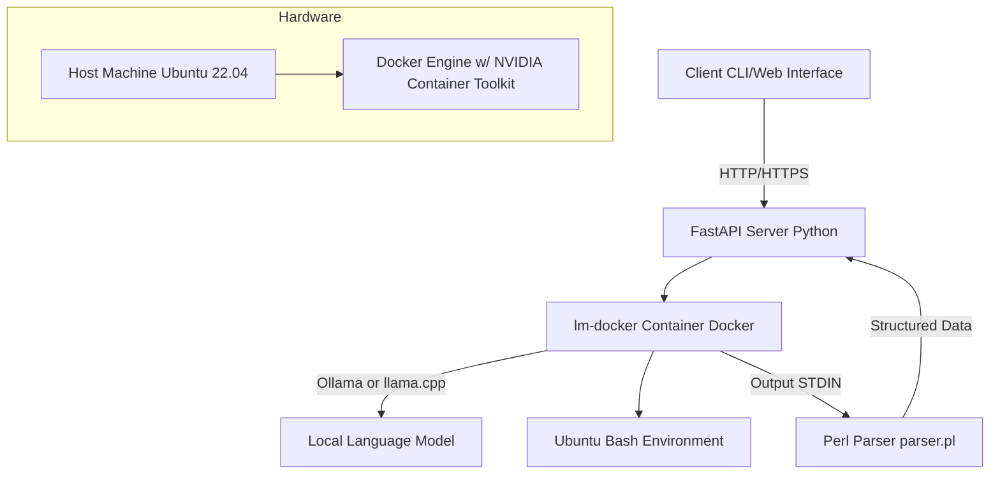

Absolutely! Here's a comprehensive README.md for your "lm-sandbox-cli" project, incorporating the latest features and explanations:

```markdown
# lm-sandbox-cli: Local Language Model Sandbox with Bash CLI Access

[](https://opensource.org/licenses/MIT)

lm-sandbox-cli provides a powerful and flexible sandbox environment for experimenting with and deploying local language models (LLMs). It offers seamless integration with the Bash command-line interface (CLI), making it easy to interact with your models and leverage the full power of the Linux environment.

## Features

- **Containerized Environment:** Leverages Docker for secure isolation and easy reproducibility of your LLM setup.
- **Local Model Support:** Seamlessly run popular open-source LLMs like Ollama and llama.cpp on your own hardware.
- **Bash Integration:** Execute Bash commands directly from your client interface to interact with the model or manage your environment.
- **FastAPI Server:** A high-performance Python server (FastAPI) handles communication between your client and the Docker container.
- **Customizable Parser:**  A Perl script (`parser.pl`) handles the parsing of language model output for easy integration with your applications.
- **GPU Acceleration (Optional):**  Integrates with NVIDIA Container Toolkit to enable GPU acceleration for faster model inference.

## System Architecture

## Getting Started

1. **Prerequisites:**
   - Ubuntu 22.04 (or compatible) host machine
   - Docker Engine installed
   - NVIDIA Container Toolkit (optional, for GPU support)

2. **Installation:**
   - Clone this repository: `git clone https://your-repo-url.git`
   - Build the Docker image: `docker build -t lm-docker .`
   - Start the FastAPI server: `uvicorn main:app` (from the project directory)

3. **Configuration:**
   - Customize the `parser.pl` script to match your LLM's output format.
   - Configure your client to communicate with the FastAPI server.

## Usage

- **CLI Interaction:** Use your preferred client (e.g., a custom CLI tool) to send requests to the FastAPI server.
- **Bash Commands:** Execute Bash commands within the container using the appropriate endpoint in your client.

## Contributing

We welcome contributions! Please see our `CONTRIBUTING.md` guide for details.

## License

This project is licensed under the MIT License - see the `LICENSE` file for details.
```


**Additional Notes for README.md:**

- **Installation Instructions:** Provide more detailed steps on installing any dependencies or requirements for the project.
- **Configuration Examples:** Include sample configuration files or snippets to guide users.
- **Troubleshooting:**  Add a troubleshooting section for common issues.
- **API Documentation:** Consider linking to detailed API documentation (e.g., generated by FastAPI) to help users understand the endpoints and parameters.

To list all installed Perl packages (modules) on your system, you can use several methods. Here are some common approaches:

### Using `perldoc`

The `perldoc` command can be used to list all installed modules. Run the following command in your terminal:

```bash
perldoc perllocal
```

This will display a list of all installed modules, including their versions and installation paths.

### Using `cpan`

If you have the `cpan` command-line tool installed, you can use it to list installed modules:

1. **Open a Terminal**: Launch your terminal application.

2. **Run `cpan`**: Enter the `cpan` shell by running:

   ```bash
   cpan
   ```

3. **List Installed Modules**: Once in the `cpan` shell, run the following command:

   ```bash
   installed
   ```

   This will display a list of all installed modules.

### Using `cpanminus`

If you have `cpanm` (cpanminus) installed, you can use it to list installed modules:

```bash
cpanm --list
```

This will display a list of all installed modules.

### Using `pm-list`

The `pm-list` script from the `App::pmuninstall` module can also be used to list installed modules. First, ensure you have the module installed:

```bash
cpan App::pmuninstall
```

Then, run the `pm-list` script:

```bash
pm-list
```

This will display a list of all installed modules.

### Using a Perl Script

You can also create a Perl script to list all installed modules. Here is an example script:

```perl
#!/usr/bin/perl
use strict;
use warnings;
use ExtUtils::Installed;

my $installed = ExtUtils::Installed->new();
my @modules = $installed->modules();

foreach my $module (@modules) {
    my $version = $installed->version($module) || 'unknown';
    print "$module ($version)\n";
}
```

Save this script to a file (e.g., `list_perl_modules.pl`) and run it:

```bash
perl list_perl_modules.pl
```

This script will output a list of all installed modules along with their versions.

### Summary

- **Perldoc**: Use `perldoc perllocal` to list installed modules.
- **CPAN Shell**: Use `cpan` and then `installed` to list modules.
- **CPANminus**: Use `cpanm --list` to list modules.
- **pm-list**: Use `pm-list` from `App::pmuninstall` to list modules.
- **Perl Script**: Create a Perl script to list modules.

By using these methods, you can list all installed Perl packages (modules) on your system.
