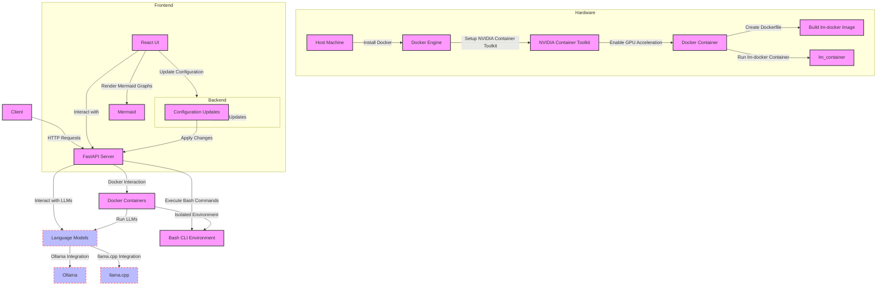

```mermaid
graph TD
    Client[Client] -->|HTTP Requests| FastAPI[FastAPI Server]
    FastAPI -->|Interact with LLMs| LLM[Language Models]
    FastAPI -->|Execute Bash Commands| Bash[Bash CLI Environment]
    FastAPI -->|Docker Interaction| Docker[Docker Containers]
    Docker -->|Run LLMs| LLM
    Docker -->|Isolated Environment| Bash

    LLM -->|Ollama Integration| Ollama[Ollama]
    LLM -->|llama.cpp Integration| llama_cpp[llama.cpp]

    subgraph Hardware
        Host[Host Machine]
        Host -->|Install Docker| DockerEngine[Docker Engine]
        DockerEngine -->|Setup NVIDIA Container Toolkit| NVIDIA[NVIDIA Container Toolkit]
        NVIDIA -->|Enable GPU Acceleration| DockerContainer[Docker Container]
        DockerContainer -->|Create Dockerfile| lmDocker[Build lm-docker Image]
        DockerContainer -->|Run lm-docker Container| lmContainer[lm_container]
    end

    subgraph Frontend
        UI[React UI] -->|Render Mermaid Graphs| Mermaid[Mermaid]
        UI -->|Interact with| FastAPI
        UI -->|Update Configuration| Backend[Backend]
    end

    subgraph Backend
        Backend -->|Process Updates| ConfigUpdate[Configuration Updates]
        ConfigUpdate -->|Apply Changes| FastAPI
    end

    classDef default fill:#f9f,stroke:#333,stroke-width:2px;
    classDef llm fill:#bbf,stroke:#f66,stroke-width:2px,stroke-dasharray: 5, 5;
    class FastAPI,Docker default;
    class LLM,Ollama,llama_cpp llm;
    class Frontend,Backend fill:#ccf,stroke:#33f,stroke-width:2px;
```
