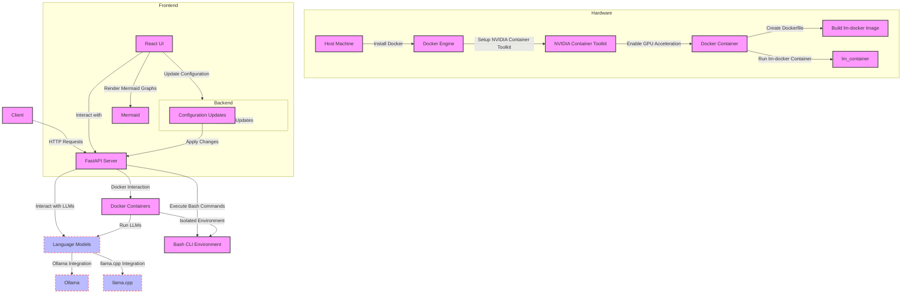

Here's an updated Mermaid diagram based on the latest details of the `lm-sandbox-cli` project, including the integration with the web-based interface for managing Mermaid graphs.

### Description

1. **Frontend**: 
   - **React UI**: Provides the user interface for interacting with the system. Allows rendering and editing of Mermaid diagrams.
   - **Mermaid**: Used to visualize and interact with system diagrams.
   - **Update Configuration**: Sends configuration updates to the FastAPI backend.

2. **Backend**:
   - **FastAPI Server**: Handles HTTP requests for interacting with LLMs and executing bash commands.
   - **Configuration Updates**: Endpoint to process and apply updates from the frontend.

3. **Hardware**:
   - **Host Machine**: Runs Docker and NVIDIA Container Toolkit for GPU acceleration.
   - **Docker Engine**: Manages Docker containers.
   - **NVIDIA Container Toolkit**: Enables GPU acceleration within Docker containers.

4. **LLMs**:
   - **Ollama**: Integration for LLMs.
   - **llama.cpp**: Another integration for LLMs.

5. **Interactions**:
   - The React UI renders Mermaid diagrams and interacts with the FastAPI backend.
   - The FastAPI server interacts with the Docker containers to run LLMs and execute bash commands.
   - Configuration updates are processed and applied through the backend.

Feel free to customize the diagram further based on additional details or specific needs of the project!
