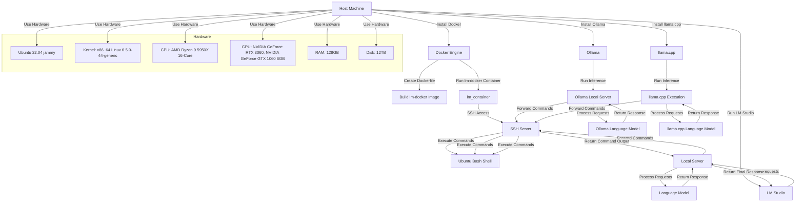

There are several libraries, command-line interfaces (CLI), and web servers available for running large language models (LLMs) locally or in cloud environments. Here are some notable options:

### Libraries
1. **Hugging Face Transformers**
   - Widely used library for working with various LLMs like GPT, BERT, and more.
   - Supports both PyTorch and TensorFlow.
   - Provides easy integration and fine-tuning of pre-trained models.
   - [GitHub](https://github.com/huggingface/transformers)

2. **Fairseq**
   - A Facebook AI Research (FAIR) library for sequence-to-sequence learning.
   - Used for training and evaluating LLMs.
   - [GitHub](https://github.com/pytorch/fairseq)

3. **OpenAI GPT-3 API**
   - Provides access to GPT-3 models via a web API.
   - Requires an API key and offers various endpoints for different tasks.
   - [OpenAI](https://beta.openai.com/)

4. **EleutherAI GPT-NeoX**
   - A library for training and inference of large transformer models.
   - Supports distributed training.
   - [GitHub](https://github.com/EleutherAI/gpt-neox)

### Command-Line Interfaces (CLI)
1. **llama.cpp**
   - A CLI tool for running inference with LLaMA models.
   - Designed for efficient execution on local machines.
   - [GitHub](https://github.com/ggerganov/llama.cpp)

2. **GPT-3 CLI**
   - A simple CLI for interacting with OpenAI's GPT-3.
   - Useful for quick experiments and testing.
   - [GitHub](https://github.com/kollalabs/gpt3-cli)

3. **Ollama**
   - Provides an interface for interacting with LLMs.
   - Offers various options for model execution and management.
   - [GitHub](https://github.com/jordwest/ollama)

4. **lm-scorer**
   - A CLI for scoring texts using language models.
   - Supports models from Hugging Face Transformers.
   - [GitHub](https://github.com/simonepri/lm-scorer)

### Web Servers
1. **LM Studio**
   - Hosts LLMs locally via a web server interface.
   - Supports various endpoints similar to OpenAI's API.
   - [LM Studio](https://lmstudio.ai)

2. **FastAPI**
   - A modern web framework for building APIs with Python.
   - Often used to serve LLMs with custom endpoints.
   - [GitHub](https://github.com/tiangolo/fastapi)

3. **Flask**
   - A lightweight WSGI web application framework in Python.
   - Commonly used for serving machine learning models.
   - [GitHub](https://github.com/pallets/flask)

4. **Django**
   - A high-level Python web framework.
   - Can be used to build robust web applications that serve LLMs.
   - [GitHub](https://github.com/django/django)

5. **TensorFlow Serving**
   - A flexible, high-performance serving system for machine learning models.
   - Designed for production environments.
   - [GitHub](https://github.com/tensorflow/serving)

### Usage Examples

#### Using Hugging Face Transformers with FastAPI
```python
from fastapi import FastAPI
from transformers import pipeline

app = FastAPI()
model = pipeline('text-generation', model='gpt-2')

@app.post("/generate/")
async def generate_text(prompt: str):
    return model(prompt)

# Run with: uvicorn script_name:app --reload
```

#### Running LLaMA with llama.cpp
```bash
# Clone the repository
git clone https://github.com/ggerganov/llama.cpp
cd llama.cpp

# Build the project
make

# Run inference
./llama -m models/7B/ggml-model.bin -p "Your prompt here"
```

These libraries, CLIs, and web servers provide a range of options for running and serving large language models efficiently, both for development and production environments.


Large Language Models (LLMs) have gained significant attention due to their ability to generate human-like text, answer questions, and perform a variety of natural language processing tasks. Here are some other libraries, CLI tools, and web servers that are popular for working with LLMs, similar to Ollama and llama.cpp:

### Libraries

1. **Transformers by Hugging Face**:
   - **Description**: A popular library for working with a wide range of pre-trained transformer models, including BERT, GPT, and more.
   - **Link**: [Hugging Face Transformers](https://github.com/huggingface/transformers)

2. **Fairseq**:
   - **Description**: A sequence modeling toolkit that allows researchers and developers to train custom models for translation, summarization, language modeling, and more.
   - **Link**: [Fairseq](https://github.com/pytorch/fairseq)

3. **AllenNLP**:
   - **Description**: An open-source NLP research library, built on PyTorch, that provides tools for designing and evaluating NLP models.
   - **Link**: [AllenNLP](https://github.com/allenai/allennlp)

4. **spaCy**:
   - **Description**: An industrial-strength NLP library in Python that supports a wide range of NLP tasks and integrates well with other libraries.
   - **Link**: [spaCy](https://github.com/explosion/spaCy)

### CLI Tools

1. **GPT-3 CLI**:
   - **Description**: A command-line interface for interacting with OpenAI's GPT-3 model, allowing users to generate text directly from the terminal.
   - **Link**: [GPT-3 CLI](https://github.com/rpidanny/gpt3-cli)

2. **BERT-CLI**:
   - **Description**: A CLI tool for using BERT models for various NLP tasks, such as text classification and question answering.
   - **Link**: [BERT-CLI](https://github.com/hanxiao/bert-as-service)

3. **Fairseq-CLI**:
   - **Description**: The command-line interface for the Fairseq toolkit, which allows for training and evaluating sequence models.
   - **Link**: [Fairseq-CLI](https://github.com/pytorch/fairseq)

### Web Servers

1. **BERT as a Service**:
   - **Description**: A web server that provides BERT embeddings for text, allowing applications to easily integrate BERT's powerful contextual understanding.
   - **Link**: [BERT as a Service](https://github.com/hanxiao/bert-as-service)

2. **GPT-NeoX**:
   - **Description**: A web server and API for running large-scale language models like GPT-NeoX, which can be used for text generation and other NLP tasks.
   - **Link**: [GPT-NeoX](https://github.com/EleutherAI/gpt-neox)

3. **FastAPI for LLMs**:
   - **Description**: FastAPI is a modern, fast (high-performance), web framework for building APIs with Python 3.7+ based on standard Python type hints. It can be used to create a web server for serving LLMs.
   - **Link**: [FastAPI](https://github.com/tiangolo/fastapi)

These tools and libraries provide a range of functionalities for working with LLMs, from simple CLI interactions to complex web server deployments. Depending on your specific needs and use case, you can choose the appropriate tool to integrate LLMs into your applications.


For working with large language models (LLMs) like OpenAI's models, there are several libraries, command-line interfaces (CLI), and web servers that facilitate interaction with these models or serve as alternatives for different use cases. Here's an overview:

### Libraries

1. **Transformers (by Hugging Face)**: A comprehensive library that provides access to thousands of pre-trained models for Natural Language Processing (NLP), including large language models. It supports PyTorch, TensorFlow, and JAX.
   - **Website**: [Hugging Face Transformers](https://huggingface.co/transformers/)

2. **GPT-Neo and GPT-J (by EleutherAI)**: Open-source alternatives to GPT-3, these models are available through the Hugging Face Transformers library and can be used for a variety of NLP tasks.
   - **Website**: [EleutherAI](https://www.eleuther.ai/)

3. **Fairseq (by Facebook AI Research)**: A sequence modeling toolkit that allows researchers and developers to train custom models for translation, summarization, language modeling, and other text generation tasks.
   - **GitHub**: [Fairseq](https://github.com/pytorch/fairseq)

### CLI Tools

1. **OpenAI CLI**: OpenAI provides a command-line tool for interacting with their API, allowing users to easily make requests to models like GPT-3 directly from the terminal.
   - **Documentation**: [OpenAI API](https://beta.openai.com/docs/api-reference/introduction)

2. **Hugging Face CLI**: The `transformers-cli` provided by Hugging Face allows users to download and upload models from the Hugging Face Model Hub, among other functionalities.
   - **Documentation**: [Hugging Face CLI](https://huggingface.co/transformers/main_classes/commands.html)

### Web Servers & APIs

1. **Hugging Face Inference API**: Provides an easy-to-use API to run inference on hosted models, including large language models. It supports a wide range of models for different tasks.
   - **Website**: [Hugging Face Inference API](https://huggingface.co/inference-api)

2. **Docker Images for LLMs**: There are Docker images available for running large language models locally or in the cloud. These can be found on Docker Hub or GitHub, providing an encapsulated environment for model inference.

3. **FastAPI for ML Models**: FastAPI is a modern, fast (high-performance) web framework for building APIs with Python 3.7+ that's particularly well-suited for deploying machine learning models. Developers can wrap their LLMs in a FastAPI server to create a custom API for their models.
   - **GitHub**: [FastAPI](https://github.com/tiangolo/fastapi)

### Other Notable Mentions

- **LLaMA (by Meta)**: A family of models that have been made available for research purposes. While not directly a library or tool, the models can be used with existing libraries like Hugging Face Transformers.
- **ollama**: As of my last update, specific details or official sources for "ollama" were not provided, so it's important to refer to the official repositories or announcements for accurate information.

When working with these tools and libraries, always consider the computational requirements and ethical considerations of deploying large language models, including data privacy, model bias, and environmental impact.

Choosing between Ollama and llama.cpp depends on your specific requirements, use case, and the context in which you intend to use these tools. Both Ollama and llama.cpp are related to the processing and utilization of the LLaMA (Large Language Model) architecture, but they serve different purposes and have different strengths.

### Ollama

- **Purpose**: Ollama is likely a framework or tool designed to work with LLaMA models, potentially focusing on deployment, integration, or specific functionalities related to LLaMA.
- **Strengths**:
  - **Integration**: May offer seamless integration with other systems or platforms.
  - **Customization**: Could provide tools for customizing LLaMA models for specific applications.
  - **Ease of Use**: Might have a user-friendly interface or workflow for non-technical users.

### llama.cpp

- **Purpose**: llama.cpp is a C++ library for running LLaMA models. It is designed to be efficient and performant, making it suitable for resource-constrained environments or high-performance applications.
- **Strengths**:
  - **Performance**: Being a C++ library, it can offer high performance and low latency, which is crucial for real-time applications.
  - **Portability**: Can be compiled and run on various platforms, making it versatile for different environments.
  - **Control**: Provides low-level access to the model, allowing for fine-grained control and optimization.

### Comparison

- **Performance**: If performance is critical, especially in terms of speed and resource usage, llama.cpp might be the better choice due to its C++ implementation.
- **Ease of Use**: If you prefer a higher-level interface or need to integrate the model into existing workflows more easily, Ollama might be more suitable.
- **Customization**: Depending on the level of customization and control you need, one might offer more flexibility than the other.
- **Platform**: Consider the platform you are working on. llama.cpp being a C++ library can be more versatile across different systems.

### Conclusion

There is no one-size-fits-all answer to which is better. It depends on your specific needs, the environment you are working in, and the level of control and performance you require. If you need high performance and low-level control, llama.cpp might be the better choice. If you value ease of integration and a potentially simpler interface, Ollama could be more suitable. It's recommended to evaluate both based on your specific requirements and constraints.


Choosing between Ollama and llama.cpp depends on your specific needs, use cases, and preferences. Here are some points to consider for each:

### Ollama

#### Pros:
1. **Ease of Use**: Ollama often provides a higher-level interface that can be more user-friendly, especially for those who are less familiar with low-level operations and configurations.
2. **Flexibility**: Ollama can offer more features and flexibility in terms of model execution, integration with other tools, and management.
3. **Community and Support**: Depending on the development and support community, Ollama might have more extensive documentation and community support.

#### Cons:
1. **Overhead**: Higher-level interfaces sometimes come with additional overhead, potentially impacting performance.
2. **Complexity**: More features and flexibility can sometimes lead to increased complexity, especially for simple use cases.

### llama.cpp

#### Pros:
1. **Performance**: Designed for efficient execution, llama.cpp can offer better performance, especially for local machine inference.
2. **Lightweight**: Being a more focused and lower-level implementation, it can be more lightweight with fewer dependencies.
3. **Transparency**: With llama.cpp, you have more control over the low-level operations and configurations, which can be beneficial for fine-tuning and optimization.

#### Cons:
1. **Usability**: Might require more technical knowledge to set up and use effectively.
2. **Features**: May lack some of the higher-level features and flexibility that Ollama offers.

### Use Case Considerations

- **Development and Prototyping**: If you are in the early stages of development and need a straightforward, easy-to-use tool, Ollama might be the better choice.
- **Performance Optimization**: If performance and resource efficiency are critical, especially in a production environment, llama.cpp could be more suitable.
- **Control and Customization**: If you need granular control over the model execution and are comfortable with lower-level configurations, llama.cpp provides more transparency and customization.

### Decision Factors

1. **Technical Expertise**: Choose Ollama for ease of use and llama.cpp for more control and optimization.
2. **Project Requirements**: Consider the specific requirements of your project, such as performance needs, ease of integration, and level of customization.
3. **Community and Support**: Evaluate the level of community support, documentation, and active development for each tool.

### Example Comparison

**Ollama Setup:**
```bash
# Clone the Ollama repository
git clone https://github.com/jordwest/ollama
cd ollama

# Follow the setup instructions
```

**llama.cpp Setup:**
```bash
# Clone the llama.cpp repository
git clone https://github.com/ggerganov/llama.cpp
cd llama.cpp

# Build the project
make

# Run inference
./llama -m models/7B/ggml-model.bin -p "Your prompt here"
```

### Conclusion

- **Ollama**: Best for users looking for a higher-level, user-friendly interface with additional features and flexibility.
- **llama.cpp**: Best for users needing high performance, lower overhead, and more control over model execution.

Ultimately, the choice between Ollama and llama.cpp should be based on your specific use case, technical expertise, and project requirements.
