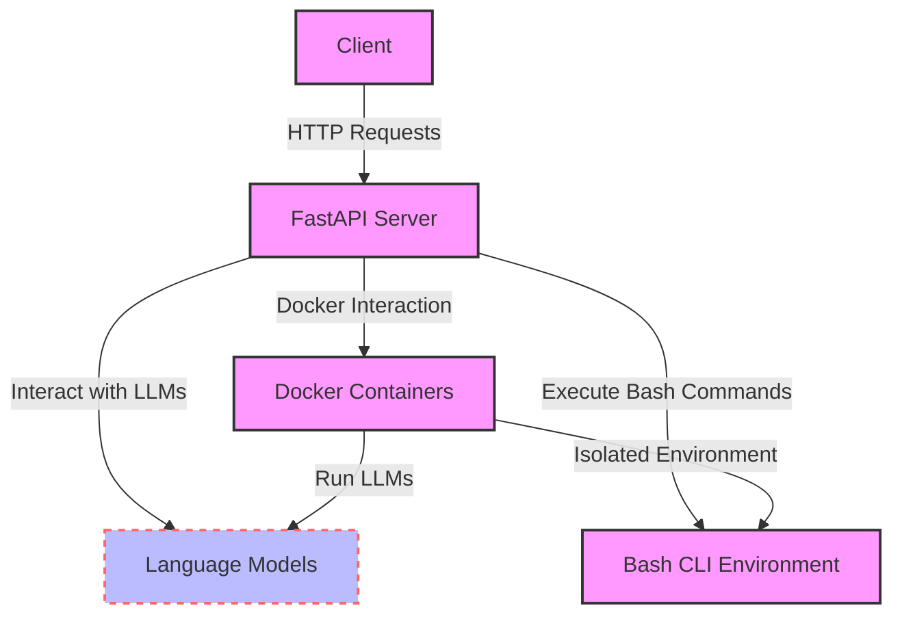

Based on the provided information, the 'lm-sandbox' project appears to be a comprehensive environment designed for experimenting with and deploying various large language models (LLMs) such as Ollama and llama.cpp. The project leverages Docker for containerization, ensuring a consistent and isolated environment for each component of the system. Here's a detailed breakdown of the project components and their interactions within the existing hardware/software stack:

### Hardware Stack

- **Host Machine Specifications**:
  - **Operating System**: Ubuntu 22.04 jammy, which is a stable and widely used Linux distribution, suitable for running complex machine learning models.
  - **Kernel**: x86_64 Linux 6.5.0-44-generic, indicating a modern Linux kernel version that supports the latest hardware and software capabilities.
  - **CPU**: AMD Ryzen 9 5950X 16-Core, a high-performance CPU that can efficiently handle the computational demands of large language models.
  - **GPUs**: NVIDIA GeForce RTX 3060 and NVIDIA GeForce GTX 1060 6GB, providing substantial GPU acceleration for model inference tasks, crucial for LLMs.
  - **RAM**: 128GB, offering ample memory to load and run large models or multiple models simultaneously without bottlenecking.
  - **Disk**: 12TB, providing significant storage space for model weights, datasets, and other necessary files.

### Software Stack and Workflow

1. **Docker Engine**:
   - Installed on the host machine, it's used to create isolated environments (containers) for different parts of the project, ensuring compatibility and ease of deployment.

2. **lm-docker Image and Container**:
   - A Docker image is built from a Dockerfile, which contains the environment setup for running LLMs. This image is then used to run a container (`lm_container`) that serves as the execution environment for the models and related tools.

3. **SSH Server within Docker Container**:
   - Facilitates secure SSH access to the container, allowing for remote execution of commands within the container's environment.

4. **Ubuntu Bash Shell**:
   - The primary interface for executing commands within the Docker container, interacting with the installed LLMs and other utilities.

5. **LM Studio**:
   - A component (possibly a web interface or application) running on the host machine, designed to send API requests to a local server for processing LLM tasks.

6. **Local Server**:
   - Processes requests from LM Studio, interacts with the language models for inference, and forwards commands to the Docker container via SSH for execution.

7. **Language Models (Ollama and llama.cpp)**:
   - Installed and run either directly on the host machine or within Docker containers, these models process requests, perform inference, and return responses. They can also forward commands to the SSH server for execution in the container.

8. **Integration with Hardware**:
   - The entire setup is designed to leverage the host machine's hardware capabilities, including CPU, GPU, RAM, and disk space, to efficiently run and manage LLMs.

### Project Workflow:

1. **API Requests**: LM Studio sends API requests to the local server.
2. **Request Processing**: The local server processes these requests, interacting with the installed LLMs (Ollama, llama.cpp) for inference.
3. **Command Execution**: Some requests may involve executing commands, which are forwarded to the Docker container via SSH.
4. **Response Handling**: The local server collects responses from the LLMs and command outputs from the Docker container, then sends the final response back to LM Studio.

### Conclusion

The 'lm-sandbox' project is a sophisticated setup for experimenting with and deploying large language models, utilizing Docker for isolation and SSH for secure command execution. It's designed to take full advantage of the host machine's high-end hardware, ensuring optimal performance for LLM tasks. This setup supports a flexible and efficient workflow for developing and testing applications powered by state-of-the-art language models.

Optimizing the performance of large language models (LLMs) in a Docker container involves several best practices aimed at ensuring efficient resource utilization, minimizing overhead, and leveraging hardware acceleration. Here are key strategies:

### 1. **Container Resource Allocation**

- **Limit Resource Usage**: Use Docker's resource constraints options (`--cpus`, `--memory`) to allocate appropriate CPU and memory resources to your container. This prevents any single container from monopolizing system resources.
- **Use CPU Pinning**: Pin your containers to specific CPUs (`--cpuset-cpus`) to reduce context switching and cache invalidation, especially important for CPU-intensive LLM tasks.

### 2. **Leverage GPU Acceleration**

- **NVIDIA Docker Toolkit**: Utilize the NVIDIA Docker toolkit (nvidia-docker) to allow your Docker containers to access the host's NVIDIA GPUs directly. This is crucial for LLMs that can benefit significantly from GPU acceleration.
- **Optimize GPU Usage**: Ensure your LLMs are optimized for the specific GPUs available (e.g., adjusting batch sizes, using mixed-precision training/inference).

### 3. **Optimize Docker Images**

- **Use Minimal Base Images**: Start with minimal base images (e.g., Alpine Linux) to reduce the size and overhead of your Docker images.
- **Layer Caching**: Organize Dockerfile instructions to maximize layer caching, speeding up builds and reducing time to deployment.
- **Multi-Stage Builds**: Use multi-stage builds to minimize the size of the final image by separating the build environment from the runtime environment.

### 4. **File System and Storage Optimization**

- **Use Volumes for Data**: Store model data and weights on Docker volumes or bind mounts instead of the container's writable layer to improve I/O performance.
- **Choose the Right Storage Driver**: Select a Docker storage driver that offers the best performance for your workload and environment (e.g., overlay2 is generally recommended).

### 5. **Network Optimization**

- **Host Networking**: For containers that require high network throughput, consider using host networking (`--network host`) to reduce networking overhead.
- **Minimize Inter-Container Communication Latency**: When running multiple containers that communicate frequently, use Docker's user-defined networks to minimize latency.

### 6. **Efficient Model Loading and Caching**

- **Model Caching**: Implement caching mechanisms for frequently used models to avoid reloading them from disk, which can be time-consuming.
- **Lazy Loading**: Load only the necessary parts of a model into memory when needed, especially useful for large models where full loading can be resource-intensive.

### 7. **Monitoring and Profiling**

- **Use Monitoring Tools**: Employ Docker and system monitoring tools (e.g., cAdvisor, Prometheus) to track container performance and resource usage.
- **Profiling**: Profile your LLM applications to identify bottlenecks, using tools like NVIDIA Nsight Systems for GPU profiling or Python profilers for CPU/memory profiling.

### 8. **Security Considerations**

- **Keep Images Up-to-Date**: Regularly update your Docker images to include the latest security patches.
- **Use User Namespaces**: Enable user namespaces in Docker to map container users to less privileged users on the host, reducing the risk of privilege escalation attacks.

By following these best practices, you can optimize the performance of large language models running in Docker containers, ensuring efficient use of resources while maintaining high throughput and low latency.

To refactor the 'lm-sandbox' project based on the provided template, we'll integrate Ollama and llama.cpp into the existing Docker-based setup. This involves setting up environments for both models, ensuring they can process requests and execute commands via the SSH server in the Docker container. Here's a step-by-step plan:

### Step 1: Docker and SSH Setup

- **Install Docker**: Ensure Docker is installed on the host machine.
- **Create Dockerfile**: The Dockerfile should set up an Ubuntu environment with SSH access.
- **Build Docker Image**: Name the image `lm-docker`.
- **Run Docker Container**: Expose necessary ports, especially for SSH.

### Step 2: LM Studio and Local Server

- **LM Studio**: This component sends API requests to the local server.
- **Local Server**: Processes requests from LM Studio and forwards commands to the Docker container via SSH.

### Step 3: Install and Run Ollama

- **Install Ollama**: On the host machine, ensure Ollama is installed and configured.
- **Ollama Local Server**: Set up a local server specifically for Ollama to handle inference requests.
- **Process and Respond**: The Ollama server processes requests, runs inference, and returns responses.
- **Integration**: Ensure the Ollama server can forward commands to the Docker container for execution.

### Step 4: Install and Run llama.cpp

- **Install llama.cpp**: Similar to Ollama, install and set up llama.cpp on the host machine.
- **llama.cpp Execution**: Run inference using llama.cpp, processing requests as needed.
- **Integration**: Like Ollama, ensure llama.cpp can forward commands to the Docker container.

### Step 5: Hardware Utilization

- **Ensure Compatibility**: The setup should fully utilize the specified hardware, including CPU, GPU, RAM, and disk space.

### Implementation Overview

```bash
# Step 1: Docker and SSH Setup
# Assuming Docker is installed and the Dockerfile is ready
docker build -t lm-docker .
docker run -d -p 2222:22 --name lm_container lm-docker

# Step 2: LM Studio and Local Server
# This step depends on the specific implementation details of LM Studio and the local server

# Step 3: Install and Run Ollama
# Installation steps for Ollama (hypothetical, replace with actual commands)
# Setup Ollama local server (specific commands depend on Ollama's requirements)

# Step 4: Install and Run llama.cpp
# Installation steps for llama.cpp (hypothetical, replace with actual commands)
# Setup for running llama.cpp inference (specific commands depend on llama.cpp's requirements)

# Note: Integration with Docker container via SSH for Ollama and llama.cpp would require additional scripting
# to forward commands from the local servers to the Docker container and execute them.
```

### Additional Notes

- **SSH Access**: Ensure the Docker container's SSH server is properly configured for key-based authentication for secure communication.
- **API and Command Forwarding**: The local servers for Ollama and llama.cpp need to be able to communicate with the Docker container. This might involve setting up network routes or using SSH port forwarding.
- **Security**: Given the open SSH port, ensure the Docker container is secured against unauthorized access.
- **Hardware Utilization**: Monitor the system's resource usage to ensure the models are efficiently utilizing the available hardware, especially for intensive tasks.

This refactoring plan integrates Ollama and llama.cpp into the 'lm-sandbox' project, expanding its capabilities to include additional large language models while maintaining a Docker-based, SSH-accessible environment for command execution and model inference.


FastAPI is a modern, fast (high-performance) web framework for building APIs with Python 3.7+ based on standard Python type hints. It's designed to create APIs that are easy to code and highly efficient. FastAPI integrates seamlessly with Pydantic for data validation and serialization, and Starlette for the web parts. Here's how FastAPI can be used to expose local language models (LLMs) to a virtual machine (VM) running Ubuntu OS, providing access to a Bash CLI-type environment:

### Step 1: Setting Up FastAPI

1. **Install FastAPI**: First, you need to install FastAPI and an ASGI server like Uvicorn, which will serve your FastAPI application.
   ```bash
   pip install fastapi uvicorn
   ```

2. **Create FastAPI App**: Develop a FastAPI application that defines endpoints to interact with your LLMs. This involves importing FastAPI, defining a `FastAPI` instance, and then creating route handlers.

### Step 2: Exposing Language Models

1. **Define Endpoints**: Create API endpoints that correspond to different operations or queries you want to perform with your LLMs. For example, an endpoint to process natural language queries through your model.

2. **Model Interaction**: Inside the endpoint functions, write the code to interact with your local language models. This could involve loading the model, processing the input data, and returning the model's predictions or responses.

### Step 3: Accessing Ubuntu OS and Bash CLI

1. **Subprocess Module**: Utilize Python's `subprocess` module within your FastAPI application to execute Bash commands. This allows your API to perform operations on the Ubuntu VM as if they were being executed in a Bash CLI environment.
   
2. **Secure Execution**: Ensure that commands executed are sanitized and secure, preventing any potential security vulnerabilities from injection attacks.

### Step 4: Running the FastAPI Application

1. **Start the Server**: Use Uvicorn to run your FastAPI application. This makes your API accessible over the network, allowing interactions with your LLMs through HTTP requests.
   ```bash
   uvicorn main:app --reload
   ```
   Replace `main` with the name of your Python file that contains the FastAPI app instance named `app`.

### Example FastAPI Application

```python
from fastapi import FastAPI
import subprocess

app = FastAPI()

@app.get("/run-bash/")
async def run_bash_command(cmd: str):
    # Ensure cmd is safely sanitized before execution
    process = subprocess.Popen(cmd, shell=True, stdout=subprocess.PIPE, stderr=subprocess.PIPE)
    stdout, stderr = process.communicate()
    return {"stdout": stdout.decode(), "stderr": stderr.decode()}

# Example endpoint to interact with a language model
@app.get("/query-model/")
async def query_model(query: str):
    # Placeholder for model interaction
    response = "Model response to query: " + query
    return {"response": response}
```

### How It Works

- **API Requests**: Clients can send HTTP requests to the FastAPI server. These requests can include operations to be performed by the LLMs or commands to be executed in the Ubuntu environment.
- **Processing**: FastAPI processes these requests, interacts with the LLMs as required, or executes Bash commands using the `subprocess` module.
- **Response**: The server then sends back responses, which could be the output of a language model or the result of a Bash command execution.

This setup allows your local language models to be accessible over the network, enabling their integration into a broader ecosystem or application stack running on a VM with Ubuntu OS. It combines the power of FastAPI for API development with the flexibility of executing Bash commands, providing a versatile environment for deploying and interacting with LLMs.
