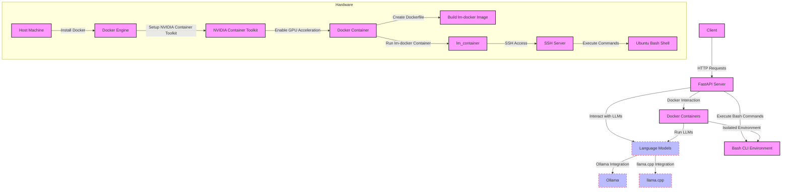
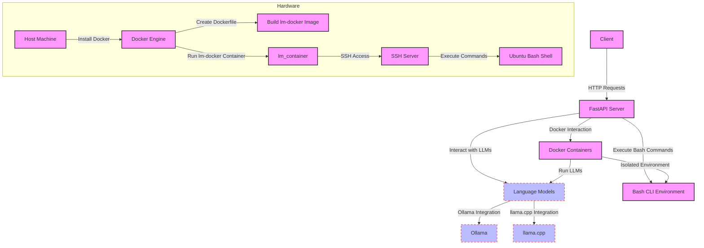

To refactor the 'lm-sandbox' project to use the NVIDIA Container Toolkit, you'll need to modify the Docker setup to leverage GPU acceleration. Below are the steps and the updated Mermaid diagram.

### Steps to Integrate NVIDIA Container Toolkit

#### Step 1: Install NVIDIA Container Toolkit

1. **Install NVIDIA Driver**:
   - Ensure you have the NVIDIA driver installed on your host machine. You can download it from the [NVIDIA Driver Downloads](https://www.nvidia.com/Download/index.aspx) page.

2. **Setup the NVIDIA Container Toolkit**:
   - Follow the installation instructions from the [NVIDIA Container Toolkit GitHub](https://github.com/NVIDIA/nvidia-container-toolkit).
   ```bash
   # Add the package repositories
   sudo distribution=$(. /etc/os-release;echo $ID$VERSION_ID)
   sudo curl -s -L https://nvidia.github.io/libnvidia-container/gpgkey | sudo apt-key add -
   sudo curl -s -L https://nvidia.github.io/libnvidia-container/$distribution/libnvidia-container.list | sudo tee /etc/apt/sources.list.d/nvidia-container-toolkit.list

   # Install the NVIDIA Container Toolkit
   sudo apt-get update
   sudo apt-get install -y nvidia-docker2

   # Restart the Docker daemon to complete the installation
   sudo systemctl restart docker
   ```

#### Step 2: Create a Dockerfile Using NVIDIA Base Image

1. **Create a `Dockerfile`**:
   - Use the NVIDIA CUDA base image and install necessary dependencies.
   ```Dockerfile
   FROM nvidia/cuda:11.7.1-cudnn8-runtime-ubuntu22.04

   # Install necessary packages
   RUN apt-get update && apt-get install -y \
       python3-pip \
       openssh-server \
       curl \
       && rm -rf /var/lib/apt/lists/*

   # Install Paramiko and Requests for Python
   RUN pip3 install paramiko requests

   # Set up SSH
   RUN mkdir /var/run/sshd
   RUN echo 'root:password' | chpasswd
   RUN sed -i 's/PermitRootLogin prohibit-password/PermitRootLogin yes/' /etc/ssh/sshd_config
   RUN sed -i 's/#PasswordAuthentication yes/PasswordAuthentication yes/' /etc/ssh/sshd_config
   EXPOSE 22

   # Copy your script into the container
   COPY script.py /root/script.py

   # Start SSH service
   CMD ["/usr/sbin/sshd", "-D"]
   ```

#### Step 3: Build and Run the Docker Container with NVIDIA Support

1. **Build the Docker Image**:
   ```bash
   docker build -t lm-docker .
   ```

2. **Run the Docker Container with NVIDIA Support**:
   ```bash
   docker run -d --gpus all -p 2222:22 --name lm_container lm-docker
   ```

### Updated Mermaid Diagram



### Explanation of Changes

1. **NVIDIA Container Toolkit**: Integration of the NVIDIA Container Toolkit to enable GPU acceleration within Docker containers.
2. **Dockerfile**: Modified to use the NVIDIA CUDA base image and install necessary dependencies for running the language models and SSH server.
3. **Run Docker Container**: Command updated to run the Docker container with GPU support.

### Steps to Visualize the Diagram

1. **Copy the Mermaid code** above.
2. **Use a Mermaid Live Editor** like [Mermaid Live Editor](https://mermaid-js.github.io/mermaid-live-editor/) to visualize the diagram.
3. **Paste the code** into the editor to see the rendered diagram.

This updated diagram and setup reflect the use of the NVIDIA Container Toolkit for GPU acceleration, providing an optimized environment for running local language models within your 'lm-sandbox' project.

Below is the refactored Mermaid diagram for the 'llm-sandbox-cli' project, removing the LM Studio component and focusing on FastAPI, Docker, Ollama, and llama.cpp.



### Explanation

1. **Client**: Represents users or systems interacting with the 'lm-sandbox' project by sending HTTP requests.
2. **FastAPI Server**: Acts as the central node that processes HTTP requests from clients, interacting with language models and executing Bash commands.
3. **Language Models (LLM)**: Core components for processing natural language data. Includes integration with both Ollama and llama.cpp for model execution.
4. **Bash CLI Environment**: Represents the capability to execute Bash commands on the Ubuntu VM, using the subprocess module.
5. **Docker Containers**: Used to encapsulate and manage the environment for running the FastAPI server, LLMs, and Bash CLI environment.
6. **Ollama**: Integration with the Ollama language model framework.
7. **llama.cpp**: Integration with the llama.cpp language model framework.
8. **Hardware**: Details of the host machine running Ubuntu 22.04 with specified hardware, Docker Engine, and other components.

### Steps to Visualize the Diagram

1. **Copy the Mermaid code** above.
2. **Use a Mermaid Live Editor** like [Mermaid Live Editor](https://mermaid-js.github.io/mermaid-live-editor/) to visualize the diagram.
3. **Paste the code** into the editor to see the rendered diagram.

This updated diagram focuses on the essential components of the 'lm-sandbox' project, highlighting the use of FastAPI, Docker, and the integration of local language models (Ollama and llama.cpp).
