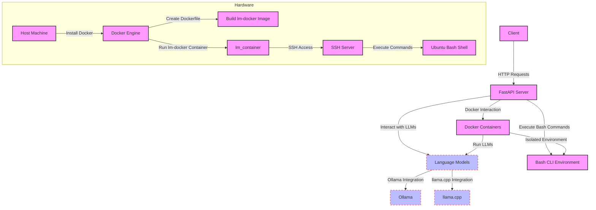

Certainly! Below is the refactored Mermaid diagram for the 'lm-sandbox' project, removing the LM Studio component and focusing on FastAPI, Docker, Ollama, and llama.cpp.

### Explanation

1. **Client**: Represents users or systems interacting with the 'lm-sandbox' project by sending HTTP requests.
2. **FastAPI Server**: Acts as the central node that processes HTTP requests from clients, interacting with language models and executing Bash commands.
3. **Language Models (LLM)**: Core components for processing natural language data. Includes integration with both Ollama and llama.cpp for model execution.
4. **Bash CLI Environment**: Represents the capability to execute Bash commands on the Ubuntu VM, using the subprocess module.
5. **Docker Containers**: Used to encapsulate and manage the environment for running the FastAPI server, LLMs, and Bash CLI environment.
6. **Ollama**: Integration with the Ollama language model framework.
7. **llama.cpp**: Integration with the llama.cpp language model framework.
8. **Hardware**: Details of the host machine running Ubuntu 22.04 with specified hardware, Docker Engine, and other components.

### Steps to Visualize the Diagram

1. **Copy the Mermaid code** above.
2. **Use a Mermaid Live Editor** like [Mermaid Live Editor](https://mermaid-js.github.io/mermaid-live-editor/) to visualize the diagram.
3. **Paste the code** into the editor to see the rendered diagram.

This updated diagram focuses on the essential components of the 'lm-sandbox' project, highlighting the use of FastAPI, Docker, and the integration of local language models (Ollama and llama.cpp).
