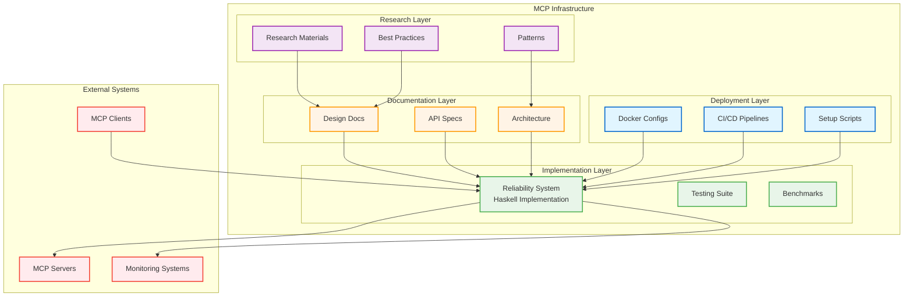

# MCP Server Infrastructure

<div align="center">

[](https://opensource.org/licenses/MIT)
[](https://www.haskell.org)
[](./Sept_16_2025/mcp-reliability-system/README.md)

**A comprehensive infrastructure for Model Context Protocol (MCP) server implementation and deployment**

[Overview](#overview) •
[Components](#-components) •
[Getting Started](#-getting-started) •
[Documentation](#-documentation)

</div>

---

## Overview

This directory contains the complete infrastructure for building, deploying, and managing MCP (Model Context Protocol) servers. It includes production-ready implementations, design documents, research materials, and deployment tools.

### What is MCP?

The Model Context Protocol (MCP) is a standardized protocol for communication between AI models and external tools/services. This infrastructure provides:

- **Production-Ready Implementation**: Enterprise-grade Haskell implementation with reliability patterns
- **Comprehensive Documentation**: Design documents, API specifications, and deployment guides
- **Research & Best Practices**: Curated research materials and industry best practices
- **Deployment Tools**: Docker configurations, setup scripts, and CI/CD pipelines

## 📁 Directory Structure

```
MCP_SERVER/
├── Sept_16_2025/                    # Main implementation directory
│   ├── mcp-reliability-system/      # Production Haskell implementation
│   │   ├── src/                     # Source code
│   │   ├── test/                    # Test suites
│   │   ├── bench/                   # Benchmarks
│   │   ├── docker/                  # Docker configurations
│   │   ├── docs/                    # Technical documentation
│   │   └── config/                  # Configuration files
│   ├── mcp-setup-ubuntu.sh          # Ubuntu setup script
│   ├── readme.md                    # Implementation overview
│   └── updates/                     # Update logs and changelogs
├── Design Documents/
│   ├── expanded_design.md           # Comprehensive system design
│   ├── system_overview.md           # High-level architecture
│   ├── public_facing_gateway.md     # API gateway design
│   └── testing_harness_fuzzer.md    # Testing strategy
└── Research Materials/
    ├── perplexity_research.md       # Research findings
    ├── gemini_research.md           # AI research insights
    ├── research_prompt.md           # Research methodology
    └── meta_API_swarm.md            # Advanced patterns
```

## 🎯 Components

### 1. MCP Reliability System

**Location**: `Sept_16_2025/mcp-reliability-system/`

Production-ready Haskell implementation featuring:

- ✅ Circuit breakers for fault tolerance
- ✅ Intelligent fallback mechanisms
- ✅ Multi-level caching
- ✅ Comprehensive security validation
- ✅ Real MCP protocol implementation
- ✅ Prometheus monitoring integration
- ✅ Docker containerization

**Quick Start**:
```bash
cd Sept_16_2025/mcp-reliability-system
make build
make run
```

[Full Documentation →](./Sept_16_2025/mcp-reliability-system/README.md)

### 2. Design Documentation

**Location**: Root directory markdown files

Comprehensive design documents covering:

- **System Architecture**: Layered architecture with clear separation of concerns
- **API Gateway Design**: Public-facing gateway with authentication
- **Security Model**: Multi-layer security validation
- **Testing Strategy**: Fuzzing and comprehensive test coverage

**Key Documents**:
- [`expanded_design.md`](./expanded_design.md) - Detailed system design
- [`system_overview.md`](./system_overview.md) - High-level architecture
- [`public_facing_gateway.md`](./public_facing_gateway.md) - Gateway specifications

### 3. Setup & Deployment Tools

**Location**: `Sept_16_2025/`

Automated setup and deployment tools:

- **Ubuntu Setup Script**: Automated installation on Ubuntu systems
- **Docker Configurations**: Multi-stage builds with security best practices
- **CI/CD Pipelines**: GitHub Actions workflows

**Quick Setup (Ubuntu)**:
```bash
cd Sept_16_2025
./mcp-setup-ubuntu.sh
```

### 4. Research Materials

**Location**: Root directory research files

Curated research and best practices:

- Industry research on MCP implementations
- AI-assisted design insights
- Performance optimization strategies
- Advanced architectural patterns

## 🚀 Getting Started

### Prerequisites

- **OS**: Linux (Ubuntu 22.04+ recommended), macOS, or Windows with WSL2
- **GHC**: 9.4.8, 9.6.4, or 9.8.1
- **Cabal**: 3.0 or higher
- **Docker**: (optional) for containerized deployment

### Quick Start

#### Option 1: Local Development

```bash
# Clone the repository
git clone https://github.com/danindiana/GRYPHGEN.git
cd GRYPHGEN/MCP_SERVER/Sept_16_2025/mcp-reliability-system

# Install dependencies and build
make dev-setup
make build

# Run tests
make test

# Start the server
make run
```

#### Option 2: Docker Deployment

```bash
cd GRYPHGEN/MCP_SERVER/Sept_16_2025/mcp-reliability-system

# Build Docker image
make docker-build

# Run with Docker Compose
make docker-run

# Check status
make docker-logs
```

#### Option 3: Automated Setup (Ubuntu)

```bash
cd GRYPHGEN/MCP_SERVER/Sept_16_2025

# Run setup script
./mcp-setup-ubuntu.sh

# Follow the prompts
```

## 📊 Architecture Overview



## 📚 Documentation

### Main Documentation

- **[MCP Reliability System README](./Sept_16_2025/mcp-reliability-system/README.md)** - Complete system documentation
- **[Architecture Guide](./Sept_16_2025/mcp-reliability-system/docs/ARCHITECTURE.md)** - Technical architecture
- **[Contributing Guidelines](./Sept_16_2025/mcp-reliability-system/CONTRIBUTING.md)** - How to contribute
- **[Security Policy](./Sept_16_2025/mcp-reliability-system/SECURITY.md)** - Security best practices

### Design Documents

- **[Expanded Design](./expanded_design.md)** - Comprehensive system design
- **[System Overview](./system_overview.md)** - High-level architecture overview
- **[API Gateway](./public_facing_gateway.md)** - Gateway design and specifications
- **[Testing Strategy](./testing_harness_fuzzer.md)** - Testing and fuzzing approach

### Research Materials

- **[Perplexity Research](./perplexity_research.md)** - Research findings and insights
- **[Gemini Research](./gemini_research.md)** - AI-assisted design insights
- **[Meta API Swarm](./meta_API_swarm.md)** - Advanced architectural patterns

## 🔧 Development

### Building from Source

```bash
cd Sept_16_2025/mcp-reliability-system

# Build
make build

# Run tests
make test

# Run linter
make lint

# Format code
make format

# Generate docs
make docs
```

### Running Tests

```bash
# Unit tests
make test

# With coverage
make test-coverage

# Benchmarks
make bench

# Watch mode
make watch
```

### Docker Development

```bash
# Build image
make docker-build

# Run locally
make docker-run

# View logs
make docker-logs

# Stop containers
make docker-stop
```

## 🔒 Security

Security is a top priority. The system implements:

- **Multi-layer validation**: All inputs validated at multiple layers
- **Sandboxed execution**: Tools run in isolated environments
- **RBAC**: Fine-grained role-based access control
- **Audit logging**: Comprehensive security event logging
- **Resource limits**: Protection against DoS attacks

For security policies and vulnerability reporting, see [SECURITY.md](./Sept_16_2025/mcp-reliability-system/SECURITY.md).

## 📈 Monitoring

The system includes comprehensive monitoring:

- **Prometheus Metrics**: Request rates, latencies, errors
- **Health Checks**: Readiness and liveness probes
- **Structured Logging**: JSON and plaintext formats
- **Performance Metrics**: Resource usage tracking

## 🤝 Contributing

We welcome contributions! Please see:

- [Contributing Guidelines](./Sept_16_2025/mcp-reliability-system/CONTRIBUTING.md)
- [Code of Conduct](./Sept_16_2025/mcp-reliability-system/CODE_OF_CONDUCT.md)

### Quick Contribution Steps

1. Fork the repository
2. Create a feature branch
3. Make your changes
4. Run tests and linter
5. Submit a pull request

## 📄 License

This project is licensed under the MIT License - see the [LICENSE](./Sept_16_2025/mcp-reliability-system/LICENSE) file for details.

## 🙏 Acknowledgments

- [MCPToolBench++ Paper](https://arxiv.org/pdf/2508.07575) for reliability insights
- [Model Context Protocol](https://modelcontextprotocol.io/) specification
- Haskell community for excellent tooling and libraries

## 📞 Support

- **Documentation**: See individual README files in subdirectories
- **Issues**: [GitHub Issues](https://github.com/danindiana/GRYPHGEN/issues)
- **Discussions**: [GitHub Discussions](https://github.com/danindiana/GRYPHGEN/discussions)

## 🗺️ Roadmap

### Completed ✅

- [x] Production-ready Haskell implementation
- [x] Comprehensive test suite
- [x] Docker containerization
- [x] CI/CD pipelines
- [x] Prometheus monitoring
- [x] Security validation
- [x] API documentation

### In Progress 🚧

- [ ] Advanced load balancing
- [ ] Distributed tracing
- [ ] Multi-region support
- [ ] GraphQL API support

### Planned 📋

- [ ] gVisor sandbox integration
- [ ] Machine learning-based anomaly detection
- [ ] Kubernetes operator
- [ ] Performance optimization toolkit

---

<div align="center">

**[⬆ back to top](#mcp-server-infrastructure)**

Made with ❤️ by the GRYPHGEN Team

</div>
