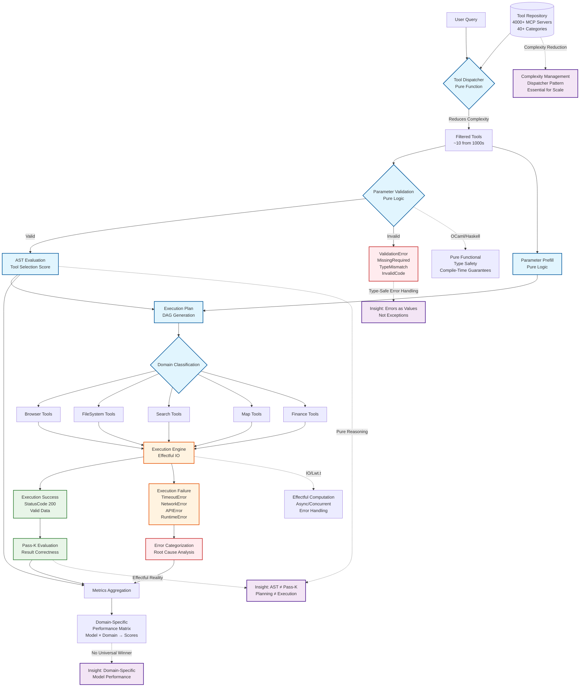

```mermaid
graph TB
    %% Input Layer
    Query[User Query] --> Dispatcher{Tool Dispatcher<br/>Pure Function}
    
    %% Tool Repository
    ToolRepo[(Tool Repository<br/>4000+ MCP Servers<br/>40+ Categories)] --> Dispatcher
    
    %% Complexity Reduction
    Dispatcher -->|Reduces Complexity| FilteredTools[Filtered Tools<br/>~10 from 1000s]
    
    %% Pure Logic Layer (OCaml/Haskell)
    FilteredTools --> Validation{Parameter Validation<br/>Pure Logic}
    FilteredTools --> Prefill[Parameter Prefill<br/>Pure Logic]
    
    %% Validation Branches
    Validation -->|Valid| ASTEval[AST Evaluation<br/>Tool Selection Score]
    Validation -->|Invalid| ValidationError[ValidationError<br/>MissingRequired<br/>TypeMismatch<br/>InvalidCode]
    
    %% Planning Phase (Pure)
    Prefill --> PlanGen[Execution Plan<br/>DAG Generation]
    ASTEval --> PlanGen
    
    %% Domain Classification
    PlanGen --> DomainClass{Domain Classification}
    DomainClass --> Browser[Browser Tools]
    DomainClass --> FileSystem[FileSystem Tools]
    DomainClass --> Search[Search Tools]
    DomainClass --> Map[Map Tools]
    DomainClass --> Finance[Finance Tools]
    
    %% Effectful Execution Layer
    Browser --> ExecEngine[Execution Engine<br/>Effectful IO]
    FileSystem --> ExecEngine
    Search --> ExecEngine
    Map --> ExecEngine
    Finance --> ExecEngine
    
    %% Execution Results
    ExecEngine --> Success[Execution Success<br/>StatusCode 200<br/>Valid Data]
    ExecEngine --> Failure[Execution Failure<br/>TimeoutError<br/>NetworkError<br/>APIError<br/>RuntimeError]
    
    %% Evaluation Layer
    Success --> PassK[Pass-K Evaluation<br/>Result Correctness]
    Failure --> ErrorAnalysis[Error Categorization<br/>Root Cause Analysis]
    
    %% Final Metrics
    ASTEval --> MetricsAgg[Metrics Aggregation]
    PassK --> MetricsAgg
    ErrorAnalysis --> MetricsAgg
    
    %% Domain-Specific Results
    MetricsAgg --> DomainMetrics[Domain-Specific<br/>Performance Matrix<br/>Model × Domain → Scores]
    
    %% Key Insight Annotations
    ValidationError -.->|Type-Safe Error Handling| Insight1[Insight: Errors as Values<br/>Not Exceptions]
    
    ASTEval -.->|Pure Reasoning| Insight2[Insight: AST ≠ Pass-K<br/>Planning ≠ Execution]
    PassK -.->|Effectful Reality| Insight2
    
    DomainMetrics -.->|No Universal Winner| Insight3[Insight: Domain-Specific<br/>Model Performance]
    
    %% Complexity Flow
    ToolRepo -.->|Complexity Reduction| ComplexityNote[Complexity Management<br/>Dispatcher Pattern<br/>Essential for Scale]
    
    %% Technology Stack Annotations
    Validation -.->|OCaml/Haskell| TechStack[Pure Functional<br/>Type Safety<br/>Compile-Time Guarantees]
    ExecEngine -.->|IO/Lwt.t| TechStack2[Effectful Computation<br/>Async/Concurrent<br/>Error Handling]
    
    %% Styling
    classDef pureLogic fill:#e1f5fe,stroke:#01579b,stroke-width:2px
    classDef effectful fill:#fff3e0,stroke:#e65100,stroke-width:2px
    classDef insight fill:#f3e5f5,stroke:#4a148c,stroke-width:2px
    classDef error fill:#ffebee,stroke:#c62828,stroke-width:2px
    classDef success fill:#e8f5e8,stroke:#2e7d32,stroke-width:2px
    
    class Dispatcher,Validation,Prefill,ASTEval,PlanGen,DomainClass pureLogic
    class ExecEngine,Success,Failure,PassK effectful
    class Insight1,Insight2,Insight3,ComplexityNote insight
    class ValidationError,ErrorAnalysis error
    class Success,PassK success
```
