# MCP Reliability System

A comprehensive, production-ready Haskell system for reliable and secure MCP (Model Context Protocol: https://arxiv.org/pdf/2508.07575) tool execution. This system addresses the core reliability issues identified in the MCPToolBench++ paper while providing enterprise-grade security validation, real MCP integration, and comprehensive monitoring.

## Features

### 🔧 Reliability Engineering
- **Circuit Breakers**: Intelligent failure detection and recovery
- **Fallback Selection**: Smart routing to alternative tools/servers
- **Caching**: Multi-level caching with TTL and invalidation
- **Metrics Tracking**: Comprehensive performance and reliability metrics

### 🔒 Security Validation
- **Parameter Injection Prevention**: Advanced input sanitization and validation
- **Tool Sandboxing**: Isolated execution environments
- **Permission Models**: Fine-grained access control
- **Input Sanitization**: Multi-layer security validation

### 🌐 Real MCP Integration
- **Protocol Compliance**: Full MCP specification implementation
- **Server Discovery**: Automatic MCP server detection and registration
- **Transport Layer**: Support for STDIO, HTTP/SSE, and WebSocket transports
- **JSON-RPC 2.0**: Complete implementation with error handling

### 📊 Production Features
- **Monitoring**: Prometheus metrics and health checks
- **Logging**: Structured logging with multiple backends
- **Docker Support**: Complete containerization
- **Benchmarking**: Performance validation against MCPToolBench++ metrics

## Quick Start

### Prerequisites
- GHC 9.4+ or Stack
- Docker (optional, for containerized deployment)

### Installation

```bash
# Clone the repository
git clone https://github.com/example/mcp-reliability-system
cd mcp-reliability-system

# Build with Cabal
cabal update
cabal build

# Or with Stack
stack build
```

### Basic Usage

```bash
# Start the MCP server
cabal run mcp-server -- --config config/production.yaml

# Run tests
cabal test

# Run benchmarks
cabal bench

# Docker deployment
docker-compose up -d
```

## Architecture

```
┌─────────────────┐    ┌─────────────────┐    ┌─────────────────┐
│   MCP Client    │────│  Core Engine    │────│   MCP Server    │
│   Applications  │    │                 │    │   Discovery     │
└─────────────────┘    └─────────────────┘    └─────────────────┘
                              │
                    ┌─────────┼─────────┐
                    │         │         │
            ┌───────▼───┐ ┌───▼───┐ ┌───▼────────┐
            │Reliability│ │Security│ │ Monitoring │
            │  System   │ │Validation│ │ & Metrics │
            └───────────┘ └────────┘ └────────────┘
```

## Configuration

Create a configuration file at `config/production.yaml`:

```yaml
server:
  host: "0.0.0.0"
  port: 8080
  
reliability:
  circuit_breaker:
    failure_threshold: 5
    timeout_seconds: 30
    recovery_timeout: 60
  cache:
    max_size: 1000
    ttl_seconds: 300
    
security:
  sandbox:
    enabled: true
    timeout_seconds: 30
  parameter_guard:
    max_input_length: 10000
    allowed_patterns: ["^[a-zA-Z0-9_-]+$"]
    
monitoring:
  prometheus:
    enabled: true
    port: 9090
  logging:
    level: "INFO"
    format: "json"
```

## API Documentation

### Core Engine

The `MCP.Core.Engine` module provides the main interface:

```haskell
import MCP.Core.Engine
import MCP.Core.Config

main :: IO ()
main = do
  config <- loadConfig "config/production.yaml"
  engine <- initializeEngine config
  runEngine engine
```

### Security Validation

```haskell
import MCP.Security.ParameterGuard

-- Validate input parameters
validateParams :: Text -> IO (Either SecurityError Text)
validateParams input = do
  guard <- createParameterGuard defaultGuardConfig
  validateInput guard input
```

### Circuit Breaker Usage

```haskell
import MCP.Reliability.CircuitBreaker

-- Create and use circuit breaker
withCircuitBreaker :: IO a -> IO (Either CircuitBreakerError a)
withCircuitBreaker action = do
  cb <- createCircuitBreaker defaultConfig
  executeWithBreaker cb action
```

## Testing

The system includes comprehensive test suites:

```bash
# Unit tests
cabal test mcp-reliability-tests

# Property-based tests
cabal test --test-option="--quickcheck-tests=1000"

# Security validation tests
cabal test --test-option="--match=Security"

# Integration tests
cabal test --test-option="--match=Integration"
```

## Benchmarking

Validate performance against MCPToolBench++ metrics:

```bash
# Run all benchmarks
cabal bench

# Specific benchmark suites
cabal bench --benchmark-option="--match=pattern/Reliability"
cabal bench --benchmark-option="--match=pattern/Security"
cabal bench --benchmark-option="--match=pattern/Protocol"
```

## Docker Deployment

### Development
```bash
docker-compose -f docker/docker-compose.dev.yml up
```

### Production
```bash
docker-compose -f docker/docker-compose.prod.yml up -d
```

## Monitoring

### Prometheus Metrics
- `mcp_requests_total`: Total number of MCP requests
- `mcp_request_duration_seconds`: Request duration histogram
- `mcp_circuit_breaker_state`: Circuit breaker state gauge
- `mcp_cache_hits_total`: Cache hit counter
- `mcp_security_violations_total`: Security violation counter

### Health Checks
- `/health`: Basic health check
- `/health/ready`: Readiness probe
- `/health/live`: Liveness probe
- `/metrics`: Prometheus metrics endpoint

## Security Considerations

This system implements multiple layers of security:

1. **Input Validation**: All inputs are validated against configurable patterns
2. **Parameter Injection Prevention**: Advanced sanitization prevents code injection
3. **Sandboxing**: Tools execute in isolated environments
4. **Permission Models**: Fine-grained access control
5. **Audit Logging**: All security events are logged

## Contributing

1. Fork the repository
2. Create a feature branch
3. Add tests for new functionality
4. Ensure all tests pass
5. Submit a pull request

## License

MIT License - see LICENSE file for details.

## Support

- Documentation: [docs/](docs/)
- Issues: [GitHub Issues](https://github.com/example/mcp-reliability-system/issues)
- Discussions: [GitHub Discussions](https://github.com/example/mcp-reliability-system/discussions)

```mermaid
graph TB
    %% Input Layer
    Query[User Query] --> Dispatcher{Tool Dispatcher<br/>Pure Function}
    
    %% Tool Repository
    ToolRepo[(Tool Repository<br/>4000+ MCP Servers<br/>40+ Categories)] --> Dispatcher
    
    %% Complexity Reduction
    Dispatcher -->|Reduces Complexity| FilteredTools[Filtered Tools<br/>~10 from 1000s]
    
    %% Pure Logic Layer (OCaml/Haskell)
    FilteredTools --> Validation{Parameter Validation<br/>Pure Logic}
    FilteredTools --> Prefill[Parameter Prefill<br/>Pure Logic]
    
    %% Validation Branches
    Validation -->|Valid| ASTEval[AST Evaluation<br/>Tool Selection Score]
    Validation -->|Invalid| ValidationError[ValidationError<br/>MissingRequired<br/>TypeMismatch<br/>InvalidCode]
    
    %% Planning Phase (Pure)
    Prefill --> PlanGen[Execution Plan<br/>DAG Generation]
    ASTEval --> PlanGen
    
    %% Domain Classification
    PlanGen --> DomainClass{Domain Classification}
    DomainClass --> Browser[Browser Tools]
    DomainClass --> FileSystem[FileSystem Tools]
    DomainClass --> Search[Search Tools]
    DomainClass --> Map[Map Tools]
    DomainClass --> Finance[Finance Tools]
    
    %% Effectful Execution Layer
    Browser --> ExecEngine[Execution Engine<br/>Effectful IO]
    FileSystem --> ExecEngine
    Search --> ExecEngine
    Map --> ExecEngine
    Finance --> ExecEngine
    
    %% Execution Results
    ExecEngine --> Success[Execution Success<br/>StatusCode 200<br/>Valid Data]
    ExecEngine --> Failure[Execution Failure<br/>TimeoutError<br/>NetworkError<br/>APIError<br/>RuntimeError]
    
    %% Evaluation Layer
    Success --> PassK[Pass-K Evaluation<br/>Result Correctness]
    Failure --> ErrorAnalysis[Error Categorization<br/>Root Cause Analysis]
    
    %% Final Metrics
    ASTEval --> MetricsAgg[Metrics Aggregation]
    PassK --> MetricsAgg
    ErrorAnalysis --> MetricsAgg
    
    %% Domain-Specific Results
    MetricsAgg --> DomainMetrics[Domain-Specific<br/>Performance Matrix<br/>Model × Domain → Scores]
    
    %% Key Insight Annotations
    ValidationError -.->|Type-Safe Error Handling| Insight1[Insight: Errors as Values<br/>Not Exceptions]
    
    ASTEval -.->|Pure Reasoning| Insight2[Insight: AST ≠ Pass-K<br/>Planning ≠ Execution]
    PassK -.->|Effectful Reality| Insight2
    
    DomainMetrics -.->|No Universal Winner| Insight3[Insight: Domain-Specific<br/>Model Performance]
    
    %% Complexity Flow
    ToolRepo -.->|Complexity Reduction| ComplexityNote[Complexity Management<br/>Dispatcher Pattern<br/>Essential for Scale]
    
    %% Technology Stack Annotations
    Validation -.->|OCaml/Haskell| TechStack[Pure Functional<br/>Type Safety<br/>Compile-Time Guarantees]
    ExecEngine -.->|IO/Lwt.t| TechStack2[Effectful Computation<br/>Async/Concurrent<br/>Error Handling]
    
    %% Styling for Dark Mode
    classDef pureLogic fill:#2d3748,stroke:#63b3ed,stroke-width:2px,color:#e2e8f0
    classDef effectful fill:#4a5568,stroke:#f6ad55,stroke-width:2px,color:#e2e8f0
    classDef insight fill:#553c9a,stroke:#d53f8c,stroke-width:2px,color:#e2e8f0
    classDef error fill:#742a2a,stroke:#fc8181,stroke-width:2px,color:#e2e8f0
    classDef success fill:#22543d,stroke:#68d391,stroke-width:2px,color:#e2e8f0
    classDef neutral fill:#4a5568,stroke:#a0aec0,stroke-width:2px,color:#e2e8f0
    
    class Dispatcher,Validation,Prefill,ASTEval,PlanGen,DomainClass pureLogic
    class ExecEngine,Success,Failure,PassK effectful
    class Insight1,Insight2,Insight3,ComplexityNote insight
    class ValidationError,ErrorAnalysis,Failure error
    class Success,PassK success
    class Query,ToolRepo,FilteredTools,MetricsAgg,DomainMetrics,TechStack,TechStack2 neutral

    %% Link styling for better visibility
    linkStyle default stroke:#a0aec0,stroke-width:1.5px
    linkStyle 0,1,2,3,4,5,6,7,8,9,10,11,12,13,14,15,16,17,18,19,20,21,22,23,24,25,26,27 stroke-width:2px
```


