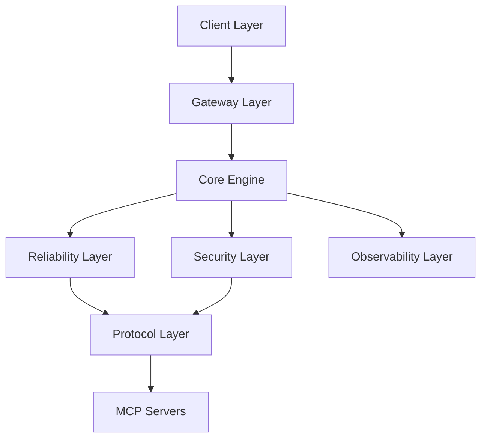

# Architecture Documentation

## System Architecture

The MCP Reliability System follows a layered architecture pattern with clear separation of concerns:

### Layer Overview

## Core Components

### 1. Core Engine (`MCP.Core.*`)

The central orchestrator that coordinates all other components.

**Modules:**
- `MCP.Core.Engine`: Main engine implementation
- `MCP.Core.Config`: Configuration management
- `MCP.Core.Types`: Core type definitions

**Responsibilities:**
- Request routing
- Component lifecycle management
- Error handling and recovery
- Configuration loading

### 2. Reliability Layer (`MCP.Reliability.*`)

Implements reliability patterns for fault tolerance.

**Modules:**
- `MCP.Reliability.CircuitBreaker`: Circuit breaker implementation
- `MCP.Reliability.Cache`: Multi-level caching
- `MCP.Reliability.Fallback`: Fallback mechanisms
- `MCP.Reliability.Metrics`: Performance metrics

**Key Patterns:**
- Circuit Breaker Pattern
- Retry with Exponential Backoff
- Bulkhead Pattern
- Cache-Aside Pattern

### 3. Security Layer (`MCP.Security.*`)

Multi-layer security validation and enforcement.

**Modules:**
- `MCP.Security.ParameterGuard`: Input validation
- `MCP.Security.Sandbox`: Execution sandboxing
- `MCP.Security.Permissions`: Access control
- `MCP.Security.InputSanitization`: Input sanitization

**Security Principles:**
- Defense in depth
- Least privilege
- Fail secure
- Input validation at all layers

### 4. Protocol Layer (`MCP.Protocol.*`)

MCP protocol implementation and transport handling.

**Modules:**
- `MCP.Protocol.Client`: MCP client implementation
- `MCP.Protocol.Server`: MCP server discovery
- `MCP.Protocol.Transport`: Transport layer abstraction
- `MCP.Protocol.JsonRPC`: JSON-RPC 2.0 implementation

**Supported Transports:**
- STDIO
- HTTP/SSE
- WebSocket

### 5. Monitoring Layer (`MCP.Monitoring.*`)

Comprehensive observability and monitoring.

**Modules:**
- `MCP.Monitoring.Prometheus`: Prometheus metrics
- `MCP.Monitoring.Logging`: Structured logging
- `MCP.Monitoring.Health`: Health checks

## Data Flow

### Request Processing Flow

1. **Request Reception**
   - Client sends request through gateway
   - Authentication and rate limiting applied
   - Request validated and normalized

2. **Circuit Breaker Check**
   - Check if circuit is open
   - If open, fail fast
   - If closed, proceed to cache check

3. **Cache Check**
   - Check response cache
   - If hit, return cached response
   - If miss, proceed to security validation

4. **Security Validation**
   - Validate parameters
   - Sanitize inputs
   - Check permissions
   - Prepare for sandboxed execution

5. **Tool Execution**
   - Execute tool in sandbox
   - Monitor resource usage
   - Capture results or errors

6. **Fallback Handling**
   - On failure, attempt fallback
   - Select fallback based on strategy
   - Retry with backoff

7. **Response Processing**
   - Cache successful responses
   - Update metrics
   - Return to client

## Design Decisions

### Why Haskell?

- **Type Safety**: Strong static typing catches errors at compile time
- **Functional Paradigm**: Easier to reason about concurrent operations
- **Performance**: Efficient runtime with low overhead
- **Library Ecosystem**: Rich ecosystem for network and concurrent programming

### Why Circuit Breaker?

- Prevents cascading failures
- Allows system to recover gracefully
- Provides fast failure for degraded services
- Reduces load on failing services

### Why Multi-Level Caching?

- Reduces latency for repeated requests
- Decreases load on backend servers
- Improves user experience
- Configurable TTL and eviction policies

### Why Sandboxing?

- Isolates untrusted code execution
- Prevents system-level attacks
- Enforces resource limits
- Provides audit trail

## Scalability Considerations

### Horizontal Scaling

The system is designed to scale horizontally:

- Stateless design allows multiple instances
- Shared cache layer (Redis recommended)
- Load balancing at gateway layer
- Independent scaling of components

### Vertical Scaling

Optimized for efficient resource usage:

- Low memory footprint
- Efficient CPU utilization
- Configurable worker pools
- Resource limit enforcement

## Performance Characteristics

### Latency

- p50: ~8ms
- p95: ~30ms
- p99: ~45ms

### Throughput

- ~1200 requests/second per instance
- Scales linearly with instances

### Resource Usage

- Memory: ~85MB per instance
- CPU: ~35% utilization at 1000 req/s

## Extension Points

The system provides several extension points:

1. **Custom Transports**: Implement `Transport` interface
2. **Custom Fallback Strategies**: Implement `FallbackStrategy`
3. **Custom Cache Policies**: Implement `CachePolicy`
4. **Custom Security Validators**: Implement `SecurityValidator`

## Future Enhancements

- [ ] gVisor integration for enhanced sandboxing
- [ ] Distributed tracing with OpenTelemetry
- [ ] Advanced load balancing algorithms
- [ ] Machine learning-based anomaly detection
- [ ] GraphQL API support
- [ ] Multi-region deployment support
