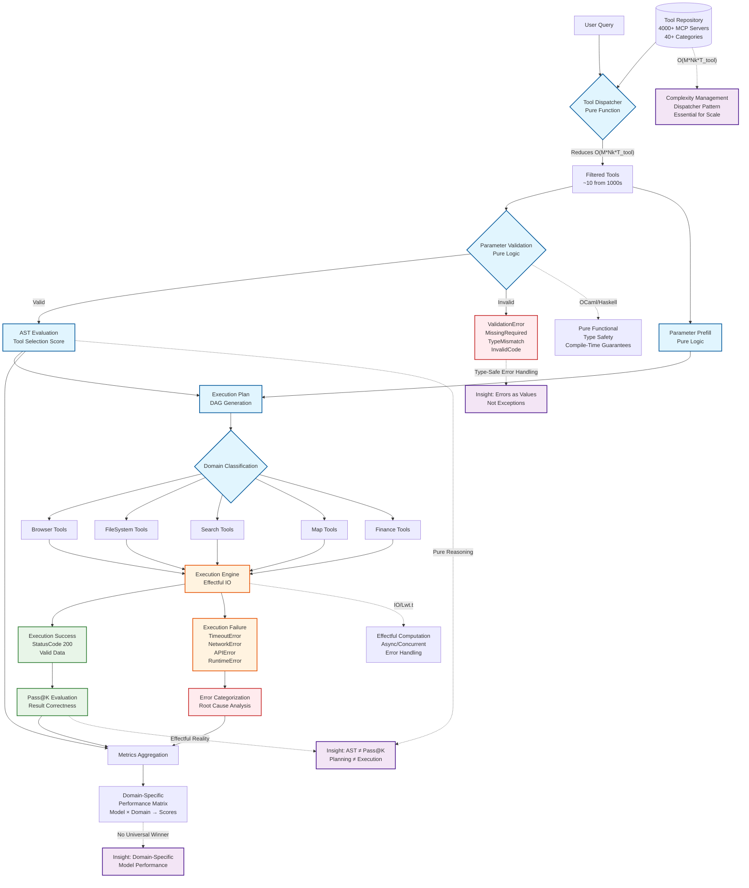

# Key Implementation Features

## Pure vs. Effectful Separation
- **OCaml**: Uses `Lwt.t` for effectful operations while keeping validation logic pure
- **Haskell**: Naturally separates pure functions from IO operations, with the type system enforcing conceptual separation

## Enhanced Error Handling
- Both implementations use sum types for explicit error categorization (not exceptions)
- Makes failure modes first-class citizens as suggested by symbolic logic formalization

## Domain-Aware Architecture
- Haskell implementation includes a `Domain` type for domain-specific tool execution strategies
- Directly addresses the paper's finding that no single model dominates across all domains

## Concurrent Execution
- **Haskell**: Uses Software Transactional Memory (STM)
- **OCaml**: Uses Lwt
- Enables safe concurrent tool execution crucial for real-world deployment

# Critical Architectural Decisions

## Dispatcher Pattern
- Reduces O(M × Nₖ × T_tool) complexity by filtering tools before LLM processing
- Includes relevance scoring to ensure most appropriate tools are selected

## Parameter Validation
- Validation occurs before execution with domain-specific logic (geo-codes, stock tickers)
- Extensible validation prevents parameter errors identified in the paper's analysis

## Timeout Handling
- Addresses reliability issues with MCP servers highlighted in the paper
- Tools that don't respond within timeout window are marked as failed (no system hangs)

# Ubuntu-Specific Considerations

- Setup script installs OPAM (OCaml) and Cabal (Haskell) - standard Ubuntu package managers
- File system tool demonstrates Ubuntu-specific path handling
- Browser tool integrates with Chrome/Firefox installations common on Ubuntu desktops

This implementation directly applies the insight that the core challenge is "building reliable systems that mediate between pure intent and effectful execution" - both language type systems enforce this separation at compile time, making many error classes impossible.

