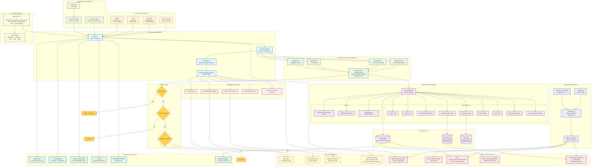

```mermaid
graph TB
    %% External Spec Sources
    subgraph "External Spec Sources"
        OLLAMA_API[Ollama<br/>openapi.json<br/>HTTP endpoint]
        TRITON_REPO[Triton<br/>proto repo<br/>Git repository]
        FASTCHAT_API[FastChat<br/>swagger.yaml<br/>HTTP endpoint]
        OTHER_SPECS[Other Vendors<br/>Various formats]
    end

    %% Configuration & Scheduling
    subgraph "Configuration & Scheduling"
        YAML_CONFIG[vendors.yaml<br/>Config Map]
        CRON_SCHED[CronJob Scheduler<br/>03:00 UTC nightly]
        MANUAL_TRIGGER[Manual Trigger<br/>POST /crawler/v1/refresh]
    end

    %% Core Processing Components
    subgraph "Core Processing Pipeline"
        FETCHER[Fetcher<br/>HTTP + Git Client]
        PARSER[Parser/Normalizer<br/>Multi-format Support]
        DIFF_ENGINE[Diff Engine<br/>Breaking Change Detection]
        BREAK_ANALYZER[Breaking Change Analyzer<br/>Semantic Rules]
    end

    %% Data Model & Storage
    subgraph "Data Model (PostgreSQL)"
        DOCS_TABLE[docs_index table<br/>Primary Storage]
        
        subgraph "Table Schema"
            VENDOR[vendor: text]
            VERSION[version: text]
            FETCHED[fetched_at: timestamptz]
            RAW_SPEC[raw_spec: bytea]
            CANONICAL[canonical_spec: jsonb]
            HASH[hash: char64]
            VALID[valid: bool]
            BREAKING[breaking_flags: jsonb]
            LAST_GOOD[last_good_hash: char64]
        end
        
        subgraph "Indexes"
            PK[PRIMARY KEY vendor, version]
            UNIQUE[UNIQUE vendor, hash]
            GIN[GIN index on canonical_spec]
        end
    end

    %% Storage Layers
    subgraph "Storage Layers"
        POSTGRES[(PostgreSQL<br/>ACID, Row-level locking)]
        ELASTICSEARCH[(ElasticSearch<br/>mcp-docs index<br/>Full-text search)]
        S3[(S3 Archive<br/>mcp-spec-archive<br/>365-day lifecycle)]
    end

    %% Format Conversion
    subgraph "Format Conversion & Normalization"
        SWAGGER2[Swagger 2.0<br/>→ swagger-converter]
        OPENAPI3[OpenAPI 3.x<br/>→ identity pass]
        PROTOBUF[Protobuf files<br/>→ protoc-gen-openapi]
        MARKDOWN[Markdown/RST<br/>→ front-matter extractor]
        
        NORMALIZE[Post-processing:<br/>• Strip $ref loops<br/>• Sort keys deterministically<br/>• Stable SHA-256]
    end

    %% Breaking Change Detection
    subgraph "Breaking Change Rules"
        RULE1[Path removed]
        RULE2[Required param added]
        RULE3[Enum value removed]
        RULE4[Auth scope removed]
        RULE5[Response schema narrowed]
    end

    %% Public API
    subgraph "Public HTTP API (Sidecar)"
        API_REFRESH[POST /crawler/v1/refresh<br/>Ad-hoc crawl trigger]
        API_HEALTH[GET /crawler/v1/health<br/>K8s liveness]
        API_SPEC[GET /crawler/v1/spec/vendor/version<br/>Raw or canonical spec]
        API_DIFF[GET /crawler/v1/diff/vendor<br/>JSON diff vs previous]
        API_SEARCH[GET /crawler/v1/search?q=embedding<br/>ElasticSearch query]
    end

    %% Alerting & Notifications
    subgraph "Alerting & Notifications"
        SLACK[Slack Alerts<br/>Breaking changes]
        EMAIL[Email Notifications<br/>Critical updates]
        WEBHOOK[Webhook Endpoints<br/>Integration hooks]
        METRICS[Prometheus Metrics<br/>mcp_docs_fetch_total<br/>mcp_docs_breaking_changes]
    end

    %% Resilience Features
    subgraph "Resilience & Operations"
        IDEMPOTENT[Idempotency<br/>Key: vendor, url, etag]
        CIRCUIT[Circuit Breaker<br/>5 failures → skip vendor]
        ETAG[ETag + If-None-Match<br/>Skip unchanged specs]
        RETRY[3 retries<br/>Exponential backoff]
        CHECKSUM[SHA-256 Verification<br/>Detect bit-rot]
        ROLLBACK[Rollback Support<br/>Re-point to last good]
    end

    %% Local Development
    subgraph "Local Development"
        LOCAL_CMD[docker run --rm<br/>-v vendors.yaml:/etc/crawler/vendors.yaml<br/>ghcr.io/mcp/docs-crawler:latest<br/>--once --vendor=ollama]
        LOCAL_OUTPUT[stdout output:<br/>Download → Translate → Diff → Store → Alert]
    end

    %% Flow Connections - Scheduling
    YAML_CONFIG --> CRON_SCHED
    CRON_SCHED --> FETCHER
    MANUAL_TRIGGER --> FETCHER

    %% Flow Connections - Fetching
    OLLAMA_API --> FETCHER
    TRITON_REPO --> FETCHER
    FASTCHAT_API --> FETCHER
    OTHER_SPECS --> FETCHER

    %% Flow Connections - Processing Pipeline
    FETCHER --> PARSER
    PARSER --> DIFF_ENGINE
    DIFF_ENGINE --> BREAK_ANALYZER

    %% Flow Connections - Format Conversion
    PARSER --> SWAGGER2
    PARSER --> OPENAPI3
    PARSER --> PROTOBUF
    PARSER --> MARKDOWN
    
    SWAGGER2 --> NORMALIZE
    OPENAPI3 --> NORMALIZE
    PROTOBUF --> NORMALIZE
    MARKDOWN --> NORMALIZE

    %% Flow Connections - Storage
    NORMALIZE --> DOCS_TABLE
    DOCS_TABLE --> POSTGRES
    CANONICAL --> ELASTICSEARCH
    RAW_SPEC --> S3

    %% Flow Connections - Breaking Change Analysis
    BREAK_ANALYZER --> RULE1
    BREAK_ANALYZER --> RULE2
    BREAK_ANALYZER --> RULE3
    BREAK_ANALYZER --> RULE4
    BREAK_ANALYZER --> RULE5

    %% Flow Connections - Alerting
    RULE1 --> SLACK
    RULE2 --> EMAIL
    RULE3 --> WEBHOOK
    BREAK_ANALYZER --> METRICS

    %% Flow Connections - API
    POSTGRES --> API_SPEC
    POSTGRES --> API_DIFF
    ELASTICSEARCH --> API_SEARCH
    FETCHER --> API_REFRESH

    %% Flow Connections - Resilience
    FETCHER --> IDEMPOTENT
    FETCHER --> CIRCUIT
    FETCHER --> ETAG
    FETCHER --> RETRY
    FETCHER --> CHECKSUM
    POSTGRES --> ROLLBACK

    %% Local Development Flow
    LOCAL_CMD --> LOCAL_OUTPUT
    LOCAL_CMD --> FETCHER

    %% Decision Points
    subgraph "Decision Logic"
        HASH_CHECK{Same hash?}
        VALID_CHECK{Translation valid?}
        BREAK_CHECK{Breaking changes?}
    end

    NORMALIZE --> HASH_CHECK
    HASH_CHECK -->|Yes| SKIP[Skip - No changes]
    HASH_CHECK -->|No| VALID_CHECK
    VALID_CHECK -->|Yes| BREAK_CHECK
    VALID_CHECK -->|No| ERROR_LOG[Log error]
    BREAK_CHECK -->|Yes| SLACK
    BREAK_CHECK -->|No| INFO_LOG[Log info]

    %% Data Relationships
    DOCS_TABLE --> VENDOR
    DOCS_TABLE --> VERSION
    DOCS_TABLE --> FETCHED
    DOCS_TABLE --> RAW_SPEC
    DOCS_TABLE --> CANONICAL
    DOCS_TABLE --> HASH
    DOCS_TABLE --> VALID
    DOCS_TABLE --> BREAKING
    DOCS_TABLE --> LAST_GOOD

    DOCS_TABLE --> PK
    DOCS_TABLE --> UNIQUE
    DOCS_TABLE --> GIN

    %% Kubernetes Deployment
    subgraph "Kubernetes Deployment"
        CRONJOB[CronJob: docs-crawler<br/>Schedule: 0 3 * * *]
        POD[Crawler Pod<br/>ghcr.io/mcp/docs-crawler:1.2.3]
        CONFIGMAP[ConfigMap<br/>crawler-config]
        SIDECAR[Sidecar Container<br/>HTTP API Server]
    end

    CRONJOB --> POD
    CONFIGMAP --> POD
    POD --> SIDECAR
    SIDECAR --> API_REFRESH
    SIDECAR --> API_HEALTH
    SIDECAR --> API_SPEC
    SIDECAR --> API_DIFF
    SIDECAR --> API_SEARCH

    %% Styling
    classDef external fill:#fff3e0,stroke:#ff8f00,stroke-width:2px
    classDef config fill:#f1f8e9,stroke:#33691e,stroke-width:2px
    classDef processing fill:#e1f5fe,stroke:#0277bd,stroke-width:2px
    classDef storage fill:#f3e5f5,stroke:#7b1fa2,stroke-width:2px
    classDef format fill:#e8f5e8,stroke:#2e7d32,stroke-width:2px
    classDef rules fill:#ffebee,stroke:#c62828,stroke-width:2px
    classDef api fill:#fce4ec,stroke:#c2185b,stroke-width:2px
    classDef alerting fill:#fff8e1,stroke:#f57c00,stroke-width:2px
    classDef resilience fill:#e0f2f1,stroke:#00695c,stroke-width:2px
    classDef local fill:#f9fbe7,stroke:#827717,stroke-width:2px
    classDef k8s fill:#e8eaf6,stroke:#3f51b5,stroke-width:2px
    classDef decision fill:#ffd54f,stroke:#f57f17,stroke-width:2px

    class OLLAMA_API,TRITON_REPO,FASTCHAT_API,OTHER_SPECS external
    class YAML_CONFIG,CRON_SCHED,MANUAL_TRIGGER config
    class FETCHER,PARSER,DIFF_ENGINE,BREAK_ANALYZER processing
    class DOCS_TABLE,POSTGRES,ELASTICSEARCH,S3,VENDOR,VERSION,FETCHED,RAW_SPEC,CANONICAL,HASH,VALID,BREAKING,LAST_GOOD,PK,UNIQUE,GIN storage
    class SWAGGER2,OPENAPI3,PROTOBUF,MARKDOWN,NORMALIZE format
    class RULE1,RULE2,RULE3,RULE4,RULE5 rules
    class API_REFRESH,API_HEALTH,API_SPEC,API_DIFF,API_SEARCH api
    class SLACK,EMAIL,WEBHOOK,METRICS alerting
    class IDEMPOTENT,CIRCUIT,ETAG,RETRY,CHECKSUM,ROLLBACK resilience
    class LOCAL_CMD,LOCAL_OUTPUT local
    class CRONJOB,POD,CONFIGMAP,SIDECAR k8s
    class HASH_CHECK,VALID_CHECK,BREAK_CHECK,SKIP,ERROR_LOG,INFO_LOG decision
```
