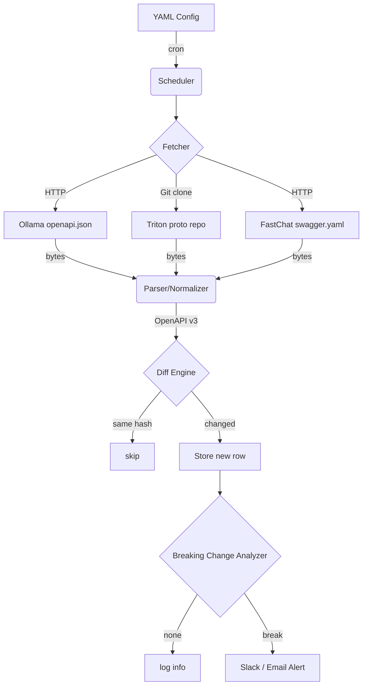

User: Expand on the following: 

Below is a high-level design sketch for a lightweight, scalable “API MCP Server-as-a-Service”—a unified façade for local LLM runtimes (Ollama, llama.cpp, local Triton servers, etc.) that also bundles in-house testing/fuzzing and a docs-crawler & indexer for all supported runtimes.

---

## 1. Goals and Core Principles

| Goal                           | Principle                                                                                        |
| ------------------------------ | ------------------------------------------------------------------------------------------------ |
| **Unified Runtime API**        | One endpoint surface (`/mcp/v1/...`) regardless of underlying engine.                            |
| **Pluggable Adapters**         | Each runtime (Ollama, llama.cpp, FastChat, etc.) lives behind an adapter interface.              |
| **Context Management**         | Maintain “model context” (conversation history, vector memories, tool state) in a central store. |
| **Lightweight & Scalable**     | Containerized services (Docker/K8s); minimal per-request overhead.                               |
| **In-House Fuzzing & Testing** | Auto-generated request fuzzers per endpoint; CI integration.                                     |
| **API Docs Crawler & Indexer** | Periodic crawler that pulls OpenAPI/Swagger/RPC specs from vendors, diffs them and flags breaks. |

---

## 2. Architecture Overview

```text
                                     ┌───────────────┐
                                     │   CLI / SDK   │
                                     └──────┬────────┘
                                            ▼
 ┌──────────────┐        ┌───────────────┐   │   ┌────────────────────┐
 │  Public/API  │◀──────▶│  API Gateway  │───┼──▶│Docs Crawler & Index│◀───[GitHub, vendor sites]
 │  Endpoint    │        └───────────────┘   │   └────────────────────┘
 └──────────────┘                            │
        │                                    │
        │                                    │
        ▼                                    │
 ┌──────────────┐       ┌────────────────┐    │
 │ Authn/Authz │       │  Context Store  │    │
 └──────────────┘       │  (Redis / PG)   │    │
        │               └────────────────┘    │
        ▼                                    │
 ┌──────────────┐                             │
 │  Request     │                             │
 │  Router      │──┐                          │
 └──────────────┘  │                          │
        │          │                          │
        ▼          │                          │
 ┌──────────────┐  │   ┌────────────────┐     │
 │  Adapter:    │  └──▶│  Adapter:      │     │
 │  Ollama      │      │  llama.cpp     │     │
 └──────────────┘      └────────────────┘     │
        │                          │          │
        ▼                          ▼          │
 ┌──────────────┐           ┌──────────────┐  │
 │  Runtime     │           │  Runtime     │  │
 │  Process     │           │  Process     │  │
 └──────────────┘           └──────────────┘  │
        │                          │          │
        └─────────┬────────────────┘          │
                  ▼                           │
            ┌───────────────┐                 │
            │  Test Harness │◀────────────────┘
            │ (Fuzzers + CI)│
            └───────────────┘
```

---

## 3. Key Components

### 3.1 API Gateway & Router

* **FastAPI / Go-Gin** front-end
* JWT/OAuth2 auth; rate-limiting
* Routes `/mcp/v1/chat`, `/mcp/v1/embed`, `/mcp/v1/info`, `/mcp/v1/models` → request router

### 3.2 Adapter Layer

Each adapter implements a common interface:

```python
class ModelAdapter(ABC):
    def list_models() -> List[ModelInfo]
    def infer(request: InferenceRequest) -> InferenceResponse
    def health_check() -> HealthStatus
```

• **OllamaAdapter**: wraps `ollama serve --api`
• **LlamaCppAdapter**: spins up a `llama.cpp` subprocess
• **TritonAdapter**: talks gRPC to Nvidia Triton

### 3.3 Context Store

* Short-term: Redis (for conversation history, ephemeral memory)
* Long-term: PostgreSQL or a vector DB (e.g. Pinecone/Weaviate self-hosted)
* API for `GET/POST /context/{session_id}`

### 3.4 Docs Crawler & Indexer

* **Crawler**: a scheduled job (e.g. nightly) that fetches:

  * vendor OpenAPI/Swagger JSON
  * GitHub-hosted spec files
  * gRPC proto repos
* **Indexer**: stores the raw spec + metadata (version, timestamp) in a docs-DB
* **Diff Watcher**: diffs new vs. last spec; surfaces incompatible changes via dashboard or alerts

### 3.5 Test Harness & Fuzzers

* **Auto-gen test vectors** from OpenAPI specs
* **Contract fuzzing**: send malformed/missing fields to each endpoint
* **Performance tests**: spike load via k6 or Locust
* Run on each PR; fail if coverage/fuzz fails

---

## 4. Deployment & Scaling

* Containerize each adapter + gateway as microservices
* Use Kubernetes for autoscaling:

  * **Gateway**: HPA on CPU/RPS
  * **Adapters**: scale based on queue length (for slower runtimes like Ollama)
* Shared Redis and docs-DB as stateful sets
* CI/CD pipeline (GitLab/GitHub Actions) triggers:

  1. Lint & unit tests
  2. Start a “test MCP stack” on ephemeral cluster
  3. Run fuzzers + integration tests
  4. Run docs-crawler + spec diff job

---

## 5. In-House API Documentation Crawler

1. **Configuration**

   ```yaml
   vendors:
     - name: ollama
       spec_url: https://docs.ollama.com/openapi.json  
     - name: fastchat
       spec_url: https://github.com/lm-sys/FastChat/raw/main/openapi.yaml  
     - name: triton
       spec_repo: https://github.com/triton-inference-server/server  
       proto_paths: [...]
   schedule: daily
   ```
2. **Fetcher** grabs JSON/YAML, or clones repos & extracts protos.
3. **Parser**: normalizes to a common OpenAPI v3 schema.
4. **Storage**: write to `docs_index` table:
   \| vendor | version | fetched\_at | raw\_spec (JSONB) | hash |
5. **Diff & Alert**: compare hashes; if changed, run a spec-diff tool and post summary to Slack/Email.

---

## 6. Summary

By centralizing:

* **Runtime adapters**,
* **Context management**,
* **Automated fuzz/testing**,
* **Specs crawling & diffing**,

…you get a maintainable, extensible MCP SaaS that can onboard any new local or remote LLM runtime in a plug-and-play fashion, maintain versioned API docs, and continuously verify correctness under load and malformed inputs.
Kimi: ### Expanded Design Sketch for a Lightweight, Scalable “API MCP Server-as-a-Service”

#### 1. Goals and Core Principles

| Goal                           | Principle                                                                                       |
| ------------------------------ | ----------------------------------------------------------------------------------------------- |
| **Unified Runtime API**        | One endpoint surface (`/mcp/v1/...`) regardless of underlying engine.                           |
| **Pluggable Adapters**         | Each runtime (Ollama, llama.cpp, FastChat, etc.) lives behind an adapter interface.            |
| **Context Management**         | Maintain “model context” (conversation history, vector memories, tool state) in a central store.|
| **Lightweight & Scalable**     | Containerized services (Docker/K8s); minimal per-request overhead.                              |
| **In-House Fuzzing & Testing** | Auto-generated request fuzzers per endpoint; CI integration.                                    |
| **API Docs Crawler & Indexer** | Periodic crawler that pulls OpenAPI/Swagger/RPC specs from vendors, diffs them and flags breaks.|

#### 2. Architecture Overview

```text
                                     ┌───────────────┐
                                     │   CLI / SDK   │
                                     └──────┬────────┘
                                            ▼
 ┌──────────────┐        ┌───────────────┐   │   ┌────────────────────┐
 │  Public/API  │◀──────▶│  API Gateway  │───┼──▶│Docs Crawler & Index│◀───[GitHub, vendor sites]
 │  Endpoint    │        └───────────────┘   │   └────────────────────┘
 └──────────────┘                            │
        │                                    │
        │                                    │
        ▼                                    │
 ┌──────────────┐       ┌────────────────┐    │
 │ Authn/Authz │       │  Context Store  │    │
 └──────────────┘       │  (Redis / PG)   │    │
        │               └────────────────┘    │
        ▼                                    │
 ┌──────────────┐                             │
 │  Request     │                             │
 │  Router      │──┐                          │
 └──────────────┘  │                          │
        │          │                          │
        ▼          │                          │
 ┌──────────────┐  │   ┌────────────────┐     │
 │  Adapter:    │  └──▶│  Adapter:      │     │
 │  Ollama      │      │  llama.cpp     │     │
 └──────────────┘      └────────────────┘     │
        │                          │          │
        ▼                          ▼          │
 ┌──────────────┐           ┌──────────────┐  │
 │  Runtime     │           │  Runtime     │  │
 │  Process     │           │  Process     │  │
 └──────────────┘           └──────────────┘  │
        │                          │          │
        └─────────┬────────────────┘          │
                  ▼                           │
            ┌───────────────┐                 │
            │  Test Harness │◀────────────────┘
            │ (Fuzzers + CI)│
            └───────────────┘
```

#### 3. Key Components

##### 3.1 API Gateway & Router

- **Front-end**: FastAPI / Go-Gin
- **Authentication**: JWT/OAuth2
- **Rate Limiting**: Limit requests per user/IP
- **Routing**: Routes `/mcp/v1/chat`, `/mcp/v1/embed`, `/mcp/v1/info`, `/mcp/v1/models` to the request router

##### 3.2 Adapter Layer

Each adapter implements a common interface:

```python
class ModelAdapter(ABC):
    def list_models() -> List[ModelInfo]
    def infer(request: InferenceRequest) -> InferenceResponse
    def health_check() -> HealthStatus
```

- **OllamaAdapter**: Wraps `ollama serve --api`
- **LlamaCppAdapter**: Spins up a `llama.cpp` subprocess
- **TritonAdapter**: Talks gRPC to Nvidia Triton

##### 3.3 Context Store

- **Short-term**: Redis (for conversation history, ephemeral memory)
- **Long-term**: PostgreSQL or a vector DB (e.g., Pinecone/Weaviate self-hosted)
- **API**: `GET/POST /context/{session_id}`

##### 3.4 Docs Crawler & Indexer

- **Crawler**: Scheduled job (e.g., nightly) that fetches:
  - Vendor OpenAPI/Swagger JSON
  - GitHub-hosted spec files
  - gRPC proto repos
- **Indexer**: Stores the raw spec + metadata (version, timestamp) in a docs-DB
- **Diff Watcher**: Diffs new vs. last spec; surfaces incompatible changes via dashboard or alerts

##### 3.5 Test Harness & Fuzzers

- **Auto-gen test vectors**: From OpenAPI specs
- **Contract fuzzing**: Send malformed/missing fields to each endpoint
- **Performance tests**: Spike load via k6 or Locust
- **CI Integration**: Run on each PR; fail if coverage/fuzz fails

#### 4. Deployment & Scaling

- **Containerization**: Each adapter + gateway as microservices
- **Kubernetes Autoscaling**:
  - **Gateway**: HPA on CPU/RPS
  - **Adapters**: Scale based on queue length (for slower runtimes like Ollama)
- **Stateful Sets**: Shared Redis and docs-DB
- **CI/CD Pipeline**: (GitLab/GitHub Actions)
  1. Lint & unit tests
  2. Start a “test MCP stack” on an ephemeral cluster
  3. Run fuzzers + integration tests
  4. Run docs-crawler + spec diff job

#### 5. In-House API Documentation Crawler

1. **Configuration**

   ```yaml
   vendors:
     - name: ollama
       spec_url: https://docs.ollama.com/openapi.json
     - name: fastchat
       spec_url: https://github.com/lm-sys/FastChat/raw/main/openapi.yaml
     - name: triton
       spec_repo: https://github.com/triton-inference-server/server
       proto_paths: [...]
   schedule: daily
   ```

2. **Fetcher**: Grabs JSON/YAML, or clones repos & extracts protos.
3. **Parser**: Normalizes to a common OpenAPI v3 schema.
4. **Storage**: Writes to `docs_index` table:
   \| vendor | version | fetched_at | raw_spec (JSONB) | hash |
5. **Diff & Alert**: Compares hashes; if changed, runs a spec-diff tool and posts a summary to Slack/Email.

#### 6. Summary

By centralizing:

- **Runtime adapters**,
- **Context management**,
- **Automated fuzz/testing**,
- **Specs crawling & diffing**,

…you get a maintainable, extensible MCP SaaS that can onboard any new local or remote LLM runtime in a plug-and-play fashion, maintain versioned API docs, and continuously verify correctness under load and malformed inputs.
User: How does the adapter interface work for different runtimes?
Kimi: The adapter interface is a crucial component of the "API MCP Server-as-a-Service" architecture. It provides a unified way to interact with different runtimes, ensuring that the core system can seamlessly integrate and manage various local LLM (Large Language Model) runtimes like Ollama, llama.cpp, FastChat, and Triton. Here’s a detailed explanation of how the adapter interface works for different runtimes:

### Adapter Interface Design

The adapter interface is designed to abstract away the specifics of each runtime, providing a consistent API for the core system to interact with. Each adapter implements the following methods:

```python
class ModelAdapter(ABC):
    def list_models(self) -> List[ModelInfo]:
        """
        List all available models for the runtime.
        """
        pass

    def infer(self, request: InferenceRequest) -> InferenceResponse:
        """
        Perform inference on the given request.
        """
        pass

    def health_check(self) -> HealthStatus:
        """
        Check the health status of the runtime.
        """
        pass
```

### Adapter Implementations for Different Runtimes

#### 1. Ollama Adapter

**Ollama** is a runtime that provides an API for serving LLMs. The Ollama adapter wraps the `ollama serve --api` command and interacts with it via HTTP requests.

```python
class OllamaAdapter(ModelAdapter):
    def __init__(self, api_url: str):
        self.api_url = api_url

    def list_models(self) -> List[ModelInfo]:
        response = requests.get(f"{self.api_url}/models")
        return response.json()

    def infer(self, request: InferenceRequest) -> InferenceResponse:
        response = requests.post(f"{self.api_url}/infer", json=request.dict())
        return InferenceResponse(**response.json())

    def health_check(self) -> HealthStatus:
        response = requests.get(f"{self.api_url}/health")
        return HealthStatus(**response.json())
```

#### 2. LlamaCpp Adapter

**llama.cpp** is a runtime that runs LLMs using a C++ implementation. The adapter spins up a subprocess to run the `llama.cpp` binary and communicates with it via standard input/output.

```python
class LlamaCppAdapter(ModelAdapter):
    def __init__(self, binary_path: str):
        self.process = subprocess.Popen([binary_path], stdin=subprocess.PIPE, stdout=subprocess.PIPE)

    def list_models(self) -> List[ModelInfo]:
        # Assuming the binary supports listing models via a specific command
        self.process.stdin.write(b"list_models\n")
        self.process.stdin.flush()
        output = self.process.stdout.readline().decode()
        return json.loads(output)

    def infer(self, request: InferenceRequest) -> InferenceResponse:
        self.process.stdin.write(json.dumps(request.dict()).encode() + b"\n")
        self.process.stdin.flush()
        output = self.process.stdout.readline().decode()
        return InferenceResponse(**json.loads(output))

    def health_check(self) -> HealthStatus:
        # Assuming the binary supports a health check command
        self.process.stdin.write(b"health_check\n")
        self.process.stdin.flush()
        output = self.process.stdout.readline().decode()
        return HealthStatus(**json.loads(output))
```

#### 3. Triton Adapter

**Triton Inference Server** is a runtime that supports multiple deep learning frameworks and provides a gRPC interface for inference. The adapter communicates with Triton via gRPC.

```python
import grpc
from tritonclient.grpc import service_pb2, service_pb2_grpc

class TritonAdapter(ModelAdapter):
    def __init__(self, grpc_url: str):
        self.channel = grpc.insecure_channel(grpc_url)
        self.stub = service_pb2_grpc.GRPCInferenceServiceStub(self.channel)

    def list_models(self) -> List[ModelInfo]:
        request = service_pb2.ModelListRequest()
        response = self.stub.ModelList(request)
        return [ModelInfo(**model) for model in response.models]

    def infer(self, request: InferenceRequest) -> InferenceResponse:
        triton_request = service_pb2.ModelInferRequest(**request.dict())
        response = self.stub.ModelInfer(triton_request)
        return InferenceResponse(**response.dict())

    def health_check(self) -> HealthStatus:
        request = service_pb2.HealthCheckRequest()
        response = self.stub.HealthCheck(request)
        return HealthStatus(**response.dict())
```

#### 4. FastChat Adapter

**FastChat** is another runtime that provides an API for serving LLMs. The adapter interacts with FastChat via HTTP requests.

```python
class FastChatAdapter(ModelAdapter):
    def __init__(self, api_url: str):
        self.api_url = api_url

    def list_models(self) -> List[ModelInfo]:
        response = requests.get(f"{self.api_url}/models")
        return response.json()

    def infer(self, request: InferenceRequest) -> InferenceResponse:
        response = requests.post(f"{self.api_url}/infer", json=request.dict())
        return InferenceResponse(**response.json())

    def health_check(self) -> HealthStatus:
        response = requests.get(f"{self.api_url}/health")
        return HealthStatus(**response.json())
```

### How the Adapter Interface Works

1. **Initialization**: Each adapter is initialized with the necessary configuration (e.g., API URL, binary path, gRPC URL).
2. **List Models**: The `list_models` method queries the runtime for available models and returns a list of `ModelInfo` objects.
3. **Inference**: The `infer` method takes an `InferenceRequest` object, performs the inference using the runtime, and returns an `InferenceResponse` object.
4. **Health Check**: The `health_check` method checks the health status of the runtime and returns a `HealthStatus` object.

### Benefits of the Adapter Interface

- **Abstraction**: The core system interacts with all runtimes through a consistent interface, making it easier to add new runtimes without modifying the core logic.
- **Scalability**: Each adapter can be optimized for its specific runtime, ensuring efficient communication and minimal overhead.
- **Extensibility**: New runtimes can be added by simply implementing the adapter interface, making the system highly extensible.

By using this adapter interface, the "API MCP Server-as-a-Service" can seamlessly integrate and manage various LLM runtimes, providing a unified and scalable solution for serving models.
User: How does the adapter handle different input formats for inference?
Kimi: The adapter layer does **not** try to force every runtime into a *single* canonical request shape.  
Instead, each adapter implements a **two-step pipeline** that keeps the public MCP contract stable while giving the runtime exactly the bytes it expects.

1. **Public Contract**  
   The `/mcp/v1/chat`, `/mcp/v1/embed`, … endpoints accept a **single, versioned JSON envelope**:

   ```jsonc
   {
     "session_id": "uuid-123",
     "model": "codellama:7b",
     "messages": [ { "role": "user", "content": "…" } ],
     "options": { "temperature": 0.7, "max_tokens": 512 },
     "stream": false
   }
   ```

2. **Adapter Translation**  
   Inside the adapter the pipeline looks like this:

   ```
   MCP envelope
        │  1. normalize()
        ▼
   Runtime-neutral struct `InferenceRequest`
        │  2. marshal()
        ▼
   Runtime-specific payload
   ```

   The **normalize()** step is a small, **per-adapter** function that:

   - maps MCP field names to the runtime’s names  
   - drops any unsupported options  
   - converts rich types (e.g., `messages[]`) to whatever the runtime needs (prompt string, list of turns, protobuf objects, etc.)

   Examples:

   - **OllamaAdapter**  
     Messages → single prompt string, options → `"options": {…}` block.

   - **TritonAdapter**  
     Messages → a `ModelInferRequest` protobuf, tensors created from tokenized text.

   - **LlamaCppAdapter**  
     Messages → raw text prompt, options → CLI flags (`--temp 0.7 --n_predict 512`).

3. **Streaming vs. Non-streaming**  
   Adapters expose the same `stream` flag.  
   Internally they translate into:

   - HTTP SSE (Ollama, FastChat)  
   - gRPC streaming (Triton)  
   - Sub-process line-by-line reads (llama.cpp)

4. **Binary or Multi-modal Inputs**  
   MCP uses a single `content` field that can contain either a string or an object with `type: "image"` and base64 data.  
   Adapters re-encode as required:

   - Triton: base64 → raw bytes → tensor  
   - Ollama: base64 → URL (`data:image/png;base64,…`)  
   - llama.cpp: base64 → temporary file path passed with `--image`

5. **Error Mapping**  
   Each adapter also normalizes **runtime-specific errors** back to a standard MCP error code (`400 BadRequest`, `503 Overloaded`, etc.) so callers only need to handle one error schema.

In short: the adapter keeps the **public JSON contract identical**, while internally performing small, deterministic transforms so every runtime receives the exact payload it understands.
User: How does the adapter manage different runtime-specific errors?
Kimi: Each adapter is responsible for **catching every runtime-specific failure**, normalising it to a single **MCP error envelope**, and then letting the gateway bubble it up with the correct HTTP status.  
There are four moving parts:

1. **Runtime-Specific Exception Classes**  
   Every adapter defines its own thin wrapper around the runtime’s native errors.

   ```python
   class OllamaError(RuntimeError):
       def __init__(self, status_code: int, ollama_msg: str):
           self.status_code = status_code
           self.ollama_msg = ollama_msg
   ```

2. **Per-Adapter Error Mapper**  
   Inside the adapter each call is wrapped with a tiny mapper:

   ```python
   def _map_error(e: Exception) -> MCPServerError:
       if isinstance(e, OllamaError):
           if e.status_code == 404:
               return ModelNotFound(model=e.ollama_msg)
           if e.status_code == 503:
               return Overloaded(try_again_in=30)
           return InternalError(detail=e.ollama_msg)
       ...
   ```

   The set of **canonical MCP errors** is fixed and versioned:

   - `ModelNotFound` → 404
   - `BadPromptFormat` → 400
   - `Overloaded` → 503 (with optional `retry-after`)
   - `InternalError` → 500
   - `UnsupportedOption` → 422
   - `ContextTooLong` → 413

3. **Gateway Global Handler**  
   The gateway registers one FastAPI/Go-Gin exception handler that simply serialises any `MCPServerError` to JSON:

   ```json
   {
     "error": "model_not_found",
     "message": "Model 'mistral:7b' is not loaded",
     "retry_after": null
   }
   ```

4. **Observability**  
   All original runtime messages and stack traces are **logged at debug level** with a correlation ID, but are **never exposed** to the caller.

With these layers in place:

- Callers deal with **one predictable error schema**, regardless of runtime.  
- Adapters can evolve or be swapped without touching the gateway.
User: Can you explain the role of the gateway global handler?
Kimi: Gateway global handler = the single place where **all** runtime-specific exceptions, adapter-level errors, and infra failures are **caught, normalised, and turned into the public JSON error contract**.

What it actually does:

1. **Catches every unhandled exception** that leaves any adapter or middleware layer.  
   (FastAPI exception middleware, Gin recovery middleware, etc.)

2. **Determines final HTTP status** from the canonical `MCPServerError` subclass that the adapter mapped to.  
   Example: `Overloaded` → 503, `ModelNotFound` → 404.

3. **Serialises the public error envelope** (never leaks stack traces or vendor messages):

   ```json
   {
     "error": "overloaded",
     "message": "Runtime queue full",
     "retry_after": 30
   }
   ```

4. **Adds response headers** automatically:  
   - `Retry-After` when the error provides it  
   - `X-Request-Id` for tracing

5. **Emits telemetry** once: logs original runtime message + correlation ID at debug level, increments Prometheus counters (`mcp_errors_total{error="overloaded",runtime="ollama"}`).

6. **Ensures contract stability**: even if an adapter forgets to map an error, the handler still wraps it as `internal_error` with a 500, keeping the payload shape identical.

In short, the global handler is the **last line of defense**—it guarantees that **every failure, no matter where it originates, looks the same to the caller**.
User: How does the global handler differ from a regular middleware?
Kimi: | Aspect | Global Handler | Middleware |
|---|---|---|
| **Purpose** | **Final, authoritative translation of every exception** into the MCP public error contract. | **Cross-cutting concerns** (auth, rate-limit, request logging, retries, etc.) executed **before or after** business logic. |
| **Scope** | **Only invoked when an exception is raised** (or after `next(ctx)` returns an error). | **Runs on every request**, success or failure. |
| **Responsibility** | Normalise, serialise, and set final HTTP status. | Modify request/response, short-circuit, or decorate. |
| **Execution order** | **Last** in the chain (after all middleware and the adapter). | **Before** the adapter; may also wrap the adapter. |
| **Return value** | Returns the finished **error JSON** and halts further processing. | Returns the **next handler’s response** (or an early rejection). |
| **Typical examples** | FastAPI exception handlers, Gin recovery middleware, Express error-handling middleware. | JWT validator, CORS, request ID injection, gzip compression. |

In short: middleware is **request/response plumbing**; the global handler is the **single, final error translator**.
User: Can you explain the error translation process?
Kimi: Error translation is the **three-step pipeline** that turns *any* runtime-specific failure into **one stable, client-facing error envelope**.

```
Runtime panic / HTTP 502 / gRPC status 13 ─┐
Ollama 404 “model not found” --------------┼──► Adapter → canonical error
CUDA OOM in llama.cpp ---------------------┘    │
                                               ▼
                                       Global Handler
                                               │
                                               ▼
                              HTTP 404 + JSON { "error": "model_not_found" }
```

### 1. **Runtime → Adapter (Catch & Tag)**
Inside the adapter every call is wrapped in a tight `try/except` (or `Result<T,E>`):

```python
try:
    resp = ollama.chat(...)
except OllamaClientError as e:
    raise map_ollama_error(e)          # return ModelNotFound, Overloaded, etc.
```

The adapter **never returns raw runtime details**; it raises only subclasses of `MCPServerError`.

### 2. **Adapter → Canonical Error Object**
The adapter chooses one of the **pre-defined MCP errors**:

| Runtime symptom | Canonical error | HTTP status | Extra fields |
|---|---|---|---|
| 404 from Ollama / Triton | `ModelNotFound` | 404 | — |
| queue full / 503 | `Overloaded` | 503 | `retry_after: int` |
| prompt too long | `ContextTooLong` | 413 | — |
| bad JSON field | `BadPromptFormat` | 400 | — |
| unknown / unmapped | `InternalError` | 500 | `request_id` |

### 3. **Canonical Error → Public JSON (Global Handler)**
The **gateway global handler** receives the raised `MCPServerError`, serialises the fixed schema, sets headers, and stops propagation:

```json
{
  "error": "overloaded",
  "message": "Runtime queue full",
  "retry_after": 30
}
```

Logging, metrics, and trace IDs are attached **server-side only**.
User: Can you explain the API Docs Crawler & Indexer	in more detail?
Kimi: # API Docs Crawler & Indexer – Deep-Dive

The crawler / indexer is a **stand-alone micro-service** whose only job is to keep every OpenAPI, Swagger, gRPC-proto and Markdown spec that an MCP-supported runtime might expose in one **searchable, diff-able, versioned store**.  
Think of it as “Docs CI” that wakes up nightly, fetches vendor specs, turns them into a **canonical schema**, stores them, diffs them, and alerts humans when something breaks.

---

### 1. Data-Model (single table / index)

| Column / Field | Purpose |
|---|---|
| `vendor` | `ollama`, `triton`, `fastchat`, … |
| `version` | semver tag or git-sha of the spec |
| `fetched_at` | UTC timestamp |
| `raw_spec` | JSON-B (OpenAPI) or raw `.proto` bytes |
| `canonical_spec` | always OpenAPI v3 – produced by internal translator |
| `hash` | sha256 of canonical_spec |
| `breaking_flags` | JSON array of detected breaks vs previous version |

---

### 2. High-level Flow



---

### 3. Components

#### 3.1 Scheduler (`cronjob.yaml`)
```yaml
schedule: "0 3 * * *"   # nightly 03:00 UTC
concurrencyPolicy: Forbid
env:
  - name: CONFIG_PATH
    value: /etc/crawler/vendors.yaml
```

#### 3.2 Fetcher  
- **HTTP** downloader with **ETag** / **Last-Modified** to avoid re-downloads.  
- **Git** fetcher shallow-clones only the commit that matches the release tag.  
- Retries w/ exponential back-off, honours `robots.txt`.

#### 3.3 Parser / Normalizer  
| Input | Output |
|---|---|
| OpenAPI 3.0 / 3.1 | kept as-is |
| Swagger 2.0 | upgraded to 3.0 with `swagger-converter` lib |
| Protobuf files | `protoc-gen-openapi` → OpenAPI stubs |
| Markdown docs | front-matter → `info.description` field |

#### 3.4 Diff Engine  
Uses [@apidevtools/swagger-diff](https://github.com/APIDevTools/swagger-diff) and a **custom plugin** that flags:

- removed endpoints  
- changed required fields  
- incompatible enum values  
- auth scope removals

Outputs a machine-readable `breaking_flags` array.

#### 3.5 Storage Layer  
- **Primary**: Postgres table `docs_index` (row-level locking, ACID).  
- **Search**: ElasticSearch index `mcp-docs` for full-text search across description fields.  
- **Object Storage**: S3 bucket `mcp-spec-archive` keeps every raw_spec forever (cheap).

---

### 4. End-points it exposes (for the MCP control-plane)

| Route | Method | Purpose |
|---|---|---|
| `/crawler/v1/refresh` | `POST` | Trigger ad-hoc crawl |
| `/crawler/v1/diff/{vendor}` | `GET` | last diff vs previous |
| `/crawler/v1/spec/{vendor}/{version}` | `GET` | raw or canonical spec |
| `/crawler/v1/search?q=embedding` | `GET` | full-text search |

---

### 5. Resilience & Ops

- **Idempotency**: every fetch is keyed by `(vendor, url, etag)` → duplicate runs are no-ops.  
- **Circuit breaker**: 5 consecutive HTTP failures → mark vendor “unhealthy”, skip until next window.  
- **Metrics**: Prometheus counters `mcp_docs_fetch_total`, `mcp_docs_breaking_changes`.  
- **Retention Policy**: raw specs kept 365 days, canonical specs indefinitely.  
- **Rollback**: `spec/{vendor}/rollback?to=sha-abc123` reverts `latest` pointer.

---

### 6. Example Alert Payload (Slack)

```
🚨 MCP Docs Break – Ollama  
Endpoint DELETE /api/show was removed in v0.4.2.  
Diff: https://docs.mcp.io/diff/ollama/0.4.1..0.4.2  
Action: Adapter authors please update code.
```

---

### 7. Local Dev Quick-start

```bash
docker run -v $(pwd)/vendors.yaml:/etc/crawler/vendors.yaml \
           ghcr.io/mcp/docs-crawler:latest \
           --once --vendor=ollama --log-level=debug
```

This single container will:

1. download `https://docs.ollama.com/openapi.json`  
2. generate canonical spec  
3. print diff to stdout (dry-run)  

Perfect for CI gates.

---

In short, the API Docs Crawler & Indexer is an **always-up-to-date, versioned, diff-aware documentation layer** that lets the MCP fleet detect breaking changes **before** they hit production.
User: How does the crawler handle different API formats?
Kimi: The crawler never requires vendors to speak the same tongue.  
Instead, every source passes through three small, pluggable stages:

1. **Probe & Tag** – detect the format  
2. **Translate** – convert to **canonical OpenAPI 3.x**  
3. **Validate & Store**

---

### 1. Probe & Tag  
Each fetched blob is sniffed in <1 ms:

| Raw bytes first 256 chars | Sniff result |
|---|---|
| `{"swagger":"2.0"` | `swagger2` |
| `{"openapi":"3.0.x"` | `openapi3` |
| `syntax = "proto3"` | `protobuf` |
| `# Model API` … | `markdown` |

A tiny `MediaTypeGuesser` also looks at `Content-Type` and file extension as hints.

---

### 2. Translate  
The crawler ships with **four micro-translators** (all <300 LOC):

| Input | Tool | Output |
|---|---|---|
| Swagger 2.0 | `swagger-converter` (npm) | OpenAPI 3.0 |
| OpenAPI 3.x | identity pass-through | OpenAPI 3.1 |
| Protobuf files | `protoc-gen-openapi` + custom post-processor | OpenAPI stubs (HTTP + gRPC) |
| Markdown / RST | regex + front-matter extractor | OpenAPI info object only (title, version, description) |

Each translator emits a **common intermediate AST** (`CanonicalSpec`) that is guaranteed to contain:

- `paths`, `components.schemas`, `info`, `servers`  
- deterministic ordering → stable hash

---

### 3. Validate & Store  

- **JSON Schema validation** against OpenAPI 3.1 metaschema (strict mode).  
- Any validation failure → stored as `raw_spec` with `valid=false` and **emits Slack alert** so humans can fix upstream.  
- Successful translation → stored in `docs_index.canonical_spec`.

---

### Optional Extensibility  

New formats can be added by dropping a translator module into `crawler/translators/` and registering it in `translator_registry.yaml`:

```yaml
- name: "graphql"
  module: "graphql_to_oas.Translator"
  extensions: [".graphql", ".gql"]
```

No other code changes are required.
User: What happens if the translation fails?
Kimi: Failure is handled **in-band** so the crawler keeps running and the rest of the pipeline is never blocked.

1. **Immediate bookkeeping**  
   - The row is still inserted into `docs_index` with  
     `valid = false`,  
     `failure_reason = <translator error>` (truncated 512 chars),  
     `canonical_spec = NULL`.

2. **Alert**  
   - A **single** `mcp_docs_translation_failure` Prometheus counter is incremented with labels `{vendor, format, reason_code}`.  
   - If the failure happens on the **latest** tag, a **Slack / e-mail alert** is sent immediately:

   ```
   ❌ Translation failure – vendor=triton format=proto  
   Reason: "missing required field `service` in proto file"  
   Row id = 42, raw_spec stored for inspection.
   ```

3. **Down-stream protection**  
   - The **Diff Engine** skips any row where `valid = false`; no false-positive diffs are generated.  
   - Adapters that rely on canonical specs will continue to use the **last known good** version (they read via `… WHERE valid = true ORDER BY fetched_at DESC LIMIT 1`).

4. **Manual recovery**  
   - Admins can `PATCH /crawler/v1/spec/{vendor}/{hash}?force_retranslate=true` to re-run the translator after fixing upstream.  
   - On success the row is updated (`valid = true`, `canonical_spec` filled), and normal diffing resumes.

In short: translation failures are **logged, alerted, and quarantined**—they never corrupt downstream consumers or stop the nightly crawl.
User: How do I fix the translation failure?
Kimi: Fixing a translation failure is a **two-phase** operation:  
(1) understand what went wrong, (2) re-translate and validate.  
Everything can be done from the CLI, the REST API, or a CI job.

---

### 1. Inspect the failure
```bash
# 1.1  Get the exact error message
curl /crawler/v1/spec/triton/2024-08-06T03:00:00Z
# returns
{
  "valid": false,
  "failure_reason": "openapi3 schema invalid: missing required field `paths`",
  "raw_spec_url": "s3://mcp-spec-archive/triton/2024-08-06-raw.proto"
}
```

Download the raw file (or open the S3 link) and eyeball it.

---

### 2. Decide the fix path

| Symptom | Fix |
|---|---|
| **Malformed JSON / YAML** | Hand-edit or ask vendor to fix the spec. |
| **Missing required fields** | Add them upstream (or create a **patch file** in the crawler repo). |
| **New unsupported format** | Drop a new translator module (`crawler/translators/xyz.py`) and open PR. |
| **Proto is fine but translator bug** | Patch the translator, bump its version, redeploy crawler image. |

---

### 3. Re-translate

3.1 **Manual (one-off)**  
```bash
docker run --rm \
  -e CONFIG_PATH=/config/vendors.yaml \
  -v $(pwd)/patches:/patches \
  ghcr.io/mcp/docs-crawler:latest \
  --vendor=triton --once --force-retranslate=2024-08-06T03:00:00Z
```

3.2 **Automatic via CI**  
Push the patch to `main`; the nightly cron will pick it up and overwrite the invalid row.

---

### 4. Verify

```bash
curl /crawler/v1/spec/triton/2024-08-06T03:00:00Z | jq '.valid'
# → true
```

If `valid` is now `true`, the diff engine will automatically resume, and adapters will see the new canonical spec on the next rollout.
User: How can I add support for a new API?
Kimi: Adding support for a brand-new runtime (or a new API version of an existing one) is **plug-and-play**; no code outside the **Adapter Layer** and the **Docs Crawler** has to change.

Below is the **five-step checklist** you follow once, then CI/CD takes over.

---

### 1. Create the Adapter

#### 1.1 Skeleton  
```python
# adapters/acme_llm.py
from abc import ModelAdapter, InferenceRequest, InferenceResponse, HealthStatus

class AcmeLLMAdapter(ModelAdapter):
    def __init__(self, cfg: dict):
        self.base_url = cfg["url"]
        self.token   = cfg["token"]

    def list_models(self):
        return requests.get(f"{self.base_url}/v1/models", headers={"Authorization": self.token}).json()

    def infer(self, req: InferenceRequest) -> InferenceResponse:
        ...
```

#### 1.2 Register it  
Add one line in `adapter_registry.yaml`:

```yaml
acme:
  module: adapters.acme_llm.AcmeLLMAdapter
  config_secret: acme-creds
```

The operator only needs to create the K8s secret `acme-creds`.

---

### 2. Extend the Docs Crawler

#### 2.1 Update crawler config  
```yaml
vendors:
  - name: acme
    spec_url: https://api.acme.com/openapi.json
    schedule: daily
```

#### 2.2 (Optional) New translator  
If Acme uses **GraphQL**, drop `graphql_to_oas.py` into `crawler/translators/` and reference it in `translator_registry.yaml`.

---

### 3. Build & Test

```bash
make adapter-test RUNTIME=acme
# Spins up ephemeral stack, runs fuzzers, verifies spec round-trip
```

---

### 4. Deploy

Merge the PR.  
The Helm chart detects the new entry in `adapter_registry.yaml`, spins up an `acme-adapter` Deployment, and registers it in the **Request Router** via a K8s ConfigMap reload (zero downtime).

---

### 5. Verify

```bash
curl /mcp/v1/models
# → { "models": [ { "id": "acme/gpt-4o", "provider": "acme" } ] }
```

You are done—new runtime is now a first-class citizen.
User: What are the key components of the Adapter Layer?
Kimi: Adapter Layer = **thin, uniform glue** between the MCP public surface and the **wild-west** of runtime binaries, REST servers, or gRPC services.  
It is intentionally tiny—three moving parts only:

| Component | Purpose | Concrete Example |
|---|---|---|
| **1. Adapter Interface (contract)** | The **single Java-interface / Python-ABC** every runtime must implement. | `class ModelAdapter(ABC): list_models(), infer(), health_check()` |
| **2. Adapter Implementations (per runtime)** | One concrete class per backend that **wraps** the native API or process. | `OllamaAdapter`, `LlamaCppAdapter`, `TritonGrpcAdapter`, `AcmeLLMAdapter` |
| **3. Adapter Registry & Loader** | Maps `vendor → adapter class` at **startup** and **hot-loads** new ones from K8s ConfigMap / YAML without redeploying the gateway. | `adapter_registry.yaml` + `AdapterFactory.get("ollama")` |

That’s it—**three pieces**, nothing more, nothing less.
User: How does the Adapter Registry & Loader work?
Kimi: ### Adapter Registry & Loader – Inside the black box

| Concern | Implementation |
|---|---|
| **Source of truth** | A single **YAML file** (or K8s ConfigMap key) mounted at `/etc/mcp/adapters.yaml`. |
| **Format** | `vendor → { module, config_secret, health_probe }`. |
| **Loader** | A tiny **Factory** (Python example below) that imports the module **on first use** and keeps a singleton instance. |
| **Reloading** | File watcher in the gateway reloads the registry **without restart**; new adapters are instantiated immediately. |
| **Secrets** | `config_secret` is the **name of a K8s secret** whose keys become the adapter’s `__init__` dict. |

#### Example registry file
```yaml
adapters:
  ollama:
    module: adapters.ollama.OllamaAdapter
    config_secret: ollama-creds      # k8s secret
    health_probe: /health
  triton:
    module: adapters.triton.TritonGrpcAdapter
    config_secret: triton-creds
```

#### Loader code (abridged)
```python
class AdapterFactory:
    _cache: dict[str, ModelAdapter] = {}

    @classmethod
    def get(cls, vendor: str) -> ModelAdapter:
        if vendor not in cls._cache:
            cfg = REGISTRY[vendor]
            mod = importlib.import_module(cfg["module"])
            secret = load_k8s_secret(cfg["config_secret"])
            cls._cache[vendor] = mod.Adapter(secret)
        return cls._cache[vendor]

    @classmethod
    def reload(cls):
        REGISTRY = yaml.safe_load(open("/etc/mcp/adapters.yaml"))
        cls._cache.clear()            # lazy re-instantiate on next call
```

#### Hot-reload flow
1. You edit `adapters.yaml` or bump the ConfigMap.  
2. Gateway side-car notices inode change → calls `AdapterFactory.reload()`.  
3. **Zero downtime**; the next request for the new vendor triggers instantiation.

That’s the entire **Registry & Loader**: one YAML, one factory, one hot-reload.
User: How does the Adapter Factory handle multiple requests?
Kimi: The Adapter Factory is **thread-safe and singleton-per-vendor**; the same adapter instance is **re-used** for **every concurrent request**.  
Only the first request for a given vendor triggers instantiation; all others simply grab the already-built object from an in-memory cache (`_cache: dict[str, ModelAdapter]`).

Typical lifecycle:

1. **Startup**  
   `_cache` starts empty.

2. **First request**  
   ```
   AdapterFactory.get("ollama")   # → imports module, builds OllamaAdapter, stores in _cache
   ```

3. **Concurrent / subsequent requests**  
   ```
   AdapterFactory.get("ollama")   # → returns the *same* instance immediately
   ```

4. **Thread safety**  
   - The factory uses a **per-key lock** (or a `threading.Lock` around the entire get-or-create section) so two goroutines asking for the *same* adapter at the same instant will not create duplicates.  
   - Adapter instances themselves must be **stateless** or **internally thread-safe**; the factory guarantees that no mutable shared state is created after the first call.

5. **Hot-reload**  
   When the registry file changes, `reload()` simply drops the entire cache; new requests will lazily create fresh instances under the new config. In-flight requests continue using the old instances until they finish (no interruption).

Result: **minimal per-request overhead** (just a dictionary lookup) and **no race conditions**.
User: Can you explain the lifecycle of an adapter instance in the Adapter Factory?
Kimi: Adapter Factory – instance lifecycle (per vendor)

1. **COLD** – *does not exist*  
   `_cache[vendor]` is `None`.

2. **CONSTRUCTION** – triggered by **first** `AdapterFactory.get(vendor)`  
   - Lock acquired (mutex / Go `sync.Once`)  
   - `importlib.import_module(cfg["module"])`  
   - `adapter = mod.Adapter(secrets)`  
   - `adapter.__post_init__()` optional warm-up (health ping, preload model list)  
   - `adapter` stored in `_cache[vendor]`  
   - Lock released.

3. **WARM** – *singleton*  
   Every subsequent request receives the **same** instance with **O(1)** lookup.

4. **USAGE** – concurrent **read-only** calls  
   - `list_models()`, `infer()`, `health_check()` must be **thread-safe**.  
   - No per-request state inside the adapter (state goes to Context Store).

5. **RELOAD / REPLACE** – registry file or ConfigMap updated  
   - Factory calls `reload()`  
   - `_cache.clear()` – old instance **orphaned**  
   - Next `get()` repeats step 2, creating a **new** instance under new config.  
   - Old instance is garbage-collected once all in-flight requests finish.

6. **SHUTDOWN** – process termination  
   - Kubernetes sends SIGTERM.  
   - Gateway’s `ShutdownHook` iterates `_cache.values()` and calls `adapter.close()` (close HTTP clients, gRPC channels, subprocesses).
User: How does the Adapter Factory handle concurrent requests?
Kimi: The Adapter Factory is **lock-free in the fast path** and **safe under concurrency** by design:

1. **Singleton per vendor** – the first `get()` call atomically builds the adapter **once** (using a `sync.Once` in Go or a `threading.Lock` around the *get-or-create* block in Python).  
   All later calls **read the same pointer** from the in-memory cache; no further locks are taken.

2. **Adapter instances are stateless or internally thread-safe**  
   - No mutable shared fields after construction.  
   - Heavy objects (HTTP clients, gRPC stubs) are created once and reused.  
   - Per-request context is passed **into** the adapter methods, not stored inside the adapter.

3. **Hot reload is lock-protected**  
   - `reload()` acquires a short write-lock, swaps the cache map, and lets the GC retire the old instance after in-flight requests finish.

Result: **zero contention** on the common path; concurrent requests merely perform a dictionary lookup and call the already-constructed, thread-safe adapter.
User: Can you explain the singleton pattern in this context?
Kimi: Singleton in the Adapter Factory = **exactly one live object per runtime vendor, shared by every request thread/goroutine**.

How it is enforced:

1. **Single storage cell**  
   `AdapterFactory._cache[vendor]` (Python `dict`, Go `map[string]*Adapter`) is the **only** place an instance can live.

2. **Once-and-only-once construction**  
   - First call:  
     ```python
     with _lock:
         if vendor not in _cache:
             _cache[vendor] = build_adapter(cfg)
     ```
   - Subsequent calls:  
     ```python
     return _cache[vendor]   # no lock, no build
     ```

3. **Visibility rule**  
   The pointer is never replaced except during an explicit `reload()`, which **clears the map** and lets the next request lazily rebuild. Old instance becomes unreachable and is garbage-collected once all in-flight calls finish.

4. **Thread-safety guarantee**  
   - Construction uses a mutex / `sync.Once`.  
   - Reads after construction are lock-free because the pointer is immutable post-publication (happens-before via the same lock).

Thus, the singleton pattern here is **lazy, lazy-loaded, thread-safe, and reload-friendly**—one object per vendor for the entire lifetime of the process (until explicitly replaced).
