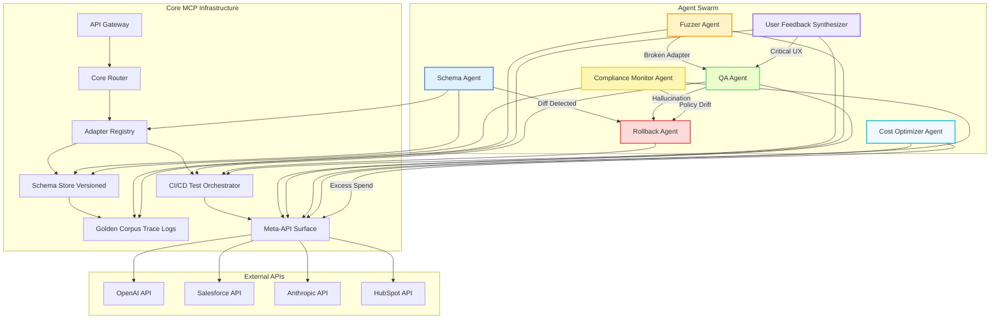

```mermaid
graph TD

    subgraph Core MCP Infrastructure
        A[API Gateway]
        B[Core Router]
        C[Adapter Registry]
        D[Schema Store Versioned]
        E[Golden Corpus Trace Logs]
        F[CI/CD Test Orchestrator]
        G[Meta-API Surface]
    end

    subgraph Agent Swarm
        H1[Schema Agent]
        H2[Fuzzer Agent]
        H3[QA Agent]
        H4[Rollback Agent]
        H5[Cost Optimizer Agent]
        H6[Compliance Monitor Agent]
        H7[User Feedback Synthesizer]
    end

    subgraph External APIs
        Z1[OpenAI API]
        Z2[Salesforce API]
        Z3[Anthropic API]
        Z4[HubSpot API]
    end

    %% Core Infrastructure Flows
    A --> B --> C
    C --> D
    D --> E
    C --> F --> G

    %% External API Integration
    G --> Z1
    G --> Z2
    G --> Z3
    G --> Z4

    %% Agents Monitor and Modify
    H1 --> D
    H1 --> C
    H2 --> G
    H2 --> E
    H3 --> G
    H3 --> F
    H4 --> F
    H5 --> G
    H6 --> G
    H6 --> D
    H7 --> E
    H7 --> F

    %% Agent Feedback Loops
    H1 -->|Diff Detected| H4
    H2 -->|Broken Adapter| H3
    H3 -->|Hallucination| H4
    H5 -->|Excess Spend| G
    H6 -->|Policy Drift| H4
    H7 -->|Critical UX| H3

    style H1 fill:#e0f2fe,stroke:#3b82f6,stroke-width:2px
    style H2 fill:#fef3c7,stroke:#f59e0b,stroke-width:2px
    style H3 fill:#ecfccb,stroke:#4ade80,stroke-width:2px
    style H4 fill:#fcdada,stroke:#ef4444,stroke-width:2px
    style H5 fill:#f0f9ff,stroke:#06b6d4,stroke-width:2px
    style H6 fill:#fdf6b2,stroke:#facc15,stroke-width:2px
    style H7 fill:#ede9fe,stroke:#8b5cf6,stroke-width:2px
```
