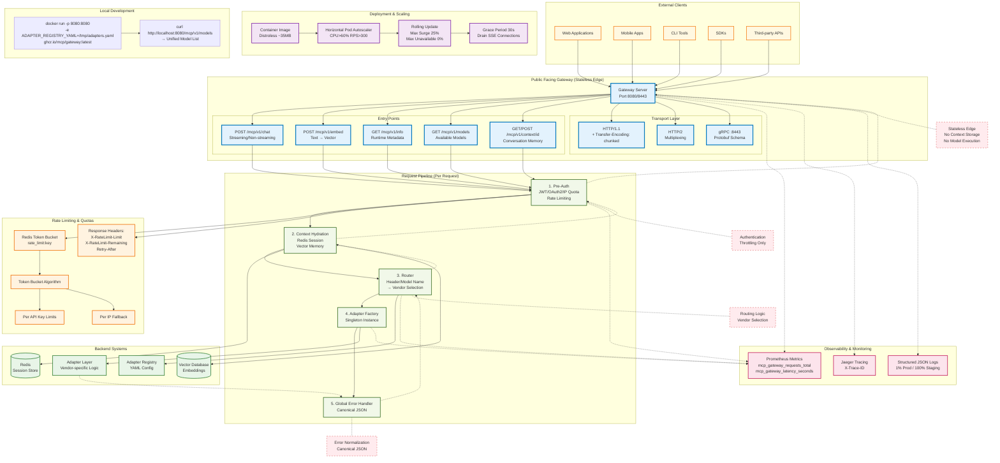

```mermaid
graph TD
    %% External Clients
    subgraph "External Clients"
        WEB[Web Applications]
        MOBILE[Mobile Apps]
        CLI[CLI Tools]
        SDK[SDKs]
        API[Third-party APIs]
    end

    %% Public Facing Gateway
    subgraph "Public Facing Gateway (Stateless Edge)"
        GW[Gateway Server<br/>Port 8080/8443]
        
        subgraph "Entry Points"
            EP1[POST /mcp/v1/chat<br/>Streaming/Non-streaming]
            EP2[POST /mcp/v1/embed<br/>Text → Vector]
            EP3[GET /mcp/v1/info<br/>Runtime Metadata]
            EP4[GET /mcp/v1/models<br/>Available Models]
            EP5[GET/POST /mcp/v1/context/id<br/>Conversation Memory]
        end
        
        subgraph "Transport Layer"
            HTTP1[HTTP/1.1<br/>+ Transfer-Encoding: chunked]
            HTTP2[HTTP/2<br/>Multiplexing]
            GRPC[gRPC :8443<br/>Protobuf Schema]
        end
    end

    %% Internal Pipeline
    subgraph "Request Pipeline (Per Request)"
        PRE[1. Pre-Auth<br/>JWT/OAuth2/IP Quota<br/>Rate Limiting]
        HYDRATE[2. Context Hydration<br/>Redis Session<br/>Vector Memory]
        ROUTER[3. Router<br/>Header/Model Name<br/>→ Vendor Selection]
        ADAPTER[4. Adapter Factory<br/>Singleton Instance]
        ERROR[5. Global Error Handler<br/>Canonical JSON]
    end

    %% Rate Limiting System
    subgraph "Rate Limiting & Quotas"
        REDIS[Redis Token Bucket<br/>rate_limit:key]
        BUCKET[Token Bucket Algorithm]
        HEADERS[Response Headers:<br/>X-RateLimit-Limit<br/>X-RateLimit-Remaining<br/>Retry-After]
        PERKEY[Per API Key Limits]
        PERIP[Per IP Fallback]
    end

    %% Observability
    subgraph "Observability & Monitoring"
        PROM[Prometheus Metrics<br/>mcp_gateway_requests_total<br/>mcp_gateway_latency_seconds]
        JAEGER[Jaeger Tracing<br/>X-Trace-ID]
        LOGS[Structured JSON Logs<br/>1% Prod / 100% Staging]
    end

    %% Deployment
    subgraph "Deployment & Scaling"
        CONTAINER[Container Image<br/>Distroless ~35MB]
        HPA[Horizontal Pod Autoscaler<br/>CPU>60%  RPS>300]
        ROLLING[Rolling Update<br/>Max Surge 25%<br/>Max Unavailable 0%]
        GRACE[Grace Period 30s<br/>Drain SSE Connections]
    end

    %% Backend Systems
    subgraph "Backend Systems"
        ADAPTER_LAYER[Adapter Layer<br/>Vendor-specific Logic]
        REDIS_SESSION[(Redis<br/>Session Store)]
        VECTOR_DB[(Vector Database<br/>Embeddings)]
        REGISTRY[Adapter Registry<br/>YAML Config]
    end

    %% Connection Flow
    WEB --> GW
    MOBILE --> GW
    CLI --> GW
    SDK --> GW
    API --> GW

    GW --> EP1
    GW --> EP2
    GW --> EP3
    GW --> EP4
    GW --> EP5

    GW --> HTTP1
    GW --> HTTP2
    GW --> GRPC

    %% Pipeline Flow
    EP1 --> PRE
    EP2 --> PRE
    EP3 --> PRE
    EP4 --> PRE
    EP5 --> PRE

    PRE --> HYDRATE
    HYDRATE --> ROUTER
    ROUTER --> ADAPTER
    ADAPTER --> ERROR

    %% Rate Limiting Connections
    PRE --> REDIS
    REDIS --> BUCKET
    BUCKET --> PERKEY
    BUCKET --> PERIP
    PRE --> HEADERS

    %% Context Hydration
    HYDRATE --> REDIS_SESSION
    HYDRATE --> VECTOR_DB

    %% Routing
    ROUTER --> REGISTRY
    ADAPTER --> ADAPTER_LAYER

    %% Observability Connections
    GW -.-> PROM
    GW -.-> JAEGER
    GW -.-> LOGS
    PRE -.-> PROM
    ROUTER -.-> PROM
    ADAPTER -.-> PROM

    %% Deployment Monitoring
    CONTAINER --> HPA
    HPA --> ROLLING
    ROLLING --> GRACE

    %% Local Development
    subgraph "Local Development"
        DOCKER[docker run -p 8080:8080<br/>-e ADAPTER_REGISTRY_YAML=/tmp/adapters.yaml<br/>ghcr.io/mcp/gateway:latest]
        CURL[curl http://localhost:8080/mcp/v1/models<br/>→ Unified Model List]
        
        DOCKER --> CURL
    end

    %% Response Flow (dotted lines)
    ADAPTER_LAYER -.-> ERROR
    ERROR -.-> ROUTER
    ROUTER -.-> HYDRATE
    HYDRATE -.-> PRE
    PRE -.-> GW

    %% Key Principles (annotations)
    GW -.- PRINCIPLE1[Stateless Edge<br/>No Context Storage<br/>No Model Execution]
    PRE -.- PRINCIPLE2[Authentication<br/>Throttling Only]
    ROUTER -.- PRINCIPLE3[Routing Logic<br/>Vendor Selection]
    ERROR -.- PRINCIPLE4[Error Normalization<br/>Canonical JSON]

    %% Styling
    classDef gateway fill:#e3f2fd,stroke:#0277bd,stroke-width:3px
    classDef pipeline fill:#f1f8e9,stroke:#33691e,stroke-width:2px
    classDef rateLimit fill:#fff3e0,stroke:#ef6c00,stroke-width:2px
    classDef observability fill:#fce4ec,stroke:#c2185b,stroke-width:2px
    classDef deployment fill:#f3e5f5,stroke:#7b1fa2,stroke-width:2px
    classDef backend fill:#e8f5e8,stroke:#2e7d32,stroke-width:2px
    classDef external fill:#fff8e1,stroke:#f57f17,stroke-width:2px
    classDef principle fill:#ffebee,stroke:#d32f2f,stroke-width:1px,stroke-dasharray: 5 5

    class GW,EP1,EP2,EP3,EP4,EP5,HTTP1,HTTP2,GRPC gateway
    class PRE,HYDRATE,ROUTER,ADAPTER,ERROR pipeline
    class REDIS,BUCKET,HEADERS,PERKEY,PERIP rateLimit
    class PROM,JAEGER,LOGS observability
    class CONTAINER,HPA,ROLLING,GRACE deployment
    class ADAPTER_LAYER,REDIS_SESSION,VECTOR_DB,REGISTRY backend
    class WEB,MOBILE,CLI,SDK,API external
    class PRINCIPLE1,PRINCIPLE2,PRINCIPLE3,PRINCIPLE4 principle
```
