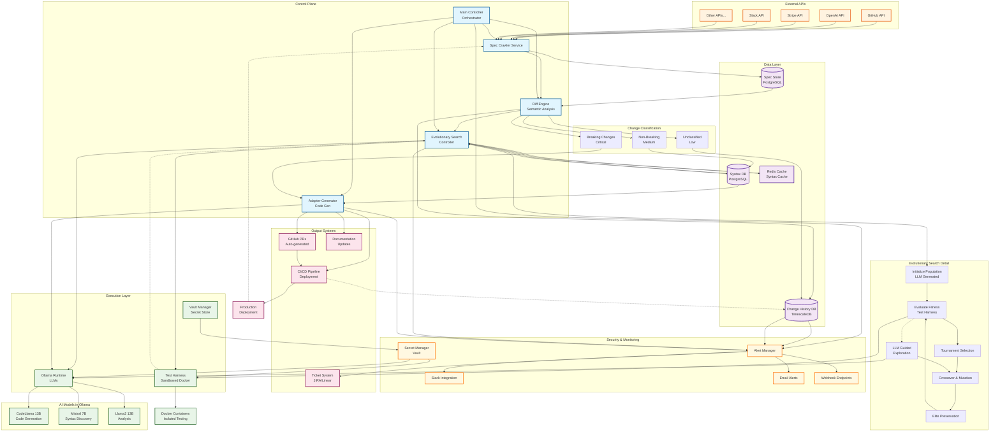

```mermaid
graph TB
    %% External Systems
    subgraph "External APIs"
        API1[GitHub API]
        API2[OpenAI API] 
        API3[Stripe API]
        API4[Slack API]
        APIn[Other APIs...]
    end

    %% Control Plane
    subgraph "Control Plane"
        SC[Spec Crawler Service]
        DE[Diff Engine<br/>Semantic Analysis]
        ESC[Evolutionary Search<br/>Controller]
        AG[Adapter Generator<br/>Code Gen]
        MC[Main Controller<br/>Orchestrator]
    end

    %% Data Layer
    subgraph "Data Layer"
        SS[(Spec Store<br/>PostgreSQL)]
        SDB[(Syntax DB<br/>PostgreSQL)]
        CHD[(Change History DB<br/>TimescaleDB)]
        RC[Redis Cache<br/>Syntax Cache]
    end

    %% Execution Layer
    subgraph "Execution Layer"
        OR[Ollama Runtime<br/>LLMs]
        TH[Test Harness<br/>Sandboxed Docker]
        VM[Vault Manager<br/>Secret Store]
    end

    %% AI Models
    subgraph "AI Models in Ollama"
        M1[CodeLlama 13B<br/>Code Generation]
        M2[Mistral 7B<br/>Syntax Discovery]
        M3[Llama2 13B<br/>Analysis]
    end

    %% Security & Monitoring
    subgraph "Security & Monitoring"
        AL[Alert Manager]
        SL[Slack Integration]
        EM[Email Alerts]
        WH[Webhook Endpoints]
        SM[Secret Manager<br/>Vault]
    end

    %% Output Systems
    subgraph "Output Systems"
        GH[GitHub PRs<br/>Auto-generated]
        CI[CI/CD Pipeline<br/>Deployment]
        DOC[Documentation<br/>Updates]
        TICK[Ticket System<br/>JIRA/Linear]
    end

    %% Main Workflow Connections
    API1 --> SC
    API2 --> SC
    API3 --> SC
    API4 --> SC
    APIn --> SC

    SC --> SS
    SC --> DE
    
    DE --> CHD
    DE --> ESC
    
    ESC --> SDB
    ESC --> TH
    ESC --> OR
    
    AG --> OR
    AG --> GH
    
    MC --> SC
    MC --> DE
    MC --> ESC
    MC --> AG
    MC --> AL

    %% Data Flow
    SS --> DE
    SDB --> ESC
    SDB --> AG
    CHD --> AL
    RC --> ESC
    ESC --> RC

    %% Execution Layer Connections
    OR --> M1
    OR --> M2
    OR --> M3
    
    TH --> Docker[Docker Containers<br/>Isolated Testing]
    
    VM --> SM
    SM --> OR
    SM --> TH

    %% Monitoring & Alerting
    AL --> SL
    AL --> EM
    AL --> WH
    AL --> TICK
    
    CHD --> AL
    ESC --> AL
    AG --> AL

    %% Output Connections
    AG --> CI
    AG --> DOC
    
    GH --> CI
    CI --> Production[Production<br/>Deployment]

    %% Feedback Loops
    TH -.-> ESC
    CI -.-> CHD
    Production -.-> SC

    %% Evolutionary Algorithm Detail
    subgraph "Evolutionary Search Detail"
        INIT[Initialize Population<br/>LLM Generated]
        EVAL[Evaluate Fitness<br/>Test Harness]
        SEL[Tournament Selection]
        CROSS[Crossover & Mutation]
        ELITE[Elite Preservation]
        LLM_GUIDE[LLM Guided<br/>Exploration]
        
        INIT --> EVAL
        EVAL --> SEL
        SEL --> CROSS
        CROSS --> ELITE
        ELITE --> EVAL
        EVAL -.-> LLM_GUIDE
        LLM_GUIDE --> CROSS
    end

    ESC --> INIT
    EVAL --> TH
    LLM_GUIDE --> OR

    %% Change Classification
    subgraph "Change Classification"
        BREAK[Breaking Changes<br/>Critical]
        NON_BREAK[Non-Breaking<br/>Medium]
        UNCLAS[Unclassified<br/>Low]
        
        BREAK --> AG
        NON_BREAK --> SDB
        UNCLAS --> CHD
    end

    DE --> BREAK
    DE --> NON_BREAK
    DE --> UNCLAS

    %% Styling
    classDef controlPlane fill:#e1f5fe,stroke:#01579b,stroke-width:2px
    classDef dataLayer fill:#f3e5f5,stroke:#4a148c,stroke-width:2px
    classDef execution fill:#e8f5e8,stroke:#1b5e20,stroke-width:2px
    classDef external fill:#fff3e0,stroke:#e65100,stroke-width:2px
    classDef output fill:#fce4ec,stroke:#880e4f,stroke-width:2px
    classDef security fill:#fff8e1,stroke:#ff6f00,stroke-width:2px

    class SC,DE,ESC,AG,MC controlPlane
    class SS,SDB,CHD,RC dataLayer
    class OR,TH,VM,M1,M2,M3,Docker execution
    class API1,API2,API3,API4,APIn external
    class GH,CI,DOC,TICK,Production output
    class AL,SL,EM,WH,SM security
```
