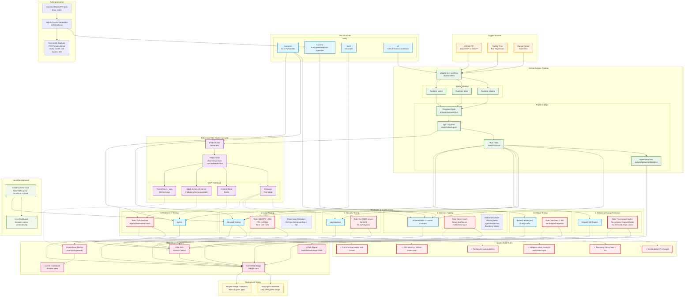

```mermaid
graph TB
    %% Trigger Sources
    subgraph "Trigger Sources"
        PR[GitHub PR<br/>adapters/** or tests/**]
        CRON[Nightly Cron<br/>Full Regression]
        MANUAL[Manual /retest<br/>Comment]
    end

    %% CI Pipeline Entry
    subgraph "GitHub Actions Pipeline"
        WORKFLOW[adapter-test workflow<br/>ubuntu-latest]
        
        subgraph "Matrix Strategy"
            OLLAMA[Runtime: ollama]
            TRITON[Runtime: triton]
            ACME[Runtime: acme]
        end
        
        subgraph "Pipeline Steps"
            CHECKOUT[Checkout Code<br/>actions/checkout@v4]
            KINDUP[Spin Up KIND<br/>./tests/ci/kind-up.sh]
            RUNTESTS[Run Tests<br/>./tests/ci/run.sh]
            UPLOAD[Upload Artifacts<br/>actions/upload-artifact@v4]
        end
    end

    %% Physical Layout
    subgraph "Test Structure"
        subgraph "tests/"
            HARNESS[harness/<br/>Go + Python libs]
            FUZZERS[fuzzers/<br/>Auto-generated from OpenAPI]
            LOAD[load/<br/>k6 scripts]
            CI_DIR[ci/<br/>GitHub Actions workflows]
        end
    end

    %% Ephemeral Test Environment
    subgraph "Ephemeral K8s Cluster (per job)"
        KIND[KIND Cluster<br/>acme-test]
        
        subgraph "MCP Test Stack"
            GW_TEST[Gateway<br/>Test Mode]
            REDIS_TEST[Context Store<br/>Redis]
            MOCK[Mock AcmeLLM Server<br/>Fallback when unavailable]
            PROM_TEST[Prometheus + Loki<br/>Metrics/Logs]
        end
        
        HELM[Helm Install<br/>charts/mcp-stack<br/>--set testMode=true]
    end

    %% Test Suites
    subgraph "Test Suites & Quality Gates"
        
        subgraph "1. Contract Fuzzing"
            SCHEMA[schemathesis + custom mutators]
            FUZZ_RULE[Rule: Never crash<br/>Return 4xx/5xx on malformed input]
            FUZZ_CASES[Malformed JSON<br/>Missing fields<br/>Type mismatches<br/>Boundary values]
        end
        
        subgraph "2. Load Testing"
            K6[k6 Load Testing]
            LOAD_RULE[Rule: 100 RPS × 30s<br/>P95 < 200ms<br/>Error rate < 1%]
            REGRESSION[Regression Detection<br/>>10% performance drop = fail]
        end
        
        subgraph "3. Security Testing"
            ZAP[zap-baseline]
            SEC_RULE[Rule: No CORS issues<br/>No XSS<br/>No auth bypass]
        end
        
        subgraph "4. Breaking Change Detection"
            CRAWLER[Crawler Diff Engine]
            BREAK_RULE[Rule: No removed paths<br/>No removed required fields<br/>No removed enum values]
        end
        
        subgraph "5. End-to-End Testing"
            PYTEST[pytest]
            E2E_RULE[Rule: Full chat loop<br/>Against ephemeral stack]
        end
        
        subgraph "6. Chaos Testing"
            CHAOS[kubectl delete pod<br/>During traffic]
            CHAOS_RULE[Rule: Recovery < 60s<br/>No dropped requests]
        end
    end

    %% Auto-generation Process
    subgraph "Auto-generation"
        SPEC[Canonical OpenAPI Spec<br/>docs_index]
        FUZZER_GEN[Nightly Fuzzer Generation<br/>schemathesis]
        EXAMPLE[Generated Example:<br/>POST /mcp/v1/chat<br/>body: model: null<br/>expect: 400]
    end

    %% Reporting & Artifacts
    subgraph "Reporting & Artifacts"
        JUNIT[JUnit XML<br/>GitHub Checks]
        HTML[HTML Report<br/>tests/artifacts/report.html]
        METRICS[Prometheus Metrics<br/>prom-pushgateway]
        DASHBOARD[Live k6 Dashboard<br/>Browser view]
        BADGE[Green/Red Badge<br/>Merge Gate]
    end

    %% Local Development
    subgraph "Local Development"
        LOCAL_CMD[make harness-local<br/>RUNTIME=acme TESTS=fuzz,load]
        LOCAL_DASH[Live Dashboard<br/>Browser opens automatically]
    end

    %% Deployment Target
    subgraph "Deployment Gates"
        STAGING[Staging Environment<br/>Only after green badge]
        PROMOTION[Adapter Image Promotion<br/>After all gates pass]
    end

    %% Flow Connections
    PR --> WORKFLOW
    CRON --> WORKFLOW
    MANUAL --> WORKFLOW

    WORKFLOW --> OLLAMA
    WORKFLOW --> TRITON
    WORKFLOW --> ACME

    OLLAMA --> CHECKOUT
    TRITON --> CHECKOUT
    ACME --> CHECKOUT

    CHECKOUT --> KINDUP
    KINDUP --> RUNTESTS
    RUNTESTS --> UPLOAD

    %% Infrastructure Setup
    KINDUP --> KIND
    KIND --> HELM
    HELM --> GW_TEST
    HELM --> REDIS_TEST
    HELM --> MOCK
    HELM --> PROM_TEST

    %% Test Execution Flow
    RUNTESTS --> SCHEMA
    RUNTESTS --> K6
    RUNTESTS --> ZAP
    RUNTESTS --> CRAWLER
    RUNTESTS --> PYTEST
    RUNTESTS --> CHAOS

    %% Test Dependencies
    HARNESS --> SCHEMA
    HARNESS --> K6
    HARNESS --> PYTEST
    FUZZERS --> SCHEMA
    LOAD --> K6
    CI_DIR --> WORKFLOW

    %% Auto-generation Flow
    SPEC --> FUZZER_GEN
    FUZZER_GEN --> FUZZERS
    FUZZER_GEN --> EXAMPLE

    %% Reporting Flow
    SCHEMA --> JUNIT
    K6 --> JUNIT
    ZAP --> JUNIT
    CRAWLER --> JUNIT
    PYTEST --> JUNIT
    CHAOS --> JUNIT

    JUNIT --> BADGE
    UPLOAD --> HTML
    K6 --> METRICS
    METRICS --> DASHBOARD

    %% Quality Gates
    FUZZ_RULE --> BADGE
    LOAD_RULE --> BADGE
    SEC_RULE --> BADGE
    BREAK_RULE --> BADGE
    E2E_RULE --> BADGE
    CHAOS_RULE --> BADGE

    %% Local Dev Flow
    LOCAL_CMD --> LOCAL_DASH
    LOCAL_CMD --> K6

    %% Deployment Flow
    BADGE --> STAGING
    BADGE --> PROMOTION

    %% Test Environment Details
    GW_TEST -.-> SCHEMA
    GW_TEST -.-> K6
    GW_TEST -.-> ZAP
    GW_TEST -.-> PYTEST
    
    REDIS_TEST -.-> E2E_RULE
    MOCK -.-> E2E_RULE
    PROM_TEST -.-> METRICS

    %% Quality Gate Details
    subgraph "Quality Gate Rules"
        RULE1[✓ Adapters never crash on malformed input]
        RULE2[✓ P95 latency < 200ms under load]
        RULE3[✓ No security vulnerabilities]
        RULE4[✓ No breaking API changes]
        RULE5[✓ Full chat loop works end-to-end]
        RULE6[✓ Recovery from chaos < 60s]
    end

    FUZZ_RULE -.-> RULE1
    LOAD_RULE -.-> RULE2
    SEC_RULE -.-> RULE3
    BREAK_RULE -.-> RULE4
    E2E_RULE -.-> RULE5
    CHAOS_RULE -.-> RULE6

    %% Styling
    classDef trigger fill:#fff3e0,stroke:#ff8f00,stroke-width:2px
    classDef pipeline fill:#e8f5e8,stroke:#2e7d32,stroke-width:2px
    classDef test fill:#e1f5fe,stroke:#0277bd,stroke-width:2px
    classDef infra fill:#f3e5f5,stroke:#7b1fa2,stroke-width:2px
    classDef quality fill:#ffebee,stroke:#c62828,stroke-width:3px
    classDef report fill:#fce4ec,stroke:#c2185b,stroke-width:2px
    classDef local fill:#f1f8e9,stroke:#558b2f,stroke-width:2px
    classDef deploy fill:#fff8e1,stroke:#f9a825,stroke-width:2px

    class PR,CRON,MANUAL trigger
    class WORKFLOW,OLLAMA,TRITON,ACME,CHECKOUT,KINDUP,RUNTESTS,UPLOAD pipeline
    class SCHEMA,K6,ZAP,CRAWLER,PYTEST,CHAOS,HARNESS,FUZZERS,LOAD,CI_DIR test
    class KIND,GW_TEST,REDIS_TEST,MOCK,PROM_TEST,HELM infra
    class FUZZ_RULE,LOAD_RULE,SEC_RULE,BREAK_RULE,E2E_RULE,CHAOS_RULE,RULE1,RULE2,RULE3,RULE4,RULE5,RULE6 quality
    class JUNIT,HTML,METRICS,DASHBOARD,BADGE report
    class LOCAL_CMD,LOCAL_DASH local
    class STAGING,PROMOTION deploy
```
