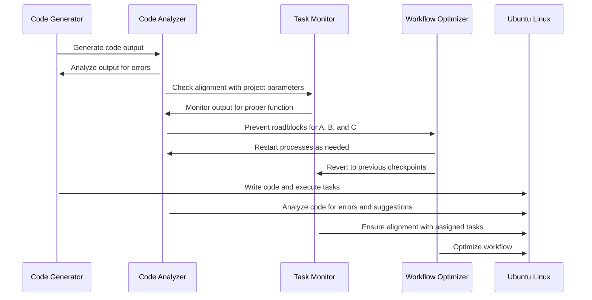

# GRYPHGEN

GRYPHGEN pronounced 'Griffin' stands for Grid Resource Prioritization in Heterogeneous Environments. Gryphgen is a framework that leverages large language models (LLMs) to automate software production at scale. The framework consists of three main components: SYMORQ, SYMORG, and SYMAUG.

1. SYMORQ (Systems Orchestration for Resource Quality): This component is an LLM-based orchestration service that uses the ZeroMQ message passing API to manage and coordinate resources in the grid. It ensures that resources are utilized efficiently and effectively to meet the demands of the software production process.

2. SYMORG (Systems Orchestration Retrieval Generator): This component is an LLM-based automated RAG (Retrieval Augmented Generation) constructor. RAG is a technique used to enhance the accuracy and reliability of generative AI models by incorporating facts fetched from external sources. SYMORG automates the retrieval and incorporation of relevant information into the software production process.

3. SYMAUG (Smart Yielding Microservices for Agile and Ultra-Portable Grids): This component is a dockerized or virtual machine implementation of the CCDE-SIOS ensemble. It provides a lightweight and portable solution for Gryphgen deployment across various platforms and hardware architectures. This ensures that Gryphgen can be easily integrated into different environments and used to produce software at scale.

The overall goal of GRYPHGEN is to create a self-deploying LLM cooperative programming environment capable of producing any type of software at any level of complexity and scale. To illustrate the workflow of Gryphgen, a series of interconnected sequence diagrams are used to describe the stages of operation, including:

- Task submission and initialization: The code generator (A) generates code output, which is analyzed by the code analyzer (B) for errors and alignment with project parameters. The task monitor (C) ensures that the output functions properly and aligns with assigned tasks.

- Code generation and analysis: The code generator writes the code and executes tasks on the target server (Target_Server), while the code analyzer analyzes the code for errors and suggestions.

- Task monitoring and workflow optimization: The task monitor ensures alignment with assigned tasks and reverts to previous checkpoints if necessary. The workflow optimizer (D) optimizes the process by restarting processes as needed and preventing roadblocks for components A, B, and C.

- Continuous deployment and monitoring: The target server executes tasks and writes code, while the code analyzer and task monitor continuously monitor the process for errors and proper function.

- Adaptive learning and system evolution: The system learns from previous iterations and evolves to improve efficiency and effectiveness over time.

By breaking down the workflow into these distinct stages, the sequence diagrams provide a comprehensive understanding of how Gryphgen functions and how it can be used to automate software production at scale.

