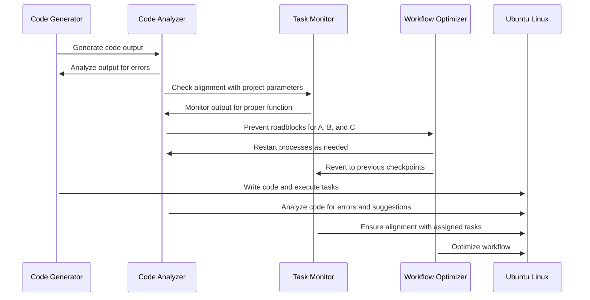
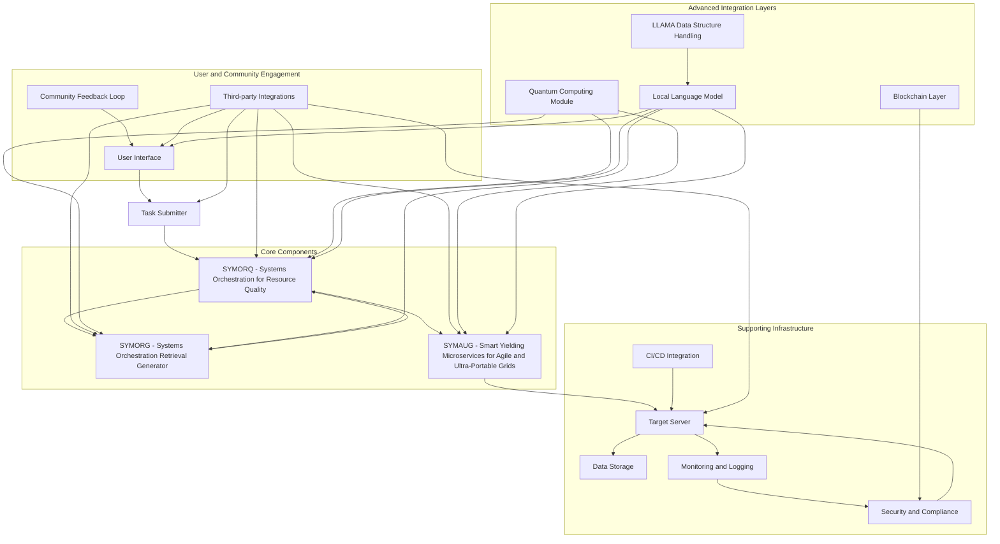
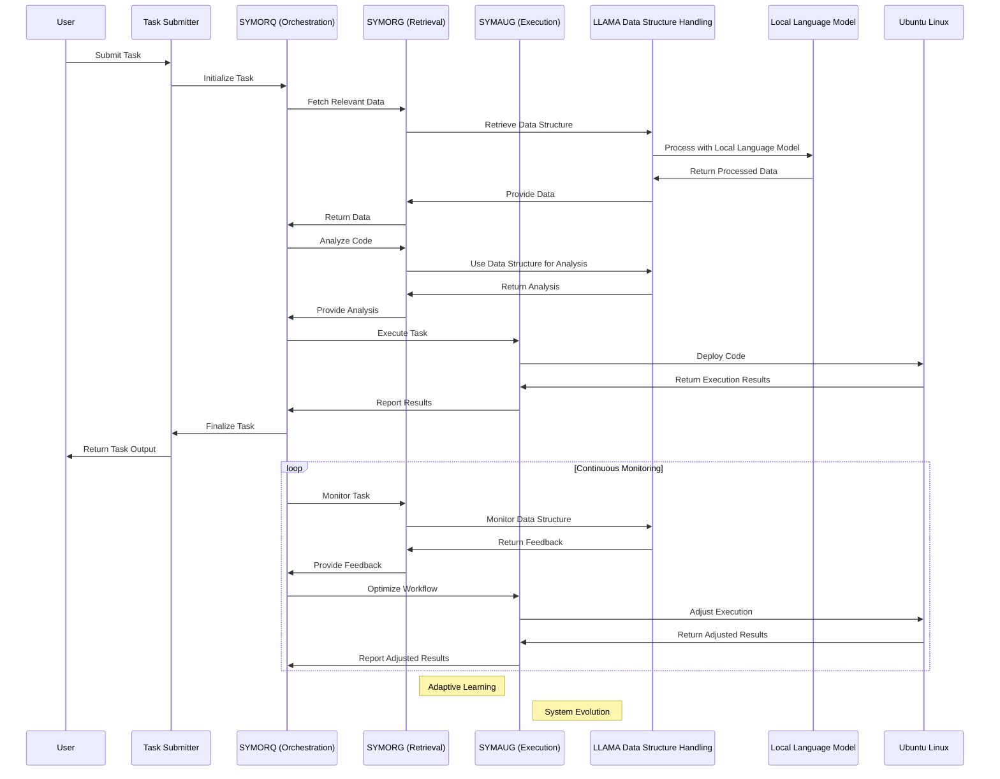

# GRYPHGEN

GRYPHGEN pronounced 'Griffin' stands for Grid Resource Prioritization in Heterogeneous Environments. Gryphgen is a framework that leverages large language models (LLMs) to automate software production at scale. The framework consists of three main components: SYMORQ, SYMORG, and SYMAUG.

1. SYMORQ (Systems Orchestration for Resource Quality): This component is an LLM-based orchestration service that uses the ZeroMQ message passing API to manage and coordinate resources in the grid. It ensures that resources are utilized efficiently and effectively to meet the demands of the software production process.

2. SYMORG (Systems Orchestration Retrieval Generator): This component is an LLM-based automated RAG (Retrieval Augmented Generation) constructor. RAG is a technique used to enhance the accuracy and reliability of generative AI models by incorporating facts fetched from external sources. SYMORG automates the retrieval and incorporation of relevant information into the software production process.

3. SYMAUG (Smart Yielding Microservices for Agile and Ultra-Portable Grids): This component is a dockerized or virtual machine implementation of the CCDE-SIOS ensemble. It provides a lightweight and portable solution for Gryphgen deployment across various platforms and hardware architectures. This ensures that Gryphgen can be easily integrated into different environments and used to produce software at scale.

The overall goal of GRYPHGEN is to create a self-deploying LLM cooperative programming environment capable of producing any type of software at any level of complexity and scale. To illustrate the workflow of Gryphgen, a series of interconnected sequence diagrams are used to describe the stages of operation, including:

- Task submission and initialization: The code generator (A) generates code output, which is analyzed by the code analyzer (B) for errors and alignment with project parameters. The task monitor (C) ensures that the output functions properly and aligns with assigned tasks.

- Code generation and analysis: The code generator writes the code and executes tasks on the target server (Target_Server), while the code analyzer analyzes the code for errors and suggestions.

- Task monitoring and workflow optimization: The task monitor ensures alignment with assigned tasks and reverts to previous checkpoints if necessary. The workflow optimizer (D) optimizes the process by restarting processes as needed and preventing roadblocks for components A, B, and C.

- Continuous deployment and monitoring: The target server executes tasks and writes code, while the code analyzer and task monitor continuously monitor the process for errors and proper function.

- Adaptive learning and system evolution: The system learns from previous iterations and evolves to improve efficiency and effectiveness over time.

By breaking down the workflow into these distinct stages, the sequence diagrams provide a comprehensive understanding of how Gryphgen functions and how it can be used to automate software production at scale.

### Integrated System Overview and Sequence Diagram

### AI Questions

1. **What specific software tools are recommended to generate the code output from A?**
   - **Answer:** Tools such as Visual Studio Code, JetBrains IntelliJ IDEA, or Eclipse can be used for code generation. For automated code generation, tools like JHipster, Swagger Codegen, or the Yo generator can be employed. Additionally, LLAMA and local language models integrated with GRYPHGEN facilitate automated and optimized code generation.

2. **Can you explain how B analyzes this code for potential errors and why such analysis is critical?**
   - **Answer:** B uses static code analysis tools like SonarQube, ESLint, or PyLint to detect syntax errors, code smells, and potential bugs. This analysis is critical to ensure code quality, maintainability, and to prevent runtime errors. Integrating LLAMA allows for more sophisticated analysis by handling different data structures efficiently.

3. **What kind of alignment does C check between the generated code and project parameters, and what methodologies might be employed here?**
   - **Answer:** C checks alignment with project parameters such as coding standards, design patterns, and project-specific guidelines. Methodologies include unit testing, integration testing, and compliance checks using tools like Jenkins and CI/CD pipelines.

4. **How do monitoring processes implemented by C ensure that tasks are executed correctly on target servers?**
   - **Answer:** C uses real-time monitoring tools like Nagios, Prometheus, or Datadog to track task execution, resource utilization, and system health. These tools alert on anomalies and provide logs for debugging.

5. **Can you describe how D prevents roadblocks from affecting A, B, or C during their processes?**
   - **Answer:** D identifies bottlenecks and system inefficiencies using workflow analysis tools and metrics. It dynamically adjusts resource allocation, load balancing, and prioritizes tasks to prevent delays and roadblocks.

6. **What kind of optimization techniques does D use to improve the overall workflow for code generation and execution?**
   - **Answer:** D employs techniques such as parallel processing, task scheduling, caching strategies, and pipeline optimization. Tools like Apache Airflow or Kubernetes can be used to manage and optimize workflows.

7. **How does B interact with Target_Server (Ubuntu Linux) in order to analyze generated codes?**
   - **Answer:** B uses remote access protocols like SSH to connect to the Target_Server. It runs static and dynamic analysis tools on the server to evaluate code performance and detect issues.

8. **Can you explain how A writes its output directly onto a target server, ensuring seamless integration within GRYPHGEN's framework?**
   - **Answer:** A uses deployment scripts (e.g., Bash scripts, Ansible playbooks) or CI/CD tools like Jenkins to automate the transfer and execution of code on the Target_Server. This ensures a consistent and seamless deployment process.

9. **What are some of the tools that D might use for workflow optimization on Ubuntu Linux?**
   - **Answer:** Tools like Apache Airflow for workflow orchestration, Kubernetes for container management, and Prometheus for monitoring can be used by D to optimize workflows on Ubuntu Linux.

10. **How does B ensure that any suggestions provided upon analyzing code align with project parameters and requirements set by C?**
    - **Answer:** B uses project-specific configuration files and rule sets in static analysis tools to ensure that the suggestions align with project parameters and requirements. Continuous integration checks validate these suggestions against the project's standards.

11. **What methods do you think A employs to write its output directly onto a target server, ensuring seamless integration within GRYPHGEN's framework?**
    - **Answer:** A can use SCP (Secure Copy Protocol) for file transfer, Git for version control, and Docker for containerization to deploy code directly onto the Target_Server, ensuring integration and consistency.

12. **Can you describe how D reverts the system back to previous checkpoints when necessary?**
    - **Answer:** D uses version control systems (e.g., Git) and backup tools to revert to previous code versions. Snapshot and rollback features in Docker or Kubernetes can also be used to revert the system state.

13. **How does B communicate with Target_Server (Ubuntu Linux) if errors or suggestions are detected during code analysis?**
    - **Answer:** B logs errors and suggestions in a central logging system (e.g., ELK Stack) and notifies stakeholders through alerting systems (e.g., email, Slack). It can also trigger automated scripts to address certain issues.

14. **What role do error logs play in ensuring that A, B, and C functions correctly within GRYPHGEN's framework?**
    - **Answer:** Error logs provide a detailed account of system failures, performance issues, and code defects. They are essential for diagnosing problems, debugging, and ensuring that A, B, and C can function correctly by identifying and resolving issues promptly.

15. **Can you discuss how the workflow optimization module of D ensures efficient use of system resources on target servers running Ubuntu Linux?**
    - **Answer:** D ensures efficient resource utilization by monitoring resource usage, adjusting resource allocation dynamically, optimizing task scheduling, and using load balancing techniques to distribute workloads evenly across available resources.

16. **How does the communication flow between different modules like Code Generator (A), Code Analyzer (B) in relation to Task Monitor (C)?**
    - **Answer:** A generates the code and passes it to B for analysis. B checks for errors and alignment

 with project parameters, then communicates with C to monitor task execution. C ensures that the code runs correctly and aligns with project requirements, providing feedback to A and B.

17. **What kind of security protocols ensure that A, B, and C communicate securely within GRYPHGEN's framework?**
    - **Answer:** Security protocols like SSH for secure communication, TLS/SSL for data encryption, and OAuth for authentication can be implemented to ensure secure communication between A, B, and C.

18. **Can you explain how D ensures minimal disruptions while restarting processes on target servers running Ubuntu Linux?**
    - **Answer:** D uses rolling updates, canary deployments, and blue-green deployment strategies to restart processes with minimal disruption. These techniques allow for gradual updates and quick rollbacks if issues arise.

19. **How does D assist with troubleshooting by identifying bottlenecks in the workflow process?**
    - **Answer:** D uses performance monitoring tools and analytics to identify bottlenecks, analyze workflow metrics, and pinpoint inefficiencies. It can then suggest or implement optimizations to improve workflow performance.

20. **What kind of real-time monitoring tools could be used to ensure that C accurately tracks task execution and alignment?**
    - **Answer:** Tools like Prometheus, Grafana, Nagios, and Datadog can be used for real-time monitoring, providing dashboards, alerts, and detailed metrics to ensure that C accurately tracks task execution and alignment with project parameters.

