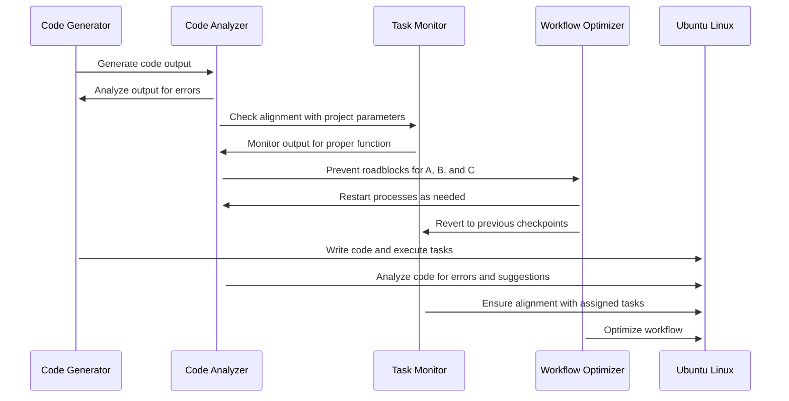
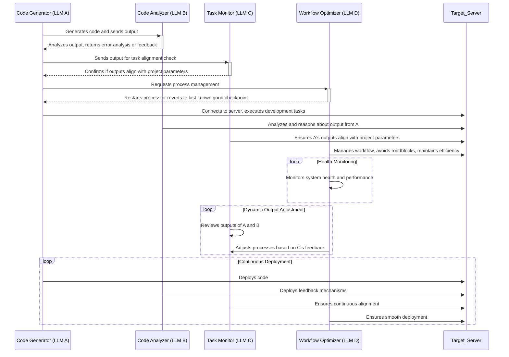
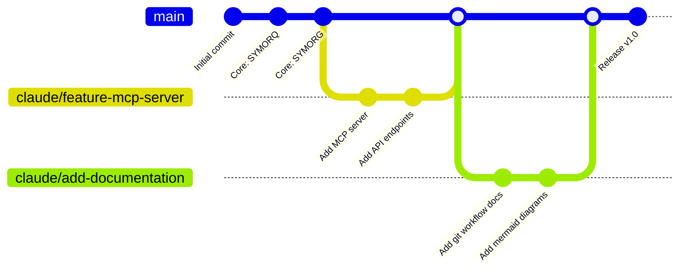
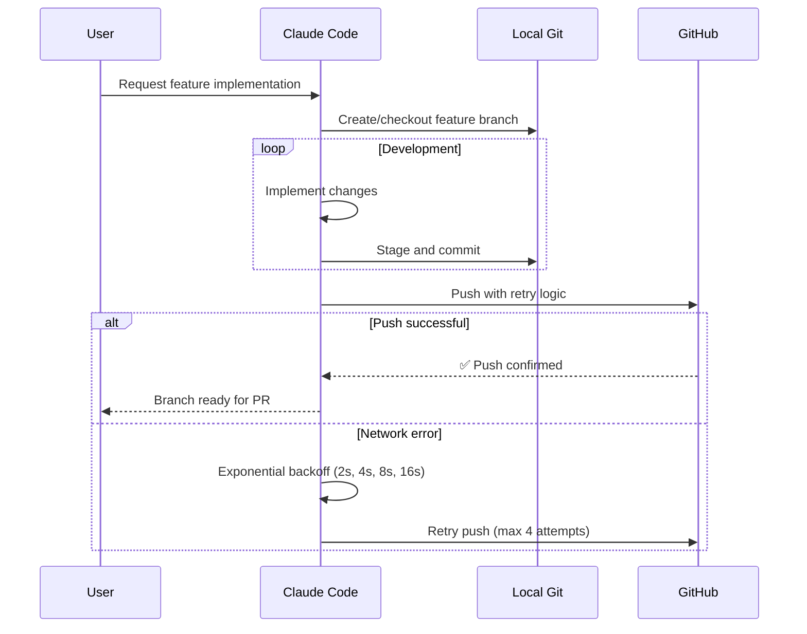
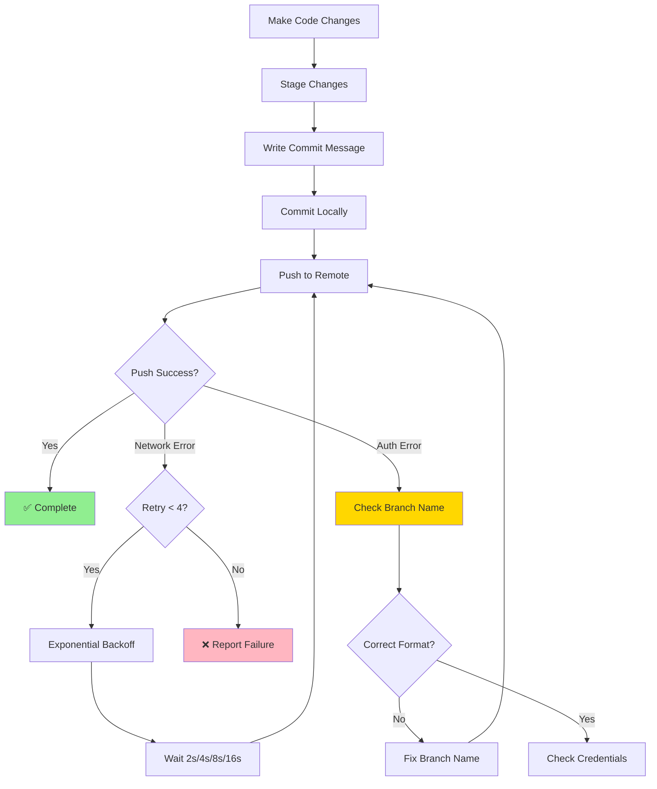
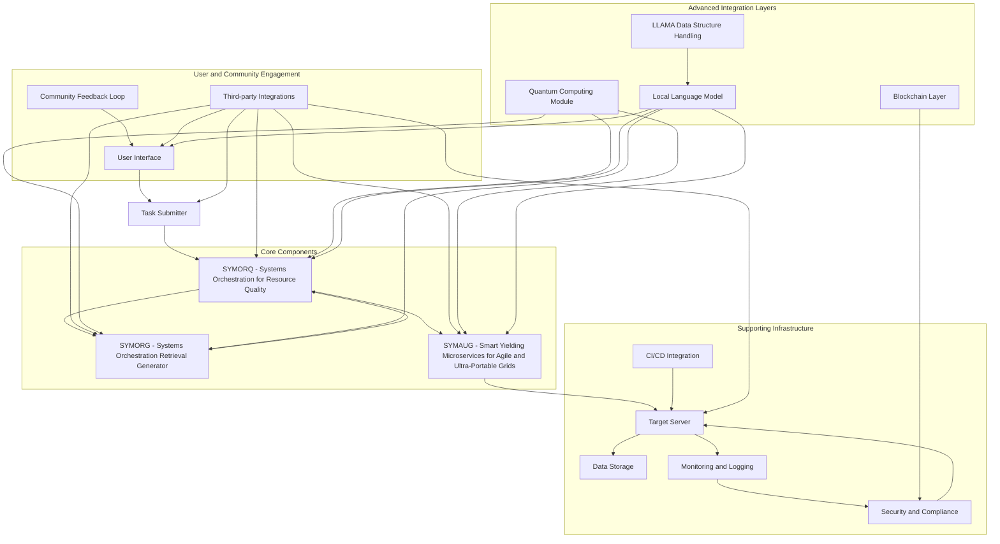

# GRYPHGEN

**Grid Resource Prioritization in Heterogeneous Environments**

[](https://www.gnu.org/licenses/gpl-3.0)
[](https://github.com/danindiana/GRYPHGEN)
[](https://github.com/danindiana/GRYPHGEN/fork)
[](https://github.com/danindiana/GRYPHGEN/issues)
[](https://github.com/danindiana/GRYPHGEN/pulls)
[](https://github.com/danindiana/GRYPHGEN/commits)
[](https://github.com/danindiana/GRYPHGEN)
[](https://github.com/danindiana/GRYPHGEN/graphs/contributors)

GRYPHGEN (pronounced 'Griffin') is a framework that leverages large language models (LLMs) to automate software production at scale. The framework consists of three main components: SYMORQ, SYMORG, and SYMAUG.

## Table of Contents

1. [Overview](#overview)
2. [Core Components](#core-components)
3. [System Architecture](#system-architecture)
4. [Git Workflow and Development Process](#git-workflow-and-development-process)
5. [Implementation Details](#implementation-details)
6. [Documentation](#documentation)
7. [Contributing](#contributing)
8. [License](#license)

---

## Overview

## Core Components

### 1. SYMORQ (Systems Orchestration for Resource Quality)

An LLM-based orchestration service that uses the ZeroMQ message passing API to manage and coordinate resources in the grid. It ensures that resources are utilized efficiently and effectively to meet the demands of the software production process.

### 2. SYMORG (Systems Orchestration Retrieval Generator)

An LLM-based automated RAG (Retrieval Augmented Generation) constructor. RAG is a technique used to enhance the accuracy and reliability of generative AI models by incorporating facts fetched from external sources. SYMORG automates the retrieval and incorporation of relevant information into the software production process.

### 3. SYMAUG (Smart Yielding Microservices for Agile and Ultra-Portable Grids)

A dockerized or virtual machine implementation of the CCDE-SIOS ensemble. It provides a lightweight and portable solution for GRYPHGEN deployment across various platforms and hardware architectures. This ensures that GRYPHGEN can be easily integrated into different environments and used to produce software at scale.

---

## System Architecture

**Motivation:** GRYPHGEN creates a self-deploying LLM cooperative programming environment capable of producing any type of software at any level of complexity and scale. To illustrate the workflow of GRYPHGEN, a series of interconnected sequence diagrams are used to describe the stages of operation.

### Basic Workflow Sequence

GRYPHGEN is designed to download/install/run local language models as code generators, analyzers, task monitors, and workflow optimizers. Local models are run using llama.cpp (https://github.com/ggerganov/llama.cpp) Inference of Meta's LLaMA model (and others) in pure C/C++. GRYPHGEN uses llama.cpp web server which is a lightweight OpenAI API (https://github.com/openai/openai-openapi) compatible HTTP server that can be used to serve local models and easily connect them to existing clients. GRYPHGEN integrates with Jan.ai and lm-studio running as local servers. 

Implementation Details:
llama.cpp Web Server: A fast, lightweight, pure C/C++ HTTP server used for LLM inference.
Features:
LLM inference of F16 and quantum models on GPU and CPU
OpenAI API compatible chat completions and embeddings routes
Parallel decoding with multi-user support
Continuous batching
Multimodal (work in progress)
Monitoring endpoints
Schema-constrained JSON response format
By leveraging the GRYPHGEN framework, developers can create a self-deploying LLM cooperative programming environment capable of producing any type of software at any level of complexity and scale.


- Task submission and initialization: The code generator (A) generates code output, which is analyzed by the code analyzer (B) for errors and alignment with project parameters. The task monitor (C) ensures that the output functions properly and aligns with assigned tasks.

- Code generation and analysis: The code generator writes the code and executes tasks on the target server (Target_Server), while the code analyzer analyzes the code for errors and suggestions.

- Task monitoring and workflow optimization: The task monitor ensures alignment with assigned tasks and reverts to previous checkpoints if necessary. The workflow optimizer (D) optimizes the process by restarting processes as needed and preventing roadblocks for components A, B, and C.

- Continuous deployment and monitoring: The target server executes tasks and writes code, while the code analyzer and task monitor continuously monitor the process for errors and proper function.

- Adaptive learning and system evolution: The system learns from previous iterations and evolves to improve efficiency and effectiveness over time.

- By breaking down the workflow into these distinct stages, the sequence diagrams provide a comprehensive understanding of how Gryphgen functions and how it can be used to automate software production at scale.




---

## Git Workflow and Development Process

GRYPHGEN follows a structured git workflow using feature branches and Claude Code for development automation. All development happens on dedicated branches prefixed with `claude/` and includes session IDs for traceability.

### Quick Start for Contributors

1. **Clone the repository**
   ```bash
   git clone <repository-url>
   cd GRYPHGEN
   ```

2. **Create a feature branch**
   ```bash
   git checkout -b claude/your-feature-name-sessionID
   ```

3. **Make changes and commit**
   ```bash
   git add .
   git commit -m "Descriptive commit message"
   ```

4. **Push to remote (with retry logic)**
   ```bash
   git push -u origin claude/your-feature-name-sessionID
   ```

### Branch Strategy Diagram



### Development Workflow with Claude Code



### Branch Naming Convention

All branches must follow this format for successful pushes:

```
claude/{descriptive-name}-{sessionID}
```

**Examples:**
- `claude/add-git-mermaid-diagrams-01A7FntuzYu1pDpWAiqwbqSv`
- `claude/implement-rag-system-AbC123XyZ456`
- `claude/fix-zeromq-bug-DeF789UvW012`

### Commit and Push Workflow



For comprehensive git workflow documentation, see **[docs/GIT_WORKFLOW.md](docs/GIT_WORKFLOW.md)**.

For repository structure improvements and organization, see **[docs/STRUCTURE_IMPROVEMENTS.md](docs/STRUCTURE_IMPROVEMENTS.md)**.

---

### Integrated System RoadMap Overview and Sequence Diagram



---

## Documentation

Comprehensive documentation is available in the `docs/` directory:

### Core Documentation
- **[Git Workflow](docs/GIT_WORKFLOW.md)** - Complete git workflow, branching strategy, and development process
- **[Structure Improvements](docs/STRUCTURE_IMPROVEMENTS.md)** - Repository organization and improvement proposals

### Component Documentation
- **[MCP Server](MCP_SERVER/readme.md)** - Model Context Protocol server documentation
- **[Mermaid Diagrams](mermaid/readme.md)** - System architecture diagrams and visualizations
- **[System Overview](System_overview.md)** - High-level system architecture overview

### Additional Resources
- **[Perl Pipes](perl_pipes/readme.md)** - Inter-process communication utilities
- **[gstruct](gstruct/readme.md)** - Data structure handling documentation
- **[Swarm OpenAI](swarm_openai/readme.md)** - OpenAI integration documentation

---

## Contributing

We welcome contributions to GRYPHGEN! To contribute:

1. **Fork the repository** and clone it locally
2. **Create a feature branch** following the naming convention:
   ```bash
   git checkout -b claude/your-feature-name-sessionID
   ```
3. **Make your changes** with clear, descriptive commits
4. **Test thoroughly** to ensure your changes work as expected
5. **Push to your fork** with retry logic:
   ```bash
   git push -u origin claude/your-feature-name-sessionID
   ```
6. **Create a Pull Request** with a clear description of your changes

### Development Guidelines

- Follow the git workflow outlined in [docs/GIT_WORKFLOW.md](docs/GIT_WORKFLOW.md)
- Write clear, descriptive commit messages
- Include tests for new functionality
- Update documentation as needed
- Ensure code follows project conventions

### Code of Conduct

Please be respectful and constructive in all interactions. We aim to maintain a welcoming and inclusive community.

---

## License

This project is licensed under the GNU General Public License v3.0. See the [LICENSE](LICENSE) file for details.

---

## Quick Links

- **Repository Structure**: [docs/STRUCTURE_IMPROVEMENTS.md](docs/STRUCTURE_IMPROVEMENTS.md)
- **Git Workflow**: [docs/GIT_WORKFLOW.md](docs/GIT_WORKFLOW.md)
- **System Overview**: [System_overview.md](System_overview.md)
- **Issues**: Report bugs and request features via GitHub Issues
- **Pull Requests**: Submit improvements via Pull Requests

---

**GRYPHGEN** - Automating software production at scale with LLM-powered orchestration.
