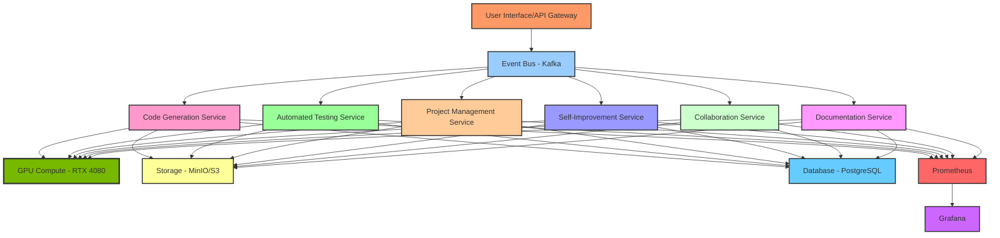

# GRYPHGEN Agentic AI Development Assistant

[](https://www.python.org/downloads/)
[](https://developer.nvidia.com/cuda-toolkit)
[](https://www.docker.com/)
[](LICENSE)
[](https://github.com/psf/black)
[](https://www.nvidia.com/)

> A comprehensive AI-powered development assistant that autonomously generates code, tests, documentation, and manages projects using state-of-the-art machine learning models.

## 🚀 Features

### Core Capabilities

- **🤖 AI Code Generation**: Transformer-based code generation using models like GPT-4, Claude, or Codex
- **✅ Automated Testing**: ML-powered test case generation and execution with PyTest
- **📊 Project Management**: Reinforcement Learning-based task optimization and scheduling
- **🔄 Self-Improvement**: Meta-learning algorithms for continuous system enhancement
- **👥 Collaboration Matching**: Graph Neural Networks for optimal developer-task matching
- **📚 Documentation Generation**: NLP-powered automated documentation from code

### Infrastructure

- **Microservices Architecture**: Scalable, containerized services
- **Event-Driven Communication**: Apache Kafka for reliable message passing
- **GPU Acceleration**: Optimized for NVIDIA RTX 4080 (16GB VRAM)
- **Container Orchestration**: Docker Compose and Kubernetes support
- **Monitoring**: Prometheus + Grafana integration
- **Service Discovery**: Consul integration for dynamic service location

## 📋 Table of Contents

- [Architecture](#architecture)
- [Prerequisites](#prerequisites)
- [Quick Start](#quick-start)
- [Installation](#installation)
- [Usage](#usage)
- [Configuration](#configuration)
- [Development](#development)
- [API Documentation](#api-documentation)
- [Contributing](#contributing)
- [License](#license)

## 🏗️ Architecture

### System Overview



### Service Architecture

Each microservice is built with:

- **Neural Network Layer**: Transformer models, RL agents, GNNs, NLP models
- **API Layer**: FastAPI-based REST endpoints
- **Data Layer**: PostgreSQL for metadata, MinIO/S3 for artifacts
- **Event Layer**: Kafka producers/consumers
- **GPU Layer**: CUDA-optimized inference for RTX 4080


## 📦 Prerequisites

### Hardware Requirements
- **GPU**: NVIDIA RTX 4080 (16GB VRAM) or better
- **CPU**: 8+ cores recommended
- **RAM**: 32GB+ recommended
- **Storage**: 100GB+ SSD/NVMe

### Software Requirements
- **OS**: Linux (Ubuntu 22.04+), macOS, or Windows with WSL2
- **Python**: 3.11+
- **Docker**: 24.0+
- **Docker Compose**: 2.20+
- **CUDA**: 12.x (for GPU acceleration)
- **NVIDIA Drivers**: 535+ (for RTX 4080)

## 🚀 Quick Start

### 1. Clone and Navigate

```bash
git clone https://github.com/danindiana/GRYPHGEN.git
cd GRYPHGEN/agentic
```

### 2. Set Up Environment

```bash
# Create virtual environment
python3.11 -m venv venv
source venv/bin/activate  # On Windows: venv\Scripts\activate

# Install dependencies
pip install -r requirements.txt
```

### 3. Configure Environment

```bash
# Copy example environment file
cp .env.example .env

# Edit configuration (add API keys, database URLs, etc.)
nano .env
```

### 4. Start Services with Docker

```bash
# Start all services
docker-compose up -d

# Check service health
docker-compose ps

# View logs
docker-compose logs -f
```

### 5. Access Services

- **API Gateway**: http://localhost:8000
- **Grafana Dashboard**: http://localhost:3000 (admin/admin)
- **Prometheus**: http://localhost:9090
- **Kafka UI**: http://localhost:8080

## 📥 Installation

### Development Setup

```bash
# Install development dependencies
make install-dev

# Run tests
make test

# Format code
make format

# Lint code
make lint

# Build Docker images
make build

# Start development environment
make dev
```

### Production Setup

```bash
# Build optimized Docker images
make build-prod

# Deploy with Kubernetes
kubectl apply -f k8s/

# Or deploy with Docker Compose
docker-compose -f docker-compose.prod.yml up -d
```

## 💻 Usage

### Code Generation Example

```python
from agentic_client import AgenticClient

# Initialize client
client = AgenticClient(api_url="http://localhost:8000")

# Generate code
result = client.generate_code(
    prompt="Create a Python function to calculate Fibonacci numbers",
    language="python",
    style="functional"
)

print(result.code)
print(result.tests)
print(result.documentation)
```

### Project Management Example

```python
# Optimize task assignments
assignments = client.optimize_tasks(
    project_id="proj_123",
    team_members=["alice", "bob", "charlie"],
    tasks=tasks_list
)

for task, assignee in assignments.items():
    print(f"Task {task} → {assignee}")
```

### CLI Usage

```bash
# Generate code
agentic generate --prompt "Create a REST API" --language python

# Run tests
agentic test --file src/mycode.py

# Generate documentation
agentic docs --project ./my_project

# Manage project
agentic project optimize --team-size 5
```

## ⚙️ Configuration

### GPU Optimization for RTX 4080

Edit `configs/gpu_config.yaml`:

```yaml
gpu:
  device: "cuda:0"
  memory_limit: "14GB"  # Leave 2GB for system
  compute_capability: 8.9
  mixed_precision: true
  tensor_cores: true

optimization:
  batch_size: 32
  num_workers: 8
  pin_memory: true
  cudnn_benchmark: true
```

### Service Configuration

Each service can be configured via environment variables or config files:

```yaml
# configs/code_generation.yaml
model:
  name: "gpt-4-turbo"
  provider: "openai"
  temperature: 0.7
  max_tokens: 4096

inference:
  gpu_enabled: true
  batch_size: 16
  timeout: 30
```

## 🔧 Development

### Project Structure

```
agentic/
├── src/
│   ├── services/
│   │   ├── code_generation/     # Code generation microservice
│   │   ├── automated_testing/   # Testing service
│   │   ├── project_management/  # PM service
│   │   ├── documentation/       # Docs service
│   │   ├── collaboration/       # Collaboration service
│   │   └── self_improvement/    # Meta-learning service
│   ├── common/                  # Shared utilities
│   └── api/                     # API gateway
├── tests/                       # Test suites
├── docs/                        # Documentation
├── examples/                    # Usage examples
├── configs/                     # Configuration files
├── docker-compose.yml           # Docker orchestration
├── Makefile                     # Build automation
├── requirements.txt             # Python dependencies
└── pyproject.toml              # Project metadata
```

### Adding a New Service

1. Create service directory in `src/services/`
2. Implement service logic with FastAPI
3. Add Dockerfile for the service
4. Update `docker-compose.yml`
5. Add tests in `tests/`
6. Update documentation

### Running Tests

```bash
# Run all tests
pytest tests/

# Run specific service tests
pytest tests/test_code_generation.py

# Run with coverage
pytest --cov=src tests/

# Run GPU tests (requires GPU)
pytest tests/ -m gpu
```

## 📚 API Documentation

### REST API

Once services are running, access interactive API documentation:

- **Swagger UI**: http://localhost:8000/docs
- **ReDoc**: http://localhost:8000/redoc

### API Endpoints

#### Code Generation

```http
POST /api/v1/code/generate
Content-Type: application/json

{
  "prompt": "Create a web scraper",
  "language": "python",
  "framework": "scrapy"
}
```

#### Automated Testing

```http
POST /api/v1/test/generate
Content-Type: application/json

{
  "code": "def add(a, b): return a + b",
  "test_framework": "pytest"
}
```

## 🤝 Contributing

We welcome contributions! Please see [CONTRIBUTING.md](CONTRIBUTING.md) for details.

### Development Workflow

1. Fork the repository
2. Create a feature branch (`git checkout -b feature/amazing-feature`)
3. Make your changes
4. Run tests (`make test`)
5. Format code (`make format`)
6. Commit changes (`git commit -m 'Add amazing feature'`)
7. Push to branch (`git push origin feature/amazing-feature`)
8. Open a Pull Request

## 📊 Performance

### Benchmarks (RTX 4080 16GB)

| Service | Throughput | Latency (p95) | GPU Memory |
|---------|-----------|---------------|------------|
| Code Generation | 50 req/s | 800ms | 8GB |
| Testing | 200 req/s | 200ms | 2GB |
| Documentation | 100 req/s | 400ms | 4GB |
| Project Mgmt | 500 req/s | 100ms | 1GB |

## 🔐 Security

- API authentication via JWT tokens
- TLS/SSL for all external communications
- Secrets management via environment variables
- Regular security audits
- Container security scanning

## 📄 License

This project is licensed under the MIT License - see the [LICENSE](LICENSE) file for details.

## 🙏 Acknowledgments

- OpenAI for GPT models
- Anthropic for Claude API
- HuggingFace for model hosting
- NVIDIA for CUDA toolkit
- The open-source community

## 📞 Support

- **Documentation**: [docs/](docs/)
- **Issues**: [GitHub Issues](https://github.com/danindiana/GRYPHGEN/issues)
- **Discussions**: [GitHub Discussions](https://github.com/danindiana/GRYPHGEN/discussions)

## 🗺️ Roadmap

- [x] Core microservices architecture
- [x] Docker containerization
- [x] GPU optimization for RTX 4080
- [ ] Kubernetes deployment manifests
- [ ] CI/CD pipeline automation
- [ ] Multi-GPU support
- [ ] Cloud provider integrations (AWS, GCP, Azure)
- [ ] WebUI dashboard
- [ ] Real-time collaboration features
- [ ] Advanced security features

---

**Built with ❤️ for the AI development community**
