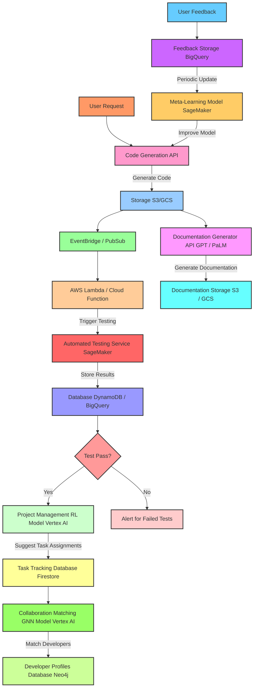
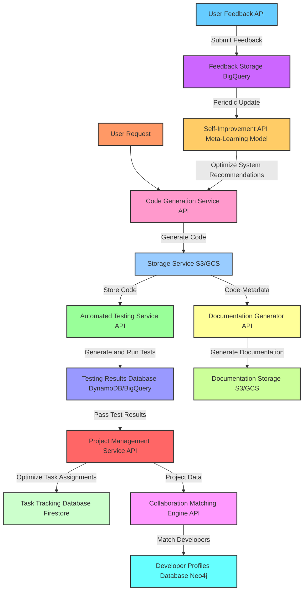
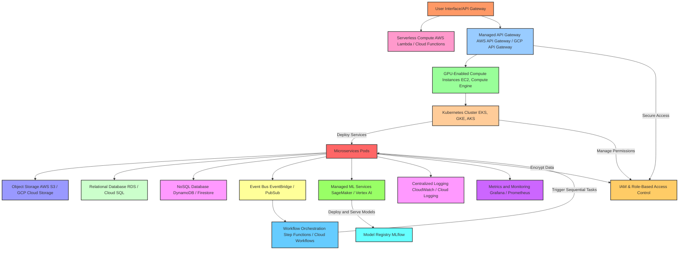

Building this system using cloud resources and language models-as-a-service (LMaaS) will enable rapid development, scalability, and cost-efficient usage of advanced AI and ML capabilities without the need for extensive local infrastructure. Here’s how we can piece together the system by leveraging cloud APIs and services.

---

### **1. Cloud Infrastructure Setup**

1. **Compute**: Use a combination of serverless and managed compute resources for flexible scaling and cost management.
   - **Serverless Compute**: AWS Lambda, Azure Functions, or Google Cloud Functions for event-driven tasks.
   - **VMs with GPUs**: AWS EC2 instances with GPU support (e.g., P3 or P4 instances), Google Compute Engine, or Azure’s NV-series for compute-heavy tasks (like real-time code generation).
2. **Orchestration**: For managing multiple services and APIs.
   - **Kubernetes Engine**: GKE (Google Kubernetes Engine), EKS (Elastic Kubernetes Service on AWS), or AKS (Azure Kubernetes Service) for microservices orchestration.
   - **API Gateway**: Use a managed API gateway (AWS API Gateway, Azure API Management, Google API Gateway) to direct requests, handle security, and manage API limits.

---

### **2. Core Services Using API Calls**

Each core component can rely on a cloud-based AI or ML service, allowing you to leverage pretrained models and managed environments. Here’s a breakdown:

#### **Code Generation Service**

- **LMaaS**: OpenAI’s Codex, Cohere, or Anthropic’s Claude for language-to-code generation.
- **API Structure**: 
  - Make API calls to the LMaaS endpoint to generate code snippets based on provided user requirements.
  - Example workflow:
    1. Send a user prompt and project requirements to the Codex API.
    2. Receive code snippets and structure from Codex, which is then processed and stored.
  - **Caching**: Cache frequently requested code snippets or use a content-based hash to store similar requests, reducing API call costs.

#### **Automated Testing Service**

- **Cloud AI Services**: Use a managed ML service to analyze code and generate automated tests.
  - Google AutoML Tables or AWS SageMaker could host a simple ML model trained to generate and validate test cases based on code.
- **API Structure**: 
  - Pass generated code to the testing service.
  - Use serverless functions to execute tests and store the results.
  - Store generated test cases and results in a managed database (e.g., Google BigQuery or AWS DynamoDB).

#### **Project Management Service**

- **Reinforcement Learning (RL) as a Service**: Deploy an RL model with Google’s Vertex AI or AWS SageMaker RL for task scheduling and prioritization.
  - **API Structure**: 
    - Define actions (e.g., task assignments) and rewards (e.g., project efficiency).
    - Set up training to optimize task assignments based on inputs such as team profiles, deadlines, and historical performance data.
  - Use AWS Step Functions or Google Cloud Workflows to orchestrate the reinforcement learning workflows.

#### **Self-Improvement Feedback Loop**

- **Meta-Learning Model Hosting**: Use SageMaker or Google Vertex AI for meta-learning capabilities.
  - **API Structure**:
    - Feed user feedback and performance metrics through an endpoint that retrains the meta-learning model, adjusting system recommendations and improving code generation over time.
    - Store feedback in a managed database and use it as a dataset to fine-tune models regularly.

#### **Collaboration Matching Engine**

- **Graph Database API**: Neo4j Aura on GCP or AWS for relationship-driven queries.
  - **Graph Neural Network (GNN) API**: Use hosted PyTorch or TensorFlow models for GNN-based matching on user profiles.
  - **API Structure**: 
    - Query developer profiles and project data from the Neo4j API to identify potential matches.
    - Send results to the GNN model to refine matches, filtering candidates by skill, interest, and experience.

#### **Documentation Generator**

- **NLP Model via LMaaS**: Use OpenAI’s GPT or Google’s PaLM API for natural language processing to generate and update documentation.
  - **API Structure**: 
    - Provide comments, function names, and summaries of the codebase to the LMaaS API to generate documentation.
    - Store the resulting documentation in cloud storage (e.g., AWS S3 or Google Cloud Storage) and tag with metadata for versioning.

---

### **3. Inter-Service Communication and Event-Driven Workflow**

To stitch together these services, use an **event-driven architecture** with cloud-based messaging and orchestration tools.

- **Event Bus**: AWS EventBridge, Google Cloud Pub/Sub, or Azure Event Grid to handle asynchronous events and trigger workflows.
- **Workflow Orchestration**: AWS Step Functions, Google Cloud Workflows, or Azure Logic Apps to sequence tasks and coordinate inter-service communication.
- **Example Workflow**:
  1. A user request to generate code triggers an API call to the Code Generation service.
  2. Once the code is generated, an event is emitted to run tests through the Automated Testing service.
  3. Successful test completion triggers Project Management to schedule tasks.
  4. After updates, Self-Improvement consumes feedback and refines the process.

---

### **4. Data Storage and Logging**

Centralize logs, metrics, and data storage to streamline monitoring and maintenance.

- **Centralized Logging and Monitoring**:
  - **Cloud Logging**: Use AWS CloudWatch, Google Cloud Logging, or Azure Monitor for logs.
  - **Distributed Tracing**: OpenTelemetry for tracing requests across services.
  - **Dashboards**: Set up dashboards in Grafana or integrate with cloud-native monitoring for visualization of metrics.

- **Data Storage**:
  - **Relational Data**: Managed databases like Amazon RDS, Google Cloud SQL, or Azure SQL Database for structured data.
  - **NoSQL**: DynamoDB, Firestore, or Cosmos DB for unstructured or semi-structured data.
  - **File Storage**: Cloud storage services like AWS S3, Google Cloud Storage, or Azure Blob for larger datasets and documentation files.

---

### **5. Security and Access Control**

Using cloud infrastructure simplifies security management through managed identity services and secure API gateways.

- **Identity and Access Management (IAM)**: Use IAM roles and policies to control access to services (AWS IAM, Google IAM, Azure IAM).
- **API Key Management**: Use secret managers like AWS Secrets Manager, Google Secret Manager, or Azure Key Vault to secure API keys and access tokens.
- **Data Encryption**: Enable encryption at rest and in transit for all cloud services, particularly sensitive data like user profiles and feedback.

---

### **6. Continuous Integration and Deployment (CI/CD)**

Set up CI/CD pipelines to automate testing, deployment, and updating of cloud resources.

- **CI/CD Tools**: Use Jenkins, GitHub Actions, GitLab CI/CD, or cloud-native options (AWS CodePipeline, Google Cloud Build, Azure DevOps).
- **Testing Automation**: Integrate unit tests, integration tests, and API tests to verify service interactions.
- **Canary Releases**: Deploy updates incrementally by rolling out changes to a subset of users before a full deployment.

---

### **Example Workflow of Stitching APIs Together**

Here's an example of how API calls and cloud resources would interact:

1. **Request Processing**: 
   - A user request for a new feature triggers the Code Generation API (Codex via OpenAI API).
   - The generated code is stored in S3, and an event is sent to EventBridge.

2. **Automated Testing**:
   - The event triggers an AWS Lambda function that sends the code to the Testing Service, which uses SageMaker to generate and run tests.
   - Results are stored in DynamoDB, with alerts for any test failures.

3. **Project Management**:
   - Once testing passes, an event triggers the Project Management RL model on Vertex AI.
   - The model suggests task assignments, which are stored in Firestore for tracking.

4. **Self-Improvement and Feedback**:
   - User feedback is stored in Google BigQuery.
   - A scheduled job uses this data to fine-tune models in SageMaker and improve recommendations.

5. **Documentation**:
   - Documentation Generator sends code metadata to GPT via OpenAI API to create or update documentation, stored in Google Cloud Storage.

6. **Collaboration**:
   - Project data is sent to the GNN model hosted in Vertex AI, which suggests contributors, stored in Neo4j for future references.

---

Using cloud services in this way enables an agile, scalable, and adaptable system that can handle complex software-building tasks by leveraging state-of-the-art AI capabilities available through cloud-based APIs. Let me know if you want more details on any specific integration!

Implementing a software-building system capable of dynamically generating and managing AI/software components requires a well-structured, modular, and iterative approach. Here’s a detailed plan to implement this scaffolding, including best practices for each layer:

### 1. **Core Architecture: Microservices-Based Design**

#### Microservices
- **Code Generator Service**: Uses transformer models like Codex.
- **Automated Testing Service**: Uses PyTest with ML-based test case generation.
- **Project Management Service**: Uses reinforcement learning for task optimization.
- **Self-Improvement Feedback Loop**: Uses meta-learning to adapt based on feedback.
- **Collaboration Matching Engine**: Uses Graph Neural Networks for team matching.
- **Documentation Generator**: Uses NLP models like BERT or GPT for documentation.

#### Service Registry
- **Kubernetes**: For dynamic service discovery and orchestration.

### 2. **Central Orchestrator and Communication**

#### API Gateway
- **NGINX or Kong**: For centralized routing of requests.

#### Event-Driven Architecture
- **Kafka or RabbitMQ**: For asynchronous service interactions.

#### Workflow Tools
- **Apache Airflow**: For managing complex task dependencies.

### 3. **Machine Learning Model Management**

#### Model Registry
- **MLflow**: For tracking, versioning, and updating models.

#### Model Deployment
- **TensorFlow Serving, TorchServe, or NVIDIA Triton Inference Server**: For seamless deployment and updating of models.

#### A/B Testing
- Implement A/B testing for model updates without affecting the entire system.

### 4. **Knowledge Management**

#### Ontology Design
- **Graph Database**: Use Neo4j to represent relationships among code modules, tests, documentation, and user feedback.

### 5. **Feedback and Self-Improvement Mechanism**

#### Meta-Learning Framework
- **MAML or Reptile**: For adapting based on feedback.

#### Continuous Feedback
- Collect performance metrics and user feedback continuously to feed into the meta-learning mechanism.

### 6. **System-Level Abstraction Layer**

#### Containerization
- **Docker**: For deploying services.

#### Orchestration
- **Kubernetes**: For easy scaling.

#### Hardware Optimization
- **CUDA, ROCm, or Intel MKL**: For leveraging specific hardware optimizations.

### 7. **Core System Libraries and Frameworks**

#### Libraries and Frameworks
- **NLP**: Transformers library.
- **Code Generation**: OpenAI Codex.
- **Testing Automation**: PyTest.
- **Reinforcement Learning**: RLlib from Ray.
- **Meta-Learning**: MAML or Reptile.
- **Graph Neural Networks**: PyTorch Geometric.
- **Documentation Generation**: BERT or GPT.

### 8. **Infrastructure and DevOps**

#### CI/CD Tools
- **Jenkins or GitLab CI**: For deployment, monitoring, and iterative development.

#### Monitoring
- **ELK Stack and Grafana**: For service health monitoring.

#### Security
- **Role-Based Access Controls and TLS**: For secure API endpoints.

### 9. **Iterative Development and Experimentation Framework**

#### MVP Creation
1. **Core Agents**: Create MVPs for Code Generator, Automated Testing, and Documentation Generator.
2. **Central Orchestrator**: Set up the central orchestrator and event-driven communication backbone.
3. **Meta-Learning Feedback Loop**: Develop and integrate the meta-learning feedback loop.
4. **Additional Functionalities**: Add Project Management and Collaboration matching.
5. **Optimization**: Optimize models, data handling, and orchestration based on evolving requirements.

### Implementation Steps

#### Step 1: Set Up Core Architecture
- **Microservices**: Develop each microservice independently.
- **Kubernetes**: Set up Kubernetes for service discovery and orchestration.

#### Step 2: Central Orchestrator and Communication
- **API Gateway**: Implement NGINX or Kong for centralized routing.
- **Event-Driven Architecture**: Set up Kafka or RabbitMQ for asynchronous communication.
- **Workflow Tools**: Integrate Apache Airflow for complex task dependencies.

#### Step 3: Machine Learning Model Management
- **Model Registry**: Set up MLflow for tracking and versioning models.
- **Model Deployment**: Use TensorFlow Serving, TorchServe, or NVIDIA Triton Inference Server for model deployment.
- **A/B Testing**: Implement A/B testing for model updates.

#### Step 4: Knowledge Management
- **Ontology Design**: Design an ontology to represent relationships among components.
- **Graph Database**: Use Neo4j for storing and querying the ontology.

#### Step 5: Feedback and Self-Improvement Mechanism
- **Meta-Learning Framework**: Implement MAML or Reptile for adapting based on feedback.
- **Continuous Feedback**: Set up mechanisms to collect and analyze performance metrics and user feedback.

#### Step 6: System-Level Abstraction Layer
- **Containerization**: Use Docker for deploying services.
- **Orchestration**: Set up Kubernetes for scaling.
- **Hardware Optimization**: Use CUDA, ROCm, or Intel MKL for hardware optimizations.

#### Step 7: Core System Libraries and Frameworks
- **Libraries and Frameworks**: Integrate the chosen libraries and frameworks for each component.

#### Step 8: Infrastructure and DevOps
- **CI/CD Tools**: Set up Jenkins or GitLab CI for deployment and monitoring.
- **Monitoring**: Use ELK Stack and Grafana for service health monitoring.
- **Security**: Implement role-based access controls and TLS for secure API endpoints.

#### Step 9: Iterative Development and Experimentation Framework
- **MVP Creation**: Create MVPs for core agents.
- **Central Orchestrator**: Set up the central orchestrator and event-driven communication backbone.
- **Meta-Learning Feedback Loop**: Develop and integrate the meta-learning feedback loop.
- **Additional Functionalities**: Add Project Management and Collaboration matching.
- **Optimization**: Continuously optimize models, data handling, and orchestration.

### Summary

By following these steps, you can create a robust, modular, and scalable software-building system capable of dynamically generating and managing AI/software components. This scaffolding ensures continuous improvement, flexibility, and adaptability to evolving requirements. Would you like to explore any specific part of this process in more detail, or discuss how to implement it further?

This diagram captures the key API-driven services:

- **Code Generation**: Receives user requests, generates code, and stores it.
- **Automated Testing**: Runs tests on generated code and stores results.
- **Project Management**: Analyzes test results and optimizes tasks.
- **Self-Improvement**: Uses feedback to improve the recommendation engine.
- **Collaboration Matching**: Matches developers based on project needs.
- **Documentation Generation**: Creates and updates documentation based on code metadata.

Explanation of Cloud Infrastructure Setup
Compute:

Serverless Compute (e.g., AWS Lambda, Cloud Functions) for lightweight, event-driven tasks.
Managed API Gateway for routing and security.
GPU-Enabled Instances for heavy ML model processing.
Container Orchestration:

Kubernetes Cluster for scaling microservices and workload distribution across pods.
Storage and Database:

Object Storage (e.g., AWS S3, GCP Cloud Storage) for model and data files.
Relational Database for structured data (e.g., RDS, Cloud SQL).
NoSQL Database for unstructured or semi-structured data (e.g., DynamoDB, Firestore).
Event-Driven Workflow:

Event Bus (e.g., EventBridge, Pub/Sub) for asynchronous inter-service communication.
Workflow Orchestration (e.g., Step Functions, Cloud Workflows) for complex task sequences.
Machine Learning Model Hosting:

Model Registry for tracking and versioning models.
Managed ML Services for model training, serving, and updates.
Logging and Monitoring:

Centralized Logging and Monitoring Tools to track system health and performance.
Security and Access Control:

IAM & RBAC for managing permissions and secure access to resources.
