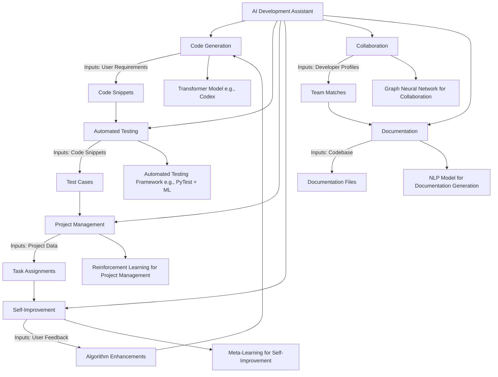

Here's the refactored Mermaid diagram that combines all the components, each utilizing efficient neural network or machine learning abstraction layers:

### Components Explained

- **Code Generation (B):** Uses a Transformer model like Codex to generate code snippets based on user requirements.
- **Automated Testing (C):** Uses an Automated Testing Framework (e.g., PyTest + ML) to create and execute tests for generated code.
- **Project Management (D):** Utilizes Reinforcement Learning for task optimization based on project data.
- **Self-Improvement (E):** Incorporates Meta-Learning to learn from user feedback, improving algorithms over time.
- **Collaboration (F):** Applies a Graph Neural Network to connect developers based on profile matching.
- **Documentation (G):** Employs an NLP model to create and update documentation using the codebase’s structure and comments.

This architecture allows a holistic workflow, supporting developers with code generation, testing, and documentation, while also fostering collaboration and continuous learning across the system. Let me know if you'd like to discuss specific aspects of these components!

To implement this system on a bare metal server stack, you'll need a robust hardware setup that supports scalable computation and networking requirements. Here’s a step-by-step approach to architecting this AI Development Assistant from scratch on a bare-metal server:

### 1. **Hardware Requirements**

A comprehensive AI-driven software development system like this requires powerful compute resources, ample storage, and a stable network. Here’s an ideal setup:

- **Compute Nodes**: At least one high-performance CPU server with multi-core processors and multiple GPUs (NVIDIA A100, V100, or similar) for machine learning tasks.
- **Memory**: 256 GB RAM or more, depending on the workload.
- **Storage**: Fast storage like NVMe SSDs for high-speed access (at least 4 TB for model storage and dataset management).
- **Networking**: High-speed Ethernet (10 Gbps or better) or InfiniBand for fast data transfers between nodes.
- **Powerful GPUs**: For training and running transformer models, reinforcement learning, etc., several high-performance GPUs are essential.
- **Redundancy**: Ensure RAID configurations for storage reliability, along with power backup for hardware uptime.

### 2. **Software Stack**

Start with an operating system and virtualization software to manage containers and orchestration.

- **Operating System**: A Linux-based OS (Ubuntu, CentOS, or similar).
- **Containerization**: Docker or Podman for encapsulating different system components.
- **Orchestration**: Kubernetes (K8s) for managing container clusters, scaling, and deployment.
- **Hypervisor (Optional)**: If partitioning resources for isolation, use a Type-1 hypervisor like VMware ESXi or KVM.

### 3. **Infrastructure Setup**

1. **Networking Configuration**: Configure the network to support distributed processing and secure inter-node communication, setting up Virtual LANs (VLANs) as needed.
2. **Storage Management**: Use a distributed file system like Ceph or GlusterFS for storage redundancy, with specific directories mounted to each container for access to data and model files.
3. **GPU and CPU Partitioning**: Allocate GPUs across containers or virtual machines based on component needs, with CPU resources reserved for orchestration, logging, and non-GPU-bound tasks.

### 4. **Component Deployment**

Each system component will run in its own container, leveraging specific hardware acceleration as necessary. Here’s how each part could be deployed:

#### **Core Agent**
- **Description**: The primary control plane that communicates between components.
- **Implementation**: A central API layer using Python with FastAPI or Flask to manage requests and control the flow between components.
- **Deployment**: Host this on a CPU node with access to all other component APIs.

#### **Code Generation (Transformer Model)**
- **Model**: Use a transformer model like Codex or a fine-tuned GPT model for code generation.
- **Deployment**: Containerize this using Docker, with GPU allocation.
- **Resources**: Requires 1-2 GPUs and access to training datasets and API for prompt generation.

#### **Automated Testing (ML-enabled Testing Framework)**
- **Framework**: PyTest combined with machine learning models for analyzing code and generating test cases.
- **Deployment**: Containerized environment using a testing framework and small ML models, possibly using CPU resources unless heavy test generation is required.
- **Resources**: Shared storage for test artifacts and test execution logs.

#### **Project Management (Reinforcement Learning)**
- **Model**: A reinforcement learning model for optimizing task allocation and timelines.
- **Deployment**: Container with dedicated access to project data, leveraging RL libraries like RLlib.
- **Resources**: CPU and GPU, depending on the scale of project data and the need for training/updates.

#### **Self-Improvement (Meta-Learning)**
- **Model**: Meta-learning algorithms that adapt to feedback, such as MAML (Model-Agnostic Meta-Learning).
- **Deployment**: Container with access to user feedback logs and system performance metrics.
- **Resources**: GPU access to process and retrain meta-learning models over time.

#### **Collaboration (Graph Neural Network)**
- **Model**: A Graph Neural Network (GNN) for profiling and matching collaborators.
- **Deployment**: Containerized GNN framework like PyTorch Geometric, with access to collaboration data.
- **Resources**: Requires both CPU and GPU for model training and inference as user profiles grow.

#### **Documentation Generator (NLP-based)**
- **Model**: NLP model to analyze codebase and generate documentation.
- **Deployment**: Containerized NLP model (BERT, GPT) with NLP libraries for text generation.
- **Resources**: Light GPU or CPU, depending on documentation complexity and frequency of updates.

### 5. **Inter-Component Communication and Orchestration**

- **Orchestration**: Kubernetes manages container life cycles, scaling, and health checks.
- **API Gateway**: Use an API gateway (like NGINX or Kong) to route requests among components securely and efficiently.
- **Messaging**: Use RabbitMQ or Kafka for event-driven communication between components, ensuring asynchronous updates.
- **Service Discovery**: Enable service discovery in Kubernetes (or use Consul if needed) to locate services dynamically.

### 6. **Data Management and Logging**

- **Logging**: ELK Stack (Elasticsearch, Logstash, Kibana) for monitoring, along with Grafana for performance dashboards.
- **Data Storage**: Store model data, training datasets, logs, and documentation in shared storage, and mount it as needed in each container.

### 7. **Security and Access Control**

- **Access Control**: Role-based access control (RBAC) for containers and Kubernetes, enforcing strict permissions.
- **Network Security**: Use firewall rules and Virtual LANs to secure communication between nodes, implementing SSL for secure API endpoints.
- **Data Encryption**: Encrypt all sensitive data at rest and in transit, especially collaboration and feedback data.

### 8. **Scaling and Maintenance**

- **Scaling**: Set up horizontal pod autoscaling in Kubernetes for components that can scale horizontally, like the code generation and collaboration modules.
- **Maintenance**: Routine backups, regular model retraining, and hardware checks are essential for reliability.

This setup will enable a robust, scalable, and secure environment for your AI Development Assistant, leveraging the full power of a bare-metal server stack with AI-driven capabilities. Let me know if you’d like further details on any particular component!
