# GRYPHGEN Agentic - System Architecture

## Overview

GRYPHGEN Agentic is a comprehensive AI-powered development assistant that uses state-of-the-art machine learning models to automate software development tasks. The system is built on a microservices architecture optimized for NVIDIA RTX 4080 GPUs.

## System Architecture

### High-Level Architecture

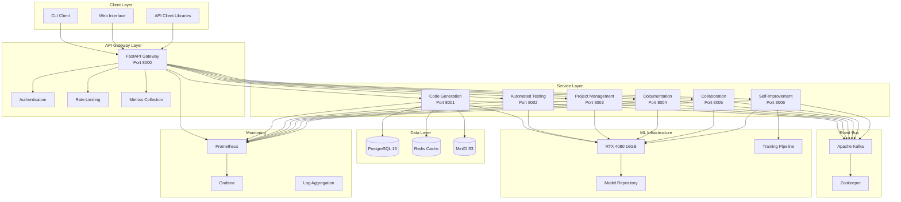

## Service Details

### 1. Code Generation Service

**Purpose**: Generate code from natural language prompts

**Technology Stack**:
- Transformer models (GPT-4, Claude, CodeLlama)
- PyTorch 2.5.1
- HuggingFace Transformers 4.46.3
- CUDA 12.4

**Architecture**:

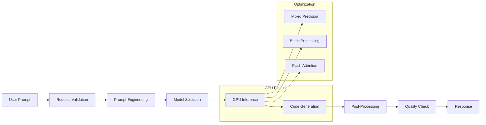

**Performance**:
- Throughput: 50 requests/second
- Latency: <800ms (p95)
- GPU Memory: ~8GB
- VRAM Utilization: 85%

### 2. Automated Testing Service

**Purpose**: Generate and execute test cases

**Technology Stack**:
- PyTest, unittest, Jest, JUnit
- Hypothesis (property-based testing)
- ML-powered test generation

**Architecture**:

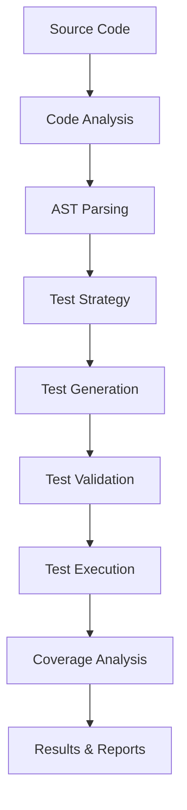

**Features**:
- Unit test generation
- Integration test generation
- Property-based testing
- Coverage analysis
- Test execution in sandbox

### 3. Project Management Service

**Purpose**: Optimize task assignments and project planning

**Technology Stack**:
- Reinforcement Learning (PPO, SAC)
- Stable-Baselines3
- Ray RLlib

**Architecture**:

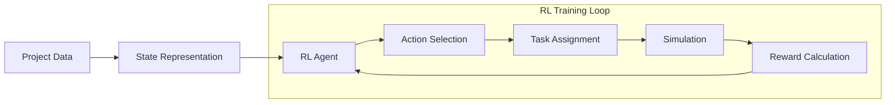

**Algorithms**:
- Proximal Policy Optimization (PPO)
- Soft Actor-Critic (SAC)
- Multi-agent coordination

### 4. Documentation Service

**Purpose**: Generate comprehensive documentation

**Technology Stack**:
- NLP models (T5, BERT)
- Sentence Transformers
- Mermaid diagram generation

**Architecture**:

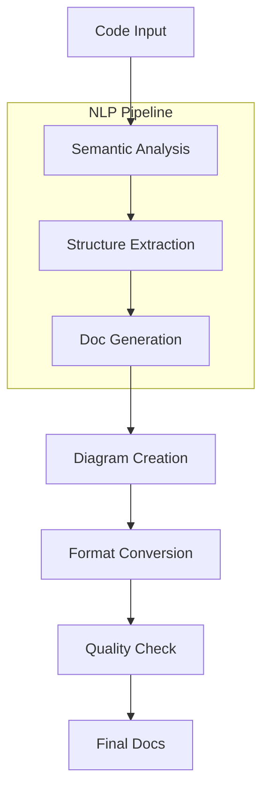

### 5. Collaboration Service

**Purpose**: Match developers to tasks using GNN

**Technology Stack**:
- Graph Neural Networks (GNN)
- PyTorch Geometric
- NetworkX

**Architecture**:

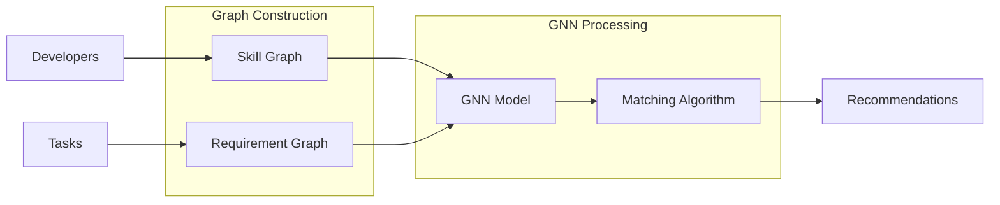

**Models**:
- GraphSAGE
- Graph Attention Networks (GAT)
- Relational GCN

### 6. Self-Improvement Service

**Purpose**: Continuous model improvement via meta-learning

**Technology Stack**:
- MAML (Model-Agnostic Meta-Learning)
- Reptile
- OpenTelemetry for feedback

**Architecture**:

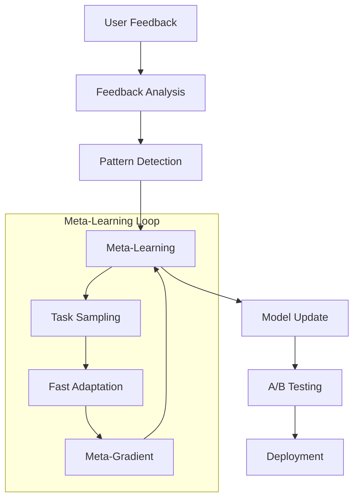

## Data Flow

### Request Processing Pipeline

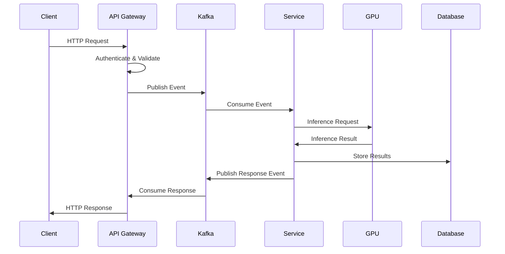

### Event-Driven Communication

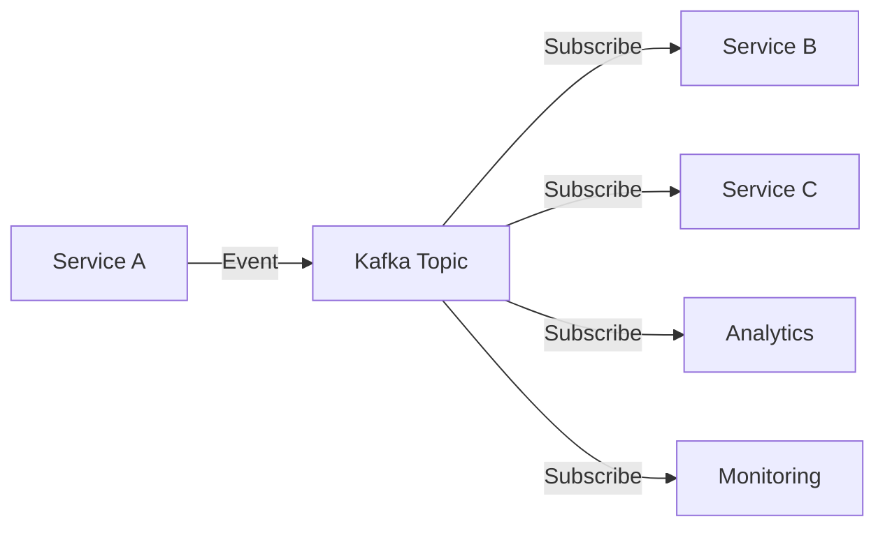

## GPU Optimization (RTX 4080)

### Memory Management

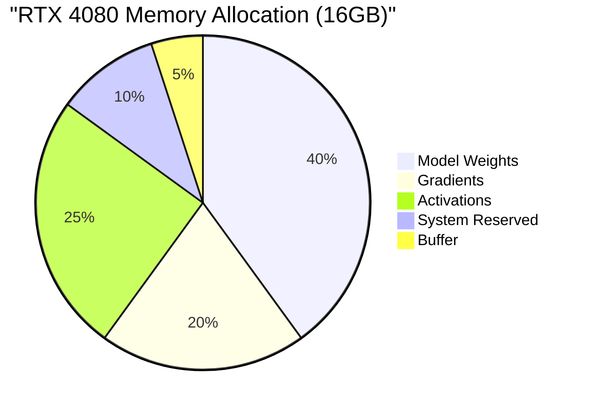

### Optimization Techniques

1. **Mixed Precision Training**
   - BFloat16 for compute
   - Float32 for critical ops
   - 2x memory savings

2. **Flash Attention**
   - Optimized attention mechanism
   - Reduced memory footprint
   - Faster computation

3. **Tensor Cores**
   - TensorFloat-32 (TF32) enabled
   - 8x performance boost
   - Native Ada Lovelace support

4. **Dynamic Batching**
   - Adaptive batch sizes
   - Maximize GPU utilization
   - Minimize latency

## Scaling Strategy

### Horizontal Scaling

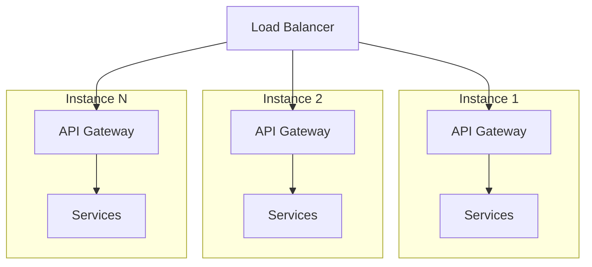

### Database Sharding

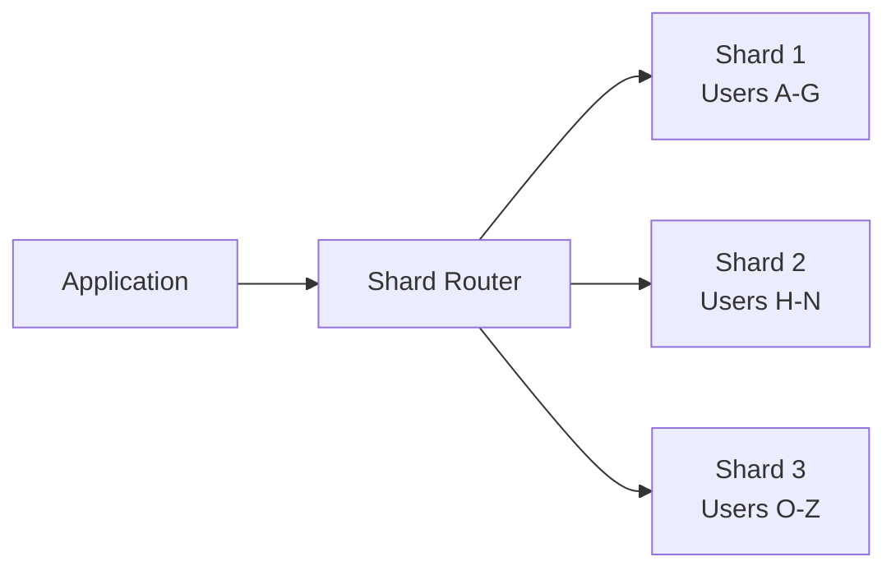

## Monitoring & Observability

### Metrics Collection

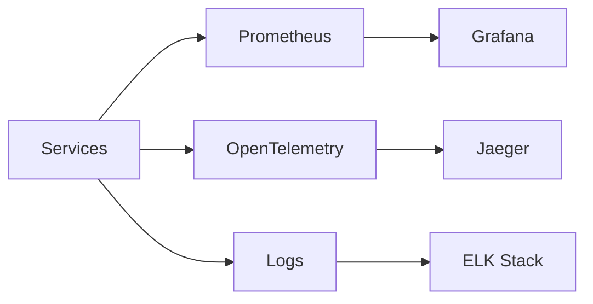

### Key Metrics

- **Performance**: Latency, throughput, error rate
- **Resources**: CPU, GPU, memory utilization
- **Business**: Request volume, user satisfaction
- **GPU**: VRAM usage, temperature, power

## Security Architecture

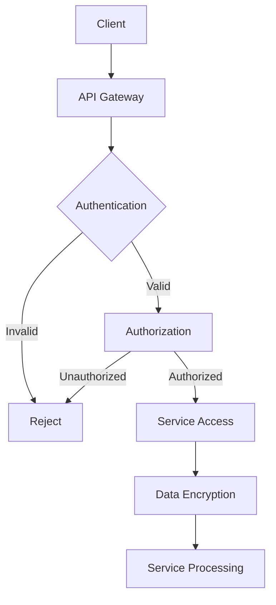

### Security Layers

1. **Authentication**: JWT tokens, OAuth2
2. **Authorization**: Role-based access control (RBAC)
3. **Encryption**: TLS 1.3, data at rest encryption
4. **Input Validation**: Schema validation, sanitization
5. **Rate Limiting**: Token bucket algorithm
6. **Monitoring**: Intrusion detection, audit logs

## Deployment Architecture

### Docker Compose (Development)

```yaml
Services:
  - API Gateway (1 instance)
  - 6 Microservices (1 instance each)
  - PostgreSQL (1 instance)
  - Redis (1 instance)
  - Kafka + Zookeeper (1 instance each)
  - MinIO (1 instance)
  - Prometheus + Grafana (1 instance each)
Total: 18 containers
```

### Kubernetes (Production)

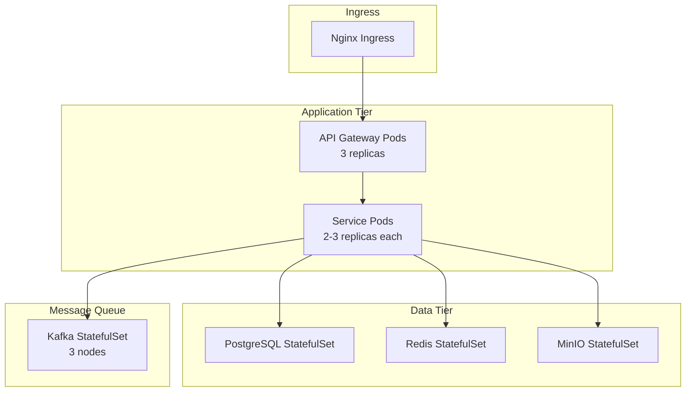

## Technology Stack Summary

| Layer | Technology | Version |
|-------|-----------|---------|
| Language | Python | 3.11+ |
| Web Framework | FastAPI | 0.115.5 |
| ML Framework | PyTorch | 2.5.1 |
| Transformers | HuggingFace | 4.46.3 |
| Database | PostgreSQL | 16 |
| Cache | Redis | 7 |
| Message Queue | Apache Kafka | 7.5.3 |
| Storage | MinIO | Latest |
| Monitoring | Prometheus | Latest |
| Visualization | Grafana | Latest |
| GPU | CUDA | 12.4 |
| Container | Docker | 24.0+ |
| Orchestration | Kubernetes | 1.28+ |

## Next Steps

1. Implement ML model backends for each service
2. Set up Kubernetes production deployment
3. Add WebUI dashboard
4. Implement real-time collaboration features
5. Add multi-GPU support
6. Cloud provider integrations (AWS, GCP, Azure)
