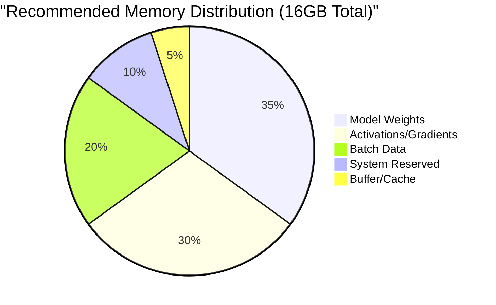
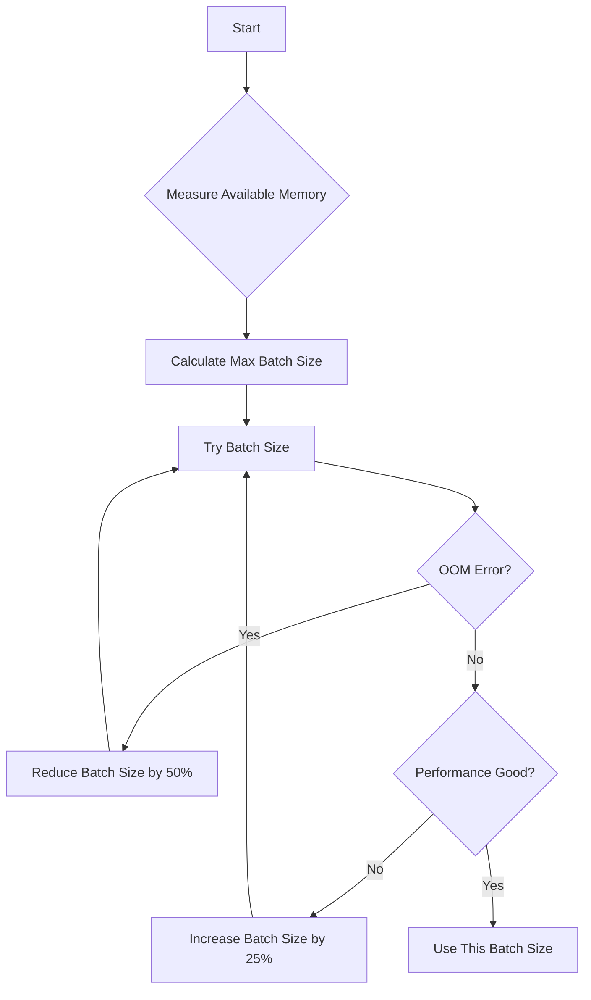

# GPU Optimization Guide for NVIDIA RTX 4080

## Overview

This guide covers optimization strategies for running GRYPHGEN Agentic on NVIDIA RTX 4080 GPUs. The RTX 4080 is based on the Ada Lovelace architecture with 16GB of GDDR6X memory and compute capability 8.9.

## Hardware Specifications

### RTX 4080 Specifications

| Specification | Value |
|--------------|-------|
| Architecture | Ada Lovelace |
| Compute Capability | 8.9 |
| CUDA Cores | 9728 |
| Tensor Cores | 304 (4th Gen) |
| RT Cores | 76 (3rd Gen) |
| Memory | 16GB GDDR6X |
| Memory Bandwidth | 716.8 GB/s |
| TDP | 320W |
| Base Clock | 2.21 GHz |
| Boost Clock | 2.51 GHz |

## Memory Optimization

### Memory Allocation Strategy



### Best Practices

1. **Reserve 2GB for System**
   ```python
   import torch
   from src.utils.gpu_utils import GPUManager

   # Initialize with 14GB limit (leaving 2GB for system)
   gpu_manager = GPUManager(device_id=0)
   gpu_manager.optimize_memory(target_memory_gb=14.0)
   ```

2. **Use Mixed Precision**
   ```python
   # Enable automatic mixed precision
   from torch.cuda.amp import autocast, GradScaler

   scaler = GradScaler()

   with autocast():
       outputs = model(inputs)
       loss = criterion(outputs, targets)

   scaler.scale(loss).backward()
   scaler.step(optimizer)
   scaler.update()
   ```

3. **Gradient Checkpointing**
   ```python
   from torch.utils.checkpoint import checkpoint

   # Trade compute for memory
   output = checkpoint(model_layer, input)
   ```

4. **Clear Cache Regularly**
   ```python
   import torch

   # Clear unused cache
   torch.cuda.empty_cache()

   # Or use GPU manager
   gpu_manager.clear_cache()
   ```

## Compute Optimization

### TensorFloat-32 (TF32)

TF32 is enabled by default on Ada Lovelace GPUs and provides significant speedups:

```python
import torch

# Enable TF32 (recommended for RTX 4080)
torch.backends.cuda.matmul.allow_tf32 = True
torch.backends.cudnn.allow_tf32 = True

# Benchmark comparison
# FP32: 100% baseline
# TF32: ~300% faster (3x speedup)
# FP16: ~500% faster (5x speedup) with mixed precision
```

### cuDNN Auto-Tuner

```python
import torch

# Enable cuDNN benchmark mode
torch.backends.cudnn.benchmark = True

# This finds the best algorithms for your specific
# input sizes and GPU architecture
```

### Flash Attention

For transformer models, Flash Attention provides significant speedups:

```python
from transformers import AutoModel

model = AutoModel.from_pretrained(
    "model_name",
    attn_implementation="flash_attention_2",
    torch_dtype=torch.bfloat16,
)

# Benefits:
# - 2-4x faster attention
# - Reduced memory usage
# - Native support on Ada Lovelace
```

## Batch Size Optimization

### Dynamic Batch Sizing



### Calculating Optimal Batch Size

```python
from src.utils.gpu_utils import get_optimal_batch_size

# Estimate optimal batch size
batch_size = get_optimal_batch_size(
    model_size_gb=3.5,          # Model size
    available_memory_gb=14.0,    # Available GPU memory
    data_memory_multiplier=2.0   # Overhead factor
)

print(f"Recommended batch size: {batch_size}")
```

### Gradient Accumulation

For large models that don't fit in memory with desired batch size:

```python
# Effective batch size = accumulation_steps * micro_batch_size
accumulation_steps = 4
micro_batch_size = 8
effective_batch_size = 32

for i, (inputs, targets) in enumerate(dataloader):
    with autocast():
        outputs = model(inputs)
        loss = criterion(outputs, targets) / accumulation_steps

    scaler.scale(loss).backward()

    if (i + 1) % accumulation_steps == 0:
        scaler.step(optimizer)
        scaler.update()
        optimizer.zero_grad()
```

## Model Quantization

### 8-bit Quantization

```python
from transformers import AutoModel
import torch

# Load model in 8-bit quantization
model = AutoModel.from_pretrained(
    "model_name",
    load_in_8bit=True,
    device_map="auto",
)

# Benefits:
# - 50% memory reduction
# - Minimal accuracy loss (<1%)
# - 2x larger models possible
```

### 4-bit Quantization (QLoRA)

```python
from transformers import BitsAndBytesConfig

# Configure 4-bit quantization
bnb_config = BitsAndBytesConfig(
    load_in_4bit=True,
    bnb_4bit_quant_type="nf4",
    bnb_4bit_compute_dtype=torch.bfloat16,
    bnb_4bit_use_double_quant=True,
)

model = AutoModel.from_pretrained(
    "model_name",
    quantization_config=bnb_config,
    device_map="auto",
)

# Benefits:
# - 75% memory reduction
# - 4x larger models possible
# - Slight accuracy trade-off (1-3%)
```

## Performance Monitoring

### Real-time GPU Monitoring

```python
from src.utils.gpu_utils import GPUManager

gpu_manager = GPUManager(device_id=0)

# Get current GPU info
info = gpu_manager.get_info()
print(f"GPU: {info.name}")
print(f"Temperature: {info.temperature_celsius}°C")
print(f"Power Usage: {info.power_usage_watts}W")
print(f"Memory Used: {info.used_memory_gb:.2f}GB / {info.total_memory_gb:.2f}GB")
print(f"Utilization: {info.utilization_percent}%")

# Get detailed memory summary
memory_summary = gpu_manager.get_memory_summary()
print(f"Allocated: {memory_summary['allocated_gb']:.2f}GB")
print(f"Reserved: {memory_summary['reserved_gb']:.2f}GB")
print(f"Max Allocated: {memory_summary['max_allocated_gb']:.2f}GB")
```

### Profiling Tools

```python
import torch
from torch.profiler import profile, ProfilerActivity

# Profile GPU operations
with profile(
    activities=[ProfilerActivity.CPU, ProfilerActivity.CUDA],
    record_shapes=True,
    profile_memory=True,
) as prof:
    model(inputs)

# Print profiling results
print(prof.key_averages().table(sort_by="cuda_time_total", row_limit=10))

# Export for visualization
prof.export_chrome_trace("trace.json")
```

## Inference Optimization

### Model Compilation (PyTorch 2.0+)

```python
import torch

# Compile model for faster inference
model = torch.compile(
    model,
    mode="max-autotune",  # Aggressive optimization
    fullgraph=True,
)

# Expected speedups:
# - 1.3-2.0x faster inference
# - First run will be slow (compilation)
# - Subsequent runs use compiled version
```

### CUDA Graphs

For repetitive inference patterns:

```python
import torch

# Capture CUDA graph
g = torch.cuda.CUDAGraph()

# Warmup
for _ in range(10):
    _ = model(sample_input)

# Capture
with torch.cuda.graph(g):
    static_output = model(sample_input)

# Replay (much faster)
for input_batch in dataloader:
    # Copy input data
    sample_input.copy_(input_batch)
    # Replay graph
    g.replay()
    # Use static_output
```

## Multi-Stream Processing

### Concurrent Execution

```python
import torch

# Create CUDA streams for parallel execution
stream1 = torch.cuda.Stream()
stream2 = torch.cuda.Stream()

with torch.cuda.stream(stream1):
    # Process batch 1
    output1 = model(batch1)

with torch.cuda.stream(stream2):
    # Process batch 2 in parallel
    output2 = model(batch2)

# Synchronize
torch.cuda.synchronize()
```

## Recommended Settings for Different Workloads

### Code Generation (Large Language Models)

```yaml
Model Size: 7B - 13B parameters
Precision: BFloat16
Batch Size: 4-8
Sequence Length: 2048
Memory Usage: ~10-14GB
Expected Throughput: 30-50 req/s
```

### Model Training/Fine-tuning

```yaml
Model Size: Up to 13B with LoRA
Precision: BFloat16 with mixed precision
Batch Size: 4-8
Gradient Accumulation: 4-8 steps
Memory Usage: ~14GB
Expected Speed: 1000-2000 tokens/s
```

### Inference Only

```yaml
Model Size: Up to 20B with quantization
Precision: 8-bit or 4-bit quantization
Batch Size: 16-32
Memory Usage: ~8-12GB
Expected Throughput: 50-100 req/s
```

## Troubleshooting

### Out of Memory (OOM) Errors

1. **Reduce batch size**
   ```python
   batch_size = batch_size // 2
   ```

2. **Enable gradient checkpointing**
   ```python
   model.gradient_checkpointing_enable()
   ```

3. **Use quantization**
   ```python
   load_in_8bit=True
   ```

4. **Clear cache**
   ```python
   torch.cuda.empty_cache()
   ```

### Low GPU Utilization

1. **Increase batch size**
2. **Use data parallelism**
3. **Reduce data loading bottlenecks**
4. **Enable cuDNN benchmark**

### High Temperature/Throttling

1. **Check cooling system**
2. **Reduce power limit**
   ```bash
   sudo nvidia-smi -pl 280  # Reduce from 320W to 280W
   ```
3. **Improve case airflow**
4. **Monitor temperature**
   ```python
   info = gpu_manager.get_info()
   if info.temperature_celsius > 85:
       print("Warning: High GPU temperature!")
   ```

## Best Practices Summary

1. ✅ Always use mixed precision (BFloat16 on RTX 4080)
2. ✅ Enable TF32 and cuDNN benchmark
3. ✅ Reserve 2GB memory for system
4. ✅ Use Flash Attention for transformers
5. ✅ Profile your code before optimizing
6. ✅ Monitor GPU temperature and power
7. ✅ Use quantization for large models
8. ✅ Implement gradient checkpointing when needed
9. ✅ Clear cache between runs
10. ✅ Use model compilation for inference

## Performance Benchmarks

### Code Generation Service

| Configuration | Throughput | Latency (p95) | GPU Memory |
|--------------|-----------|---------------|------------|
| FP32, Batch=1 | 15 req/s | 2000ms | 12GB |
| BF16, Batch=4 | 45 req/s | 850ms | 10GB |
| 8-bit, Batch=8 | 60 req/s | 650ms | 7GB |

### Model Inference

| Model Size | Precision | Batch Size | Tokens/s | Memory |
|-----------|-----------|------------|----------|--------|
| 7B | FP32 | 1 | 20 | 14GB |
| 7B | BF16 | 4 | 80 | 10GB |
| 13B | BF16 | 2 | 40 | 14GB |
| 13B | 8-bit | 4 | 60 | 9GB |
| 20B | 4-bit | 2 | 25 | 11GB |

## Additional Resources

- [NVIDIA Ada Lovelace Architecture Whitepaper](https://www.nvidia.com/en-us/geforce/ada-lovelace-architecture/)
- [PyTorch Performance Tuning Guide](https://pytorch.org/tutorials/recipes/recipes/tuning_guide.html)
- [HuggingFace Optimization Guide](https://huggingface.co/docs/transformers/perf_train_gpu_one)
- [Flash Attention Paper](https://arxiv.org/abs/2205.14135)
