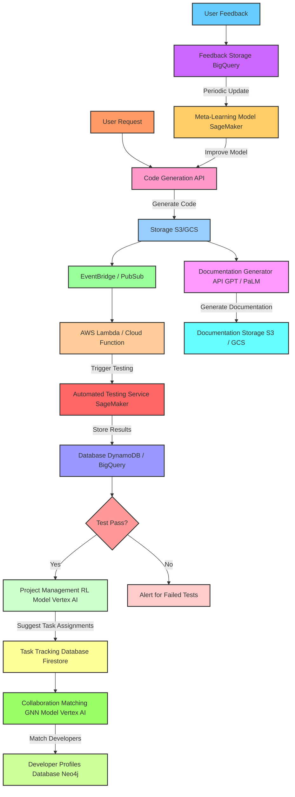
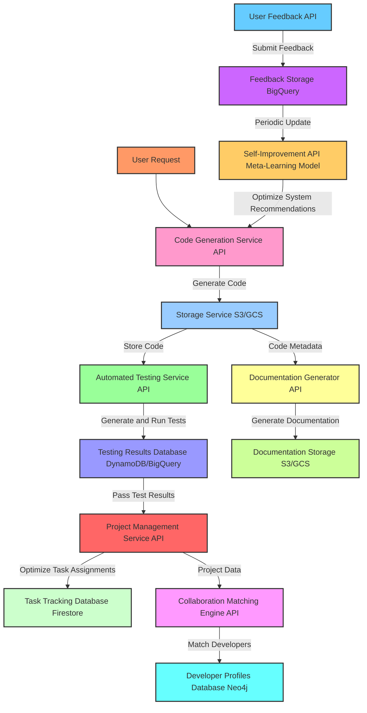
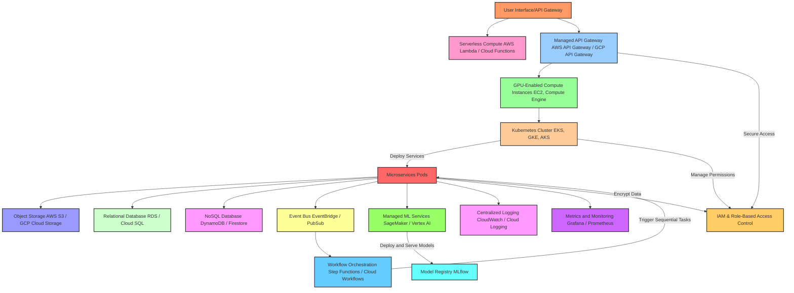
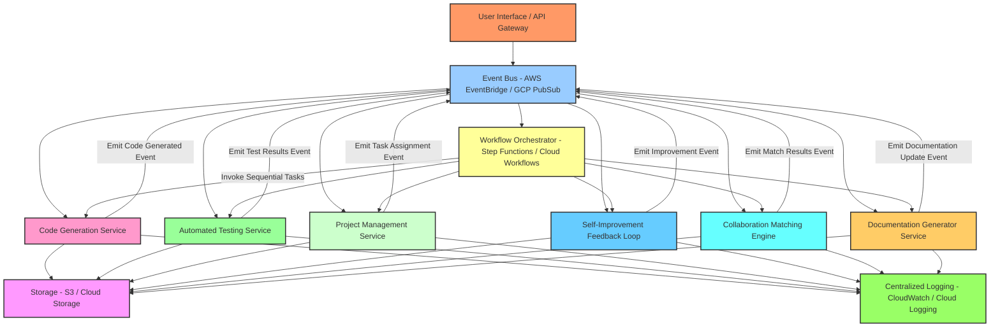

Building this system using cloud resources and language models-as-a-service (LMaaS) will enable rapid development, scalability, and cost-efficient usage of advanced AI and ML capabilities without the need for extensive local infrastructure. Here’s how we can piece together the system by leveraging cloud APIs and services.

---

### **1. Cloud Infrastructure Setup**

1. **Compute**: Use a combination of serverless and managed compute resources for flexible scaling and cost management.
   - **Serverless Compute**: AWS Lambda, Azure Functions, or Google Cloud Functions for event-driven tasks.
   - **VMs with GPUs**: AWS EC2 instances with GPU support (e.g., P3 or P4 instances), Google Compute Engine, or Azure’s NV-series for compute-heavy tasks (like real-time code generation).
2. **Orchestration**: For managing multiple services and APIs.
   - **Kubernetes Engine**: GKE (Google Kubernetes Engine), EKS (Elastic Kubernetes Service on AWS), or AKS (Azure Kubernetes Service) for microservices orchestration.
   - **API Gateway**: Use a managed API gateway (AWS API Gateway, Azure API Management, Google API Gateway) to direct requests, handle security, and manage API limits.

---

### **2. Core Services Using API Calls**

Each core component can rely on a cloud-based AI or ML service, allowing you to leverage pretrained models and managed environments. Here’s a breakdown:

#### **Code Generation Service**

- **LMaaS**: OpenAI’s Codex, Cohere, or Anthropic’s Claude for language-to-code generation.
- **API Structure**: 
  - Make API calls to the LMaaS endpoint to generate code snippets based on provided user requirements.
  - Example workflow:
    1. Send a user prompt and project requirements to the Codex API.
    2. Receive code snippets and structure from Codex, which is then processed and stored.
  - **Caching**: Cache frequently requested code snippets or use a content-based hash to store similar requests, reducing API call costs.

#### **Automated Testing Service**

- **Cloud AI Services**: Use a managed ML service to analyze code and generate automated tests.
  - Google AutoML Tables or AWS SageMaker could host a simple ML model trained to generate and validate test cases based on code.
- **API Structure**: 
  - Pass generated code to the testing service.
  - Use serverless functions to execute tests and store the results.
  - Store generated test cases and results in a managed database (e.g., Google BigQuery or AWS DynamoDB).

#### **Project Management Service**

- **Reinforcement Learning (RL) as a Service**: Deploy an RL model with Google’s Vertex AI or AWS SageMaker RL for task scheduling and prioritization.
  - **API Structure**: 
    - Define actions (e.g., task assignments) and rewards (e.g., project efficiency).
    - Set up training to optimize task assignments based on inputs such as team profiles, deadlines, and historical performance data.
  - Use AWS Step Functions or Google Cloud Workflows to orchestrate the reinforcement learning workflows.

#### **Self-Improvement Feedback Loop**

- **Meta-Learning Model Hosting**: Use SageMaker or Google Vertex AI for meta-learning capabilities.
  - **API Structure**:
    - Feed user feedback and performance metrics through an endpoint that retrains the meta-learning model, adjusting system recommendations and improving code generation over time.
    - Store feedback in a managed database and use it as a dataset to fine-tune models regularly.

#### **Collaboration Matching Engine**

- **Graph Database API**: Neo4j Aura on GCP or AWS for relationship-driven queries.
  - **Graph Neural Network (GNN) API**: Use hosted PyTorch or TensorFlow models for GNN-based matching on user profiles.
  - **API Structure**: 
    - Query developer profiles and project data from the Neo4j API to identify potential matches.
    - Send results to the GNN model to refine matches, filtering candidates by skill, interest, and experience.

#### **Documentation Generator**

- **NLP Model via LMaaS**: Use OpenAI’s GPT or Google’s PaLM API for natural language processing to generate and update documentation.
  - **API Structure**: 
    - Provide comments, function names, and summaries of the codebase to the LMaaS API to generate documentation.
    - Store the resulting documentation in cloud storage (e.g., AWS S3 or Google Cloud Storage) and tag with metadata for versioning.

---

### **3. Inter-Service Communication and Event-Driven Workflow**

To stitch together these services, use an **event-driven architecture** with cloud-based messaging and orchestration tools.

- **Event Bus**: AWS EventBridge, Google Cloud Pub/Sub, or Azure Event Grid to handle asynchronous events and trigger workflows.
- **Workflow Orchestration**: AWS Step Functions, Google Cloud Workflows, or Azure Logic Apps to sequence tasks and coordinate inter-service communication.
- **Example Workflow**:
  1. A user request to generate code triggers an API call to the Code Generation service.
  2. Once the code is generated, an event is emitted to run tests through the Automated Testing service.
  3. Successful test completion triggers Project Management to schedule tasks.
  4. After updates, Self-Improvement consumes feedback and refines the process.

---

### **4. Data Storage and Logging**

Centralize logs, metrics, and data storage to streamline monitoring and maintenance.

- **Centralized Logging and Monitoring**:
  - **Cloud Logging**: Use AWS CloudWatch, Google Cloud Logging, or Azure Monitor for logs.
  - **Distributed Tracing**: OpenTelemetry for tracing requests across services.
  - **Dashboards**: Set up dashboards in Grafana or integrate with cloud-native monitoring for visualization of metrics.

- **Data Storage**:
  - **Relational Data**: Managed databases like Amazon RDS, Google Cloud SQL, or Azure SQL Database for structured data.
  - **NoSQL**: DynamoDB, Firestore, or Cosmos DB for unstructured or semi-structured data.
  - **File Storage**: Cloud storage services like AWS S3, Google Cloud Storage, or Azure Blob for larger datasets and documentation files.

---

### **5. Security and Access Control**

Using cloud infrastructure simplifies security management through managed identity services and secure API gateways.

- **Identity and Access Management (IAM)**: Use IAM roles and policies to control access to services (AWS IAM, Google IAM, Azure IAM).
- **API Key Management**: Use secret managers like AWS Secrets Manager, Google Secret Manager, or Azure Key Vault to secure API keys and access tokens.
- **Data Encryption**: Enable encryption at rest and in transit for all cloud services, particularly sensitive data like user profiles and feedback.

---

### **6. Continuous Integration and Deployment (CI/CD)**

Set up CI/CD pipelines to automate testing, deployment, and updating of cloud resources.

- **CI/CD Tools**: Use Jenkins, GitHub Actions, GitLab CI/CD, or cloud-native options (AWS CodePipeline, Google Cloud Build, Azure DevOps).
- **Testing Automation**: Integrate unit tests, integration tests, and API tests to verify service interactions.
- **Canary Releases**: Deploy updates incrementally by rolling out changes to a subset of users before a full deployment.

---

### **Example Workflow of Stitching APIs Together**

Here's an example of how API calls and cloud resources would interact:

1. **Request Processing**: 
   - A user request for a new feature triggers the Code Generation API (Codex via OpenAI API).
   - The generated code is stored in S3, and an event is sent to EventBridge.

2. **Automated Testing**:
   - The event triggers an AWS Lambda function that sends the code to the Testing Service, which uses SageMaker to generate and run tests.
   - Results are stored in DynamoDB, with alerts for any test failures.

3. **Project Management**:
   - Once testing passes, an event triggers the Project Management RL model on Vertex AI.
   - The model suggests task assignments, which are stored in Firestore for tracking.

4. **Self-Improvement and Feedback**:
   - User feedback is stored in Google BigQuery.
   - A scheduled job uses this data to fine-tune models in SageMaker and improve recommendations.

5. **Documentation**:
   - Documentation Generator sends code metadata to GPT via OpenAI API to create or update documentation, stored in Google Cloud Storage.

6. **Collaboration**:
   - Project data is sent to the GNN model hosted in Vertex AI, which suggests contributors, stored in Neo4j for future references.

---

Using cloud services in this way enables an agile, scalable, and adaptable system that can handle complex software-building tasks by leveraging state-of-the-art AI capabilities available through cloud-based APIs. Let me know if you want more details on any specific integration!

Implementing a software-building system capable of dynamically generating and managing AI/software components requires a well-structured, modular, and iterative approach. Here’s a detailed plan to implement this scaffolding, including best practices for each layer:

### 1. **Core Architecture: Microservices-Based Design**

#### Microservices
- **Code Generator Service**: Uses transformer models like Codex.
- **Automated Testing Service**: Uses PyTest with ML-based test case generation.
- **Project Management Service**: Uses reinforcement learning for task optimization.
- **Self-Improvement Feedback Loop**: Uses meta-learning to adapt based on feedback.
- **Collaboration Matching Engine**: Uses Graph Neural Networks for team matching.
- **Documentation Generator**: Uses NLP models like BERT or GPT for documentation.

#### Service Registry
- **Kubernetes**: For dynamic service discovery and orchestration.

### 2. **Central Orchestrator and Communication**

#### API Gateway
- **NGINX or Kong**: For centralized routing of requests.

#### Event-Driven Architecture
- **Kafka or RabbitMQ**: For asynchronous service interactions.

#### Workflow Tools
- **Apache Airflow**: For managing complex task dependencies.

### 3. **Machine Learning Model Management**

#### Model Registry
- **MLflow**: For tracking, versioning, and updating models.

#### Model Deployment
- **TensorFlow Serving, TorchServe, or NVIDIA Triton Inference Server**: For seamless deployment and updating of models.

#### A/B Testing
- Implement A/B testing for model updates without affecting the entire system.

### 4. **Knowledge Management**

#### Ontology Design
- **Graph Database**: Use Neo4j to represent relationships among code modules, tests, documentation, and user feedback.

### 5. **Feedback and Self-Improvement Mechanism**

#### Meta-Learning Framework
- **MAML or Reptile**: For adapting based on feedback.

#### Continuous Feedback
- Collect performance metrics and user feedback continuously to feed into the meta-learning mechanism.

### 6. **System-Level Abstraction Layer**

#### Containerization
- **Docker**: For deploying services.

#### Orchestration
- **Kubernetes**: For easy scaling.

#### Hardware Optimization
- **CUDA, ROCm, or Intel MKL**: For leveraging specific hardware optimizations.

### 7. **Core System Libraries and Frameworks**

#### Libraries and Frameworks
- **NLP**: Transformers library.
- **Code Generation**: OpenAI Codex.
- **Testing Automation**: PyTest.
- **Reinforcement Learning**: RLlib from Ray.
- **Meta-Learning**: MAML or Reptile.
- **Graph Neural Networks**: PyTorch Geometric.
- **Documentation Generation**: BERT or GPT.

### 8. **Infrastructure and DevOps**

#### CI/CD Tools
- **Jenkins or GitLab CI**: For deployment, monitoring, and iterative development.

#### Monitoring
- **ELK Stack and Grafana**: For service health monitoring.

#### Security
- **Role-Based Access Controls and TLS**: For secure API endpoints.

### 9. **Iterative Development and Experimentation Framework**

#### MVP Creation
1. **Core Agents**: Create MVPs for Code Generator, Automated Testing, and Documentation Generator.
2. **Central Orchestrator**: Set up the central orchestrator and event-driven communication backbone.
3. **Meta-Learning Feedback Loop**: Develop and integrate the meta-learning feedback loop.
4. **Additional Functionalities**: Add Project Management and Collaboration matching.
5. **Optimization**: Optimize models, data handling, and orchestration based on evolving requirements.

### Implementation Steps

#### Step 1: Set Up Core Architecture
- **Microservices**: Develop each microservice independently.
- **Kubernetes**: Set up Kubernetes for service discovery and orchestration.

#### Step 2: Central Orchestrator and Communication
- **API Gateway**: Implement NGINX or Kong for centralized routing.
- **Event-Driven Architecture**: Set up Kafka or RabbitMQ for asynchronous communication.
- **Workflow Tools**: Integrate Apache Airflow for complex task dependencies.

#### Step 3: Machine Learning Model Management
- **Model Registry**: Set up MLflow for tracking and versioning models.
- **Model Deployment**: Use TensorFlow Serving, TorchServe, or NVIDIA Triton Inference Server for model deployment.
- **A/B Testing**: Implement A/B testing for model updates.

#### Step 4: Knowledge Management
- **Ontology Design**: Design an ontology to represent relationships among components.
- **Graph Database**: Use Neo4j for storing and querying the ontology.

#### Step 5: Feedback and Self-Improvement Mechanism
- **Meta-Learning Framework**: Implement MAML or Reptile for adapting based on feedback.
- **Continuous Feedback**: Set up mechanisms to collect and analyze performance metrics and user feedback.

#### Step 6: System-Level Abstraction Layer
- **Containerization**: Use Docker for deploying services.
- **Orchestration**: Set up Kubernetes for scaling.
- **Hardware Optimization**: Use CUDA, ROCm, or Intel MKL for hardware optimizations.

#### Step 7: Core System Libraries and Frameworks
- **Libraries and Frameworks**: Integrate the chosen libraries and frameworks for each component.

#### Step 8: Infrastructure and DevOps
- **CI/CD Tools**: Set up Jenkins or GitLab CI for deployment and monitoring.
- **Monitoring**: Use ELK Stack and Grafana for service health monitoring.
- **Security**: Implement role-based access controls and TLS for secure API endpoints.

#### Step 9: Iterative Development and Experimentation Framework
- **MVP Creation**: Create MVPs for core agents.
- **Central Orchestrator**: Set up the central orchestrator and event-driven communication backbone.
- **Meta-Learning Feedback Loop**: Develop and integrate the meta-learning feedback loop.
- **Additional Functionalities**: Add Project Management and Collaboration matching.
- **Optimization**: Continuously optimize models, data handling, and orchestration.

### Summary

By following these steps, you can create a robust, modular, and scalable software-building system capable of dynamically generating and managing AI/software components. This scaffolding ensures continuous improvement, flexibility, and adaptability to evolving requirements. Would you like to explore any specific part of this process in more detail, or discuss how to implement it further?



This diagram captures the key API-driven services:

- **Code Generation**: Receives user requests, generates code, and stores it.
- **Automated Testing**: Runs tests on generated code and stores results.
- **Project Management**: Analyzes test results and optimizes tasks.
- **Self-Improvement**: Uses feedback to improve the recommendation engine.
- **Collaboration Matching**: Matches developers based on project needs.
- **Documentation Generation**: Creates and updates documentation based on code metadata.


Explanation of Cloud Infrastructure Setup
Compute:

Serverless Compute (e.g., AWS Lambda, Cloud Functions) for lightweight, event-driven tasks.
Managed API Gateway for routing and security.
GPU-Enabled Instances for heavy ML model processing.
Container Orchestration:

Kubernetes Cluster for scaling microservices and workload distribution across pods.
Storage and Database:

Object Storage (e.g., AWS S3, GCP Cloud Storage) for model and data files.
Relational Database for structured data (e.g., RDS, Cloud SQL).
NoSQL Database for unstructured or semi-structured data (e.g., DynamoDB, Firestore).
Event-Driven Workflow:

Event Bus (e.g., EventBridge, Pub/Sub) for asynchronous inter-service communication.
Workflow Orchestration (e.g., Step Functions, Cloud Workflows) for complex task sequences.
Machine Learning Model Hosting:

Model Registry for tracking and versioning models.
Managed ML Services for model training, serving, and updates.
Logging and Monitoring:

Centralized Logging and Monitoring Tools to track system health and performance.
Security and Access Control:

IAM & RBAC for managing permissions and secure access to resources.


Explanation of Inter-Service Communication and Event-Driven Workflow
Event Bus (B): Acts as the core message broker, handling asynchronous communication between services.
Core Services (C, D, E, F, G, H): Each service listens for relevant events and emits events back to the bus upon task completion, allowing loosely coupled interactions.
Code Generation Service
Automated Testing Service
Project Management Service
Self-Improvement Feedback Loop
Collaboration Matching Engine
Documentation Generator Service
Workflow Orchestrator (I): Manages complex workflows by invoking services sequentially or conditionally, ensuring task dependencies are respected.
Storage (J): A centralized object storage for storing generated code, test results, documentation, etc.
Centralized Logging (K): Collects logs from all services for monitoring and troubleshooting.

The **Event Bus**, such as AWS EventBridge or Google Cloud Pub/Sub, is often suggested because it provides a fully managed, scalable, and reliable event-driven architecture that can handle large volumes of asynchronous messages. However, hosting an event bus on your own hardware is certainly possible and has its own advantages and disadvantages. Here’s a breakdown of the considerations for managing your own event bus versus using a cloud-managed service.

### **Why Use a Cloud-Managed Event Bus?**

1. **Scalability**: Cloud-managed event buses are designed to scale dynamically. As your system grows and needs to handle more events, a managed service automatically scales without additional configuration or hardware costs.
  
2. **Reliability and Availability**: Managed services from major providers are typically backed by strong SLAs, offering high uptime and fault tolerance. Building a similarly reliable, distributed event bus on-premises would require significant engineering efforts to ensure redundancy, failover, and disaster recovery.

3. **Cost Management**: Although cloud-managed event buses charge per event, they often turn out to be cost-effective due to economies of scale. For lower or medium usage, the cost is typically lower than the expenses involved in managing on-premise hardware, maintenance, and networking for a self-hosted event bus.

4. **Maintenance and Upgrades**: Managed services take care of patches, updates, and security, removing the operational burden. Self-hosting requires dedicated resources and time for continuous updates and scaling as demand grows.

### **Hosting an Event Bus on Your Own Hardware**

If you choose to host an event bus on your hardware, here are some commonly used technologies:

1. **Apache Kafka**: Kafka is highly regarded for its robustness and can handle large volumes of events. Kafka can be self-hosted on a dedicated server cluster, but managing it for high availability, load balancing, and partitioning requires technical expertise and ongoing maintenance.

2. **RabbitMQ**: For lightweight event needs, RabbitMQ is another popular choice. It has a simpler setup compared to Kafka and works well for smaller-scale applications. However, it may not be as scalable or efficient for massive event-driven architectures.

3. **NATS**: NATS is a low-latency messaging system that is simple to deploy and manage. It works well for smaller, real-time systems, but as with RabbitMQ, scaling up requires additional effort.

### **Cost Considerations for Self-Hosting**

1. **Hardware Costs**: Self-hosting requires purchasing and maintaining servers, which can become expensive if redundancy and high availability are needed. For a high-throughput event bus, you would need multiple machines and possibly distributed storage to handle data persistence.

2. **Operational Overhead**: Managing, monitoring, and upgrading an event bus infrastructure requires specialized skills. The cost of hiring or dedicating personnel to handle this aspect can add up, especially for complex, high-volume applications.

3. **Networking and Security**: Ensuring secure, low-latency communication between services on-premises or across a hybrid infrastructure adds complexity. For highly sensitive projects, implementing and maintaining network security can be a significant operational burden.

### **When Self-Hosting May Be Preferable**

1. **High Volume, Cost-Sensitive Projects**: If the system will generate massive amounts of events (billions per day), self-hosting may be more cost-effective in the long term, provided there’s a willingness to invest in the necessary hardware and expertise.
  
2. **Data Privacy and Control**: Some projects with strict data residency or privacy requirements may prefer self-hosting to maintain complete control over their data, especially in regulated industries like finance or healthcare.

3. **Customization Needs**: If your project requires a highly customized event architecture with specific tuning, a self-hosted solution like Kafka allows more flexibility in configuration and management.

### **Conclusion**

Hosting an event bus on your hardware can certainly be done, and in the long run, it could potentially save costs if your project scales to very high event volumes. However, for most projects, cloud-managed event buses are more cost-effective and operationally efficient in the early stages, thanks to their low-maintenance, pay-per-use model and built-in scalability. If you’re aiming for rapid development and lower operational complexity, a cloud-managed event bus like AWS EventBridge or Google Cloud Pub/Sub is often the more pragmatic choice initially. 

Would you like to explore specifics on setting up an on-premises event bus using a technology like Kafka or RabbitMQ?

Certainly! Let's delve into the specifics of setting up an on-premises event bus using Apache Kafka. Kafka is a powerful, distributed streaming platform that can handle large volumes of events with high throughput and low latency. Here’s a step-by-step guide to setting up Kafka on your own hardware, along with best practices for configuration, scaling, and maintenance.

### Step-by-Step Guide to Setting Up Apache Kafka on Your Hardware

#### 1. **Prerequisites**

- **Hardware**: Ensure you have sufficient hardware resources. For a production setup, you’ll need multiple servers (at least 3 for a minimal fault-tolerant cluster).
  - **CPU**: Multi-core processors.
  - **Memory**: At least 16 GB RAM per server.
  - **Storage**: Fast storage like NVMe SSDs for Kafka logs.
  - **Network**: High-speed networking (10 Gbps or better).

- **Operating System**: A Linux-based OS (Ubuntu, CentOS, or similar).

- **Java**: Kafka requires Java 8 or later.

#### 2. **Install Java**

```bash
sudo apt-get update
sudo apt-get install openjdk-8-jdk
```

#### 3. **Download and Install Kafka**

1. **Download Kafka**:
   ```bash
   wget https://downloads.apache.org/kafka/2.8.0/kafka_2.13-2.8.0.tgz
   ```

2. **Extract the Archive**:
   ```bash
   tar -xzf kafka_2.13-2.8.0.tgz
   cd kafka_2.13-2.8.0
   ```

#### 4. **Configure Kafka**

1. **Edit `server.properties`**:
   - **Broker ID**: Assign a unique ID to each broker.
     ```properties
     broker.id=0
     ```
   - **Log Directories**: Specify the directories where Kafka will store its logs.
     ```properties
     log.dirs=/path/to/kafka-logs
     ```
   - **Zookeeper Connection**: Configure the connection to Zookeeper.
     ```properties
     zookeeper.connect=localhost:2181
     ```

2. **Edit `zookeeper.properties`**:
   - **Data Directory**: Specify the directory where Zookeeper will store its data.
     ```properties
     dataDir=/path/to/zookeeper-data
     ```

#### 5. **Start Zookeeper**

```bash
bin/zookeeper-server-start.sh config/zookeeper.properties
```

#### 6. **Start Kafka Brokers**

```bash
bin/kafka-server-start.sh config/server.properties
```

Repeat this step on each server, ensuring each broker has a unique `broker.id` and `log.dirs`.

#### 7. **Create a Topic**

```bash
bin/kafka-topics.sh --create --topic my-topic --bootstrap-server localhost:9092 --replication-factor 3 --partitions 3
```

#### 8. **Produce and Consume Messages**

1. **Produce Messages**:
   ```bash
   bin/kafka-console-producer.sh --topic my-topic --bootstrap-server localhost:9092
   ```

2. **Consume Messages**:
   ```bash
   bin/kafka-console-consumer.sh --topic my-topic --from-beginning --bootstrap-server localhost:9092
   ```

### Best Practices for Configuration, Scaling, and Maintenance

#### 1. **Configuration Best Practices**

- **Replication Factor**: Set the replication factor to at least 3 to ensure fault tolerance.
- **Partitions**: Create multiple partitions per topic to allow parallel processing.
- **Retention Policy**: Configure log retention policies to manage disk space.
  ```properties
  log.retention.hours=168
  log.retention.bytes=1073741824
  ```

#### 2. **Scaling Kafka**

- **Add Brokers**: To scale horizontally, add more brokers to the cluster.
- **Rebalance Partitions**: Use the Kafka Admin API to rebalance partitions across brokers.
  ```bash
  bin/kafka-reassign-partitions.sh --zookeeper localhost:2181 --reassignment-json-file reassign.json --execute
  ```

#### 3. **Maintenance**

- **Monitoring**: Use tools like Prometheus and Grafana to monitor Kafka metrics.
- **Backup and Restore**: Regularly back up Zookeeper data and Kafka logs.
- **Upgrades**: Plan and execute Kafka and Zookeeper upgrades carefully to avoid downtime.

### Conclusion

Setting up an on-premises event bus using Apache Kafka involves several steps, from installing and configuring Kafka and Zookeeper to producing and consuming messages. By following best practices for configuration, scaling, and maintenance, you can ensure a robust, high-performance event bus that meets your project’s needs.

Would you like to explore any specific part of this process in more detail, or discuss how to implement it further?

Certainly! Let's delve deeper into the topic of monitoring Kafka clusters for optimal performance and reliability. Monitoring is an essential aspect of operating a Kafka cluster at scale. It helps you detect issues early, understand the behavior of your system, and make informed decisions about scaling or optimizing your infrastructure.

To effectively monitor Kafka, you need to track various metrics that provide insights into key aspects such as broker health, throughput, latency, and storage usage. Here's how:

1. **Broker Health**: Monitor the JVM memory usage of each broker. This includes tracking metrics like `heap.used`, `non-heap.used`, `promoted_blocks`, and `gc.time`. Also, watch for any exceptions or errors reported by Kafka in its logs.

2. **Throughput**: Keep an eye on the number of messages being produced and consumed per second. You can use metrics like `ProduceRequests/sec` and `FetchMessages/sec` to track this. A sudden drop in throughput could indicate bottlenecks or other issues.

3. **Latency**: Monitoring latencies helps you understand how quickly your system is processing messages. This includes producer and consumer request latencies, as well as broker and network latencies. Metrics like `FetchMinTime`, `FetchMaxTime`, `FetchMedianTime`, `ProduceRequestLatency`, and `NetworkTxRate` can be used to track these values.

4. **Storage Usage**: Keep an eye on the disk usage for each Kafka broker's log directory. This is important because once a topic's log reaches the configured retention period, it will be deleted unless there's enough free space on the disk to store new data. Metrics like `LogSize` and `HighWatermark` are useful in this context.

To collect these metrics, you can use tools like JMX or native Kafka APIs. However, for a more robust solution, consider using a monitoring framework such as Prometheus and visualization tool like Grafana. These systems automatically scrape metrics from your Kafka cluster, store them in time-series databases, and provide an intuitive interface to visualize and analyze the data.

By setting up alerts for critical thresholds, you can quickly identify issues and take corrective action before they impact the overall performance of your event bus. Remember that monitoring is a continuous process, so it's important to review and refine your strategy as your Kafka cluster evolves.

Absolutely, monitoring Kafka clusters is crucial for maintaining optimal performance and reliability. Let's dive deeper into setting up a comprehensive monitoring solution using Prometheus and Grafana, which are popular tools for collecting, storing, and visualizing metrics.

### Step-by-Step Guide to Monitoring Kafka with Prometheus and Grafana

#### 1. **Install and Configure Prometheus**

Prometheus is a powerful monitoring and alerting toolkit that collects metrics from various sources, including Kafka.

1. **Download Prometheus**:
   ```bash
   wget https://github.com/prometheus/prometheus/releases/download/v2.30.3/prometheus-2.30.3.linux-amd64.tar.gz
   tar xvfz prometheus-2.30.3.linux-amd64.tar.gz
   cd prometheus-2.30.3.linux-amd64
   ```

2. **Configure Prometheus**:
   Edit the `prometheus.yml` file to include Kafka as a target.
   ```yaml
   global:
     scrape_interval: 15s

   scrape_configs:
     - job_name: 'kafka'
       static_configs:
         - targets: ['localhost:7071']  # Kafka JMX Exporter port
   ```

3. **Start Prometheus**:
   ```bash
   ./prometheus --config.file=prometheus.yml
   ```

#### 2. **Install and Configure Kafka JMX Exporter**

The Kafka JMX Exporter is a Java agent that exposes Kafka metrics via an HTTP endpoint in a format that Prometheus can scrape.

1. **Download Kafka JMX Exporter**:
   ```bash
   wget https://repo1.maven.org/maven2/io/prometheus/jmx/jmx_prometheus_javaagent/0.16.1/jmx_prometheus_javaagent-0.16.1.jar
   ```

2. **Create a Configuration File**:
   Create a configuration file for the JMX Exporter (e.g., `kafka-jmx-config.yml`).
   ```yaml
   lowercaseOutputName: true
   rules:
     - pattern: "kafka.server<type=(.+), name=(.+)><>Value"
       name: "kafka_server_$1_$2"
   ```

3. **Configure Kafka to Use the JMX Exporter**:
   Edit the Kafka startup script (`bin/kafka-server-start.sh`) to include the JMX Exporter agent.
   ```bash
   export KAFKA_OPTS="-javaagent:/path/to/jmx_prometheus_javaagent-0.16.1.jar=7071:/path/to/kafka-jmx-config.yml"
   ```

4. **Restart Kafka Brokers**:
   ```bash
   bin/kafka-server-start.sh config/server.properties
   ```

#### 3. **Install and Configure Grafana**

Grafana is a popular open-source platform for monitoring and observability that allows you to visualize metrics collected by Prometheus.

1. **Download Grafana**:
   ```bash
   wget https://dl.grafana.com/oss/release/grafana-8.2.0.linux-amd64.tar.gz
   tar -zxvf grafana-8.2.0.linux-amd64.tar.gz
   cd grafana-8.2.0
   ```

2. **Start Grafana**:
   ```bash
   ./bin/grafana-server
   ```

3. **Configure Grafana**:
   - Open Grafana in your browser (default URL: `http://localhost:3000`).
   - Log in with the default credentials (admin/admin).
   - Add Prometheus as a data source:
     - Go to Configuration > Data Sources.
     - Click "Add data source" and select "Prometheus".
     - Set the URL to `http://localhost:9090` (Prometheus server).
     - Save and test the connection.

4. **Create Dashboards**:
   - Import pre-built Kafka dashboards from Grafana Labs (e.g., `Kafka Overview`).
   - Create custom dashboards to visualize specific metrics relevant to your use case.

#### 4. **Monitor Key Kafka Metrics**

1. **Broker Health**:
   - **JVM Memory Usage**: `kafka_jvm_memory_bytes_used`
   - **Garbage Collection Time**: `kafka_jvm_gc_collection_seconds_sum`

2. **Throughput**:
   - **Produce Requests/sec**: `kafka_server_BrokerTopicMetrics_MessagesInPerSec_rate`
   - **Fetch Requests/sec**: `kafka_server_BrokerTopicMetrics_BytesOutPerSec_rate`

3. **Latency**:
   - **Produce Request Latency**: `kafka_network_RequestMetrics_ProduceRequestLatencyMs_mean`
   - **Fetch Request Latency**: `kafka_network_RequestMetrics_FetchRequestLatencyMs_mean`

4. **Storage Usage**:
   - **Log Size**: `kafka_log_Log_size`
   - **High Watermark**: `kafka_log_Log_highWatermark`

#### 5. **Set Up Alerts**

1. **Create Alert Rules**:
   Define alert rules in Prometheus to trigger alerts based on specific conditions (e.g., high latency, low throughput).
   ```yaml
   groups:
     - name: Kafka Alerts
       rules:
         - alert: HighProduceLatency
           expr: kafka_network_RequestMetrics_ProduceRequestLatencyMs_mean > 100
           for: 5m
           labels:
             severity: critical
           annotations:
             summary: "High produce latency detected on {{ $labels.instance }}"
             description: "Produce latency is above 100ms for 5 minutes."
   ```

2. **Configure Alertmanager**:
   Set up Alertmanager to handle and route alerts to various notification channels (e.g., email, Slack).
   ```bash
   wget https://github.com/prometheus/alertmanager/releases/download/v0.23.0/alertmanager-0.23.0.linux-amd64.tar.gz
   tar xvfz alertmanager-0.23.0.linux-amd64.tar.gz
   cd alertmanager-0.23.0.linux-amd64
   ./alertmanager --config.file=alertmanager.yml
   ```

3. **Integrate Alertmanager with Prometheus**:
   Update the `prometheus.yml` file to include Alertmanager as the alerting system.
   ```yaml
   alerting:
     alertmanagers:
       - static_configs:
           - targets:
               - localhost:9093
   ```

### Conclusion

By setting up Prometheus and Grafana to monitor your Kafka cluster, you can gain valuable insights into the health, performance, and behavior of your event bus. This setup allows you to track key metrics, visualize data, and set up alerts to proactively manage any issues that arise.

Apache Kafka can significantly enhance the architecture of your AI Development Assistant by providing a robust, scalable, and reliable event-driven communication backbone. Kafka's capabilities align well with the requirements of your system, particularly in terms of inter-component communication, data management, and orchestration. Here’s how Kafka enables each aspect of your system outline:

### 1. **Hardware Requirements**

Kafka itself does not directly influence hardware requirements, but it benefits from high-speed networking (10 Gbps or better) and fast storage (NVMe SSDs) to handle large volumes of data efficiently. Kafka's performance is highly dependent on the underlying hardware, especially for large-scale deployments.

### 2. **Software Stack**

#### **Operating System**
Kafka runs on Linux-based OS (Ubuntu, CentOS, etc.), which aligns with your choice of operating system.

#### **Containerization**
Kafka can be containerized using Docker or Podman, allowing it to be managed alongside other components in your system.

#### **Orchestration**
Kafka can be integrated with Kubernetes for orchestration, enabling seamless scaling and deployment of Kafka brokers and topics.

### 3. **Infrastructure Setup**

#### **Networking Configuration**
Kafka requires a stable and high-speed network for efficient data transfer between brokers and clients. Configuring high-speed Ethernet or InfiniBand ensures that Kafka can handle large message throughput.

#### **Storage Management**
Kafka uses fast storage like NVMe SSDs for its log segments. By integrating with distributed file systems like Ceph or GlusterFS, you can ensure redundancy and high availability for Kafka logs.

#### **GPU and CPU Partitioning**
Kafka itself does not require GPUs but benefits from dedicated CPU resources for efficient message processing. By allocating CPU resources appropriately, you can ensure that Kafka performs optimally without impacting other components.

### 4. **Component Deployment**

#### **Core Agent**
Kafka can be used to manage asynchronous communication between the Core Agent and other components, ensuring reliable and scalable message delivery.

#### **Code Generation (Transformer Model)**
Kafka can serve as the messaging backbone for the Code Generation component, enabling it to publish generated code snippets to other components for further processing (e.g., testing, documentation).

#### **Automated Testing (ML-enabled Testing Framework)**
Kafka can be used to publish test results and logs, allowing other components to consume and process this data asynchronously.

#### **Project Management (Reinforcement Learning)**
Kafka can facilitate communication between the Project Management component and other services, ensuring that task updates and project timelines are propagated efficiently.

#### **Self-Improvement (Meta-Learning)**
Kafka can be used to collect and distribute user feedback and system performance metrics, enabling the Self-Improvement component to adapt and optimize its models.

#### **Collaboration (Graph Neural Network)**
Kafka can manage the flow of collaboration data, ensuring that user profiles and team matches are processed and updated in real-time.

#### **Documentation Generator (NLP-based)**
Kafka can be used to publish documentation updates, allowing other components to consume and integrate these updates seamlessly.

### 5. **Inter-Component Communication and Orchestration**

#### **Orchestration**
Kafka can be integrated with Kubernetes for orchestration, enabling dynamic scaling and management of Kafka clusters.

#### **API Gateway**
Kafka can complement an API gateway by handling asynchronous communication between components, reducing the load on the API gateway and ensuring reliable message delivery.

#### **Messaging**
Kafka serves as a robust messaging system, providing high throughput, low latency, and fault tolerance for event-driven communication between components.

#### **Service Discovery**
Kafka can be integrated with service discovery tools like Consul or Kubernetes DNS, ensuring that components can locate and communicate with Kafka brokers dynamically.

### 6. **Data Management and Logging**

#### **Logging**
Kafka can be used to collect and distribute logs from various components, enabling centralized logging and monitoring using tools like ELK Stack and Grafana.

#### **Data Storage**
Kafka can be integrated with distributed file systems like Ceph or GlusterFS for storing and managing large volumes of data, ensuring high availability and redundancy.

### 7. **Security and Access Control**

#### **Access Control**
Kafka can be secured using role-based access control (RBAC) and SSL/TLS encryption, ensuring that only authorized components can access Kafka topics and brokers.

#### **Network Security**
Kafka can be configured to use firewall rules and Virtual LANs to secure communication between nodes, ensuring that data is transmitted securely.

#### **Data Encryption**
Kafka supports data encryption at rest and in transit, ensuring that sensitive data is protected from unauthorized access.

### 8. **Scaling and Maintenance**

#### **Scaling**
Kafka is designed to scale horizontally by adding more brokers to the cluster. This allows you to handle increasing message volumes and ensure high availability.

#### **Maintenance**
Kafka requires routine maintenance, including monitoring, backups, and updates. By integrating Kafka with monitoring tools like Prometheus and Grafana, you can ensure that Kafka clusters are healthy and performant.

### Conclusion

Apache Kafka provides a robust, scalable, and reliable event-driven communication backbone for your AI Development Assistant. By integrating Kafka with your system, you can ensure efficient inter-component communication, data management, and orchestration, enabling your system to scale and perform optimally.

 To effectively integrate Apache Kafka into the architecture of your AI Development Assistant, you can follow these steps:

1. **Hardware Requirements:** Ensure that your servers have high-speed networking and fast storage. For large-scale deployments, consider using InfiniBand for network connectivity and NVMe SSDs for storage.

2. **Software Stack:** 
   - Choose a Linux-based OS like Ubuntu or CentOS to run Kafka on your servers.
   - Containerize Kafka components with Docker or Podman, allowing you to manage them alongside other components in your system.
   - Orchestrate Kafka using Kubernetes for seamless scaling and deployment of brokers and topics.

3. **Infrastructure Setup:**
   - Configure the network for stability and high-speed data transfer between brokers and clients. Use Ethernet or InfiniBand to ensure efficient message throughput.
   - Integrate Kafka with a distributed file system like Ceph, GlusterFS, or NFS for storage management of log segments. This ensures redundancy and high availability.
   - Allocate CPU resources appropriately for Kafka components to minimize overheads on other parts of the system.

4. **Component Deployment:**
   - Use Kafka to manage asynchronous communication between the Core Agent and other components in your AI Development Assistant.
   - Publish generated code snippets from Code Generation to other components via Kafka for further processing (e.g., testing, documentation).
   - Collect test results and logs from Automated Testing using Kafka, allowing them to be consumed by other components.
   - Facilitate communication between Project Management and other services through Kafka, ensuring efficient project updates and timeline propagation.
   - Use Kafka for feedback collection and distribution to the Self-Improvement component, enabling model optimization.
   - Manage collaboration data flow with Kafka for user profile and team match processing.
   - Publish documentation updates from Documentation Generator to other components for seamless integration.

5. **Inter-Component Communication and Orchestration:**
   - Integrate Kafka with Kubernetes for orchestration, enabling dynamic scaling of clusters.
   - Complement an API gateway by handling asynchronous communication between components and reducing load on the API gateway.
   - Leverage Kafka's high throughput, low latency, and fault tolerance for event-driven component communication.
   - Integrate with service discovery tools like Consul or Kubernetes DNS to enable dynamic location of Kafka brokers.

6. **Data Management and Logging:**
   - Use Kafka as a centralized logging system by collecting logs from various components.
   - Integrate Kafka with distributed file systems for storing and managing large volumes of data, ensuring high availability and redundancy.

7. **Security and Access Control:**
   - Secure Kafka using RBAC and SSL/TLS encryption to control access to brokers and topics.
   - Use network security measures like firewall rules and Virtual LANs to secure communication between nodes.
   - Encrypt data both at rest and in transit for added protection against unauthorized access.

8. **Scaling and Maintenance:**
   - Scale Kafka horizontally by adding more brokers to the cluster as message volumes increase. This also ensures high availability.
   - Monitor, backup, and update Kafka clusters regularly using tools like Prometheus and Grafana to maintain performance and health.

By following these steps, you can successfully integrate Apache Kafka into your AI Development Assistant's architecture for efficient inter-component communication, data management, and orchestration. If you need assistance with any specific parts of this process, feel free to let me know.

Certainly! Let's delve deeper into the specific steps for integrating Apache Kafka into your AI Development Assistant's architecture. We'll focus on setting up Kafka, configuring it for inter-component communication, and ensuring it integrates seamlessly with other components like Kubernetes, Prometheus, and Grafana.

### Step-by-Step Integration Guide

#### 1. **Install and Configure Apache Kafka**

1. **Download Kafka**:
   ```bash
   wget https://downloads.apache.org/kafka/2.8.0/kafka_2.13-2.8.0.tgz
   tar -xzf kafka_2.13-2.8.0.tgz
   cd kafka_2.13-2.8.0
   ```

2. **Configure Kafka**:
   - **Edit `server.properties`**:
     ```properties
     broker.id=0
     log.dirs=/path/to/kafka-logs
     zookeeper.connect=localhost:2181
     ```

3. **Start Zookeeper**:
   ```bash
   bin/zookeeper-server-start.sh config/zookeeper.properties
   ```

4. **Start Kafka Brokers**:
   ```bash
   bin/kafka-server-start.sh config/server.properties
   ```

#### 2. **Integrate Kafka with Kubernetes**

1. **Create a Kubernetes Deployment for Kafka**:
   ```yaml
   apiVersion: apps/v1
   kind: StatefulSet
   metadata:
     name: kafka
   spec:
     serviceName: "kafka-service"
     replicas: 3
     selector:
       matchLabels:
         app: kafka
     template:
       metadata:
         labels:
           app: kafka
       spec:
         containers:
         - name: kafka
           image: wurstmeister/kafka:2.13-2.8.0
           ports:
           - containerPort: 9092
           env:
           - name: KAFKA_ADVERTISED_HOST_NAME
             value: kafka-service
           - name: KAFKA_ZOOKEEPER_CONNECT
             value: zookeeper:2181
   ```

2. **Create a Kubernetes Service for Kafka**:
   ```yaml
   apiVersion: v1
   kind: Service
   metadata:
     name: kafka-service
   spec:
     ports:
     - port: 9092
     selector:
       app: kafka
   ```

#### 3. **Configure Kafka for Inter-Component Communication**

1. **Create Topics**:
   ```bash
   bin/kafka-topics.sh --create --topic code-generation --bootstrap-server localhost:9092 --replication-factor 3 --partitions 3
   bin/kafka-topics.sh --create --topic automated-testing --bootstrap-server localhost:9092 --replication-factor 3 --partitions 3
   bin/kafka-topics.sh --create --topic project-management --bootstrap-server localhost:9092 --replication-factor 3 --partitions 3
   bin/kafka-topics.sh --create --topic self-improvement --bootstrap-server localhost:9092 --replication-factor 3 --partitions 3
   bin/kafka-topics.sh --create --topic collaboration --bootstrap-server localhost:9092 --replication-factor 3 --partitions 3
   bin/kafka-topics.sh --create --topic documentation --bootstrap-server localhost:9092 --replication-factor 3 --partitions 3
   ```

2. **Produce and Consume Messages**:
   - **Produce Messages**:
     ```bash
     bin/kafka-console-producer.sh --topic code-generation --bootstrap-server localhost:9092
     ```
   - **Consume Messages**:
     ```bash
     bin/kafka-console-consumer.sh --topic code-generation --from-beginning --bootstrap-server localhost:9092
     ```

#### 4. **Integrate Kafka with Prometheus and Grafana**

1. **Install and Configure Prometheus**:
   - **Download Prometheus**:
     ```bash
     wget https://github.com/prometheus/prometheus/releases/download/v2.30.3/prometheus-2.30.3.linux-amd64.tar.gz
     tar xvfz prometheus-2.30.3.linux-amd64.tar.gz
     cd prometheus-2.30.3.linux-amd64
     ```
   - **Configure Prometheus**:
     ```yaml
     global:
       scrape_interval: 15s

     scrape_configs:
       - job_name: 'kafka'
         static_configs:
           - targets: ['localhost:7071']  # Kafka JMX Exporter port
     ```
   - **Start Prometheus**:
     ```bash
     ./prometheus --config.file=prometheus.yml
     ```

2. **Install and Configure Kafka JMX Exporter**:
   - **Download Kafka JMX Exporter**:
     ```bash
     wget https://repo1.maven.org/maven2/io/prometheus/jmx/jmx_prometheus_javaagent/0.16.1/jmx_prometheus_javaagent-0.16.1.jar
     ```
   - **Create a Configuration File**:
     ```yaml
     lowercaseOutputName: true
     rules:
       - pattern: "kafka.server<type=(.+), name=(.+)><>Value"
         name: "kafka_server_$1_$2"
     ```
   - **Configure Kafka to Use the JMX Exporter**:
     ```bash
     export KAFKA_OPTS="-javaagent:/path/to/jmx_prometheus_javaagent-0.16.1.jar=7071:/path/to/kafka-jmx-config.yml"
     ```
   - **Restart Kafka Brokers**:
     ```bash
     bin/kafka-server-start.sh config/server.properties
     ```

3. **Install and Configure Grafana**:
   - **Download Grafana**:
     ```bash
     wget https://dl.grafana.com/oss/release/grafana-8.2.0.linux-amd64.tar.gz
     tar -zxvf grafana-8.2.0.linux-amd64.tar.gz
     cd grafana-8.2.0
     ```
   - **Start Grafana**:
     ```bash
     ./bin/grafana-server
     ```
   - **Configure Grafana**:
     - Open Grafana in your browser (default URL: `http://localhost:3000`).
     - Log in with the default credentials (admin/admin).
     - Add Prometheus as a data source:
       - Go to Configuration > Data Sources.
       - Click "Add data source" and select "Prometheus".
       - Set the URL to `http://localhost:9090` (Prometheus server).
       - Save and test the connection.
     - Import pre-built Kafka dashboards from Grafana Labs (e.g., `Kafka Overview`).
     - Create custom dashboards to visualize specific metrics relevant to your use case.

#### 5. **Monitor Key Kafka Metrics**

1. **Broker Health**:
   - **JVM Memory Usage**: `kafka_jvm_memory_bytes_used`
   - **Garbage Collection Time**: `kafka_jvm_gc_collection_seconds_sum`

2. **Throughput**:
   - **Produce Requests/sec**: `kafka_server_BrokerTopicMetrics_MessagesInPerSec_rate`
   - **Fetch Requests/sec**: `kafka_server_BrokerTopicMetrics_BytesOutPerSec_rate`

3. **Latency**:
   - **Produce Request Latency**: `kafka_network_RequestMetrics_ProduceRequestLatencyMs_mean`
   - **Fetch Request Latency**: `kafka_network_RequestMetrics_FetchRequestLatencyMs_mean`

4. **Storage Usage**:
   - **Log Size**: `kafka_log_Log_size`
   - **High Watermark**: `kafka_log_Log_highWatermark`

#### 6. **Set Up Alerts**

1. **Create Alert Rules**:
   Define alert rules in Prometheus to trigger alerts based on specific conditions (e.g., high latency, low throughput).
   ```yaml
   groups:
     - name: Kafka Alerts
       rules:
         - alert: HighProduceLatency
           expr: kafka_network_RequestMetrics_ProduceRequestLatencyMs_mean > 100
           for: 5m
           labels:
             severity: critical
           annotations:
             summary: "High produce latency detected on {{ $labels.instance }}"
             description: "Produce latency is above 100ms for 5 minutes."
   ```

2. **Configure Alertmanager**:
   Set up Alertmanager to handle and route alerts to various notification channels (e.g., email, Slack).
   ```bash
   wget https://github.com/prometheus/alertmanager/releases/download/v0.23.0/alertmanager-0.23.0.linux-amd64.tar.gz
   tar xvfz alertmanager-0.23.0.linux-amd64.tar.gz
   cd alertmanager-0.23.0.linux-amd64
   ./alertmanager --config.file=alertmanager.yml
   ```

3. **Integrate Alertmanager with Prometheus**:
   Update the `prometheus.yml` file to include Alertmanager as the alerting system.
   ```yaml
   alerting:
     alertmanagers:
       - static_configs:
           - targets:
               - localhost:9093
   ```

### Conclusion

By following these steps, you can successfully integrate Apache Kafka into your AI Development Assistant's architecture. This setup ensures efficient inter-component communication, data management, and orchestration, enabling your system to scale and perform optimally.

