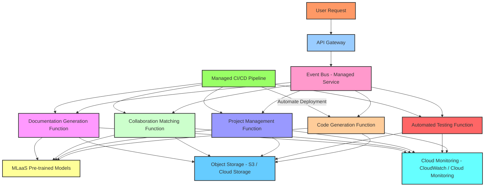
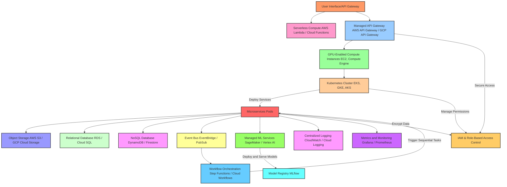

Given the complexity we’ve covered—setting up Kafka, Kubernetes, Prometheus, Grafana, and the core AI services—there is indeed a simpler and more streamlined approach if we’re willing to leverage fully managed services and platforms that already integrate many of these components. This would reduce operational complexity and allow us to focus more on developing and fine-tuning the AI and ML aspects of the system rather than managing infrastructure. Here’s what this simpler approach could look like:

### **1. Leverage Fully Managed Event Bus and Microservices Platforms**

Instead of self-hosting Kafka or setting up Kubernetes clusters, we can use fully managed platforms that provide event-driven architecture, orchestration, and scaling out-of-the-box:

- **Managed Event Bus**: Use a cloud provider’s event bus to handle inter-service communication, like:
  - **AWS EventBridge**, **Google Cloud Pub/Sub**, or **Azure Event Grid**.
  - These services automatically scale and handle message delivery without complex configuration.
- **Serverless Functions**: Replace containerized services with serverless functions (like AWS Lambda, Google Cloud Functions, or Azure Functions) to run the AI models, automated testing, and other logic.
  - Serverless functions are triggered by events and only run when needed, reducing costs and simplifying scaling.

### **2. Managed Machine Learning and AI Services**

To eliminate the need for managing model deployments, training environments, and infrastructure, use a **fully managed ML platform** that includes a suite of ML and AI tools:

- **MLaaS (Machine Learning as a Service)**: Use services like **Google Vertex AI**, **AWS SageMaker**, or **Azure ML** to handle training, deploying, and managing ML models.
  - **Pre-built AI APIs**: Many MLaaS providers offer APIs for tasks like NLP, image recognition, and code generation (e.g., OpenAI Codex on Azure or Vertex AI's PaLM models), allowing you to skip the complexities of custom model training.
- **AutoML**: For components like project management and automated testing, use AutoML features for model training without needing to build complex pipelines.

### **3. Unified Monitoring and Observability with Cloud-Native Tools**

Instead of manually configuring Prometheus and Grafana, use the cloud provider’s integrated monitoring and alerting tools:

- **AWS CloudWatch**, **Google Cloud Monitoring**, or **Azure Monitor** for centralized monitoring.
  - These tools allow you to visualize metrics, set up alerts, and track logs across services with minimal configuration.

### **4. Simplified Storage and Database Management**

Managed databases and object storage can replace custom storage setups:

- **Object Storage**: Use **AWS S3**, **Google Cloud Storage**, or **Azure Blob Storage** for code files, logs, and artifacts.
- **Managed Database**: Use a managed database for structured data (e.g., Google Firestore, AWS DynamoDB, or Azure Cosmos DB) to handle user data, feedback, and metadata for services.

### **5. Simplified CI/CD with Managed Pipelines**

To automate testing, deployment, and updating of code, leverage **cloud-native CI/CD tools**:

- **CI/CD Pipeline**: Use **AWS CodePipeline**, **Google Cloud Build**, or **Azure DevOps Pipelines** for automated code deployment, testing, and version control.
- **Automatic Triggering**: Configure the CI/CD pipeline to trigger updates when new code is pushed, including testing and deploying ML models on the managed ML platform.

---

### **Refactored Workflow Using Managed Cloud Services**

Here’s how the components would interact in this simplified architecture:

1. **User Request** triggers a function via an **API Gateway**.
2. The function sends a message to the **Event Bus** (e.g., AWS EventBridge), routing it to relevant services.
3. **Code Generation** and **Testing** functions run as serverless functions, using pre-trained models from an MLaaS provider.
4. **Project Management** and **Collaboration Matching** are also implemented as serverless functions, utilizing MLaaS for any model training or inference.
5. **Documentation Generation** uses a hosted language model API to create documentation.
6. **Monitoring and Alerts** are set up using cloud-native monitoring tools, and **logs and metrics** are centralized without additional configuration.
7. **CI/CD** pipelines manage the deployment of code updates, model updates, and testing automatically.

### **Mermaid Diagram of Simplified Architecture**

### **Key Benefits of This Refactored Setup**

- **Reduced Operational Complexity**: Managed services handle scaling, monitoring, and failover, removing the need to manually set up and manage infrastructure.
- **Cost Efficiency**: Serverless functions and pay-per-use ML models reduce costs by only running resources when needed.
- **Scalability**: Each component scales independently according to demand, with minimal manual intervention.
- **Rapid Iteration**: Cloud-native CI/CD pipelines and managed ML services allow for fast deployment, testing, and updating.

This architecture prioritizes simplicity, focusing on leveraging managed cloud resources and offloading operational complexity to the provider, allowing your team to focus more on development and less on infrastructure management. Let me know if you'd like to dive deeper into any specific part of this streamlined setup!

With this streamlined, cloud-managed setup, the AI Development Assistant agent could be quite capable, scaling efficiently to handle diverse tasks while also being flexible enough to integrate new capabilities over time. Here’s a breakdown of the functionality and scalability this setup should enable:

### **Capabilities of the Agent**

1. **Code Generation and Enhancement**
   - **Automated Code Generation**: Leverage language model APIs like Codex or PaLM to generate code snippets or full modules based on user requirements or prompts.
   - **Code Refactoring and Optimization**: Use the same APIs or customized prompts to suggest optimizations or improvements in the generated code.
   - **Multi-Language Support**: Quickly switch between programming languages if the underlying language model supports it.

2. **Automated Testing and Quality Assurance**
   - **Dynamic Test Generation**: Generate unit tests, integration tests, and performance tests automatically for the produced code.
   - **Fault Detection and Error Analysis**: Identify common pitfalls or potential issues in the code and automatically trigger improvements if errors are detected.
   - **Performance Testing**: Scale testing to simulate various workloads and performance metrics, providing insights into how code behaves under load.

3. **Project Management and Task Optimization**
   - **Dynamic Task Assignment**: Use reinforcement learning models to optimize task assignments and adjust project schedules based on team productivity and project progress.
   - **Progress Tracking and Adjustments**: Monitor project goals, automatically adjust timelines, and prioritize tasks as new requirements or blockers are identified.

4. **Self-Improvement and Feedback Loop**
   - **Continuous Learning from Feedback**: Incorporate user feedback and project performance data to improve recommendations, generating a self-improving loop.
   - **Meta-Learning for Fine-Tuning**: Fine-tune ML models based on user behavior and feedback, allowing the agent to adapt to different users and evolving requirements.

5. **Collaboration and Resource Matching**
   - **Profile-Based Developer Matching**: Use profile and skill data to match developers or contributors to projects, optimizing collaboration based on complementary skills.
   - **Community and Contribution Management**: Enable project leads to find additional contributors or resources when projects require specific skills or additional workforce.

6. **Automated Documentation**
   - **On-the-Fly Documentation Generation**: Create documentation from code comments, function names, and metadata, keeping it up-to-date as code evolves.
   - **Multilingual Documentation**: Support generating documentation in different languages if needed, leveraging NLP models with translation capabilities.

7. **Monitoring and Reporting**
   - **Real-Time Performance Monitoring**: Use cloud-native monitoring tools to track performance metrics, bottlenecks, and system health.
   - **Automated Reports and Alerts**: Generate regular reports on code quality, project health, and agent performance; alert users or admins of critical issues.

### **Scalability and Extensibility**

1. **Scalability of Code Generation and Testing**
   - **Concurrency**: With serverless functions and managed ML APIs, the agent can handle multiple concurrent code generation and testing tasks. Serverless functions will automatically scale to accommodate simultaneous requests.
   - **Large Codebases**: The architecture can handle large codebases by splitting tasks across multiple function invocations or API calls, allowing the agent to work in parallel.

2. **Scalability for Multiple Projects and Users**
   - **Multi-Tenant Support**: The setup can support multiple users or projects simultaneously without cross-interference, as each task is handled in isolated function invocations or through separate topics in the managed event bus.
   - **User-Specific Customization**: Each user or project could have dedicated profiles, allowing the system to fine-tune its responses based on individual requirements or past interactions.

3. **Data and Storage Scalability**
   - **Efficient Storage and Retrieval**: Using managed object storage (like AWS S3) for artifacts, models, and logs ensures fast and reliable access across multiple services, even as data volume grows.
   - **Automated Data Management**: Lifecycle policies on storage can automate data retention, archiving, and deletion as required.

4. **Continuous Integration and Deployment**
   - **Seamless Updates**: With managed CI/CD, new code updates, model versions, and ML algorithms can be deployed rapidly, allowing the agent to evolve and incorporate new capabilities without downtime.
   - **Rolling Model Updates**: ML models can be updated or replaced with minimal service disruption, enabling regular model improvements as new data or algorithms are available.

5. **Integration and Extensibility with New Technologies**
   - **Add-On Services**: The cloud infrastructure makes it easy to integrate additional services, such as new APIs for specific programming languages, tools for security scanning, or frameworks for testing edge cases.
   - **Modular Service Expansion**: If new functionality is required (e.g., code compliance checking, advanced debugging), it can be added as a separate serverless function or microservice.

### **Example Workload and Scale Potential**

1. **Small Scale (Single Project, Low Concurrency)**
   - **Code Generation**: A single function or module created per request with dynamic test generation, updated documentation, and task management for a small project team.
   - **Monitoring**: Basic performance tracking and error alerts on critical failures.
  
2. **Medium Scale (Multiple Projects, Moderate Concurrency)**
   - **Concurrent Projects**: Multiple projects handled at once with distinct task assignments and collaboration recommendations.
   - **Concurrent Code Generation and Testing**: Multiple functions executing in parallel with individual results reporting.
   - **Real-Time Collaboration**: Matching multiple developers to projects based on changing needs.

3. **Large Scale (Organization-Wide, High Concurrency)**
   - **High Demand Code and Testing Requests**: Automatically scale to support high volumes of simultaneous code generation and testing requests.
   - **Cross-Team Collaboration and Project Management**: Recommendations for task assignments and developer matching across departments or project teams.
   - **Detailed Analytics and Reporting**: Organization-wide insights into code quality, system health, and agent performance metrics.

### **Limitations and Considerations**

- **Latency in Model Inference**: Using managed ML services means some degree of latency in model inference, especially for large-scale code generation. Performance tuning or additional caching might be required for real-time applications.
- **Cost Management**: With high concurrency and scale, the usage of managed services can add up quickly, so cost-effective scheduling, monitoring, and scaling policies should be implemented.
- **Customizability of Managed Services**: Managed services may not allow for as much fine-grained control compared to custom deployments, so specific model tweaks or specialized functionalities might need a tailored approach.

### **Conclusion**

This cloud-managed architecture can scale to support a highly capable agent, automating key aspects of code generation, testing, project management, documentation, and collaboration. While certain high-volume applications may eventually outgrow a managed setup, this approach provides a robust starting point, delivering significant capabilities with minimal infrastructure overhead. It positions the AI Development Assistant to handle a variety of workloads and scale dynamically, while still allowing for continuous improvement and new feature integrations as needed.

Yes, you can leverage both **Google Gemini** (if it becomes accessible as an API) and **OpenAI's ChatGPT** through API calls to assist in building this system. While each model can handle various components, integrating them in tandem would allow you to offload tasks to the model best suited to each part of the workflow. Here’s how you could structure an approach to use both models effectively, along with the kinds of API calls you would make:

### **1. Architectural Planning and System Design**

Use **ChatGPT** and **Gemini** to brainstorm, generate, and refine architectural diagrams, system requirements, and detailed designs.

- **API Call to ChatGPT**: Ask ChatGPT for architectural advice, breaking down each component and suggesting infrastructure setups (e.g., how to organize serverless functions for code generation, testing, etc.).
- **API Call to Gemini**: Refine these designs, ask for specific implementation details, or request alternative architectures. Gemini may also offer specialized insights, especially if fine-tuned for cloud-based architectures or integration patterns.

### **2. Code Generation for Core Services**

Each model could contribute to code generation for the microservices and serverless functions based on the specific components needed in the system:

- **Code Structure and Templates (ChatGPT)**: Use ChatGPT to generate boilerplate code for the main components like event handling functions, database connections, and APIs. 
- **Language Model APIs**: Ask ChatGPT to generate specific code for each service, such as:
  - Code generation service: Receive user inputs and call OpenAI Codex or Google Gemini for code generation.
  - Project management service: Use ChatGPT for scripts to handle task scheduling and management APIs.
- **Integration Details (Gemini)**: If Google Gemini has specific knowledge or fine-tuned capabilities in frameworks you’re using (e.g., Firebase integration for Google Cloud), it can offer optimized configurations or integration patterns tailored to Google Cloud.

### **3. Automated Testing and Quality Assurance**

Using both models, you can automate the generation of tests for each microservice.

- **Unit and Integration Tests (ChatGPT)**: Generate specific test cases using ChatGPT for components developed in languages like Python, JavaScript, or Java.
- **API Call to ChatGPT**: Provide code snippets and request unit and integration tests for each function, module, or API endpoint.
- **System-Level Tests (Gemini)**: Use Gemini for higher-level testing (e.g., end-to-end tests) and to suggest optimizations for test coverage across Google Cloud services, leveraging its strength if it’s better suited to cloud-oriented designs.

### **4. Documentation and Commenting**

Generate user-facing documentation and developer comments across codebases.

- **In-Code Documentation (ChatGPT)**: Generate comments and docstrings directly within the code for specific functions, classes, and workflows.
- **API Call to ChatGPT**: Pass code snippets or files to ChatGPT and request comprehensive inline comments and structured documentation.
- **External Documentation and User Guides (Gemini)**: Use Gemini to produce high-level documentation, such as user guides or API reference documents for end users, incorporating project-specific terminology and structure.

### **5. Continuous Deployment and Infrastructure as Code (IaC)**

Leverage the models to write infrastructure-as-code templates for automating deployment across AWS, Google Cloud, or other environments.

- **IaC Templates and CI/CD (ChatGPT)**: Generate IaC templates (e.g., Terraform, CloudFormation) with ChatGPT for infrastructure components. You can request step-by-step instructions or templates for setting up:
  - Kubernetes clusters, event buses, serverless functions.
  - Storage solutions (like S3 on AWS or Google Cloud Storage).
- **Cross-Cloud Considerations (Gemini)**: Use Gemini to handle Google Cloud-specific deployments with Google Deployment Manager or optimized configurations for Google Cloud Functions, API Gateway, and BigQuery.
- **Continuous Deployment Setup**: Have both models generate workflows or scripts for CI/CD pipelines. For example:
  - **API Call to ChatGPT**: Ask for GitHub Actions or GitLab CI scripts for deployment.
  - **API Call to Gemini**: Ask for similar scripts optimized for Google Cloud Build, Firebase Deploy, or Kubernetes.

### **6. Monitoring, Alerts, and Logging**

Automate the configuration for monitoring tools and alerts across cloud services.

- **Logging and Monitoring Config (ChatGPT)**: Use ChatGPT to configure logging, monitoring, and alerting. It can generate configurations for tools like Prometheus, Grafana, or cloud-native monitoring setups.
- **Alerting and Reporting Dashboards (Gemini)**: Leverage Gemini for dashboards in Google Cloud Monitoring or BigQuery for data aggregation and visualization, especially if you need Google-specific configurations.
- **API Calls for Setup**:
  - Request ChatGPT to create configurations for AWS CloudWatch or Azure Monitor.
  - Ask Gemini for configurations for Google Cloud Monitoring dashboards or BigQuery analysis.

### **7. Feedback and Self-Improvement Loop**

Build a feedback mechanism to analyze usage data and refine code recommendations from both models.

- **User Feedback Analysis (ChatGPT)**: Create serverless functions that analyze feedback data stored in databases. Use ChatGPT to generate code that connects feedback with usage data, identifying patterns or errors.
- **Feedback Loops and Model Tuning (Gemini)**: For periodic updates, use Gemini to suggest refinements based on feedback, potentially focusing on optimizing latency or scalability in Google Cloud if that’s your main environment.

### **8. Collaboration Matching and Community Features**

Build collaboration matching algorithms and community-driven recommendations with advanced language models.

- **Developer Matching Logic (ChatGPT)**: Have ChatGPT generate logic for profile-based matching algorithms, and recommend developers for projects based on skills and experience.
- **Recommendation Models (Gemini)**: Use Gemini’s AI capabilities to refine collaborative filtering or suggest algorithms that match user preferences and project demands.

### **Example Workflow of Integrating ChatGPT and Gemini via API Calls**

1. **Initial Setup**:
   - **Request ChatGPT** to suggest an overall architecture and configuration for core services and dependencies.
   - **Ask Gemini** for alternative configurations or optimizations specific to cloud environments.

2. **Code Generation and Testing**:
   - **Request ChatGPT** to create the initial codebase and integration tests.
   - **Ask Gemini** to refine testing approaches or add high-level test cases for end-to-end testing.

3. **Deployment and Monitoring Setup**:
   - **Request ChatGPT** for IaC templates and CI/CD scripts.
   - **Ask Gemini** to add monitoring, alert configurations, and additional optimizations tailored to Google Cloud Monitoring or BigQuery dashboards.

4. **Documentation**:
   - **Request ChatGPT** to add in-code documentation and developer-facing guides.
   - **Ask Gemini** to create high-level user documentation and guides for end users.

5. **Feedback Loop**:
   - **Request ChatGPT** for scripts to capture and analyze user feedback.
   - **Ask Gemini** to suggest model improvements and integrate feedback handling for continual updates.

### **Benefits of Using Both Models Together**

- **Complementary Strengths**: Use ChatGPT for general-purpose development, initial code generation, and infrastructure setup. Use Gemini for cloud-specific integrations, user-focused documentation, and specialized performance tuning.
- **Faster Iterations**: By distributing tasks between the two models, you can move through phases of development, testing, and deployment faster, focusing on model-specific capabilities.
- **Dynamic Scalability**: Both models allow rapid scalability through their APIs, handling more complex projects or workloads without requiring additional setup on your end.

This approach leverages the strengths of each model, accelerating the setup and development process while providing flexibility to enhance, modify, or scale the system as needed.

To enable models like **ChatGPT** and **Google Gemini** to autonomously and iteratively build the agent system, you'd need to establish a **guided workflow** where the models are "instructed" or "prompted" at each stage of development, essentially treating them as intelligent collaborators. Here’s how you could structure the interaction so that each model can be directed to autonomously contribute to the system's development:

### **1. Define the High-Level Objective and Workflow**

Establish a clear, high-level objective that both models can work towards, broken down into phases and components. This objective can be summarized in initial prompts that guide each model to understand:

- The purpose and components of the AI Development Assistant.
- The roles of each service (e.g., code generation, automated testing, project management).
- Specific requirements for scalability, modularity, and cloud-based deployment.

### **2. Use an Orchestrator to Coordinate API Calls**

Develop a **central orchestrator** that acts as a controller for directing API calls to each model. This orchestrator would:

- **Track Progress**: Maintain state and track which parts of the system are complete, in progress, or need refinement.
- **Direct Models Based on Context**: Send tailored prompts to each model to request specific tasks based on their expertise.
- **Loop Feedback**: Collect output from each model, refine it, and use it to prompt further contributions or revisions.

A lightweight orchestration framework (e.g., a Python script or a serverless function) could handle API calls and manage workflows between the models.

### **3. Phase 1: System Planning and Component Breakdown**

Start by prompting the models to design and document the system structure:

- **Prompt to ChatGPT**: Request a comprehensive breakdown of each system component (code generation, testing, project management, etc.). Ask it to identify dependencies, APIs needed, and the sequence of interactions between components.
- **Prompt to Gemini**: Refine this breakdown, focusing on Google Cloud-specific optimizations, managed services, and any best practices for deployment within a cloud environment.

After each response, the orchestrator consolidates the inputs, storing them in a central knowledge base or document, which then guides the following phases.

### **4. Phase 2: Code Generation for Core Components**

Once the architecture is outlined, begin using the models for incremental code generation. Here’s a suggested approach:

- **Define a Standard Prompt Structure**: For consistency, design prompts with specific structures that include:
  - **Component Context**: Describe the purpose and requirements for each component.
  - **Coding Requirements**: Specify language, frameworks, and any libraries to be used.
  - **Testing and Integration**: Request that the model generate both code and initial test cases, ensuring components can be verified.
  
- **Sample Prompts**:
  - **To ChatGPT**: “Generate code for a microservice in Python that handles automated test generation based on code input. The service should receive code via an API, generate tests, and return test cases as output. Include basic logging and error handling.”
  - **To Gemini**: “Enhance the above code for deployment on Google Cloud Functions, and create a configuration for Firebase integration for real-time data updates.”

Each model’s response would be evaluated by the orchestrator, which would then either store the code, run initial tests, or send follow-up prompts for improvements or adjustments.

### **5. Phase 3: Implementing Infrastructure as Code (IaC)**

Request IaC templates and CI/CD scripts to automate deployment.

- **Prompt to ChatGPT**: “Generate Terraform templates to deploy serverless functions on AWS. These functions should include the code generation and testing services. Integrate the deployment with AWS Lambda and API Gateway.”
- **Prompt to Gemini**: “Generate Google Cloud Deployment Manager templates to deploy the project management and collaboration matching services on Google Cloud Functions. Ensure that the services are accessible via Google API Gateway.”

With responses from both models, the orchestrator combines the templates to deploy the full stack across cloud providers, then proceeds to test the setup.

### **6. Phase 4: Automated Testing and Validation**

Instruct the models to generate tests for validation across components:

- **Prompt to ChatGPT**: “Create unit tests and integration tests for the code generation service using PyTest. Include edge cases and performance tests.”
- **Prompt to Gemini**: “Write end-to-end tests for system integration on Google Cloud, ensuring API Gateway routing and serverless functions are properly connected. Use Google Cloud-specific tools for monitoring latency and throughput.”

The orchestrator can run these tests in a staging environment, evaluate the results, and provide feedback for further refinement.

### **7. Phase 5: Documentation Generation**

Request documentation from each model for both developers and end users.

- **Prompt to ChatGPT**: “Generate developer documentation and inline comments for the code generation and testing services. Include setup instructions and dependencies.”
- **Prompt to Gemini**: “Create high-level user documentation for project managers and end users. Outline the system’s purpose, usage, and features.”

The orchestrator consolidates these outputs into a final documentation repository, making it accessible for future reference and training.

### **8. Continuous Improvement and Feedback Loop**

Set up a feedback loop so the models can iteratively refine the system based on performance data, user feedback, or changes in requirements.

- **Feedback Analysis**: Collect feedback from system logs, error rates, or user comments, and store this in a database accessible to the orchestrator.
- **Prompt to ChatGPT**: “Analyze recent errors from the code generation service logs and suggest improvements. Refactor any functions that are causing latency issues.”
- **Prompt to Gemini**: “Based on recent usage patterns, optimize the Google Cloud deployment configuration for cost efficiency and scalability. Suggest any changes to resource allocation.”

This continuous improvement loop allows the orchestrator to prompt the models for refinements based on live data, enabling a self-improving system over time.

### **Example Orchestrator Workflow**

Here’s a high-level overview of how an orchestrator might structure these interactions:

1. **Define System Objectives**: Input the high-level objectives and tasks into the orchestrator.
2. **Generate Components**: Send task-specific prompts to ChatGPT or Gemini based on each model’s strengths.
3. **Evaluate Responses**: Assess the generated code, documentation, or configuration and send back requests for refinement if necessary.
4. **Deploy and Test**: Use generated IaC templates to deploy the system incrementally, running automated tests and collecting logs.
5. **Collect Feedback**: Gather feedback on performance, errors, and user interactions, which feeds into subsequent refinement prompts.
6. **Iterate and Refine**: Loop back to models with updated prompts to address issues or enhance performance based on feedback.

### **Sample Prompts for Incremental Development**

- **Phase 1 (Architecture)**: “Please design the architecture for a multi-service system, including a code generation service, testing service, project management module, and collaboration matching service. Describe each service’s function, dependencies, and interactions.”
- **Phase 2 (Code Generation)**: “Generate Python code for the testing service that connects to an API and dynamically generates test cases based on received code.”
- **Phase 3 (IaC)**: “Provide Terraform templates for deploying this microservice architecture on AWS, with load balancing and scaling configurations.”
- **Phase 4 (Testing)**: “Develop PyTest-based unit tests for the testing service and integration tests to validate end-to-end functionality.”
- **Phase 5 (Documentation)**: “Document the code generation service, including setup instructions, dependency management, and user-facing documentation.”
- **Phase 6 (Feedback)**: “Based on recent usage and error logs, suggest performance optimizations for the project management module and generate an updated configuration.”

### **Summary**

By combining an orchestrator to manage model calls with task-specific prompts, you can effectively "direct" models like ChatGPT and Google Gemini to iteratively build and refine the agent system. The orchestrator handles the workflow logic, managing dependencies and tracking the status of each component, while the models perform specialized tasks through API calls. This approach leverages the unique capabilities of each model and provides a pathway for ongoing development and self-improvement in the system.

### Summary

By combining an orchestrator to manage model calls with task-specific prompts, you can effectively "direct" models like ChatGPT and Google Gemini to iteratively build and refine the agent system. The orchestrator handles the workflow logic, managing dependencies and tracking the status of each component, while the models perform specialized tasks through API calls. This approach leverages the unique capabilities of each model and provides a pathway for ongoing development and self-improvement in the system.

### Detailed Workflow Breakdown

#### **1. Define System Objectives**

**Objective**: Establish a clear, high-level objective that both models can work towards, broken down into phases and components.

**Action**: Input the high-level objectives and tasks into the orchestrator.

**Example Prompt**:
- **To ChatGPT**: "Please design the architecture for a multi-service system, including a code generation service, testing service, project management module, and collaboration matching service. Describe each service’s function, dependencies, and interactions."
- **To Google Gemini**: "Refine the above architecture, focusing on Google Cloud-specific optimizations, managed services, and any best practices for deployment within a cloud environment."

#### **2. Generate Components**

**Objective**: Generate code, configuration, and documentation for each component.

**Action**: Send task-specific prompts to ChatGPT or Google Gemini based on each model’s strengths.

**Example Prompts**:
- **To ChatGPT**: "Generate Python code for the testing service that connects to an API and dynamically generates test cases based on received code."
- **To Google Gemini**: "Enhance the above code for deployment on Google Cloud Functions, and create a configuration for Firebase integration for real-time data updates."

#### **3. Evaluate Responses**

**Objective**: Assess the generated code, documentation, or configuration and send back requests for refinement if necessary.

**Action**: Evaluate the responses from the models and store them in a central knowledge base or document.

**Example**:
- **To ChatGPT**: "The code you provided for the testing service is almost perfect, but it lacks error handling for API timeouts. Please add appropriate error handling and retry logic."
- **To Google Gemini**: "The Firebase configuration is correct, but it could be optimized for better performance. Please suggest any changes to resource allocation."

#### **4. Deploy and Test**

**Objective**: Use generated Infrastructure as Code (IaC) templates to deploy the system incrementally, running automated tests and collecting logs.

**Action**: Deploy the components using the generated IaC templates and run automated tests.

**Example Prompts**:
- **To ChatGPT**: "Provide Terraform templates for deploying this microservice architecture on AWS, with load balancing and scaling configurations."
- **To Google Gemini**: "Generate Google Cloud Deployment Manager templates to deploy the project management and collaboration matching services on Google Cloud Functions. Ensure that the services are accessible via Google API Gateway."

#### **5. Collect Feedback**

**Objective**: Gather feedback on performance, errors, and user interactions, which feeds into subsequent refinement prompts.

**Action**: Collect feedback from system logs, error rates, or user comments, and store this in a database accessible to the orchestrator.

**Example**:
- **To ChatGPT**: "Analyze recent errors from the code generation service logs and suggest improvements. Refactor any functions that are causing latency issues."
- **To Google Gemini**: "Based on recent usage patterns, optimize the Google Cloud deployment configuration for cost efficiency and scalability. Suggest any changes to resource allocation."

#### **6. Iterate and Refine**

**Objective**: Loop back to models with updated prompts to address issues or enhance performance based on feedback.

**Action**: Use the feedback to generate new prompts for the models to refine the system.

**Example**:
- **To ChatGPT**: "The recent errors indicate that the code generation service is occasionally generating invalid code. Please review the logic and suggest improvements."
- **To Google Gemini**: "The cost analysis shows that the current resource allocation is not optimal. Please suggest a revised configuration for better cost efficiency."

### **Orchestrator Workflow Example**

1. **Define System Objectives**: Input the high-level objectives and tasks into the orchestrator.
2. **Generate Components**: Send task-specific prompts to ChatGPT or Google Gemini based on each model’s strengths.
3. **Evaluate Responses**: Assess the generated code, documentation, or configuration and send back requests for refinement if necessary.
4. **Deploy and Test**: Use generated IaC templates to deploy the system incrementally, running automated tests and collecting logs.
5. **Collect Feedback**: Gather feedback on performance, errors, and user interactions, which feeds into subsequent refinement prompts.
6. **Iterate and Refine**: Loop back to models with updated prompts to address issues or enhance performance based on feedback.

### **Conclusion**

By leveraging an orchestrator to manage the workflow and task-specific prompts, you can effectively guide models like ChatGPT and Google Gemini to iteratively build and refine the AI Development Assistant. This approach ensures that each component is developed with the necessary expertise and that the system evolves based on real-world feedback and performance data.

Explanation of the Workflow
Orchestrator Setup: The orchestrator receives system objectives, tracks progress, and sends task-specific prompts to ChatGPT and Google Gemini.
Incremental Development Phases:
Phase 1: System Architecture Design.
Phase 2: Code Generation for each microservice.
Phase 3: Infrastructure as Code (IaC) templates for deployment.
Phase 4: Testing and validation for each component.
Phase 5: Documentation creation for both developers and end users.
Phase 6: Feedback collection and iterative refinement based on system performance.
Storage and Execution: At each step, the orchestrator stores the generated outputs, runs tests, deploys code, and iterates based on feedback from models.
This diagram outlines a structured, iterative workflow for instructing ChatGPT and Google Gemini to incrementally develop and refine the AI Development Assistant system, coordinated through a central orchestrator.
