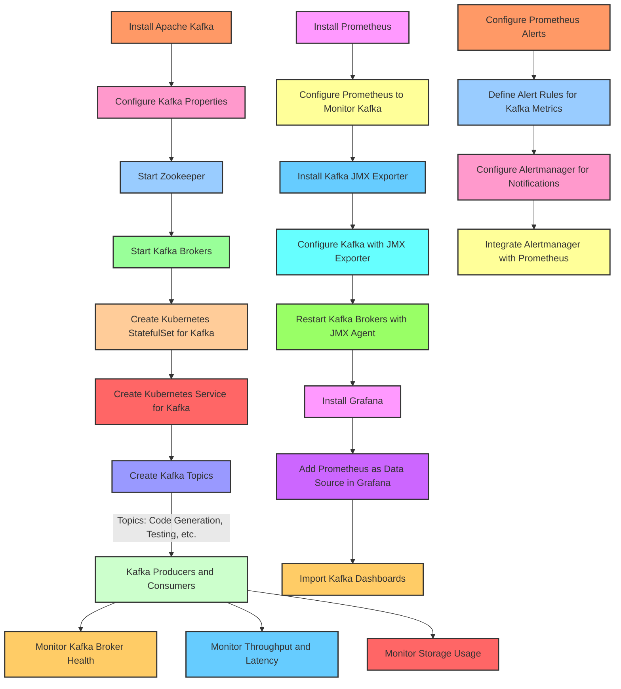

Explanation of the Workflow
Kafka Setup:

Install Kafka and configure it with essential properties.
Start Zookeeper and Kafka brokers for distributed communication.
Kafka Kubernetes Deployment:

Deploy Kafka as a StatefulSet in Kubernetes, ensuring persistence and high availability.
Expose Kafka as a service within Kubernetes for other components.
Kafka Topic Configuration:

Create specific topics for each core service, facilitating modular communication between services via Kafka.
Prometheus and Grafana Monitoring:

Install Prometheus and configure it to scrape Kafka metrics via JMX Exporter.
Configure Grafana to visualize these metrics, enabling real-time monitoring of Kafka's health and performance.
Alerting with Prometheus and Alertmanager:

Define alerting rules for critical Kafka metrics in Prometheus.
Configure Alertmanager to handle alerts and notify relevant stakeholders.
Kafka Metrics:

Monitor key Kafka metrics like broker health, throughput, latency, and storage usage to ensure optimal performance.
This architecture integrates Kafka with Kubernetes, Prometheus, and Grafana, providing a scalable and maintainable infrastructure for handling event-driven inter-service communication, with visibility into performance and health metrics. Let me know if you need more details on any specific part!

### Overview

Docker is a popular containerization platform that allows developers to package applications and their dependencies into portable containers. This tutorial will guide you through setting up Apache Kafka using Docker, focusing on both single-node and multi-node cluster setups.

### Single Node Setup

A single-node Kafka broker setup is ideal for local development and testing. Let's start with this simple setup.

#### 2.1. `docker-compose.yml` Configuration

To start an Apache Kafka server, you first need to start a Zookeeper server. We can configure this dependency in a `docker-compose.yml` file, ensuring that Zookeeper starts before Kafka and stops after it.

Create a `docker-compose.yml` file with the following content:

```yaml
version: '2'
services:
  zookeeper:
    image: confluentinc/cp-zookeeper:7.4.4
    environment:
      ZOOKEEPER_CLIENT_PORT: 2181
      ZOOKEEPER_TICK_TIME: 2000
    ports:
      - 22181:2181
  
  kafka:
    image: confluentinc/cp-kafka:7.4.4
    depends_on:
      - zookeeper
    ports:
      - 29092:29092
    environment:
      KAFKA_BROKER_ID: 1
      KAFKA_ZOOKEEPER_CONNECT: zookeeper:2181
      KAFKA_ADVERTISED_LISTENERS: PLAINTEXT://kafka:9092,PLAINTEXT_HOST://localhost:29092
      KAFKA_LISTENER_SECURITY_PROTOCOL_MAP: PLAINTEXT:PLAINTEXT,PLAINTEXT_HOST:PLAINTEXT
      KAFKA_INTER_BROKER_LISTENER_NAME: PLAINTEXT
      KAFKA_OFFSETS_TOPIC_REPLICATION_FACTOR: 1
```

In this setup:
- The Zookeeper server listens on port `2181` for the Kafka service within the same container setup.
- The Kafka service is exposed to host applications through port `29092`, but it is advertised on port `9092` within the container environment.

#### 2.2. Start Kafka Server

Start the Kafka server by spinning up the containers using the `docker-compose` command:

```bash
docker-compose up -d
```

Verify that both servers are listening on the respective ports:

```bash
nc -zv localhost 22181
nc -zv localhost 29092
```

Check the verbose logs to verify that the Kafka server is up:

```bash
docker-compose logs kafka | grep -i started
```

#### 2.3. Connection Using Kafka Tool

Use the Kafka Tool GUI utility to establish a connection with the newly created Kafka server. Specify the Bootstrap servers property to connect to the Kafka server listening at port `29092` from the host machine.

### Kafka Cluster Setup

For more stable environments, a multi-node Kafka cluster setup is necessary.

#### 3.1. `docker-compose.yml` Configuration

Extend the `docker-compose.yml` file to create a multi-node Kafka cluster setup with redundancy for both Zookeeper and Kafka servers:

```yaml
version: '2'
services:
  zookeeper-1:
    image: confluentinc/cp-zookeeper:7.4.4
    environment:
      ZOOKEEPER_CLIENT_PORT: 2181
      ZOOKEEPER_TICK_TIME: 2000
    ports:
      - 22181:2181

  zookeeper-2:
    image: confluentinc/cp-zookeeper:7.4.4
    environment:
      ZOOKEEPER_CLIENT_PORT: 2181
      ZOOKEEPER_TICK_TIME: 2000
    ports:
      - 32181:2181
  
  kafka-1:
    image: confluentinc/cp-kafka:7.4.4
    depends_on:
      - zookeeper-1
      - zookeeper-2
    ports:
      - 29092:29092
    environment:
      KAFKA_BROKER_ID: 1
      KAFKA_ZOOKEEPER_CONNECT: zookeeper-1:2181,zookeeper-2:2181
      KAFKA_ADVERTISED_LISTENERS: PLAINTEXT://kafka-1:9092,PLAINTEXT_HOST://localhost:29092
      KAFKA_LISTENER_SECURITY_PROTOCOL_MAP: PLAINTEXT:PLAINTEXT,PLAINTEXT_HOST:PLAINTEXT
      KAFKA_INTER_BROKER_LISTENER_NAME: PLAINTEXT
      KAFKA_OFFSETS_TOPIC_REPLICATION_FACTOR: 1
  kafka-2:
    image: confluentinc/cp-kafka:7.4.4
    depends_on:
      - zookeeper-1
      - zookeeper-2
    ports:
      - 39092:39092
    environment:
      KAFKA_BROKER_ID: 2
      KAFKA_ZOOKEEPER_CONNECT: zookeeper-1:2181,zookeeper-2:2181
      KAFKA_ADVERTISED_LISTENERS: PLAINTEXT://kafka-2:9092,PLAINTEXT_HOST://localhost:39092
      KAFKA_LISTENER_SECURITY_PROTOCOL_MAP: PLAINTEXT:PLAINTEXT,PLAINTEXT_HOST:PLAINTEXT
      KAFKA_INTER_BROKER_LISTENER_NAME: PLAINTEXT
      KAFKA_OFFSETS_TOPIC_REPLICATION_FACTOR: 1
```

Ensure that the service names and `KAFKA_BROKER_ID` are unique across services. Each service must expose a unique port to the host machine.

#### 3.2. Start the Kafka Cluster

Spin up the cluster using the `docker-compose` command:

```bash
docker-compose up -d
```

Use the Kafka Tool to connect to the cluster by specifying comma-separated values for the Kafka servers and respective ports.

### Conclusion

In this article, we used Docker to create single-node and multi-node setups of Apache Kafka. We also used the Kafka Tool to connect and visualize the configured broker server details. This setup provides a robust foundation for local development and testing, as well as more stable environments with multi-node clusters.

Would you like to explore any specific part of this process in more detail, or discuss how to implement it further?
