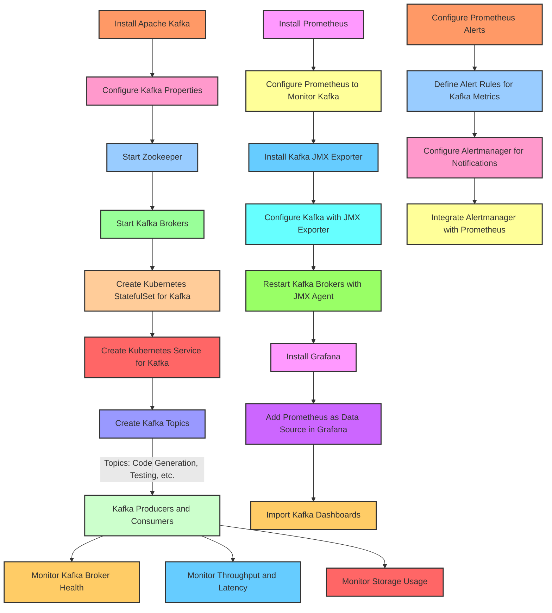

Explanation of the Workflow
Kafka Setup:

Install Kafka and configure it with essential properties.
Start Zookeeper and Kafka brokers for distributed communication.
Kafka Kubernetes Deployment:

Deploy Kafka as a StatefulSet in Kubernetes, ensuring persistence and high availability.
Expose Kafka as a service within Kubernetes for other components.
Kafka Topic Configuration:

Create specific topics for each core service, facilitating modular communication between services via Kafka.
Prometheus and Grafana Monitoring:

Install Prometheus and configure it to scrape Kafka metrics via JMX Exporter.
Configure Grafana to visualize these metrics, enabling real-time monitoring of Kafka's health and performance.
Alerting with Prometheus and Alertmanager:

Define alerting rules for critical Kafka metrics in Prometheus.
Configure Alertmanager to handle alerts and notify relevant stakeholders.
Kafka Metrics:

Monitor key Kafka metrics like broker health, throughput, latency, and storage usage to ensure optimal performance.
This architecture integrates Kafka with Kubernetes, Prometheus, and Grafana, providing a scalable and maintainable infrastructure for handling event-driven inter-service communication, with visibility into performance and health metrics. Let me know if you need more details on any specific part!
