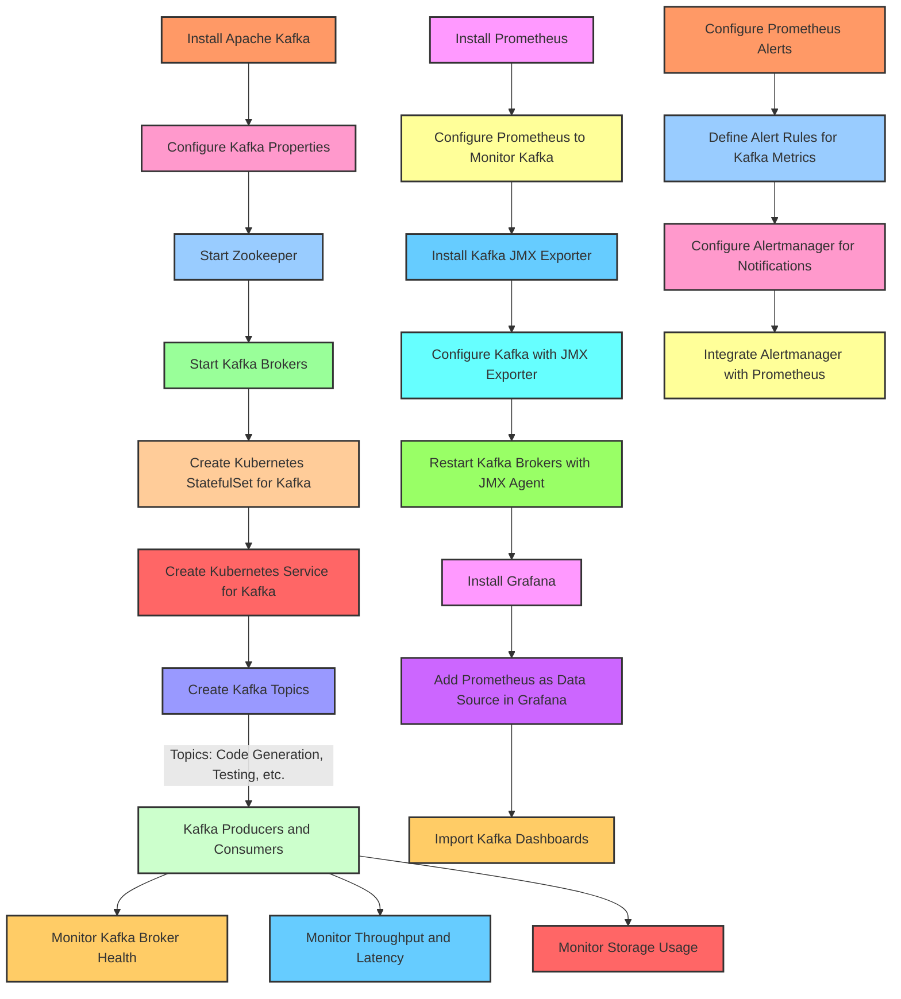

Explanation of the Workflow
Kafka Setup:

Install Kafka and configure it with essential properties.
Start Zookeeper and Kafka brokers for distributed communication.
Kafka Kubernetes Deployment:

Deploy Kafka as a StatefulSet in Kubernetes, ensuring persistence and high availability.
Expose Kafka as a service within Kubernetes for other components.
Kafka Topic Configuration:

Create specific topics for each core service, facilitating modular communication between services via Kafka.
Prometheus and Grafana Monitoring:

Install Prometheus and configure it to scrape Kafka metrics via JMX Exporter.
Configure Grafana to visualize these metrics, enabling real-time monitoring of Kafka's health and performance.
Alerting with Prometheus and Alertmanager:

Define alerting rules for critical Kafka metrics in Prometheus.
Configure Alertmanager to handle alerts and notify relevant stakeholders.
Kafka Metrics:

Monitor key Kafka metrics like broker health, throughput, latency, and storage usage to ensure optimal performance.
This architecture integrates Kafka with Kubernetes, Prometheus, and Grafana, providing a scalable and maintainable infrastructure for handling event-driven inter-service communication, with visibility into performance and health metrics. Let me know if you need more details on any specific part!

### Overview

Docker is a popular containerization platform that allows developers to package applications and their dependencies into portable containers. This tutorial will guide you through setting up Apache Kafka using Docker, focusing on both single-node and multi-node cluster setups.

### Single Node Setup

A single-node Kafka broker setup is ideal for local development and testing. Let's start with this simple setup.

#### 2.1. `docker-compose.yml` Configuration

To start an Apache Kafka server, you first need to start a Zookeeper server. We can configure this dependency in a `docker-compose.yml` file, ensuring that Zookeeper starts before Kafka and stops after it.

Create a `docker-compose.yml` file with the following content:

```yaml
version: '2'
services:
  zookeeper:
    image: confluentinc/cp-zookeeper:7.4.4
    environment:
      ZOOKEEPER_CLIENT_PORT: 2181
      ZOOKEEPER_TICK_TIME: 2000
    ports:
      - 22181:2181
  
  kafka:
    image: confluentinc/cp-kafka:7.4.4
    depends_on:
      - zookeeper
    ports:
      - 29092:29092
    environment:
      KAFKA_BROKER_ID: 1
      KAFKA_ZOOKEEPER_CONNECT: zookeeper:2181
      KAFKA_ADVERTISED_LISTENERS: PLAINTEXT://kafka:9092,PLAINTEXT_HOST://localhost:29092
      KAFKA_LISTENER_SECURITY_PROTOCOL_MAP: PLAINTEXT:PLAINTEXT,PLAINTEXT_HOST:PLAINTEXT
      KAFKA_INTER_BROKER_LISTENER_NAME: PLAINTEXT
      KAFKA_OFFSETS_TOPIC_REPLICATION_FACTOR: 1
```

In this setup:
- The Zookeeper server listens on port `2181` for the Kafka service within the same container setup.
- The Kafka service is exposed to host applications through port `29092`, but it is advertised on port `9092` within the container environment.

#### 2.2. Start Kafka Server

Start the Kafka server by spinning up the containers using the `docker-compose` command:

```bash
docker-compose up -d
```

Verify that both servers are listening on the respective ports:

```bash
nc -zv localhost 22181
nc -zv localhost 29092
```

Check the verbose logs to verify that the Kafka server is up:

```bash
docker-compose logs kafka | grep -i started
```

#### 2.3. Connection Using Kafka Tool

Use the Kafka Tool GUI utility to establish a connection with the newly created Kafka server. Specify the Bootstrap servers property to connect to the Kafka server listening at port `29092` from the host machine.

### Kafka Cluster Setup

For more stable environments, a multi-node Kafka cluster setup is necessary.

#### 3.1. `docker-compose.yml` Configuration

Extend the `docker-compose.yml` file to create a multi-node Kafka cluster setup with redundancy for both Zookeeper and Kafka servers:

```yaml
version: '2'
services:
  zookeeper-1:
    image: confluentinc/cp-zookeeper:7.4.4
    environment:
      ZOOKEEPER_CLIENT_PORT: 2181
      ZOOKEEPER_TICK_TIME: 2000
    ports:
      - 22181:2181

  zookeeper-2:
    image: confluentinc/cp-zookeeper:7.4.4
    environment:
      ZOOKEEPER_CLIENT_PORT: 2181
      ZOOKEEPER_TICK_TIME: 2000
    ports:
      - 32181:2181
  
  kafka-1:
    image: confluentinc/cp-kafka:7.4.4
    depends_on:
      - zookeeper-1
      - zookeeper-2
    ports:
      - 29092:29092
    environment:
      KAFKA_BROKER_ID: 1
      KAFKA_ZOOKEEPER_CONNECT: zookeeper-1:2181,zookeeper-2:2181
      KAFKA_ADVERTISED_LISTENERS: PLAINTEXT://kafka-1:9092,PLAINTEXT_HOST://localhost:29092
      KAFKA_LISTENER_SECURITY_PROTOCOL_MAP: PLAINTEXT:PLAINTEXT,PLAINTEXT_HOST:PLAINTEXT
      KAFKA_INTER_BROKER_LISTENER_NAME: PLAINTEXT
      KAFKA_OFFSETS_TOPIC_REPLICATION_FACTOR: 1
  kafka-2:
    image: confluentinc/cp-kafka:7.4.4
    depends_on:
      - zookeeper-1
      - zookeeper-2
    ports:
      - 39092:39092
    environment:
      KAFKA_BROKER_ID: 2
      KAFKA_ZOOKEEPER_CONNECT: zookeeper-1:2181,zookeeper-2:2181
      KAFKA_ADVERTISED_LISTENERS: PLAINTEXT://kafka-2:9092,PLAINTEXT_HOST://localhost:39092
      KAFKA_LISTENER_SECURITY_PROTOCOL_MAP: PLAINTEXT:PLAINTEXT,PLAINTEXT_HOST:PLAINTEXT
      KAFKA_INTER_BROKER_LISTENER_NAME: PLAINTEXT
      KAFKA_OFFSETS_TOPIC_REPLICATION_FACTOR: 1
```

Ensure that the service names and `KAFKA_BROKER_ID` are unique across services. Each service must expose a unique port to the host machine.

#### 3.2. Start the Kafka Cluster

Spin up the cluster using the `docker-compose` command:

```bash
docker-compose up -d
```

Use the Kafka Tool to connect to the cluster by specifying comma-separated values for the Kafka servers and respective ports.

### Conclusion

In this article, we used Docker to create single-node and multi-node setups of Apache Kafka. We also used the Kafka Tool to connect and visualize the configured broker server details. This setup provides a robust foundation for local development and testing, as well as more stable environments with multi-node clusters.

1. Overview
Docker is a popular container engine used in software development for creating, packaging, and deploying applications. In this tutorial, we'll learn how to set up Apache Kafka using Docker. It's important to note that since version 2.8.0, Apache Kafka doesn't depend on ZooKeeper anymore. However, for this tutorial, we'll use versions 7.4.4 of both the Zookeeper and Kafka containers.

2. Single Node Setup
A single-node Kafka broker setup is suitable for most local development needs. Let's start by configuring a simple setup using Docker Compose.

2.1. docker-compose.yml Configuration
First, we need to start a Zookeeper server. This dependency can be configured in the `docker-compose.yml` file, which ensures that the Zookeeper server starts before the Kafka server and stops after it.

Here's a simple `docker-compose.yml` file with two services: zookeeper and kafka:

```yaml
version: '2'
services:
  zookeeper:
    image: confluentinc/cp-zookeeper:7.4.4
    environment:
      ZOOKEEPER_CLIENT_PORT: 2181
      ZOOKEEPER_TICK_TIME: 2000
    ports:
      - 22181:2181
  
  kafka:
    image: confluentinc/cp-kafka:7.4.4
    depends_on:
      - zookeeper
    ports:
      - 29092:29092
    environment:
      KAFKA_BROKER_ID: 1
      KAFKA_ZOOKEEPER_CONNECT: zookeeper:2181
      KAFKA_ADVERTISED_LISTENERS: PLAINTEXT://kafka:9092,PLAINTEXT_HOST://localhost:29092
      KAFKA_LISTENER_SECURITY_PROTOCOL_MAP: PLAINTEXT:PLAINTEXT,PLAINTEXT_HOST:PLAINTEXT
      KAFKA_INTER_BROKER_LISTENER_NAME: PLAINTEXT
      KAFKA_OFFSETS_TOPIC_REPLICATION_FACTOR: 1
```

In this setup, the Zookeeper server listens on port 2181 for the kafka service. For any client running on the host, it's exposed on port 22181. The kafka service is exposed to host applications through port 29092 but advertised internally as port 9092.

2.2. Start Kafka Server
To start the Kafka server, spin up the containers using Docker Compose:

```sh
$ docker-compose up -d
Creating network "kafka_default" with the default driver
Creating kafka_zookeeper_1 ... done
Creating kafka_kafka_1     ... done
```

To verify that both servers are listening on their respective ports, use the `nc` command:

```sh
$ nc -zv localhost 22181
Connection to localhost port 22181 [tcp/*] succeeded!
$ nc -zv localhost 29092
Connection to localhost port 29092 [tcp/*] succeeded!
```

You can also check the verbose logs while starting up the containers and verify that the Kafka server is up:

```sh
$ docker-compose logs kafka | grep -i started
kafka_1      | [2024-02-26 16:06:27,352] DEBUG [ReplicaStateMachine controllerId=1] Started replica state machine with initial state -> HashMap() (kafka.controller.ZkReplicaStateMachine)
kafka_1      | [2024-02-26 16:06:27,354] DEBUG [PartitionStateMachine controllerId=1] Started partition state machine with initial state -> HashMap() (kafka.controller.ZkPartitionStateMachine)
kafka_1      | [2024-02-26 16:06:27,365] INFO [KafkaServer id=1] started (kafka.server.KafkaServer)
```

With that, your Kafka setup is ready for use.

2.3. Connection Using Kafka Tool
To establish a connection to the newly created Kafka server, you can use the Kafka Tool GUI utility. You might need to use the Bootstrap servers property to connect to the Kafka server listening on port 29092 from the host machine. Once connected, you'll see the visualization of your setup in the left sidebar:

```sh
$ docker-compose logs kafka | grep -i started
kafka_1      | [2024-02-26 16:06:27,352] DEBUG [ReplicaStateMachine controllerId=1] Started replica state machine with initial state -> HashMap() (kafka.controller.ZkReplicaStateMachine)
kafka_1      | [2024-02-26 16:06:27,354] DEBUG [PartitionStateMachine controllerId=1] Started partition state machine with initial state -> HashMap() (kafka.controller.ZkPartitionStateMachine)
kafka_1      | [2024-02-26 16:06:27,365] INFO [KafkaServer id=1] started (kafka.server.KafkaServer)
```

With that, your Kafka setup is ready for use.

3. Kafka Cluster Setup
For a resilient environment, we need to create a multi-node Kafka cluster setup. Let's extend our `docker-compose.yml` file to include two Zookeeper servers and two Kafka servers.

3.1. docker-compose.yml Configuration
A cluster setup for Apache Kafka requires redundancy for both Zookeeper servers and the Kafka servers. In our `docker-compose.yml` file, let's add configuration for an additional node each for Zookeeper and Kafka services:

```yaml
version: '2'
services:
  zookeeper-1:
    image: confluentinc/cp-zookeeper:7.4.4
    environment:
      ZOOKEEPER_CLIENT_PORT: 2181
      ZOOKEEPER_TICK_TIME: 2000
    ports:
      - 22181:2181
  
  zookeeper-2:
    image: confluentinc/cp-zookeeper:7.4.4
    environment:
      ZOOKEEPER_CLIENT_PORT: 2181
      ZOOKEEPER_TICK_TIME: 2000
    ports:
      - 32181:2181
  
  kafka-1:
    image: confluentinc/cp-kafka:7.4.4
    depends_on:
      - zookeeper-1
      - zookeeper-2

    ports:
      - 29092:29092
    environment:
      KAFKA_BROKER_ID: 1
      KAFKA_ZOOKEEPER_CONNECT: zookeeper-1:2181,zookeeper-2:2181
      KAFKA_ADVERTISED_LISTENERS: PLAINTEXT://kafka-1:9092,PLAINTEXT_HOST://localhost:29092
      KAFKA_LISTENER_SECURITY_PROTOCOL_MAP: PLAINTEXT:PLAINTEXT,PLAINTEXT_HOST:PLAINTEXT
      KAFKA_INTER_BROKER_LISTENER_NAME: PLAINTEXT
      KAFKA_OFFSETS_TOPIC_REPLICATION_FACTOR: 1
  kafka-2:
    image: confluentinc/cp-kafka:7.4.4
    depends_on:
      - zookeeper-1
      - zookeeper-2
    ports:
      - 39092:39092
    environment:
      KAFKA_BROKER_ID: 2
      KAFKA_ZOOKEEPER_CONNECT: zookeeper-1:2181,zookeeper-2:2181
      KAFKA_ADVERTISED_LISTENERS: PLAINTEXT://kafka-2:9092,PLAINTEXT_HOST://localhost:39092
      KAFKA_LISTENER_SECURITY_PROTOCOL_MAP: PLAINTEXT:PLAINTEXT,PLAINTEXT_HOST:PLAINTEXT
      KAFKA_INTER_BROKER_LISTENER_NAME: PLAINTEXT
      KAFKA_OFFSETS_TOPIC_REPLICATION_FACTOR: 1
```

Make sure that the service names and KAFKA_BROKER_ID are unique across services. Each service must also expose a unique port to the host machine.

3.2. Start the Kafka Cluster
To start the cluster, use the `docker-compose up -d` command:

```sh
$ docker-compose up -d
Creating network "kafka_default" with the default driver
Creating kafka_zookeeper-1_1 ... done
Creating kafka_zookeeper-2_1 ... done
Creating kafka_kafka-2_1     ... done
Creating kafka_kafka-1_1     ... done
```

After the cluster is up, we can verify its status using various methods. Let’s use the nc command to check if all services are listening on their respective ports:

```sh
$ nc -zv localhost 22181
Connection to localhost port 22181 [tcp/*] succeeded!
$ nc -zv localhost 32181
Connection to localhost port 32181 [tcp/*] succeeded!
$ nc -zv localhost 29092
Connection to localhost port 29092 [tcp/*] succeeded!
$ nc -zv localhost 39092
Connection to localhost port 39092 [tcp/*] succeeded!
```

Moreover, we can also check the verbose logs while containers are starting up:

```sh
$ docker-compose logs kafka | grep -i started
kafka_1      | [2024-02-26 16:06:27,352] DEBUG [ReplicaStateMachine controllerId=1] Started replica state machine with initial state -> HashMap() (kafka.controller.ZkReplicaStateMachine)
kafka_1      | [2024-02-26 16:06:27,354] DEBUG [PartitionStateMachine controllerId=1] Started partition state machine with initial state -> HashMap() (kafka.controller.ZkPartitionStateMachine)
kafka_1      | [2024-02-26 16:06:27,365] INFO [KafkaServer id=1] started (kafka.server.KafkaServer)
```

Once our setup is ready, we can connect to the cluster using Kafka Tool and configure it with multiple broker servers and their respective ports.

Certainly! If you're looking for an even easier way to set up Apache Kafka using Docker, you can leverage pre-built Docker images and Docker Compose configurations that simplify the setup process. One such solution is using the Confluent Platform Docker images, which provide a comprehensive set of tools and configurations for Kafka, including Zookeeper, Kafka Connect, Schema Registry, and more.

### Simplified Setup Using Confluent Platform Docker Images

Confluent provides Docker images that are pre-configured and optimized for various components of the Kafka ecosystem. This makes it much easier to set up a Kafka cluster with minimal configuration.

#### Step-by-Step Guide

1. **Install Docker and Docker Compose**

   Ensure you have Docker and Docker Compose installed on your machine.

2. **Create a `docker-compose.yml` File**

   Create a `docker-compose.yml` file with the following content:

   ```yaml
   version: '2'
   services:
     zookeeper:
       image: confluentinc/cp-zookeeper:7.4.4
       environment:
         ZOOKEEPER_CLIENT_PORT: 2181
         ZOOKEEPER_TICK_TIME: 2000
       ports:
         - 22181:2181

     kafka:
       image: confluentinc/cp-kafka:7.4.4
       depends_on:
         - zookeeper
       ports:
         - 29092:29092
       environment:
         KAFKA_BROKER_ID: 1
         KAFKA_ZOOKEEPER_CONNECT: zookeeper:2181
         KAFKA_ADVERTISED_LISTENERS: PLAINTEXT://kafka:9092,PLAINTEXT_HOST://localhost:29092
         KAFKA_LISTENER_SECURITY_PROTOCOL_MAP: PLAINTEXT:PLAINTEXT,PLAINTEXT_HOST:PLAINTEXT
         KAFKA_INTER_BROKER_LISTENER_NAME: PLAINTEXT
         KAFKA_OFFSETS_TOPIC_REPLICATION_FACTOR: 1

     schema-registry:
       image: confluentinc/cp-schema-registry:7.4.4
       depends_on:
         - zookeeper
         - kafka
       ports:
         - 8081:8081
       environment:
         SCHEMA_REGISTRY_KAFKASTORE_CONNECTION_URL: zookeeper:2181
         SCHEMA_REGISTRY_HOST_NAME: schema-registry
         SCHEMA_REGISTRY_LISTENERS: http://0.0.0.0:8081

     kafka-connect:
       image: confluentinc/cp-kafka-connect:7.4.4
       depends_on:
         - zookeeper
         - kafka
         - schema-registry
       ports:
         - 8083:8083
       environment:
         CONNECT_BOOTSTRAP_SERVERS: kafka:9092
         CONNECT_REST_ADVERTISED_HOST_NAME: kafka-connect
         CONNECT_REST_PORT: 8083
         CONNECT_GROUP_ID: kafka-connect-group
         CONNECT_CONFIG_STORAGE_TOPIC: kafka-connect-config
         CONNECT_OFFSET_STORAGE_TOPIC: kafka-connect-offsets
         CONNECT_STATUS_STORAGE_TOPIC: kafka-connect-status
         CONNECT_KEY_CONVERTER: org.apache.kafka.connect.storage.StringConverter
         CONNECT_VALUE_CONVERTER: io.confluent.connect.avro.AvroConverter
         CONNECT_VALUE_CONVERTER_SCHEMA_REGISTRY_URL: http://schema-registry:8081
         CONNECT_INTERNAL_KEY_CONVERTER: org.apache.kafka.connect.json.JsonConverter
         CONNECT_INTERNAL_VALUE_CONVERTER: org.apache.kafka.connect.json.JsonConverter
         CONNECT_PLUGIN_PATH: /usr/share/java,/etc/kafka-connect/jars
       volumes:
         - ./connectors:/etc/kafka-connect/jars
   ```

   This configuration sets up:
   - **Zookeeper**: Manages the Kafka cluster.
   - **Kafka**: The main Kafka broker.
   - **Schema Registry**: Manages Avro schemas for Kafka Connect.
   - **Kafka Connect**: Handles data integration tasks.

3. **Start the Services**

   Run the following command to start the services:

   ```bash
   docker-compose up -d
   ```

4. **Verify the Setup**

   Use the Kafka Tool or other Kafka clients to verify that the Kafka cluster is up and running. You can also access the Schema Registry and Kafka Connect REST APIs to manage schemas and connectors.

### Benefits of Using Confluent Platform Docker Images

- **Pre-configured**: The images come with default configurations that work out of the box, reducing the need for manual configuration.
- **Comprehensive**: Includes all necessary components like Zookeeper, Kafka, Schema Registry, and Kafka Connect.
- **Scalable**: Easily scale the Kafka cluster by adding more brokers or other components.
- **Community Support**: Confluent provides extensive documentation and community support for their Docker images.

### Conclusion

Using the Confluent Platform Docker images simplifies the setup of Apache Kafka and its ecosystem components. This approach reduces the complexity of configuring each component individually and provides a robust, scalable, and easy-to-manage Kafka cluster.


