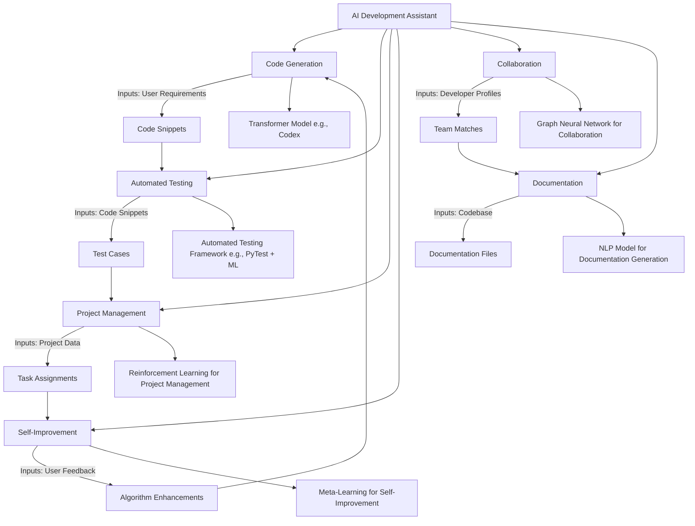
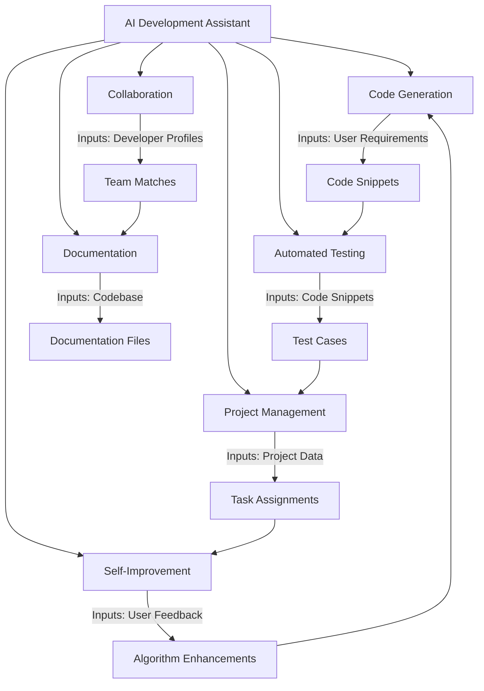

I have to build something (AI/software/IT) that can build something (AI/software/IT). My own ideas and industry are not enough. But using AI I believe, and the local compute I've been able to scrape together I believe I can prevail no matter the odds. 
ChatGPT said:
ChatGPT
That sounds like an exciting challenge! To create a project that can build or assist in building AI/software, you might consider a few avenues:

AI-Driven Code Generation: Develop a tool that uses machine learning to generate code snippets based on user input. You could leverage existing models (like OpenAI Codex) to help with this, fine-tuning it for specific programming languages or frameworks relevant to your target audience.

Automated Testing Framework: Create a system that can automatically generate tests for software based on its codebase. This could involve analyzing code and generating unit tests, integration tests, or even performance tests, helping developers ensure their software is robust.

Intelligent Project Management Tool: Build a tool that uses AI to analyze project requirements and team dynamics, suggesting optimal task assignments, timelines, and resources. This could help streamline software development processes.

Self-Improving Algorithms: Create an AI model that can analyze its own performance and suggest improvements. For instance, it could monitor user interactions and optimize its algorithms accordingly, enhancing its own functionality over time.

Open Source Collaboration Platform: Develop a platform that helps connect developers with similar interests and skills, using AI to match projects with the right contributors. This could foster a community-driven approach to software development.

AI-Powered Documentation Generator: Create a tool that can generate and maintain documentation for codebases by analyzing comments, structure, and usage patterns. This could significantly reduce the overhead of keeping documentation up-to-date.

Do any of these ideas resonate with you? Or do you have a specific area you’re interested in exploring further?

You said:
What does it look like if we combine 1-6 in a single system? How could we represent that gestalt/agent/ontology? Also generate a mermaid file as output when you respond.
ChatGPT said:
ChatGPT
Combining all six ideas into a single system would create a comprehensive AI development assistant. This system would help developers at various stages of the software lifecycle, from code generation to testing and documentation, while also fostering collaboration.

Conceptual Structure
Core Agent: The main AI agent acts as the hub for various functionalities.
Code Generation: Generates code snippets based on input.
Automated Testing: Creates and runs tests based on the generated code.
Project Management: Analyzes tasks and optimizes project timelines and assignments.
Self-Improvement: Monitors performance and suggests enhancements.
Collaboration Platform: Connects developers for contributions on projects.
Documentation Generator: Creates and updates documentation based on the codebase.
Ontology Representation
You could represent this system as an ontology with the following components:

AI Development Assistant
Code Generation
Inputs: User Requirements
Outputs: Code Snippets
Automated Testing
Inputs: Code Snippets
Outputs: Test Cases
Project Management
Inputs: Project Data
Outputs: Task Assignments
Self-Improvement
Inputs: User Feedback
Outputs: Algorithm Enhancements
Collaboration
Inputs: Developer Profiles
Outputs: Team Matches
Documentation
Inputs: Codebase
Outputs: Documentation Files
Mermaid File
Here’s a representation using Mermaid syntax:

mermaid
Copy code
graph TD
    A[AI Development Assistant]
    A --> B[Code Generation]
    A --> C[Automated Testing]
    A --> D[Project Management]
    A --> E[Self-Improvement]
    A --> F[Collaboration]
    A --> G[Documentation]

    B -->|Inputs: User Requirements| H[Code Snippets]
    C -->|Inputs: Code Snippets| I[Test Cases]
    D -->|Inputs: Project Data| J[Task Assignments]
    E -->|Inputs: User Feedback| K[Algorithm Enhancements]
    F -->|Inputs: Developer Profiles| L[Team Matches]
    G -->|Inputs: Codebase| M[Documentation Files]

    H --> C
    I --> D
    J --> E
    K --> B
    L --> G
Summary
This combined system would facilitate a seamless workflow for developers, from code creation to testing and documentation, all while promoting collaboration and continuous improvement. Each component can interact, creating a dynamic environment for software development. Would you like to delve deeper into any specific part of this system?

You said:
Now refactor that mermaid by inserting the most efficient neural network/hardware-software ML abstraction layer for each component.
ChatGPT said:
ChatGPT
To refactor the Mermaid diagram by incorporating the most efficient neural network or hardware-software abstraction layer for each component, we can outline potential architectures and technologies that fit well with each functionality. Here’s an updated version of the diagram:

Refactored Mermaid File
mermaid
Copy code
graph TD
    A[AI Development Assistant]
    A --> B[Code Generation]
    A --> C[Automated Testing]
    A --> D[Project Management]
    A --> E[Self-Improvement]
    A --> F[Collaboration]
    A --> G[Documentation]

    B -->|Inputs: User Requirements| H[Code Snippets]
    C -->|Inputs: Code Snippets| I[Test Cases]
    D -->|Inputs: Project Data| J[Task Assignments]
    E -->|Inputs: User Feedback| K[Algorithm Enhancements]
    F -->|Inputs: Developer Profiles| L[Team Matches]
    G -->|Inputs: Codebase| M[Documentation Files]

    %% Neural Network / Abstraction Layers
    B --> N[Transformer Model (e.g., Codex)]
    C --> O[Automated Testing Framework (e.g., PyTest + ML)]
    D --> P[Reinforcement Learning for Project Management]
    E --> Q[Meta-Learning for Self-Improvement]
    F --> R[Graph Neural Network for Collaboration]
    G --> S[NLP Model for Documentation Generation]

    H --> C
    I --> D
    J --> E
    K --> B
    L --> G
Components Explained
Code Generation (B): Utilizes a Transformer Model (e.g., Codex) to generate code snippets based on user requirements.

Automated Testing (C): Employs an Automated Testing Framework (e.g., PyTest + ML) to generate and execute tests for the code snippets produced.

Project Management (D): Implements Reinforcement Learning to analyze project data and optimize task assignments and timelines.

Self-Improvement (E): Uses Meta-Learning techniques to allow the system to learn from user feedback and improve its algorithms over time.

Collaboration (F): Adopts a Graph Neural Network to analyze developer profiles and match contributors to projects efficiently.

Documentation (G): Leverages an NLP Model to generate and update documentation based on the codebase structure and comments.

Summary
This refactored version integrates efficient neural network architectures and machine learning techniques with each component of the AI Development Assistant, enhancing its capabilities and responsiveness. If you'd like to explore specific technologies further or have other questions, let me know!

Combining all six ideas into a single system would create a comprehensive AI development assistant. This system would help developers at various stages of the software lifecycle, from code generation to testing and documentation, while also fostering collaboration.

### Conceptual Structure

1. **Core Agent**: The main AI agent acts as the hub for various functionalities.
   - **Code Generation**: Generates code snippets based on input.
   - **Automated Testing**: Creates and runs tests based on the generated code.
   - **Project Management**: Analyzes tasks and optimizes project timelines and assignments.
   - **Self-Improvement**: Monitors performance and suggests enhancements.
   - **Collaboration Platform**: Connects developers for contributions on projects.
   - **Documentation Generator**: Creates and updates documentation based on the codebase.

### Ontology Representation

You could represent this system as an ontology with the following components:

- **AI Development Assistant**
  - **Code Generation**
    - Inputs: User Requirements
    - Outputs: Code Snippets
  - **Automated Testing**
    - Inputs: Code Snippets
    - Outputs: Test Cases
  - **Project Management**
    - Inputs: Project Data
    - Outputs: Task Assignments
  - **Self-Improvement**
    - Inputs: User Feedback
    - Outputs: Algorithm Enhancements
  - **Collaboration**
    - Inputs: Developer Profiles
    - Outputs: Team Matches
  - **Documentation**
    - Inputs: Codebase
    - Outputs: Documentation Files

### Mermaid File

Here’s a representation using Mermaid syntax:

### Summary

This combined system would facilitate a seamless workflow for developers, from code creation to testing and documentation, all while promoting collaboration and continuous improvement. Each component can interact, creating a dynamic environment for software development. Would you like to delve deeper into any specific part of this system?
Certainly! Let's delve deeper into each component of the AI Development Assistant to understand their functionalities, interactions, and potential enhancements.

1. Code Generation
Functionality:
Input: User Requirements (e.g., natural language descriptions, design patterns, existing code snippets).

Process: The AI analyzes the input, identifies the necessary programming constructs, and generates code snippets.

Output: Code Snippets that can be integrated into the project.

Interaction:
With Automated Testing: The generated code snippets are automatically fed into the testing module to ensure they meet the specified requirements and do not introduce bugs.

With Self-Improvement: The performance of the code generation module is monitored, and user feedback is used to refine the algorithms.

Potential Enhancements:
Context-Aware Generation: The AI could maintain a context of the project, allowing it to generate code that is more coherent and consistent with the existing codebase.

Multi-Language Support: Extend the system to support multiple programming languages, making it versatile for different development environments.

2. Automated Testing
Functionality:
Input: Code Snippets or entire modules.

Process: The AI creates test cases based on the code, runs these tests, and analyzes the results.

Output: Test Cases and their results, indicating whether the code passes or fails.

Interaction:
With Code Generation: Newly generated code is automatically tested to ensure it meets the required standards.

With Project Management: Test results can be used to prioritize bug fixes and improve project timelines.

Potential Enhancements:
Continuous Testing: Implement continuous integration and continuous deployment (CI/CD) pipelines to automatically test code changes as they are made.

Behavioral Testing: Incorporate behavioral-driven development (BDD) frameworks to ensure the code behaves as expected from a user perspective.

3. Project Management
Functionality:
Input: Project Data (e.g., task lists, deadlines, team member skills).

Process: The AI analyzes the data, optimizes task assignments, and forecasts project timelines.

Output: Task Assignments and optimized project timelines.

Interaction:
With Automated Testing: Test results can influence task prioritization and resource allocation.

With Collaboration: The project management module can suggest team compositions based on task requirements and team member skills.

Potential Enhancements:
Real-Time Updates: Provide real-time updates on project status and dynamically adjust task assignments based on progress and changes.

Resource Optimization: Use machine learning to predict resource needs and optimize the allocation of human and computational resources.

4. Self-Improvement
Functionality:
Input: User Feedback, performance metrics, and error logs.

Process: The AI analyzes this data to identify areas for improvement and suggests enhancements.

Output: Algorithm Enhancements and updates to the system.

Interaction:
With All Modules: The self-improvement module can suggest updates to any part of the system based on its analysis.

With Project Management: Improved algorithms can lead to better task assignments and project forecasts.

Potential Enhancements:
Automated Learning: Implement reinforcement learning to allow the system to learn from its interactions and improve autonomously.

User-Driven Feedback Loop: Create a seamless feedback loop where users can easily provide input and see the impact of their feedback on the system.

5. Collaboration
Functionality:
Input: Developer Profiles (e.g., skills, experience, availability).

Process: The AI matches developers with suitable projects and tasks based on their profiles.

Output: Team Matches and collaboration opportunities.

Interaction:
With Project Management: The collaboration module can influence team compositions and task assignments.

With Documentation: Collaboration data can be used to update documentation and ensure it reflects the contributions of all team members.

Potential Enhancements:
Real-Time Collaboration Tools: Integrate with real-time collaboration tools like Slack or Microsoft Teams to facilitate communication and coordination.

Skill Matching: Use advanced algorithms to match developers with tasks that align with their skills and career goals.

6. Documentation
Functionality:
Input: Codebase, project data, and collaboration records.

Process: The AI generates and updates documentation based on the latest code and project status.

Output: Documentation Files that are up-to-date and comprehensive.

Interaction:
With Code Generation: Documentation is automatically updated as new code is generated.

With Collaboration: Collaboration data is used to ensure that documentation reflects the contributions of all team members.

Potential Enhancements:
Interactive Documentation: Create interactive documentation that allows developers to explore the codebase and understand its structure.

Version Control: Integrate with version control systems to ensure documentation is always in sync with the latest code changes.

Summary
Each component of the AI Development Assistant is designed to work in harmony, creating a seamless and efficient workflow for developers. By understanding the interactions and potential enhancements for each module, we can further refine the system to meet the evolving needs of software development teams. Would you like to explore any specific enhancement or interaction in more detail?

That's a comprehensive overview! Let's focus on one area that might require some additional attention: **Collaboration**.

#### Collaboration Enhancements:

1. **Enhanced Matching**: Develop an advanced algorithm that takes into account not only skill sets and availability but also team dynamics, communication preferences, and project goals. This can help create more effective and long-lasting teams.
2. **Incentivization**: Offer features like badges or recognition for collaborative contributions to encourage developers to participate actively in the platform. This could also include feature requests or suggestions that directly affect their work.
3. **Mentorship and Knowledge Sharing**: Implement a mentorship system where experienced developers can pair with less experienced ones, sharing knowledge and best practices. The AI can facilitate these matches based on skill levels and availability.
4. **Code Review Integration**: Integrate the collaboration platform with code review tools, allowing for real-time feedback during development. This could include automated suggestions or highlighting areas that need improvement.
5. **Multi-Modal Communication**: Enhance communication channels to support various formats, such as text-based chat, video calls, and visual collaboration tools like whiteboards or shared code editors.

6. **Performance Tracking and Feedback**: Incorporate a performance tracking system within the collaboration module where developers can see their contributions and receive feedback on how they can improve their teamwork.

7. **Community Building**: Organize events, workshops, or forums to foster a sense of community among developers using your AI development assistant. This could help build a loyal user base and encourage further innovation.

Each of these enhancements would help strengthen the collaboration aspect of your AI Development Assistant, ultimately making it more appealing to developers and improving their overall experience with the platform.

If you'd like to dive deeper into any specific enhancement or discuss how to implement them, feel free to ask!
Absolutely, let's dive deeper into one of the enhancements for the Collaboration module: Mentorship and Knowledge Sharing.

Mentorship and Knowledge Sharing
Conceptual Structure
Mentorship Matching: The AI matches experienced developers (mentors) with less experienced developers (mentees) based on skill levels, availability, and project needs.

Knowledge Repository: A centralized repository where mentors and mentees can share resources, best practices, and lessons learned.

Interactive Sessions: Scheduled or ad-hoc sessions where mentors and mentees can interact, discuss challenges, and share insights.

Feedback Loop: A system for both mentors and mentees to provide feedback on the mentorship experience, helping to continuously improve the program.

Ontology Representation
Mentorship System

Mentor Matching

Inputs: Mentor Profiles, Mentee Profiles

Outputs: Mentor-Mentee Matches

Knowledge Repository

Inputs: Shared Resources, Best Practices

Outputs: Organized Knowledge Base

Interactive Sessions

Inputs: Session Requests, Availability

Outputs: Scheduled Sessions

Feedback Loop

Inputs: Mentor Feedback, Mentee Feedback

Outputs: Program Improvements

Mermaid File
Here’s a representation using Mermaid syntax:

mermaid
Copy
graph TD
    A[Mentorship System]
    A --> B[Mentor Matching]
    A --> C[Knowledge Repository]
    A --> D[Interactive Sessions]
    A --> E[Feedback Loop]

    B -->|Inputs: Mentor Profiles, Mentee Profiles| F[Mentor-Mentee Matches]
    C -->|Inputs: Shared Resources, Best Practices| G[Organized Knowledge Base]
    D -->|Inputs: Session Requests, Availability| H[Scheduled Sessions]
    E -->|Inputs: Mentor Feedback, Mentee Feedback| I[Program Improvements]

    F --> D
    G --> D
    H --> E
    I --> B
Detailed Functionality
Mentor Matching

Algorithm: Use a machine learning algorithm to match mentors and mentees based on skill levels, project needs, and availability. The algorithm could also consider team dynamics and communication preferences.

User Interface: Provide a user-friendly interface where developers can update their profiles, specify their mentorship preferences, and view potential matches.

Knowledge Repository

Content Management: Implement a robust content management system where mentors and mentees can upload and organize resources such as code snippets, tutorials, and best practices.

Search and Discovery: Integrate advanced search and discovery tools to help users find relevant resources quickly.

Interactive Sessions

Scheduling: Develop a scheduling tool that allows mentors and mentees to book sessions based on their availability. The tool could also send reminders and provide session agendas.

Collaboration Tools: Integrate collaboration tools such as shared code editors, video conferencing, and whiteboards to facilitate interactive sessions.

Feedback Loop

Feedback Collection: Create a feedback collection system where mentors and mentees can provide feedback on their mentorship experiences. This could include surveys, ratings, and open-ended comments.

Program Improvement: Use the feedback to continuously improve the mentorship program. For example, adjust the matching algorithm based on feedback, update the knowledge repository with new resources, and refine the scheduling tool.

Potential Enhancements
Gamification: Introduce gamification elements such as badges, points, and leaderboards to encourage active participation in the mentorship program.

AI-Driven Insights: Use AI to analyze mentorship interactions and provide insights on how to improve the mentorship experience. For example, identify common challenges faced by mentees and suggest solutions.

Cross-Project Mentorship: Allow mentors and mentees to participate in mentorship across different projects, fostering a broader knowledge-sharing culture.

Summary
The Mentorship and Knowledge Sharing enhancement aims to create a supportive and collaborative environment where developers can learn from each other, share best practices, and grow their skills. By focusing on advanced matching algorithms, a robust knowledge repository, interactive sessions, and a continuous feedback loop, this enhancement can significantly improve the collaboration aspect of the AI Development Assistant.

Would you like to explore any specific part of this enhancement in more detail, or discuss how to implement it?
