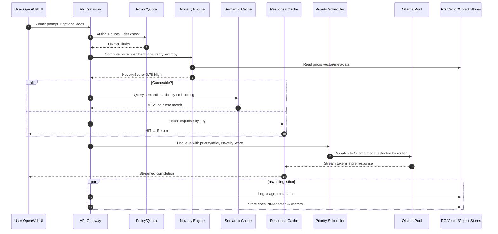

```mermaid
sequenceDiagram
  autonumber
  participant U as User OpenWebUI
  participant G as API Gateway
  participant P as Policy/Quota
  participant N as Novelty Engine
  participant S as Semantic Cache
  participant C as Response Cache
  participant Sch as Priority Scheduler
  participant O as Ollama Pool
  participant DB as PG/Vector/Object Stores

  U->>G: Submit prompt + optional docs
  G->>P: AuthZ + quota + tier check
  P-->>G: OK tier, limits
  G->>N: Compute novelty embeddings, rarity, entropy
  N->>DB: Read priors vector/metadata
  N-->>G: NoveltyScore=0.78 High
  alt Cacheable?
    G->>S: Query semantic cache by embedding
    S-->>G: MISS no close match
  else
    G->>C: Fetch response by key
    C-->>U: HIT → Return
  end
  G->>Sch: Enqueue with priority=ftier, NoveltyScore
  Sch->>O: Dispatch to Ollama model selected by router
  O-->>C: Stream tokens:store response
  C-->>U: Streamed completion
  par async ingestion
    G->>DB: Log usage, metadata
    G->>DB: Store docs PII-redacted & vectors
  end
```
